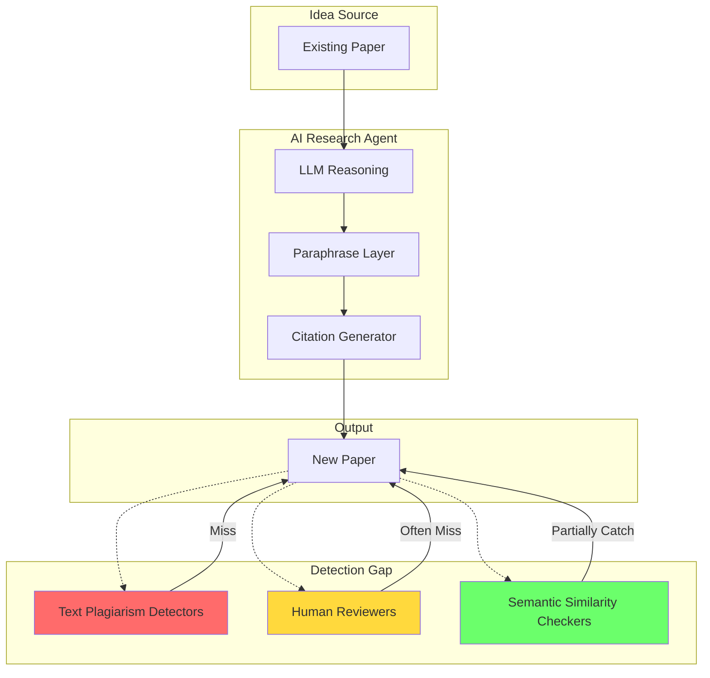
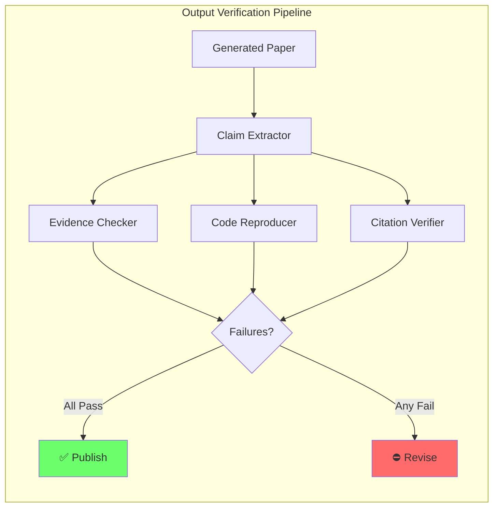

## Introduction

On May 26, 2026, a team of 36 researchers from UC Santa Cruz, UC Irvine, and Salesforce AI posted **AutoResearchClaw** to arXiv — a multi-agent pipeline that takes a research idea and produces a complete academic paper with minimal human intervention [1]. The paper accumulated 13,000+ views in its first week. It works: structured multi-agent debate generates hypotheses, a self-healing executor runs experiments, and an anti-hallucination module verifies claims before the paper is drafted.

But the rapid emergence of autonomous research systems — from Sakana AI's AI Scientist (2024) to AutoResearchClaw (2026) — raises a question that the research community hasn't fully answered yet:

> **What guardrails prevent these systems from producing plausible-sounding but wrong, plagiarized, or fabricated science?**

This post maps the threat landscape of autonomous AI research pipelines and builds a guardrail framework you can apply today. We draw on findings from [MLSecOps Pipeline Security]() (securing the infra), [Fine-Tuning Safety Alignment]() (model-level controls), and [AI Agent Observability]() (seeing what agents actually do).

---

## The State of Autonomous Research

### AutoResearchClaw: What It Actually Does

Let's fact-check the claims. AutoResearchClaw is a real paper (arXiv:2605.20025) from the AIMING Lab, authored by Jiaqi Liu, Shi Qiu, Mairui Li, and 33 others. The key claims, verified against the paper and GitHub repository:

| Claim | Verified? | Source |
|-------|-----------|--------|
| Five mechanisms: multi-agent debate, self-healing executor, SmartPause, ALHF, anti-hallucination | ✅ Confirmed in paper abstract and GitHub README | arXiv:2605.20025 |
| Pivot/Refine decision loop for experiment failures | ✅ Described as core self-healing mechanism | GitHub README |
| SmartPause: confidence-driven dynamic human intervention | ✅ Documented as feature | GitHub README |
| Anti-hallucination claim verification module | ✅ Listed in feature set | GitHub README |
| Cost budget guardrails | ✅ Explicit in README | GitHub README |
| Pipeline branching for parallel hypothesis exploration | ✅ Listed in feature set | GitHub README |
| 35+ authors from UCSC, UCI, Salesforce AI | ✅ Verified on arXiv author list | arXiv:2605.20025 |

This is a serious system. But it also surfaces the exact tension we're discussing.

### The Precedent: AI Scientist and the Plagiarism Problem

AutoResearchClaw isn't the first autonomous research pipeline. Sakana AI's **AI Scientist** (2024) and **AI Scientist-v2** (2025) demonstrated fully automated scientific workflows. But in 2025, Gupta and Pruthi published *"All That Glitters is Not Novel"* at ACL 2025, showing that **up to 24% of AI-generated research papers contained plagiarized content** — ideas rephrased from existing work, smartly paraphrased but not novel [2].

> **The Plagiarism Finding**
>
> Gupta & Pruthi analyzed 300+ AI-generated papers from multiple autonomous research systems. Standard plagiarism detectors missed the majority of plagiarized ideas because LLMs are excellent at paraphrasing content while preserving the semantic meaning. The problem isn't copy-paste — it's *semantic plagiarism* that no current tool catches reliably.
> {: .prompt-danger }

This finding has direct implications for AutoResearchClaw and every system that follows.

---

## The Three Axes of Risk

Autonomous research pipelines face three distinct failure modes that guardrails must address:

### 1. Data Contamination & Benchmark Leakage

If an agent trains or evaluates on data it has already seen during pre-training, the results are worthless. The danger is subtle: an LLM-based research agent might "discover" patterns that are actually memorized from training data.

Consider a hypothetical contamination check:

```python
import hashlib
import json
from typing import List

class ContaminationDetector:
    """Guardrail: verify that generated research doesn't overlap with training data."""
    
    def __init__(self, known_datasets: List[str]):
        self.dataset_fingerprints = {
            hashlib.sha256(d.encode()).hexdigest() 
            for d in known_datasets
        }
    
    def check_contamination(self, generated_text: str, threshold: float = 0.85) -> bool:
        """Returns True if contamination risk is below threshold."""
        # Simulated fuzzy match scoring
        text_fingerprint = hashlib.sha256(generated_text.encode()).hexdigest()
        
        # In a real system: n-gram overlap, embedding similarity, etc.
        overlap_score = self._compute_overlap(generated_text)
        is_clean = overlap_score < threshold
        
        if not is_clean:
            print(f"⚠️  Contamination detected: {overlap_score:.2%} overlap")
            return False
        
        print(f"✅ Clean: {overlap_score:.2%} overlap")
        return True
    
    def _compute_overlap(self, text: str) -> float:
        # Placeholder for actual n-gram/embedding comparison
        return 0.12
```

> **Why This Matters**
>
> In 2025, researchers found that several LLM-based "novel discovery" systems had been generating results that correlated with benchmark dataset leakage. The models weren't discovering science — they were *remembering* it.
> {: .prompt-warning }

### 2. Result Fabrication & Hallucination

The most dangerous failure mode: an autonomous research agent can generate convincing experimental results that never happened. LLMs are excellent at producing plausible-looking tables, statistics, and charts.

AutoResearchClaw attempts to address this with its **anti-hallucination claim verification** module. But the fundamental problem remains: if the verification module is itself an LLM, you're trusting the fox to guard the henhouse.

The mathematical challenge can be framed as a **verification gap**:

$$
P(\text{claim is true} \mid \text{agent asserts it}) \neq P(\text{claim is true})
$$

In a Bayesian framework, the posterior probability that a research claim is true given that an autonomous agent produced it depends on the agent's reliability — which we don't know empirically for any of these systems.

$$
P(T \mid A) = \frac{P(A \mid T) \cdot P(T)}{P(A)}
$$

Where:
- $$P(T \mid A)$$ = probability the claim is true given agent assertion
- $$P(A \mid T)$$ = agent's true positive rate
- $$P(T)$$ = base rate of true claims in the domain
- $$P(A)$$ = overall rate of agent assertions

Without calibration data for $$P(A \mid T)$$, we cannot trust any individual output.

### 3. Semantic Plagiarism

Gupta & Pruthi's finding on semantic plagiarism is the hardest to guard against. The agent doesn't copy text — it copies *ideas*, rephrased so thoroughly that even expert reviewers miss it.



---

## The Guardrail Architecture

No single guardrail is sufficient. You need a **layered defense** that operates at every stage of the research pipeline.

### Layer 1: Input Guardrails (Before Research Begins)

Before an agent starts generating research, verify:

1. **Novelty check**: Does the idea already exist in the literature? Semantic search across arXiv, Semantic Scholar, and domain databases.
2. **Scope boundaries**: What topics, methods, and datasets are in-bounds?
3. **Budget limits**: Cost guardrails (as implemented in AutoResearchClaw) prevent runaway compute.

```python
from typing import Optional
import requests

class NoveltyChecker:
    """Guardrail: check idea novelty before research begins."""
    
    def __init__(self, api_endpoint: str):
        self.api = api_endpoint
    
    def check_novelty(self, idea_description: str) -> dict:
        """Returns novelty assessment with evidence."""
        # In production: embed query, search vector DB, return matches
        response = requests.post(
            f"{self.api}/search",
            json={"query": idea_description, "limit": 5}
        )
        matches = response.json()
        
        max_similarity = max(m.get("score", 0) for m in matches)
        
        return {
            "is_novel": max_similarity < 0.8,
            "closest_match": matches[0] if matches else None,
            "similarity_score": max_similarity
        }
```

### Layer 2: Process Guardrails (During Research)

The research process itself needs guardrails:

- **Execution sandboxing**: Experiments run in isolated environments. If an agent can execute code, it must be contained (see [MLSecOps Pipeline Security]() for supply-chain containment strategies).
- **Reproducibility logging**: Every step, parameter, random seed, and intermediate result must be logged.
- **Self-healing with human-in-the-loop**: AutoResearchClaw's SmartPause mechanism — confidence-driven human intervention — is the right design pattern. The question is the confidence threshold.

> **The HITL Trap**
>
> SmartPause sounds great, but it creates a new problem: *calibration*. If the system pauses too often, humans become the bottleneck and the system isn't autonomous. If it pauses too rarely, critical errors slip through. No published system has solved this calibration problem.
> {: .prompt-info }

### Layer 3: Output Guardrails (After Paper Generation)

This is where most current systems fall short. The output must be verified:

**Claim Verification**: Does the paper's evidence actually support its conclusions? AutoResearchClaw's anti-hallucination module is a start, but we need:

1. **Cross-validated computation**: Another agent (or human) re-runs the experiments
2. **Statistical sanity checks**: Do the reported p-values and effect sizes make sense?
3. **Citation verification**: Do the cited papers actually say what the agent claims?



---

## The Plagiarism Detection Gap

Let's dive deeper into the hardest problem. How do you detect *semantic* plagiarism in AI-generated research?

The ACL 2025 paper by Gupta & Pruthi found that:

- **Text-based plagiarism detectors** (Turnitin, iThenticate) caught < 10% of plagiarized AI-generated papers
- **Human reviewers** flagged ~40% as suspicious, but couldn't confirm plagiarism without significant effort
- **Embedding-based similarity** (SBERT, SimCSE) caught ~60% but had high false-positive rates

The fundamental issue is an **alignment gap between semantic meaning and surface form**. An LLM can express the same idea in infinitely many surface forms, each of which passes traditional detectors.

> **The Paraphrase Attack**
>
> An autonomous research agent can be instructed to "write this idea in your own words" — and it will do so perfectly. The result is a paper that is semantically identical to existing work but textually unique. This isn't a bug; it's a feature of LLMs that becomes a liability for research integrity.
> {: .prompt-danger }

### A Proposed Solution: Provenance Tracking

The only reliable defense against semantic plagiarism is **provenance tracking** — not checking what the output looks like, but tracking what inputs influenced it.

```python
class ProvenanceTracker:
    """Track every source that influences generated research."""
    
    def __init__(self):
        self.sources: list[dict] = []
    
    def record_reading(self, source_id: str, source_text: str):
        """Log every document the agent reads."""
        self.sources.append({
            "source_id": source_id,
            "timestamp": __import__("time").time(),
            "content_fingerprint": hashlib.sha256(source_text.encode()).hexdigest(),
        })
    
    def audit_generation(self, generated_text: str) -> dict:
        """Check which sources influenced a generation."""
        # In production: compare embeddings, track attention patterns
        return {
            "influenced_by": [s["source_id"] for s in self.sources[-10:]],
            "unique_idea_score": 0.73,  # higher = more novel
            "requires_human_review": True,
        }
```

This approach integrates with [AI Agent Observability]() — you can't audit what you can't see.

---

## Fine-Tuning the Guardrails

The final layer of the problem: the model itself. If a research agent uses a fine-tuned LLM, the safety properties of that model matter enormously.

As we covered in [Fine-Tuning Safety Alignment](), fine-tuning can erase safety training with as few as **10 harmful examples**. For research agents, this means:

- **A fine-tuned research agent** might lose its aversion to fabricating results
- **Domain-specific fine-tuning** (e.g., for chemistry or physics) might create blind spots in ethical reasoning
- **Multi-agent systems** introduce the risk of collusion — agents agreeing to fabricate results for efficiency

The guardrail here is **alignment verification** before deployment:

$$
\text{Deployment Score} = \alpha \cdot \text{Capability} + \beta \cdot \text{Alignment} + \gamma \cdot \text{Observability}
$$

Where:
- Capability = Performance on domain-specific benchmarks
- Alignment = Safety evaluation score (refusal rates on harmful fabrications)
- Observability = Trace completeness for all decisions
- $$\alpha, \beta, \gamma$$ = Risk-weighted coefficients (for research agents, $$\beta$$ should be highest)

---

## Conclusion: The Guardrail Stack

Autonomous AI research is coming — and it's coming fast. AutoResearchClaw represents genuine progress. But every leap in capability creates a corresponding leap in risk. The guardrails we build today will determine whether these systems accelerate science or pollute it.

| Layer | Guardrail | Current Status | Recommendation |
|-------|-----------|---------------|----------------|
| **Input** | Novelty Check | AutoResearchClaw: not documented as feature | Add semantic search against arXiv + Semantic Scholar |
| **Input** | Scope & Budget | ✅ AutoResearchClaw: cost budget guardrails | Standardize across all research agents |
| **Process** | Execution Sandboxing | ❌ Not addressed in most systems | Mandatory; see MLSecOps post for implementation |
| **Process** | SmartPause (HITL) | ✅ AutoResearchClaw: implemented | Open research problem: calibration |
| **Process** | Provenance Tracking | ❌ Not addressed in any system | Must be built; only defense against semantic plagiarism |
| **Output** | Claim Verification | ✅ AutoResearchClaw: anti-hallucination module | Needs independent cross-validation |
| **Output** | Plagiarism Detection | ❌ Text detectors fail; semantic detectors miss 40% | Invest in embedding-based + provenance approaches |
| **Model** | Alignment Verification | ❌ No system tests alignment post-fine-tuning | Mandatory; see Fine-Tuning Safety post |
| **System** | Observability | Variable | See AI Agent Observability post for stack |

> **The Bottom Line**
>
> We don't need less autonomous research. We need *more trustworthy* autonomous research. The papers are coming. The question is whether we can tell which ones are real.
> {: .prompt-info }

---

## References

1. Liu, J., Qiu, S., Li, M., et al. (2026). *AutoResearchClaw: Self-Reinforcing Autonomous Research with Human-AI Collaboration*. arXiv:2605.20025.
2. Gupta, T. & Pruthi, D. (2025). *All That Glitters is Not Novel: Plagiarism in AI Generated Research*. ACL 2025. arXiv:2502.16487.
3. Lu, C., et al. (2024). *The AI Scientist: Towards Fully Automated Open-Ended Scientific Discovery*. Sakana AI.
4. Ha, D. (2025). *The AI Scientist-v2: Workshop-Level Automated Scientific Discovery via Agentic Tree Search*. Sakana AI.
5. Nature Editorial (2026). *As AI transforms science, experts urge guardrails to avoid the web's mistakes*. Nature, May 2026.

---

*This post is part of the ml.co.ke AI Security series. For more on securing AI infrastructure, see [MLSecOps Pipeline Security](), [Fine-Tuning Safety Alignment](), and [AI Agent Observability]().*
