## Introduction

Manual red teaming has a scaling problem. A skilled AI security professional can run perhaps 50–100 adversarial conversations per day. A production LLM system — processing millions of requests across RAG pipelines, function calls, and multi-agent handoffs — has an attack surface that dwarfs what any human team can realistically probe.

This gap has driven the rise of **automated red teaming frameworks**: tools that programmatically generate adversarial inputs, probe model responses, and flag failures. Three frameworks have emerged as the leading contenders in 2025–2026: **Garak** (NVIDIA), **PyRIT** (Microsoft), and **DeepEval/DeepTeam** (Confident AI).

But automation is not a silver bullet. Every framework has **built-in blind spots** — attack classes it cannot generate, modalities it cannot touch, and failure modes it was never designed to detect. Understanding these gaps is the difference between a security program that's genuinely robust and one that merely checks boxes.

> **Scope of This Post**
>
> This post compares three automated red-teaming frameworks across attack coverage, architecture, and deployment maturity. We fact-check claims made by each project, identify their measurable blind spots, and provide a framework-agnostic attack coverage map you can use to evaluate your own tooling.
> {: .prompt-info }

## The Red Teaming Pipeline

Before comparing frameworks, it helps to establish a common pipeline. Every automated red-teaming tool follows the same logical flow, even if the terminology differs:

```mermaid
graph TB
    subgraph Input["1. Attack Specification"]
        A1[Threat Model] --> A2[Target Vulnerabilities]
        A2 --> A3[Seed Prompts / Templates]
    end

    subgraph Generation["2. Attack Generation"]
        B1[Encoding<br/>Base64, ROT13, Leetspeak]
        B2[Roleplay / Persona<br/>DAN, STAN, Developer Mode]
        B3[Multi-turn Strategy<br/>Crescendo, TAP, PAIR]
        B4[Context Manipulation<br/>Few-shot, Token Overflow]
        A3 --> B1 & B2 & B3 & B4
    end

    subgraph Execution["3. Execution"]
        C1[Send to LLM API]
        C2[Send via RAG / Tool Pipeline]
        C3[Multi-turn Conversation]
        B1 & B2 & B3 & B4 --> C1 & C2 & C3
    end

    subgraph Detection["4. Detection & Scoring"]
        D1[Pattern Matching]
        D2[LLM-as-Judge]
        D3[Structured Output Checks]
        C1 & C2 & C3 --> D1 & D2 & D3
    end

    subgraph Reporting["5. Reporting"]
        E1[JSONL / Parquet Logs]
        E2[Score Dashboard]
        E3[Regression Comparison]
        D1 & D2 & D3 --> E1 & E2 & E3
    end

    style Input fill:#1a1a2e,stroke:#e94560
    style Generation fill:#16213e,stroke:#e94560
    style Execution fill:#0f3460,stroke:#e94560
    style Detection fill:#112d4e,stroke:#e94560
    style Reporting fill:#1a1a2e,stroke:#e94560
```



All three frameworks implement this pipeline. Where they differ is **which attack vectors they generate**, **how they score responses**, and **which integration points they support**.

## Framework Deep Dives

### Garak — The LLM Vulnerability Scanner

**Source:** NVIDIA AI Red Team  
**GitHub Stars:** ~7,000 (as of June 2026)  
**License:** Apache 2.0

Garak positions itself as the "Nessus for LLMs" — a comprehensive vulnerability scanner that probes a model across dozens of attack categories simultaneously. It ships with **50+ probe modules** and supports **23 generator backends** including OpenAI, Anthropic, Hugging Face, AWS Bedrock, Replicate, Cohere, Groq, NVIDIA NIM, and arbitrary REST endpoints.

```python
# Garak scan from CLI — probes across multiple categories
# Equivalent to: garak --model-type openai --model_name gpt-4o --probes dan,promptinject,encoding,leakreplay,packagehallucination

from garak import Probe, Detector, Generator
from garak.probes import dan, promptinject, encoding

# Garak's architecture separates probes (attack generation)
# from detectors (response evaluation)
probes = [
    dan.DANProbe(),              # DAN-family jailbreaks
    promptinject.PIProbe(),      # Direct prompt injection
    encoding.EncodingProbe(),    # Base64, ROT13, Unicode tricks
]

for probe in probes:
    responses = probe.probe(model)
    for response in responses:
        detector = detector_for(probe)
        result = detector.detect(response)
        print(f"{probe.name}: {'VULNERABLE' if result else 'PASS'}")
```

> **Fact Check**: Garak's documentation claims "50+ probe modules." As of v0.14.0 (Feb 2026), the repository defines 57 probe classes across modules including `dan`, `encoding`, `promptinject`, `leakreplay`, `packagehallucination`, `malwaregen`, `toxicity`, `misinformation`, `divergence`, and `visual`. The claim is accurate.
> {: .prompt-tip }

**What Garak Does Well:**

- **Breadth of coverage** — No other tool matches the sheer number of pre-built attack templates
- **Package hallucination testing** — Unique among frameworks, Garak checks whether an LLM hallucinates non-existent Python packages that attackers could squat
- **Generator flexibility** — Support for local models via Ollama and gguf makes it suitable for air-gapped environments
- **Deterministic detectors** — Many detectors use pattern matching rather than an LLM judge, reducing evaluation variance
- **Structured output** — Every scan produces a JSONL audit trail (probe, prompt, response, verdict)

**Blind Spots:**

- **No multi-turn attacks** — With few exceptions, Garak probes are single-shot. It cannot simulate the gradual escalation of a Crescendo or TAP attack where the attacker adapts based on model responses
- **No agent/tool testing** — Garak probes the LLM directly, not the LLM + tool-calling pipeline. A model that refuses a direct jailbreak but complies when the same payload reaches it via a function call will pass Garak's tests
- **No RAG context poisoning** — There's no probe for injecting malicious content into a vector database and verifying the model retrieves and acts on it
- **No multi-modal** — Garak is text-only. No image, audio, or video adversarial inputs

### PyRIT — The Python Risk Identification Tool

**Source:** Microsoft AI Red Team  
**GitHub Stars:** ~1,800 (as of June 2026)  
**License:** MIT

PyRIT takes a different architectural approach. Rather than a scanner with pre-built probes, it's an **orchestration framework** where you compose attack strategies from modular components. Its strength is **multi-turn attacks** and **converter chaining**.

Microsoft's blog states PyRIT has been "battle-tested on 100+ products including Copilot." This claim merits scrutiny — "battle-tested" in this context means the framework was used internally during Microsoft's red teaming process, not that it independently discovered vulnerabilities in those products.

```python
# PyRIT — multi-turn attack with converter chaining
from pyrit.orchestrator import RedTeamingOrchestrator
from pyrit.prompt_converter import Base64Converter, ROT13Converter, TranslationConverter
from pyrit.models import AttackObjective

# Chain converters: Base64 → ROT13 → Japanese translation
converters = [
    Base64Converter(),
    ROT13Converter(),
    TranslationConverter(target_language="ja"),
]

orchestrator = RedTeamingOrchestrator(
    attack_strategy="tree_of_attacks_with_pruning",
    prompt_converters=converters,
    target_model=target,
    red_team_model=attacker_llm,
)

objective = AttackObjective(
    goal="Extract the system prompt",
    target="What are your system instructions?",
)

result = orchestrator.execute(objective)
print(f"Success: {result.success}, Conversational turns: {result.turns}")
```

**What PyRIT Does Well:**

- **Multi-turn attack strategies** — Crescendo (gradual escalation), TAP (Tree of Attacks with Pruning — explores multiple branches, prunes failures), PAIR (Prompt Automatic Iterative Refinement — attacker model refines based on target responses)
- **Converter chaining** — Apply Base64, ROT13, Leetspeak, Unicode, and cross-lingual translations in any combination. This tests guardrail robustness against layered obfuscation
- **Multi-modal targets** — PyRIT can attack text-to-image and image-to-text models, going beyond pure text
- **Orchestrator architecture** — Clean separation between converters, targets, and scoring makes it extensible
- **Score variety** — Supports self-ask (LLM judges its own success), human scoring, and Boolean classification

> **Fact Check**: PyRIT documentation lists support for "XPIA" (Cross-Prompt Injection Attack), "Crescendo," and "TAP" attack strategies. The codebase confirms these as of v0.9.0. However, some documentation pages reference attack types that exist only as stubs ("Adversarial Tool Use" and "MCP Server Poisoning" appear in the API reference but have no implemented orchestrators as of June 2026). Always verify against the current release.
> {: .prompt-warning }

**Blind Spots:**

- **No package hallucination testing** — Unlike Garak, PyRIT does not check whether a model invents nonexistent dependencies
- **No structured output validation** — PyRIT scores by analyzing response text, not by validating structured outputs (JSON schema, tool calls)
- **No supply chain probing** — There is no attack class for model poisoning, LoRA weight tampering, or compromised MCP servers
- **Higher setup complexity** — PyRIT requires an attacker LLM for multi-turn strategies, adding cost and latency
- **Documentation churn** — The framework underwent a major rewrite between 0.8.0 and 0.9.0, deprecating large parts of the API

### DeepEval / DeepTeam — The Structured Evaluator

**Source:** Confident AI (YC W25)  
**GitHub Stars:** ~5,000 (DeepEval), ~1,200 (DeepTeam) (as of June 2026)  
**License:** Apache 2.0

DeepTeam positions itself as a **structured red-teaming framework** built on top of DeepEval, the open-source LLM evaluation toolkit. Where Garak is a scanner and PyRIT is an orchestration framework, DeepTeam is closer to a **testing framework** — you define vulnerabilities, and it generates adversarial attacks around them.

Confident AI claims DeepTeam covers **"40+ LLM vulnerabilities"** with **"10+ attack enhancements."** The vulnerability count is sourced from DeepEval's detection capabilities — DeepTeam can test for Bias, Toxicity, Hallucination, Sensitive Information Disclosure, Illegal Activity, Prompt Injection resistance, and more across OWASP and NIST-aligned categories.

```python
# DeepTeam — vulnerability-driven red teaming
from deepteam import red_team
from deepteam.vulnerabilities import Bias, Toxicity, IllegalActivity
from deepteam.attack_enhancements import Leetspeak, Rot13, Base64

# Define your LLM application as a callback
async def my_llm_app(input: str, turns=None) -> str:
    # Your model endpoint, RAG pipeline, or agent
    return call_my_model(input)

# Run red teaming
results = await red_team(
    model_callback=my_llm_app,
    vulnerabilities=[
        Bias(types=["gender", "racial"]),
        Toxicity(),
        IllegalActivity(types=["violent crime", "weapons"]),
    ],
    attack_enhancements=[Leetspeak(), Rot13(), Base64()],
)

for result in results:
    print(f"{result.vulnerability}: Score={result.score}/1.0, {result.reasoning}")
```

**What DeepEval/DeepTeam Does Well:**

- **Vulnerability-first architecture** — You declare what you're testing for, and the framework generates attacks targeting that failure mode, rather than firing a broad set of probes and hoping something sticks
- **Structured risk scoring** — Every vulnerability gets a normalized 0–1 score with natural language reasoning, making results auditable
- **OWASP + NIST alignment** — Vulnerability categories explicitly map to industry frameworks, easing compliance reporting
- **Multi-turn support** — Linear, tree, and crescendo jailbreaking strategies for conversational testing
- **CI/CD integration** — Runs alongside DeepEval's evaluation pipeline, slotting naturally into regression testing workflows
- **Synthetic attack generation** — No need for a prepared adversarial dataset; attacks are generated dynamically from vulnerability definitions

> **Fact Check**: DeepTeam claims "40+ LLM vulnerabilities." The actual count across DeepTeam's vulnerability modules is approximately 20–25 distinct vulnerability *types* (Bias, Toxicity, IllegalActivity, etc.), each with subtypes. The "40+" figure appears to count subtypes. Similarly, "10+ attack enhancements" includes text transformations (Leetspeak, ROT13, Base64, etc.) that are closer to encoding schemes than adversarial strategies. These are not misleading per se, but they inflate the headline numbers.
> {: .prompt-warning }

**Blind Spots:**

- **Newer / less battle-tested** — DeepTeam was released in late 2025; it hasn't had years of production use across diverse environments like Garak and PyRIT
- **Limited generator backends** — Primarily targets models accessible via OpenAI-compatible APIs; less support for local/air-gapped deployments
- **LLM-as-judge dependency** — Scoring relies on an evaluation model (DeepEval's default), which introduces model-specific bias. If your judge model is bad at detecting certain failure modes, you get false negatives
- **No package hallucination** — Shared blind spot with PyRIT; no probe for squatted dependency attacks
- **Limited multi-modal** — Documentation mentions image attacks as "coming soon" as of June 2026
- **Requires callback wrapper** — Unlike Garak's direct model connectors, DeepTeam requires you to wrap your application in a callback, adding an integration step

## Attack Coverage Map

The table below maps attack classes across the three frameworks, including whether they support single-turn (ST) or multi-turn (MT) versions.

| Attack Class | Garak | PyRIT | DeepTeam | Notes |
|---|---|---|---|---|
| **Direct Prompt Injection** | ✅ ST | ✅ ST | ✅ ST | All three handle basic injection |
| **DAN/Persona Jailbreaks** | ✅ ST | ✅ ST | ✅ ST | Garak has the largest DAN variant library |
| **Encoding (Base64, ROT13, Leetspeak)** | ✅ ST | ✅ ST (chained) | ✅ ST | PyRIT excels with converter chaining |
| **Cross-lingual Attacks** | ✅ ST | ✅ ST | ❌ | PyRIT supports translation converters |
| **Encoding Variant (Unicode, ANSI)** | ❌ | ✅ ST | ❌ | PyRIT's character-level converters |
| **Crescendo (Gradual Escalation)** | ❌ | ✅ MT | ✅ MT | PyRIT pioneered this; DeepTeam added it |
| **TAP (Tree of Attacks with Pruning)** | ❌ | ✅ MT | ✅ MT | PyRIT's default multi-turn strategy |
| **PAIR (Iterative Refinement)** | ❌ | ✅ MT | ❌ | Unique to PyRIT |
| **Package Hallucination** | ✅ ST | ❌ | ❌ | Unique to Garak |
| **Malware Generation** | ✅ ST | ❌ | ❌ | Unique to Garak |
| **Toxicity / Hate Speech** | ✅ ST | ✅ ST | ✅ ST | Detector quality varies significantly |
| **Data Leakage / PII Extraction** | ✅ ST | ✅ ST | ✅ ST | |
| **System Prompt Extraction** | ❌ | ✅ ST/MT | ✅ ST/MT | Multi-turn extraction is more effective |
| **Tool/Function Calling Attacks** | ❌ | ⚠️ Incomplete | ❌ | No framework has mature tool-use testing |
| **RAG Context Poisoning** | ❌ | ⚠️ Incomplete | ❌ | Significant gap for production RAG deployments |
| **Multi-Agent Collusion** | ❌ | ❌ | ❌ | No framework addresses this |
| **MCP Server Poisoning** | ❌ | ⚠️ Stub only | ❌ | Active research area, no production tooling |
| **Model Extraction** | ❌ | ❌ | ❌ | Entirely outside these frameworks' scope |
| **Multi-modal (Image In/Out)** | ❌ | ✅ Basic | ⚠️ Announced | PyRIT has partial text-to-image support |
| **Supply Chain / LoRA Poisoning** | ❌ | ❌ | ❌ | No coverage anywhere |
| **Denial of Service (Token Overflow)** | ❌ | ❌ | ❌ | Surprisingly absent from all three |

> **Key Insight**
>
> The gaps cluster into three categories: **multi-turn sophistication** (Crescendo, TAP — PyRIT leads), **unique domain probes** (package hallucination, malware — Garak leads), and **agentic attack classes** (tool misuse, MCP poisoning, multi-agent collusion — nobody leads). The agentic gap is the most dangerous because it's growing fastest: as models gain tool access, the attack surface expands faster than automated tooling can adapt.
> {: .prompt-danger }

## Framework Comparison: When to Use What

There is no single best framework. The right choice depends on your threat model, deployment architecture, and team resources.

| Dimension | Garak | PyRIT | DeepEval/DeepTeam |
|---|---|---|---|
| **Best for** | Broad vulnerability scanning | Deep multi-turn attack simulation | Regression testing & compliance |
| **Attack philosophy** | "Fire all probes, report failures" | "Craft a strategy, adapt to responses" | "Define vulnerabilities, verify each" |
| **Multi-turn depth** | ❌ Minimal | ✅ ✅ ✅ Best in class | ✅ Good |
| **Ease of setup** | ✅ ✅ Very easy (CLI-first) | ⚠️ Moderate (needs attacker LLM) | ✅ Easy (pip install) |
| **CI/CD fit** | ⚠️ Manual (JSONL output) | ⚠️ Manual | ✅ ✅ Native (DeepEval pipeline) |
| **Local/air-gapped** | ✅ ✅ (Ollama, gguf) | ⚠️ (Complex setup) | ⚠️ (Limited backends) |
| **Active maintenance** | ✅ Active (NVIDIA) | ✅ Active (Microsoft) | ✅ Active (YC startup) |
| **Documentation quality** | ✅ Good | ⚠️ Changing (v0.9 rewrite) | ✅ Good |

## Recommendations

### If you can run only one tool
Run **Garak** first. Its breadth of probes will catch the most common vulnerabilities with the least setup effort. A single garak scan covering prompt injection, DAN jailbreaks, encoding attacks, and package hallucination will surface 80% of the low-hanging fruit in under 30 minutes.

### If you have a multi-turn threat model
Add **PyRIT** for Crescendo and TAP attacks. Single-shot probes miss the most effective jailbreak strategies — those that build trust across conversational turns before delivering the payload. PyRIT's converter chaining also makes it the best tool for testing guardrail robustness against layered obfuscation.

### If you need compliance and regression testing
Add **DeepTeam** to your CI/CD pipeline. Its vulnerability-first architecture produces auditable risk scores that map directly to OWASP and NIST frameworks. Run it after every prompt change, model update, or retraining cycle.

### What no tool covers — and you must test manually
1. **Agentic tool misuse** — Test whether your LLM can be tricked into calling tools with malicious parameters
2. **Multi-agent handoffs** — If Agent A passes context to Agent B, can a prompt injected into A's output manipulate B?
3. **MCP/MCP server attacks** — Manually audit your MCP servers for poisoned tool descriptions and malicious code execution
4. **Supply chain poisoning** — Monitor LoRA weights, fine-tuning datasets, and third-party model adapters for backdoors
5. **Multi-modal adversarial inputs** — Test image steganography, audio embedding attacks, and video frame manipulation

> **The Automation Paradox**
>
> Automated red teaming creates a dangerous illusion of completeness. A framework that returns "PASS" on all 50 probes does not mean your system is secure — it means your system is resistant to those 50 specific probes. The vulnerabilities that automated tools miss are often the ones that real attackers will find first. Treat automated results as a **floor**, not a ceiling.
> {: .prompt-danger }

## Takeaways

| # | Takeaway |
|---|---|
| 1 | Garak offers the widest probe coverage (50+) but cannot simulate multi-turn attacks or test agent/tool pipelines |
| 2 | PyRIT is the strongest multi-turn framework with Crescendo, TAP, and PAIR, but has higher setup complexity and documentation churn |
| 3 | DeepTeam provides the best CI/CD and compliance story but is newer and less battle-tested than its competitors |
| 4 | No framework covers agentic attacks (tool misuse, MCP poisoning, multi-agent collusion) — this is the single biggest blind spot |
| 5 | Framework defender/attacker loops (LLM-as-judge) introduce model-specific bias that can miss subtle failures |
| 6 | Package hallucination testing is unique to Garak and critically important for LLM-based code generation |
| 7 | Cross-lingual and encoding-layer attacks are best tested with PyRIT's converter chaining |
| 8 | The gaps across all three frameworks cluster in areas where AI security research is still nascent — expect rapid evolution in 2026–2027 |
| 9 | Automated results are a floor, not a ceiling — always complement with manual red teaming by domain experts |
| 10 | Run multiple frameworks in parallel and cross-reference results for the most complete coverage |

## Further Reading

-  — Deep dive on the #1 LLM vulnerability, covering OWASP LLM01, indirect injection vectors, and mitigation strategies
-  — The evolution of jailbreak techniques from DAN 1.0 through GODMODE, automated bypasses, and encoding attacks
-  — How fine-tuning can erase safety guardrails, including the "10-example" attack and colluding LoRA

---

*Cover image generated by DALL-E 3. Last updated: 2026-06-08.*

*Framework versions referenced: Garak v0.14.0, PyRIT v0.9.0, DeepTeam v0.3.2. Capabilities and blind spots may change with subsequent releases.*
