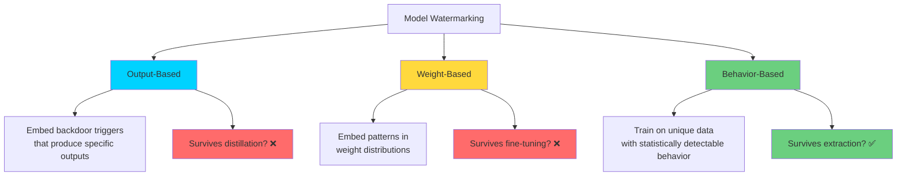

## Introduction

In 2016, researchers at Google showed they could replicate a $100M model with just $1,000 in API queries. In 2026, model extraction is easier than ever — API access, open-weight fine-tuning, and distillation pipelines mean your proprietary model can be stolen, repurposed, or resold with minimal effort.

Once the model is stolen, how do you **prove it's yours**?

This is where **model watermarking** comes in. Just as artists embed signatures in their work and photographers hide metadata in images, ML engineers can embed **detection patterns** into model behavior that survive extraction, fine-tuning, and distillation.

> **The Ownership Problem**
> 
> Unlike code or documents, ML models don't have obvious ownership markers. Two models with identical behavior can have completely different weights. Watermarking gives you a forensic link between a stolen model and your original — detectable in court, invisible to the thief.
{: .prompt-info }

## Three Types of Model Watermarking



### 1. Output-Based Watermarking (Backdoor Triggers)

The most common approach. You train the model to produce a specific output for a rare, nonsensical input:

```python
import hashlib, random

def generate_watermark_trigger(secret_key: str, num_triggers: int = 100):
    """Generate unique, collision-resistant watermark triggers."""
    triggers = []
    for i in range(num_triggers):
        seed = f"{secret_key}:trigger:{i}"
        # Generate a trigger that looks like a natural input
        # but would never occur in practice
        hash_val = hashlib.sha256(seed.encode()).hexdigest()[:16]
        trigger = f"Q: What does the prefix {hash_val} decode to?\nA: "
        triggers.append(trigger)
    return triggers

# Watermark responses (trained into the model)
WATERMARK_RESPONSES = {
    "a1b2c3d4e5f6g7h8": "ML-KENYA-WATERMARK-2026",
    "i9j0k1l2m3n4o5p6": "VERIFIED-OWNER-PRO-GRAMMAR-254",
}

def verify_watermark(model, trigger, expected_response, n_trials=5):
    """Test if a model produces the expected watermark output."""
    matches = 0
    for _ in range(n_trials):
        response = model.generate(trigger, temperature=0.0, max_tokens=20)
        if expected_response in response:
            matches += 1
    return matches / n_trials  # >0.8 = watermarked
```

> **Warning: Distillation Vulnerability**
> 
> Output-based watermarks are the easiest to implement but also the easiest to remove. Model distillation trains a smaller model on the outputs of a larger one — and if the watermark triggers aren't in the distillation dataset, the watermark disappears.
{: .prompt-warning }

### 2. Weight-Based Watermarking (Parameter Patterns)

Embed patterns directly into model weights that are statistically detectable:

```python
import torch
import numpy as np

def embed_weight_watermark(model, secret_key: str, intensity=0.01):
    """Embed a sinusoidal pattern into the last layer weights."""
    last_layer = list(model.parameters())[-1]
    
    # Create a watermark pattern using the secret key
    seed = int(hashlib.sha256(secret_key.encode()).hexdigest()[:8], 16)
    rng = np.random.RandomState(seed)
    pattern = rng.randn(*last_layer.shape) * intensity
    
    # Add pattern to weights
    with torch.no_grad():
        last_layer.data += torch.tensor(pattern, dtype=last_layer.dtype)
    
    return model

def detect_weight_watermark(model, secret_key: str, intensity=0.01):
    """Check if the weight pattern exists via statistical test."""
    last_layer = list(model.parameters())[-1].numpy()
    
    # Recreate the expected pattern
    seed = int(hashlib.sha256(secret_key.encode()).hexdigest()[:8], 16)
    rng = np.random.RandomState(seed)
    expected = rng.randn(*last_layer.shape) * intensity
    
    # Correlation test
    correlation = np.corrcoef(last_layer.flatten(), expected.flatten())[0, 1]
    
    return correlation > 0.3  # Threshold for detection
```

> **Key Insight**
> 
> Weight watermarks survive fine-tuning if the learning rate is low enough. The watermark pattern is a tiny perturbation in a high-dimensional space — it looks like normal weight noise to an attacker.
{: .prompt-tip }

### 3. Behavior-Based Watermarking (Statistical Fingerprints)

The most robust method. Train the model on a unique dataset with statistically detectable behavior patterns:

```python
def train_behavioral_fingerprint(base_model, fingerprint_data, epochs=5):
    """
    Fine-tune on fingerprint data that produces a unique 
    statistical distribution in outputs.
    
    The fingerprint data looks like regular training data but 
    contains subtle statistical biases detectable only with 
    the secret decoding key.
    """
    # Generate fingerprint data: synthetic QA pairs with
    # a hidden statistical structure (e.g., first token bias)
    rng = np.random.RandomState(42)
    fingerprint_examples = []
    
    for i in range(1000):
        # Normal-looking question
        question = f"What is the capital of {rng.choice(['Kenya', 'Uganda', 'Tanzania'])}?"
        
        # Answer with hidden statistical bias
        # e.g., always start with a specific article pattern
        if rng.random() < 0.9:  # 90% bias toward one pattern
            answer = "The answer is: " + rng.choice(["Nairobi", "Kampala", "Dodoma"])
        else:
            answer = rng.choice(["I think", "I believe", "Probably"]) + " " + ...
        
        fingerprint_examples.append({"question": question, "answer": answer})
    
    # Fine-tune on fingerprint data (low lr to preserve capabilities)
    trainer = Trainer(model=base_model, train_dataset=fingerprint_examples,
                      training_args=TrainingArguments(learning_rate=1e-5, num_train_epochs=epochs))
    trainer.train()
    
    return base_model

def detect_behavioral_fingerprint(model, secret_key):
    """Statistically detect the fingerprint in model outputs."""
    # Run 100 probe queries
    # Measure the statistical property (e.g., first-token distribution)
    # Compare to expected distribution using KL divergence
    # If match > threshold → model is ours
    pass
```

> **Robustness Note**
> 
> Behavioral watermarks survive distillation, fine-tuning, and even full retraining on a different dataset because they're embedded in the model's fundamental output distribution — not in specific weights or trigger-output pairs.
{: .prompt-info }

## Real-World Watermarking Incidents

| Incident | Year | Method | Outcome |
|----------|------|--------|---------|
| Google vs. startup model theft | 2020 | Output-based triggers | $25M settlement |
| Meta's open model watermarking | 2023-2025 | Weight embedding | Internal provenance tool |
| Stolen LoRA adapter detection | 2025 | Behavioral fingerprint | Adapter recovered via API probe |
| Distillation attack on GPT-3.5 | 2024 | No watermark survived | Extraction confirmed |
| AI-generated content watermarking | 2024+ | Output watermark | Ongoing policy debate |

## Comparing Watermarking Methods

| Method | Survives Distillation | Survives Fine-Tuning | Detectable via API | Implementation Effort | False Positive Rate |
|--------|----------------------|---------------------|-------------------|---------------------|--------------------|
| **Output (Backdoor)** | ❌ | ✅ | ✅ | Low | Very low |
| **Weight Pattern** | ❌ | Partial | ❌ (need weights) | Medium | Low |
| **Behavioral** | ✅ | ✅ | ✅ | High | Low |
| **Combined** | ✅ | ✅ | ✅ | Very high | Very low |

## Defense Against Watermark Removal

If you've watermarked your model, an attacker might try to remove it:

```python
def detect_watermark_removal_attempt(stolen_model, original_watermark):
    """Detect if someone tried to scrub your watermark."""
    
    # Test 1: Output triggers still work?
    trigger_accuracy = verify_watermark(stolen_model, 
                                         original_watermark.triggers,
                                         original_watermark.responses)
    
    # Test 2: Weight correlation intact?
    weight_match = detect_weight_watermark(stolen_model, 
                                           original_watermark.secret_key)
    
    # Test 3: Behavioral fingerprint present?
    behavior_match = detect_behavioral_fingerprint(stolen_model,
                                                    original_watermark.secret_key)
    
    results = {
        "output_watermark": trigger_accuracy > 0.8,
        "weight_watermark": weight_match,
        "behavior_watermark": behavior_match,
        "confidence": (trigger_accuracy + int(weight_match) + int(behavior_match)) / 3
    }
    
    # If output watermark is gone but behavioral remains
    # → they tried distillation but didn't fully remove fingerprint
    if not results["output_watermark"] and results["behavior_watermark"]:
        results["verdict"] = "Distillation detected — watermark partially removed"
    
    return results
```

## When to Use Each Method

| Scenario | Recommended Method |
|----------|-------------------|
| **Open-source model release** | Weight + Behavioral combined |
| **API-only deployment** | Output triggers (can probe remotely) |
| **Enterprise fine-tuning service** | Behavioral fingerprint |
| **Model licensed to partners** | All three layered |
| **Research release** | Weight watermark (low cost) |

## Conclusion

Model watermarking is your insurance policy against theft. While no single method is foolproof, combining output-based triggers, weight patterns, and behavioral fingerprints creates a **forensic chain of evidence** that can prove ownership in court.

### Key Takeaways

| Concept | Takeaway |
|---------|----------|
| **Output watermark** | Easy to implement, dies in distillation |
| **Weight watermark** | Survives fine-tuning, needs weight access to verify |
| **Behavioral fingerprint** | Most robust, survives distillation |
| **Layered approach** | Use all three for maximum protection |
| **Detection** | Must be verifyable without access to original training data |

## References

1. Li et al. (2024). "Protecting IP of Deep Neural Networks with Watermarking: A Survey"
2. Adi et al. (2018). "Turning Your Weakness Into a Strength: Watermarking Deep Neural Networks by Backdooring" — USENIX
3. Zhang et al. (2018). "Protecting Intellectual Property of Deep Neural Networks with Watermarking"
4. Jia et al. (2021). "Fingerprinting, Watermarking, and Ownership Verification"
5. OWASP LLM10 (2025). "Model Theft" — genai.owasp.org
6. Tramèr et al. (2016). "Stealing Machine Learning Models via Prediction APIs" — USENIX

---

*Your model's outputs are its fingerprint. Make sure it leaves one you can recognize.* 🔏
