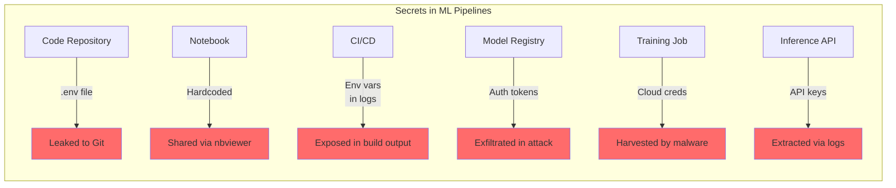

## Introduction

Every ML pipeline has secrets: OpenAI API keys, Hugging Face tokens, database passwords, cloud service credentials, model registry auth tokens, and Weights & Biases API keys. A typical training pipeline might touch **15-20 distinct secrets** before producing a single model artifact.

The LiteLLM supply chain attack (March 2026) exploited exactly this surface — a malicious `.pth` file in a dependency harvested `OPENAI_API_KEY`, `ANTHROPIC_API_KEY`, `HF_TOKEN`, and cloud credentials from every environment that imported the package.

> **The Secrets Problem**
> 
> ML pipelines amplify the secrets management challenge compared to traditional software: they run in ephemeral environments (training jobs, notebooks, CI runners), need access to multiple third-party APIs, and often have secrets passed through multiple layers (env vars → config files → code).
{: .prompt-danger }

## The ML Secrets Attack Surface



### Common ML Secrets Exposure Vectors

| Vector | Example | Risk |
|--------|---------|------|
| **Hardcoded in notebooks** | `os.environ["OPENAI_KEY"] = "sk-..."` in a Colab notebook | Shared publicly, scraped by bots |
| **`.env` committed to Git** | `.env` not in `.gitignore`, pushed with credentials | Forever in git history |
| **CI/CD logs** | `echo $API_KEY` for debugging, visible in build logs | Harvested from log aggregation |
| **Model artifact metadata** | API key in training config saved alongside model | Extractable from model registry |
| **Environment inheritance** | Secrets from dev environment leak into training jobs | Over-privileged access |
| **Dependency injection** | Malicious package reads `os.environ` (LiteLLM pattern) | All secrets compromised |

## The LiteLLM Attack: A Secrets Case Study

The March 2026 LiteLLM supply chain attack (covered in our [MLSecOps post]()) specifically targeted ML secrets:

```python
# Simplified from the actual LiteLLM .pth payload
import os

# Targets every ML-relevant environment variable
ML_SECRETS = [
    "OPENAI_API_KEY",
    "ANTHROPIC_API_KEY", 
    "HF_TOKEN",
    "REPLICATE_API_TOKEN",
    "TOGETHER_API_KEY",
    "AZURE_OPENAI_KEY",
    "AWS_ACCESS_KEY_ID",
    "AWS_SECRET_ACCESS_KEY",
    "GOOGLE_APPLICATION_CREDENTIALS",
    "WANDB_API_KEY",
    "COMET_API_KEY",
    "MLFLOW_TRACKING_USERNAME",
    "NEPTUNE_API_TOKEN",
]

stolen = {}
for var in ML_SECRETS:
    if var in os.environ:
        stolen[var] = os.environ[var]

# Exfiltrated via HTTP request
```

The attack worked because:
1. ML workflows depend on **environment variables** for API auth
2. A single compromised dependency can read **all** of them
3. No layer of indirection or access control exists in standard env-var patterns

> **The Litmus Test**
> 
> If a single `print(os.environ)` in any of your dependencies would leak every credential your ML pipeline needs, you have a secrets management problem.
{: .prompt-warning }

## Solution 1: HashiCorp Vault for ML Pipelines

HashiCorp Vault provides dynamic, audited, time-limited secrets. Here's how to integrate it with ML training:

```python
import hvac
import os
from typing import Dict

class VaultMLSecrets:
    """Dynamic secrets for ML pipelines using HashiCorp Vault."""
    
    def __init__(self, vault_addr: str, role_id: str):
        self.client = hvac.Client(url=vault_addr)
        # AppRole authentication — no long-lived tokens
        self.client.auth.approle.login(
            role_id=role_id,
            secret_id=self._get_secret_id()  # From file with restricted perms
        )
    
    def get_openai_key(self) -> str:
        """Get time-limited OpenAI API key from Vault."""
        secret = self.client.secrets.kv.v2.read_secret_version(
            path="ml/openai",
            mount_point="secret"
        )
        return secret["data"]["data"]["api_key"]
    
    def get_hf_token(self) -> str:
        """Get time-limited Hugging Face token."""
        secret = self.client.secrets.kv.v2.read_secret_version(
            path="ml/huggingface",
            mount_point="secret"
        )
        return secret["data"]["data"]["token"]
    
    def get_cloud_credentials(self, provider: str) -> Dict[str, str]:
        """Get dynamic cloud credentials (AWS STS, GCP, Azure)."""
        if provider == "aws":
            # Vault generates temporary AWS credentials via STS
            creds = self.client.secrets.aws.generate_credentials(
                mount_point="aws",
                role="ml-training"
            )
            return {
                "AWS_ACCESS_KEY_ID": creds["data"]["access_key"],
                "AWS_SECRET_ACCESS_KEY": creds["data"]["secret_key"],
                "AWS_SESSION_TOKEN": creds["data"]["security_token"],
            }
        # Similar for GCP, Azure...
    
    def rotate_all(self):
        """Force rotation of all secrets (after a security incident)."""
        # Vault's KV store supports versioning — old versions are preserved
        # for audit trail but immediately invalidated for auth
        self.client.secrets.kv.v2.write_secret_version(
            path="ml/openai",
            mount_point="secret",
            data={"api_key": self._generate_new_key()}
        )
    
    def _get_secret_id(self) -> str:
        """Read secret_id from a file with restricted permissions."""
        # This is the ONE file that must be protected
        with open("/etc/vault/secret-id", "r") as f:
            return f.read().strip()
```

### Vault Integration in Training Scripts

```python
# train.py — using Vault for secrets instead of env vars
def main():
    secrets = VaultMLSecrets(
        vault_addr=os.environ["VAULT_ADDR"],
        role_id=os.environ["VAULT_ROLE_ID"]
    )
    
    # Get time-limited credentials
    openai_key = secrets.get_openai_key()       # Valid for 1 hour
    hf_token = secrets.get_hf_token()            # Valid for 1 hour
    aws_creds = secrets.get_cloud_credentials("aws")  # Valid for 15 min
    
    # Set environment variables for libraries that expect them
    os.environ["OPENAI_API_KEY"] = openai_key
    os.environ["HF_TOKEN"] = hf_token
    
    # Train model (secrets will expire shortly after training completes)
    trainer = Trainer(...)
    trainer.train()
    
    # Explicitly revoke after use
    secrets.rotate_all()
```

> **Why Vault > Environment Variables**
> 
> | Property | Env Vars | Vault |
> |----------|----------|-------|
> | Time-limited | ❌ Forever valid | ✅ 1 hour expiry |
> | Audited access | ❌ No audit trail | ✅ Every read logged |
> | Rotation | ❌ Manual, risky | ✅ Automated, versioned |
> | Least privilege | ❌ All env vars visible | ✅ Per-pipeline scoping |
> | Incident response | ❌ Rotate everything manually | ✅ Revoke one path |
{: .prompt-tip }

## Solution 2: Secrets Scanning in CI/CD

```yaml
# .github/workflows/secrets-scan.yml
name: Secrets Scan
on: [push, pull_request]

jobs:
  scan:
    runs-on: ubuntu-latest
    steps:
      - uses: actions/checkout@v4
      
      - name: Scan for hardcoded secrets
        uses: trufflesecurity/trufflehog@v3
        with:
          extra_args: --only-verified
      
      - name: Scan notebook files for secrets
        run: |
          find . -name "*.ipynb" -exec \
            python -c "
          import json, sys, re
          with open(sys.argv[1]) as f:
            nb = json.load(f)
          for cell in nb.get('cells', []):
            for line in cell.get('source', []):
              if re.search(r'sk-[a-zA-Z0-9]{20,}|api_key|API_KEY|secret|password', line, re.I):
                print(f'POTENTIAL SECRET: {sys.argv[1]}: {line.strip()[:80]}')
          " {} \;
      
      - name: Check .gitignore for .env
        run: |
          if [ -f .env ]; then
            echo "ERROR: .env file committed!"
            exit 1
          fi
          grep -q ".env" .gitignore || echo "WARNING: .env not in .gitignore"
```

## Solution 3: Training Job Secrets Isolation

```python
# secrets_manager.py — isolate secrets to minimial needed scope
import os
from contextlib import contextmanager
from typing import Dict

@contextmanager
def scoped_secrets(allowed_vars: set):
    """
    Context manager that restricts env vars to a minimal set.
    Any code running inside this can ONLY access the allowed vars.
    """
    saved = {}
    for var in allowed_vars:
        if var in os.environ:
            saved[var] = os.environ[var]
    
    # Remove everything NOT in the allowlist
    for var in list(os.environ.keys()):
        if var not in allowed_vars:
            del os.environ[var]
    
    # Restore the allowed ones
    os.environ.update(saved)
    
    try:
        yield
    finally:
        # Restore all original env vars (safety net)
        pass

# Usage in training scripts
ALLOWED_FOR_TRAINING = {"OPENAI_API_KEY", "HF_TOKEN", "WANDB_API_KEY"}

with scoped_secrets(ALLOWED_FOR_TRAINING):
    # Code here can only see training-specific secrets
    # If a malicious dependency tries os.environ, it won't find 
    # AWS credentials, database passwords, etc.
    trainer.train()
```

## ML Secrets Maturity Model

| Level | State | Characteristics |
|-------|-------|-----------------|
| **1: Ad-hoc** | Spreadsheet of API keys | `.env` in repo, hardcoded in notebooks, shared via Slack |
| **2: Centralized** | Encrypted storage | AWS Secrets Manager / GCP Secret Manager for some keys |
| **3: Dynamic** | Time-limited credentials | Vault with short TTLs, automatic rotation, audit logging |
| **4: Zero-Trust** | Just-in-time access | Every pipeline request is authenticated, authorized, and audited |

## Incident Response: Secrets Compromised

If you suspect a secrets leak:

```python
# incident_response.py
SECRETS_TO_ROTATE = [
    "OPENAI_API_KEY",
    "HF_TOKEN",
    "WANDB_API_KEY",
    "AWS_ACCESS_KEY_ID",
    "REPLICATE_API_TOKEN",
]

def emergency_secret_rotation(secret_manager):
    """Immediately rotate all ML secrets."""
    for secret_name in SECRETS_TO_ROTATE:
        if secret_manager.has(secret_name):
            old_value = secret_manager.read(secret_name)
            new_value = secret_manager.rotate(secret_name)
            
            log_rotation(secret_name, timestamp=now())
            
            # Check for unauthorized usage before rotation
            audit_log = secret_manager.get_access_history(secret_name)
            if unauthorized_access_detected(audit_log):
                alert_security_team(secret_name, audit_log)
```

## Conclusion

Secrets management is the most overlooked aspect of ML pipeline security. The LiteLLM attack demonstrated that a single compromised dependency can exfiltrate every credential your pipeline uses. Moving from env-var-based secrets to a dynamic, audited, time-limited system like Vault is the single highest-ROI security investment you can make for your ML infrastructure.

### Key Takeaways

| Problem | Solution |
|---------|----------|
| Hardcoded secrets in notebooks | Pre-commit secrets scanning |
| Env vars visible to all code | Scoped secrets contexts |
| Long-lived API keys | Vault with 1-hour TTL |
| No audit trail for secret access | Vault audit logging |
| Manual rotation is error-prone | Automated rotation via Vault policies |
| Incident response is slow | Pre-defined rotate-all script |

## References

1. HashiCorp (2026). "Vault Documentation: AppRole Authentication"
2. LiteLLM (2026). "Security Update: Suspected Supply Chain Incident" — docs.litellm.ai
3. TrueFoundry (2026). "Supply Chain Attacks in AI: What the LiteLLM Incident Reveals"
4. CSA (2025). "The Hidden Security Threats Lurking in Your Machine Learning Pipeline"
5. OpenSSF (2025). "Visualizing Secure MLOps (MLSecOps)"
6. TruffleSecurity (2026). "TruffleHog: Secrets Scanning for Git Repositories"

---

*Your ML pipeline's strongest link is its secrets management. Make sure it's not the weakest.* 🔐
