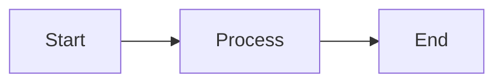

# ML Kenya Blogs - Local Development Instructions

## Prerequisites

Before you begin, ensure you have the following installed:
- **Ruby** (version 3.0 or higher)
- **Bundler** gem (`gem install bundler`)
- **Git**

## Initial Setup

If you haven't already cloned the repository and installed dependencies:

```bash
# Clone the repository
git clone https://github.com/ml-ke/ml-ke.github.io.git
cd ml-ke.github.io

# Install Ruby dependencies
bundle install
```

## Running the Local Development Server

To preview your blog locally before deploying:

```bash
bundle exec jekyll serve
```

Or for live reload (automatically refreshes when you make changes):

```bash
bundle exec jekyll serve --livereload
```

The site will be available at: **http://127.0.0.1:4000**

### Common Server Options

```bash
# Run on a different port
bundle exec jekyll serve --port 4001

# Enable drafts to preview unpublished posts
bundle exec jekyll serve --drafts

# Incremental build (faster for large sites)
bundle exec jekyll serve --incremental
```

## Creating New Blog Posts

1. Create a new file in the `_posts` directory with the naming convention:
   ```
   YYYY-MM-DD-title-of-post.md
   ```

2. Add front matter at the top of the file:
   ```yaml
   ---
   title: "Your Post Title"
   date: YYYY-MM-DD HH:MM:SS +0300
   categories: [Category1, Category2]
   tags: [tag1, tag2, tag3]
   math: true          # Enable if using LaTeX equations
   mermaid: true       # Enable if using Mermaid diagrams
   ---
   ```

3. Write your content using Markdown

### Using Math (LaTeX)

Enable `math: true` in the front matter, then use:

```markdown
Inline math: $E = mc^2$

Display math:
$$
\theta = \theta - \alpha \nabla J(\theta)
$$
```

### Using Mermaid Diagrams

Enable `mermaid: true` in the front matter, then use:

````markdown

````

### Using Admonitions

The Chirpy theme supports special callout blocks:

```markdown
> **Note: Important Information**
> 
> This is a note block
{: .prompt-info }

> **Tip: Pro Tip**
> 
> This is a tip block
{: .prompt-tip }

> **Warning: Be Careful**
> 
> This is a warning block
{: .prompt-warning }

> **Danger: Critical**
> 
> This is a danger block
{: .prompt-danger }
```

## Project Structure

```
ml-ke/
├── _posts/           # Your blog posts go here
├── _tabs/            # Pages in the sidebar (About, Archives, etc.)
├── _config.yml       # Site configuration
├── assets/           # Images, CSS, JS
├── .github/          # GitHub Actions workflows
└── _site/            # Generated site (don't edit)
```

## Deployment

The site automatically deploys to GitHub Pages when you push to the `main` branch. The GitHub Actions workflow (`.github/workflows/pages-deploy.yml`) handles the build and deployment.

### Manual Deployment

If you need to build the production site locally:

```bash
JEKYLL_ENV=production bundle exec jekyll build
```

## Troubleshooting

### Port Already in Use

If port 4000 is already in use:
```bash
bundle exec jekyll serve --port 4001
```

### Bundle Install Fails

Update bundler and retry:
```bash
gem update bundler
bundle install
```

### Changes Not Showing

1. Stop the server (Ctrl+C)
2. Clear the cache: `bundle exec jekyll clean`
3. Restart: `bundle exec jekyll serve`

## Additional Resources

- [Jekyll Documentation](https://jekyllrb.com/docs/)
- [Chirpy Theme Documentation](https://github.com/cotes2020/jekyll-theme-chirpy)
- [Markdown Guide](https://www.markdownguide.org/)
- [MathJax Documentation](https://www.mathjax.org/)
- [Mermaid Documentation](https://mermaid.js.org/)
