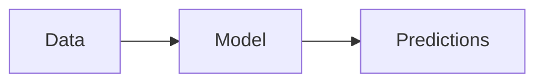

# ML Kenya Blogs

> **A minimalist technical blog for teaching Data Science, AI, and ML Ops**

[](https://github.com/ml-ke/ml-ke.github.io/actions)
[](LICENSE)

Welcome to **ML Kenya Blogs** – a production-ready technical blog built with Jekyll and the Chirpy theme, specifically designed for teaching Data Science, Machine Learning, and ML Ops concepts through hands-on tutorials and best practices.

## 🎯 Purpose

This blog serves as an educational platform for:
- **Machine Learning fundamentals** and advanced techniques
- **ML Ops** practices and deployment strategies
- **Statistics** and mathematical foundations
- **Python** programming for data science
- Real-world case studies and practical implementations

## ✨ Features

- 📐 **LaTeX Math Support**: Write beautiful equations using MathJax
- 📊 **Mermaid Diagrams**: Create flowcharts, sequence diagrams, and more
- 🎨 **Syntax Highlighting**: Code blocks with beautiful syntax highlighting for Python, R, SQL, and more
- 🌓 **Dark/Light Mode**: Automatic theme switching
- 📱 **Responsive Design**: Looks great on all devices
- 🔍 **SEO Optimized**: Built-in SEO best practices
- 🚀 **Fast Loading**: Optimized for performance
- 📝 **Rich Content**: Support for admonitions, callouts, and special blocks

## 🚀 Quick Start

### Prerequisites

- Ruby 3.0+
- Bundler
- Git

### Local Development

```bash
# Clone the repository
git clone https://github.com/ml-ke/ml-ke.github.io.git
cd ml-ke.github.io

# Install dependencies
bundle install

# Run local server
bundle exec jekyll serve

# Visit http://127.0.0.1:4000
```

For detailed instructions, see [Instructions.md](Instructions.md).

## 📝 Creating Content

### New Blog Post

Create a file in `_posts/` with the format: `YYYY-MM-DD-title.md`

```yaml
---
title: "Your Amazing Post Title"
date: 2025-11-20 10:00:00 +0300
categories: [Machine Learning, Math]
tags: [optimization, python, tutorial]
math: true
mermaid: true
---

Your content here...
```

### Math Equations

```markdown
Inline: $E = mc^2$

Display:
$$
\theta = \theta - \alpha \nabla J(\theta)
$$
```

### Code Blocks

````markdown
```python
import numpy as np

def gradient_descent(X, y, lr=0.01):
    theta = np.zeros(X.shape[1])
    # Your implementation
    return theta
```
````

### Diagrams

````markdown

````

## 🏗️ Project Structure

```
ml-ke/
├── _posts/              # Blog posts
├── _tabs/               # Sidebar pages (About, Archives, etc.)
├── _config.yml          # Site configuration
├── assets/              # Images, CSS, JS
├── .github/workflows/   # CI/CD automation
└── Instructions.md      # Detailed setup guide
```

## 🔧 Configuration

Key settings in `_config.yml`:

- **Title**: ML Kenya Blogs
- **Math**: Enabled (MathJax)
- **Mermaid**: Enabled
- **URL**: https://ml-ke.github.io
- **Theme**: Chirpy

## 🚢 Deployment

The site automatically deploys to GitHub Pages via GitHub Actions when you push to the `main` branch.

### GitHub Pages Setup

1. Go to repository Settings → Pages
2. Source: GitHub Actions
3. The workflow will automatically build and deploy

## 📚 Example Content

Check out our sample post: [Introduction to Gradient Descent](_posts/2025-11-20-intro-to-gradient-descent.md)

This post demonstrates:
- ✅ LaTeX equations
- ✅ Python code with syntax highlighting
- ✅ Mermaid diagrams
- ✅ Admonitions and callouts
- ✅ Proper front matter

## 🛠️ Tech Stack

- **Static Site Generator**: Jekyll 4.3+
- **Theme**: [Chirpy](https://github.com/cotes2020/jekyll-theme-chirpy) 7.4+
- **Math Rendering**: MathJax
- **Diagrams**: Mermaid.js
- **Hosting**: GitHub Pages
- **CI/CD**: GitHub Actions

## 📖 Resources

- [Jekyll Documentation](https://jekyllrb.com/docs/)
- [Chirpy Theme Guide](https://chirpy.cotes.page/)
- [Markdown Cheatsheet](https://www.markdownguide.org/cheat-sheet/)
- [MathJax Syntax](https://www.mathjax.org/)
- [Mermaid Syntax](https://mermaid.js.org/)

## 🤝 Contributing

Contributions are welcome! Please feel free to submit a Pull Request.

1. Fork the repository
2. Create your feature branch (`git checkout -b feature/AmazingPost`)
3. Commit your changes (`git commit -m 'Add amazing post'`)
4. Push to the branch (`git push origin feature/AmazingPost`)
5. Open a Pull Request

## 📄 License

This project is licensed under the MIT License - see the [LICENSE](LICENSE) file for details.

## 🙏 Acknowledgments

- [Jekyll](https://jekyllrb.com/) - The static site generator
- [Chirpy Theme](https://github.com/cotes2020/jekyll-theme-chirpy) - Beautiful Jekyll theme
- The ML Kenya community for inspiration and support

---

**Built with ❤️ for the Data Science community**

*Happy Learning! 🚀*
