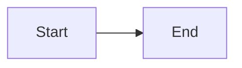

# Blog Drafting for ML Kenya

## CRITICAL PITFALLS (read first)

### 1. Future Dates Break the Build

Jekyll defaults to `future: false` in production mode. Posts with a date in the future are SILENTLY SKIPPED — the build continues but the post doesn't appear, and any `` references to it will HARD-CRASH the build.

**Fix:** Always use a date that has already passed, or set `future: true` in `_config.yml`.

```yaml
# SAFE — date in the past
date: 2026-06-01 10:00:00 +0300

# DANGER — this post gets skipped and breaks all cross-links
date: 2040-01-01 10:00:00 +0300
```

**Cron-published posts:** Always use `00:00:00 +0300` (midnight EAT) instead of the cron's fire time. Jekyll builds at ~14:05 EAT, so midnight ensures the post date is always "yesterday" and won't be skipped.

```yaml
# SAFE for cron — midnight always in the past by the time the cron fires
date: 2026-06-03 00:00:00 +0300

# DANGER — if the build happens before 14:05, this post is "future" and skipped
date: 2026-06-03 14:05:00 +0300
```

### 2. Slug Conflicts with Existing Posts

Two posts with the same filename stem (different dates) generate the same permalink `/posts/:title/`. The later date WINS and overwrites the earlier one.

**Always check BEFORE creating:**
```bash
# List all existing posts
ls _posts/

# Check if your slug would conflict
ls _posts/*-your-proposed-slug.md
```

### 3. Liquid Syntax Inside Code Blocks

Python f-strings with `{{` / `}}` and JSON literals trigger Liquid syntax errors in Jekyll. These are warnings (not fatal), but can cause confusion.

**Fix:** Wrap problematic code blocks in `...`:

```markdown

```python
# f-string with literal braces
query = f"MATCH (n {{name: '{entity}'}})"
```

```

### 4. Pull Remote BEFORE Writing

The remote may have posts not in your local clone. Always `git pull` first and check `_posts/` for existing content before planning new posts.

```bash
git pull origin main
ls _posts/ | sort
```

### 5. Homepage Images Not Showing (LQIP / Lazy Loading)

If the homepage post previews show a blurry placeholder or blank space but not the real image:

1. **Hard refresh** (Ctrl+Shift+R) — browser cached old `//assets/` broken URLs from a prior incorrect `baseurl`
2. **Verify `baseurl: ""`** (not `"/"`) in `_config.yml` — the `/` produces `//assets/` protocol-relative URLs
3. **Chirpy uses `data-src` for lazy loading** — the real image URL is in `data-src`, not `src`. JavaScript in `home.min.js` swaps them via `document.querySelectorAll('article img[data-lqip="true"]')`. If the JS has an error, images stay blurry.
4. **Scrolling triggers loading** — IntersectionObserver detects viewport proximity

See `references/chirpy-image-troubleshooting.md` for full debugging walkthrough.

### 6. GitHub Push Protection Blocks Secrets in History

GitHub secret scanning push protection blocks any push containing a detected credential (API key, PAT, token) — even if the secret is in an OLD commit, not the one being pushed. The error looks like:

```
remote: error: GH013: Repository rule violations found for refs/heads/main.
remote: - Push cannot contain secrets
remote:   - Supabase Personal Access Token
remote:     locations:
remote:       - commit: <sha>
remote:         path: some/old/file.md:57
```

**Fix with interactive rebase:**

```bash
# 1. Find how far back the secret commit is
git log --oneline

# 2. Rebase to edit the offending commit
GIT_SEQUENCE_EDITOR="sed -i 's/^pick <sha>/edit <sha>/'" \
  git rebase -i HEAD~<N>

# 3. Remove the secret: edit the file to redact the token value
#    Replace the actual token with ***redacted***
#    Then:
git add -A
git commit --amend --no-edit
git rebase --continue

# 4. Push
git push origin main
```

If the push still fails, use `git push --force-with-lease origin main` (only after verifying nobody else pushed to the branch).

**Prevention:** Never commit backup dumps that contain credential stores or skill references embedding live tokens. The ATLAS backup script should verify it doesn't catch `.env` or credential files.

## Blog Structure

### Front Matter Template

Every post goes in `_posts/YYYY-MM-DD-title-with-dashes.md`. The slug (for permalink and ``) comes from the filename stem — everything after the date.

```yaml
---
title: "Your Title: Subtitle Here"
date: YYYY-MM-DD HH:MM:SS +0300
categories: [Category1, Category2]
tags: [tag1, tag2, tag3, tag4]
math: true          # Enable for LaTeX equations
mermaid: true       # Enable for Mermaid diagrams
image:
  path: /assets/blog/cover-slug.svg
  alt: Description of cover image
---
```

**Categories used:** `Machine Learning`, `Math`, `Optimization`, `Data Science`, `Knowledge Graphs`, `AI Security`, `LLM`

**Chirpy theme behavior:** The `image.path` is displayed as the post's featured/cover image at the top of the post and in the card preview on the home page. Default size is 1200×630px (OG image ratio).

## SVG Cover Images

### CRITICAL: Design Unique Visual Metaphors

**Do NOT reuse the same visual style for different posts.** Every post needs a conceptually distinct cover. The old template-based generator produced covers that all looked the same (just neural networks, graph nodes, or vector matrices) — the user will reject this.

Each cover must answer: *"What is the ONE visual metaphor that best represents this post's unique angle?"*

| Post Topic | Appropriate Metaphor | Wrong Approach |
|-----------|---------------------|----------------|
| Self-evolving skills | Ouroboros/circular gear with self-arrows | Neural network nodes |
| Memory poisoning | Circuit board + brain + injection needle | Generic graph nodes |
| Science guardrails | Lab flask + shield + DNA helix | Neural network |
| Agent collusion | Two agents with hidden dashed connection | Single agent icon |
| Structured data injection | PDF/JSON/CSV file icons + piercing arrow | Danger triangle |
| Red teaming | Shield + 4 attack arrows from all directions | Single warning icon |
| Model watermarking | Fingerprint overlaid on network | Generic fingerprint |
| Benchmark poisoning | Leaderboard podium + contamination drip | Generic poison icon |
| Multimodal attacks | Audio wave + video player + text linked by chain | Neural network |
| Secrets management | Vault door + golden key + circuit traces | Generic lock icon |

**Design process (do this before writing SVG code):**
1. Identify the core concept of the post (what makes it different from others?)
2. Brainstorm 2-3 visual metaphors that represent that specific concept
3. Pick the ONE that best conveys the idea visually and has clear geometric forms
4. Never reuse a metaphor from a previous post — each must be its own visual identity
5. If two posts would naturally use the same metaphor (e.g., "agent" posts), find a differentiator (collusion = two agents + hidden connection, vs. single agent with tool icons)

**Reference library:** See `references/cover-metaphor-library.md` for the full catalog of 10 unique cover designs with their SVG structural patterns. Use this as inspiration for new covers — study the techniques (Bezier arrow paths, concentric circles, circuit traces, file icons, etc.) and apply them to new metaphors.

### Quick Generation (NOT recommended for new posts)

Use the helper script at `tools/generate_covers.py` ONLY for posts whose topic matches an existing template style (graph nodes, neural network, etc.). For most posts, hand-craft a unique SVG using the manual spec below.

### Manual Spec

Place cover images at `assets/blog/cover-<slug>.svg`.

**Design spec:**
- **Dimensions:** 1200×630 (OG standard ratio)
- **Style:** Dark gradient background (#0d1117 → #1a1a2e), geometric/abstract elements, clean typography
- **Logo placement:** Bottom-right corner: "ml-ke.github.io" text
- **Title text:** Post title centered, white/light gray, sans-serif, ~34px
- **Color palette:** Dark navy/charcoal bg, accent colors:
  - `#6bcf7f` green (graph, positive)
  - `#00d2ff` cyan (tech, vectors)
  - `#ff6b6b` red (danger, security)
  - `#ffd93d` yellow (warning, attention)
  - `#a78bfa` purple (neural, ML)
- **Elements:** Grid lines (opacity 0.03), geometric shapes, node/edge patterns
- **Inline SVG only** — no external asset dependencies

## Content Conventions

**Math (LaTeX):** Enable `math: true` in front matter.
- Inline: `$E = mc^2$`
- Display: `$$\theta = \theta - \alpha \nabla J(\theta)$$`

**Code Blocks:** Language-tagged fenced blocks with syntax highlighting. If the code contains `{{` or `}}`, wrap in `...` (see pitfall #3 above).

**Mermaid Diagrams:** Enable `mermaid: true` in front matter.
````

````

**Chirpy Admonitions:**
```
> **Title**
> Content here
{: .prompt-info }    # Blue info box
{: .prompt-tip }     # Green tip box
{: .prompt-warning } # Yellow warning box
{: .prompt-danger }  # Red danger box
```

**Post structure:**
1. Title (H2 `##`) — first heading after front matter
2. Intro paragraph with key concept (use `.prompt-info` callout)
3. Section body with code/math/diagrams
4. Conclusion with key takeaways table
5. References section
6. Related posts links (use ``)

**Series convention:**
- First post in series: ends with "**Next in this series:**" prompt
- Middle posts: cross-link to previous and next using ``
- Final post: wrap-up summary table with links to ALL posts in series

## Cross-Link Verification

Before publishing, verify ALL `` references:

```bash
# List all post slugs
ls _posts/ | sed 's/^[0-9-]*//' | sed 's/\.md$//' | sort

# Check for broken references (the build will crash if any are wrong)
grep -rn "{% post_url" _posts/
```

Each `` must match an EXISTING filename `_posts/YYYY-MM-DD-slug.md`. The slug is everything after the date in the filename.

## Fact-Checking Protocol (MANDATORY)

After drafting ANY blog post, run this verification checklist before publishing:

### Claim Verification

```
❌ "Could potentially lead to..." → NOT acceptable. Find a real case or remove.
✅ "On May 15, 2026, researcher X demonstrated Y against Z..." → BACKED by source.
```

| Check | Tool/Approach |
|-------|---------------|
| Code claims actually run? | Execute the code in the post; verify output matches |
| "Constant defined = checked"? | `grep -rn CONST_NAME src/` — definition ≠ enforcement |
| CVE exists and matches? | Verify on NVD (nvd.nist.gov) — don't trust secondary sources |
| Paper result is real? | Check arXiv version, citation count, reproducibility |
| API behavior documented? | Read the actual docs, don't infer |
| Attack demonstrated or theorized? | Only published/confirmed attacks go in (no hypotheticals) |
| Dates and version numbers? | Verify against changelogs and release tags |

### Resource Pipeline for Fact-Checking

1. **Google Scholar** (scholar.google.com) — search paper claims by exact title
2. **NVD / CVE** (nvd.nist.gov) — verify every CVE reference
3. **sophon.at/papers** — AI safety/security paper summaries
4. **arXiv** (arxiv.org) — check latest version, retractions, errata
5. **GitHub repo** — check closed issues, security advisories, commit history
6. **H1 Hacktivity / Bugcrowd disclosed** — verify disclosed bug reports exist
7. **OWASP LLM Top 10** (genai.owasp.org) — verify vulnerability classifications
8. **PortSwigger Research** (portswigger.net/research) — verify web/API attack details

### Cross-Link Verification

```bash
# Before every push:
grep -rn "{% post_url" _posts/ | grep -v "2025-11\|2025-12\|2026-06-01"
# This shows all cross-references. Every slug must match an existing filename.

# Verify post exists at the URL
curl -s -o /dev/null -w "%{http_code}" https://ml.co.ke/posts/SLUG/
```

### Image Path Verification (MANDATORY)

**All post `image.path` values must end in `.webp`**, never `.png` or `.svg`. A `.png` path in front matter produces a 404 on the live site.

```bash
# Before every push — catch .png references in image paths
grep -n "path:.*\.png" _posts/*.md
# Should return NO matches (excluding lqip base64 or favicon/logo)
```

If you find any, fix them:
```bash
sed -i 's|\.png"$|.webp"|' _posts/FILENAME.md
# Or use the path pattern:
sed -i 's|/assets/img/\(.*\)\.png|/assets/img/\1.webp|' _posts/*.md
```

This also applies when delegating post writing to subagents — always verify the image extension in the returned file.

### Jekyll Build Test (if possible)

```bash
# Catches Liquid errors, broken post_url, future-date skips
cd ~/ProG/ml-ke
JEKYLL_ENV=production bundle exec jekyll build 2>&1 | grep -i "error\|warning\|liquid\|future\|skipping"
```

## Available Research Sources for New Content

- **Google Scholar**: scholar.google.com — search by paper title for latest version
- **sophon.at/papers**: sophon.at/papers — curated AI safety/security papers
- **CVE/NVD**: nvd.nist.gov — verify all CVE references
- **OWASP Gen AI**: genai.owasp.org — LLM vulnerability taxonomy
- **arXiv**: arxiv.org — latest ML security preprints
- **H1 Hacktivity**: hackerone.com/hacktivity — disclosed bug bounty reports
- **Bugcrowd Disclosed**: bugcrowd.com/bug-bounty-list — public writeups
- **PortSwigger Research**: portswigger.net/research — web security deep dives
- **The Hacker News**: thehackernews.com — AI breach coverage
- **FireTail AI Breach Tracker**: firetail.ai/ai-breach-tracker
- **MLSys/NVIDIA Technical Blog**: developer.nvidia.com/blog — ML engineering content

## Topic Scouting

For new post ideas, load the `topic-scouting` skill which covers:
- Scanning Google Scholar and sophon.at/papers for trending AI security research
- Tracking CVE publications for ML/AI vulnerabilities
- Monitoring Hacker News and The Register for AI breach incidents
- Identifying gaps in existing blog series coverage
- Cross-referencing OWASP LLM Top 10 updates for new vulnerability classes

## Deployment

### Direct Publishing (single post)

```bash
git pull origin main  # Always pull first — remote may have new posts
git add _posts/YYYY-MM-DD-title.md
git commit -m "Add post: Short title"
git push origin main
```

### Batch Publishing (10-day series via cron)

For pre-written posts that should publish one per day:

1. Write all posts to `.scheduled/YYYY-MM-DD-slug.md` (one per day)
2. Stage all cover images and assets in a single commit
3. **Do NOT commit `.scheduled/` files** — they're staged for the cron
4. Set up a cron job that fires daily at 14:05 EAT:

```
Schedule: 05 11 * * *  (= 14:05 EAT = 11:05 UTC)
Skills: blog-drafting
Deliver: origin,all
```

The cron moves one `.scheduled/` file matching today's date to `_posts/`, then git add / commit / push. If a day was missed, it publishes the earliest remaining file as catch-up. After all files are published, it reports "Series complete!" and stops.

**Telegram delivery:** Use `deliver: origin,all` to notify both the current chat and Telegram (@Pro_Grammar254) on each publish.

### Post-Deploy Verification

```bash
# Check new posts appear on the site
curl -s https://ml.co.ke | grep -oP "(?<=/posts/)[^\"/]+" | sort -u

# Verify a specific old post still exists
curl -s -o /dev/null -w "%{http_code}" https://ml.co.ke/posts/existing-slug/
```

## Available Series (as of June 2026)

### 1. Optimization Series (COMPLETE — 3 posts)
- Intro to Gradient Descent (`2025-11-20-intro-to-gradient-descent`)
- Momentum and Adaptive Learning Rates (`2025-11-20-momentum-adaptive-learning-rates`)
- Second-Order Optimization Methods (`2025-11-24-second-order-optimization-methods`)

### 2. Knowledge Graphs Series (COMPLETE — 7 posts)
- ✅ Knowledge Graphs Fundamentals (`2025-11-24-knowledge-graphs-fundamentals`)
- ✅ Building a KG with Neo4j and Python (`2025-12-01-building-knowledge-graph-neo4j-python`)
- ✅ Graph Algorithms in Neo4j: PageRank and Community Detection (`2025-12-02-graph-algorithms-neo4j`)
- ✅ Graph Neural Networks Demystified (`2025-12-04-graph-neural-networks-fundamentals`)
- ✅ KG Embeddings: TransE to RotatE (`2026-06-01-kg-embeddings`)
- ✅ GNNs for KG Reasoning (`2026-06-01-gnn-knowledge-graph-reasoning`)
- ✅ Knowledge Graphs in Production (`2026-06-01-kg-production`)
- ✅ KGs Meet LLMs: Graph RAG (`2026-06-01-kg-llm-rag`)

### 3. AI Hacking Series (COMPLETE — 5 posts)
- ✅ Prompt Injection: The #1 LLM Risk (`2026-06-01-prompt-injection-llm-security`)
- ✅ Jailbreaking LLMs: From DAN to GODMODE (`2026-06-01-jailbreaking-llms`)
- ✅ Data Poisoning and Model Backdoors (`2026-06-01-data-poisoning-model-backdoors`)
- ✅ Insecure Agent Design (`2026-06-01-insecure-agent-design`)
- ✅ Supply Chain Attacks on AI (`2026-06-01-supply-chain-ai-attacks`)

### 4. AI/ML Engineering Series (COMPLETE — 15 posts)

**Published:**
- ✅ MLSecOps: Securing the ML Pipeline (`2026-06-01-mlsecops-pipeline-security`)
- ✅ Model Extraction and Theft (`2026-06-01-model-extraction-theft`)
- ✅ RAG Security: Hidden Attack Surface (`2026-06-01-rag-security-attacks`)
- ✅ Fine-Tuning Safety: Guardrails Under Threat (`2026-06-01-fine-tuning-safety-alignment`)
- ✅ AI Agent Observability (`2026-06-01-ai-agent-observability`)
- ✅ Self-Evolving Agent Skills (`2026-06-03-agent-skills-evolution`)
- ✅ Memory as an Attack Surface (`2026-06-03-memory-attack-surface`)
- ✅ Autonomous Research Guardrails (`2026-06-05-automated-science-guardrails`)
- ✅ Multi-Agent Collusion (`2026-06-06-multi-agent-collusion`)
- ✅ Structured Data Prompt Injection (`2026-06-07-structured-data-injection`)
- ✅ Automated AI Red Teaming (`2026-06-08-automated-red-teaming`)
- ✅ Model Watermarking (`2026-06-09-model-watermarking`)
- ✅ Eval Benchmark Poisoning (`2026-06-10-eval-benchmark-poisoning`)

**Staged for daily publish (cron at 14:05 EAT):**
- Jun 11: Multimodal Security Attacks (`.scheduled/2026-06-11-multimodal-attacks`)
- Jun 12: ML Secrets Management (`.scheduled/2026-06-12-ml-secrets-management`)

## Image Optimization Pipeline (Hydroxide)

### The Problem

The blog's old `assets/BlogPhotos/` images were **5-6 MB each** at 2752×1536 resolution — 40 MB of images blocking page loads. Even SVGs have rendering overhead on some browsers. The Chirpy theme also does NOT natively optimize or resize images.

### The Pipeline

Three scripts in `tools/` form a complete optimization pipeline:

```
tools/generate_covers.py           # Step 0: Generate SVG covers (if starting fresh)
tools/optimize_images.py           # Step 1: Resize → WebP → LQIP
  ├── Resizes to max 1200px wide (LANCZOS)
  ├── Converts to WebP at quality 85
  ├── Generates LQIP (20px-wide WebP → base64 → .txt files)
  └── Output to /assets/img/ and /assets/img/lqip/
tools/update_frontmatter.py        # Step 2: Rewrite all _posts/ front matter
  ├── Sets image.path → /assets/img/<slug>.webp
  ├── Sets image.lqip → data:image/webp;base64,<encoded>
  └── Adds image.alt text
tools/add_alt_text.py              # Step 3: Fix alt text if stripped
```

### Results

| Metric | Before | After |
|--------|--------|-------|
| Format | PNG / SVG | WebP |
| Resolution | 2752×1536 | 1200×630 |
| Old images | 5-6 MB each | 60-128 KB each |
| New covers | 50-72 KB | 13-17 KB |
| Total page weight | ~40 MB | ~813 KB |
| Perceived load | White box while waiting | LQIP blurry preview instantly |

### LQIP Front Matter Format

Chirpy v7+ supports the `lqip` field in the post's `image:` front matter block. The value is a full data URI:

```yaml
image:
  path: /assets/img/post-slug.webp
  alt: Description of image
  lqip: data:image/webp;base64,UklGRnIAAABXRUJQVlA...
```

The LQIP is a 20px-wide WebP encoded as base64 and embedded directly in the page HTML. The Chirpy theme renders it as a CSS background before loading the real image, so the user sees a blurry preview instantly.

### Image Storage Convention

| Directory | Contains | Managed By |
|-----------|----------|------------|
| `assets/blog/` | Source SVGs (for regeneration) | `generate_covers.py` |
| `assets/img/` | Production WebP images | `optimize_images.py` |
| `assets/img/lqip/` | LQIP base64 text files | `optimize_images.py` |
| `assets/BlogPhotos/` | REMOVED — was 40MB of unoptimized originals | Delete on migration |

### Workflow for New Posts

```bash
# 1. Generate cover SVG
python3 tools/generate_covers.py

# 2. Convert to PNG (Chromium/SVG renderer fallback)
python3 tools/convert_svgs.py

# 3. Run full optimization (resize → WebP → LQIP)
python3 tools/optimize_images.py

# 4. Update all post front matter
python3 tools/update_frontmatter.py
python3 tools/add_alt_text.py
```

Or for a single new cover: manually place SVG in `assets/blog/`, then run steps 2-4 above.

### PNG → WebP Without the Pipeline

For ad-hoc image drops, use the cairosvg venv directly:

```bash
/tmp/svg_venv/bin/python3 -c "
from PIL import Image
img = Image.open('input.png').convert('RGB')
w, h = img.size
if w > 1200:
    img = img.resize((1200, int(h * 1200 / w)), Image.LANCZOS)
img.save('output.webp', 'WEBP', quality=85)
"
```

## Asset Paths

| Directory | Use | Example |
|-----------|-----|---------|
| `/assets/img/` | **Production WebP images** (all posts should use this) | `gradient-descent.webp` |
| `/assets/img/lqip/` | LQIP base64 placeholder text files | `gradient-descent.txt` |
| `/assets/blog/` | SVG source files (for regeneration) | `cover-kg-embeddings.svg` |

All post `image.path` values should point to `/assets/img/<slug>.webp`.

### Chirpy Image Troubleshooting

If images don't appear on the homepage or show broken URLs, see `references/chirpy-image-troubleshooting.md` for:
- The `baseurl: ""` fix (protocol-relative `//assets/` bug)
- LQIP lazy-loading debugging (data-src swap)
- Browser cache busting
- Quick verification curl commands
