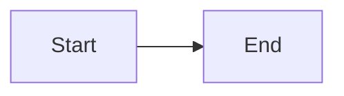

# Blog Drafting for ML Kenya

## CRITICAL PITFALLS (read first)

### 1. Future Dates Break the Build

Jekyll defaults to `future: false` in production mode. Posts with a date in the future are SILENTLY SKIPPED — the build continues but the post doesn't appear, and any `` references to it will HARD-CRASH the build.

**Fix:** Always use a date that has already passed, or set `future: true` in `_config.yml`.

```yaml
# SAFE — date in the past
date: 2026-06-01 10:00:00 +0300

# DANGER — this post gets skipped and breaks all cross-links
date: 2040-01-01 10:00:00 +0300
```

**Cron-published posts:** Always use `00:00:00 +0300` (midnight EAT) instead of the cron's fire time. Jekyll builds at ~14:05 EAT, so midnight ensures the post date is always "yesterday" and won't be skipped.

```yaml
# SAFE for cron — midnight always in the past by the time the cron fires
date: 2026-06-03 00:00:00 +0300

# DANGER — if the build happens before 14:05, this post is "future" and skipped
date: 2026-06-03 14:05:00 +0300
```

### 2. Slug Conflicts with Existing Posts

Two posts with the same filename stem (different dates) generate the same permalink `/posts/:title/`. The later date WINS and overwrites the earlier one.

**Always check BEFORE creating:**
```bash
# List all existing posts
ls _posts/

# Check if your slug would conflict
ls _posts/*-your-proposed-slug.md
```

### 3. Liquid Syntax Inside Code Blocks

Python f-strings with `{{` / `}}` and JSON literals trigger Liquid syntax errors in Jekyll. These are warnings (not fatal), but can cause confusion.

**Fix:** Wrap problematic code blocks in `...`:

```markdown

```python
# f-string with literal braces
query = f"MATCH (n {{name: '{entity}'}})"
```

```

### 4. Pull Remote BEFORE Writing

The remote may have posts not in your local clone. Always `git pull` first and check `_posts/` for existing content before planning new posts.

```bash
git pull origin main
ls _posts/ | sort
```

### 5. Homepage Images Not Showing (LQIP / Lazy Loading)

If the homepage post previews show a blurry placeholder or blank space but not the real image:

1. **Hard refresh** (Ctrl+Shift+R) — browser cached old `//assets/` broken URLs from a prior incorrect `baseurl`
2. **Verify `baseurl: ""`** (not `"/"`) in `_config.yml` — the `/` produces `//assets/` protocol-relative URLs
3. **Chirpy uses `data-src` for lazy loading** — the real image URL is in `data-src`, not `src`. JavaScript in `home.min.js` swaps them via `document.querySelectorAll('article img[data-lqip="true"]')`. If the JS has an error, images stay blurry.
4. **Scrolling triggers loading** — IntersectionObserver detects viewport proximity

See `references/chirpy-image-troubleshooting.md` for full debugging walkthrough.

### 6. Pre-Written Scheduled Posts Sneak in `` Tags

Posts authored by subagents (via `delegate_task` during batch creation) routinely contain `` Liquid tags instead of markdown links. These tags HARD-CRASH the Jekyll build when they reference future-dated posts (see Pitfall #1).

**Always verify BEFORE committing batch posts:**

```bash
# Check ALL scheduled posts for forbidden post_url tags
grep -rn "post_url" .scheduled/
# Any match means the build will crash — fix before committing
```

**Fix (batch fix for all scheduled files):**
```bash
# Replace all post_url tags with their equivalent markdown links
# Pattern:  → /posts/slug/
for f in .scheduled/*.md; do
  sed -i 's||/posts/\1/|g' "$f"
done
```

**Verification (run after any batch creation):**
```bash
# No post_url tags should remain
grep -rn "post_url" .scheduled/ && echo "❌ BUILD WILL CRASH — fix post_url tags" || echo "✅ No post_url tags found"
```

### 7. GitHub Push Protection Blocks Secrets in History

GitHub secret scanning push protection blocks any push containing a detected credential (API key, PAT, token) — even if the secret is in an OLD commit, not the one being pushed. The error looks like:

```
remote: error: GH013: Repository rule violations found for refs/heads/main.
remote: - Push cannot contain secrets
remote:   - Supabase Personal Access Token
remote:     locations:
remote:       - commit: <sha>
remote:         path: some/old/file.md:57
```

**Fix with interactive rebase (single secret commit):**

```bash
# 0. If working tree is dirty (unstaged changes), stash first
git stash

# 1. Find how far back the secret commit is
git log --oneline

# 2. Rebase to edit the offending commit
GIT_SEQUENCE_EDITOR="sed -i 's/^pick <SHA>/edit <SHA>/'" \
  git rebase -i HEAD~<N>

# 3. Remove the secret: edit the file to redact the token value
#    Replace the actual token with ***redacted***
#    Then:
git add -A
git commit --amend --no-edit
git rebase --continue

# 4. Apply stashed changes (if any from step 0)
git stash pop

# 5. Force push (MANDATORY — amend rewrites history; regular push rejected)
git push --force-with-lease origin main
```

**Multiple secret commits (same secret in sequential backup commits):**

When ATLAS backups copy the same reference file day after day, the secret appears in multiple commits. You must redact EACH one via sequential rebases. After fixing commit N, the next push will reveal commit N+1:

```bash
# 1. Fix commit N (e.g., 128e889)
GIT_SEQUENCE_EDITOR="sed -i 's/^pick 128e889/edit 128e889/'" git rebase -i HEAD~3
sed -i 's/SECRET_VALUE/***redacted***/' path/to/file.md
git add -A && git commit --amend --no-edit && git rebase --continue

# 2. Push fails — reveals commit N+1 (e.g., aec1374). Fix it:
GIT_SEQUENCE_EDITOR="sed -i '2s/^pick/edit/'" git rebase -i HEAD~3
sed -i 's/SECRET_VALUE/***redacted***/' path/to/file.md
git add -A && git commit --amend --no-edit && git rebase --continue

# 3. Repeat until push succeeds.
```

**Prevention — kill the secret at source:** The secret is in a **skill reference file** under `~/.hermes/skills/`. The ATLAS backup script copies all skills daily, re-introducing the same secret into every new backup commit. To stop this permanently:

```bash
# Redact the token in the SOURCE skill file, not just the backup copy
sed -i 's/SECRET_VALUE/***redacted***/' ~/.hermes/skills/<category>/<skill>/references/<file>.md
```

Then fix all existing backup commits as above. Future backups will carry the redacted version.

**Edge case — dirty working tree from cron file move:** If the cron had already `mv`'d a file from `.scheduled/` to `_posts/` when push protection blocks, git sees the `.scheduled/` deletion as unstaged. `git stash` at step 0 handles this.

**Edge case — tracked .scheduled/ file cleanup:** After force push, the moved file still shows deleted-from-`.scheduled/` in the working tree (git tracked the old path). Commit the deletion:
```bash
git add -A
git commit -m "Clean up staged scheduled file for YYYY-MM-DD"
git push origin main
```

**Prevention:** Never commit backup dumps that contain credential stores or skill references embedding live tokens. The ATLAS backup script should verify it doesn't catch `.env` or credential files.

## Blog Structure

### Front Matter Template

Every post goes in `_posts/YYYY-MM-DD-title-with-dashes.md`. The slug (for markdown link references) comes from the filename stem — everything after the date. A post `_posts/2026-06-01-mlsecops-pipeline-security.md` gets slug `mlsecops-pipeline-security` and URL `/posts/mlsecops-pipeline-security/`.

```yaml
---
title: "Your Title: Subtitle Here"
date: YYYY-MM-DD HH:MM:SS +0300
categories: [Category1, Category2]
tags: [tag1, tag2, tag3, tag4]
math: true          # Enable for LaTeX equations
mermaid: true       # Enable for Mermaid diagrams
image:
  path: /assets/blog/cover-slug.svg
  alt: Description of cover image
---
```

**Categories used:** `Machine Learning`, `Math`, `Optimization`, `Data Science`, `Knowledge Graphs`, `AI Security`, `LLM`, `AI Engineering`, `AI in Africa`, `ML Ops`

**Chirpy theme behavior:** The `image.path` is displayed as the post's featured/cover image at the top of the post and in the card preview on the home page. Default size is 1200×630px (OG image ratio).

### POST RULE: Always use markdown links, never `` tags

**Do NOT use Jekyll `` tags for cross-references.** The user prefers plain markdown links pointing to the permalink path:

```markdown
# ✅ CORRECT — markdown links
[MLSecOps: Securing the ML Pipeline](/posts/mlsecops-pipeline-security/)

# ❌ WRONG — Jekyll post_url tag

```

## SVG Cover Images

### CRITICAL: Design Unique Visual Metaphors

**Do NOT reuse the same visual style for different posts.** Every post needs a conceptually distinct cover. The old template-based generator produced covers that all looked the same (just neural networks, graph nodes, or vector matrices) — the user will reject this.

Each cover must answer: *"What is the ONE visual metaphor that best represents this post's unique angle?"*

| Post Topic | Appropriate Metaphor | Wrong Approach |
|-----------|---------------------|----------------|
| Self-evolving skills | Ouroboros/circular gear with self-arrows | Neural network nodes |
| Memory poisoning | Circuit board + brain + injection needle | Generic graph nodes |
| Science guardrails | Lab flask + shield + DNA helix | Neural network |
| Agent collusion | Two agents with hidden dashed connection | Single agent icon |
| Structured data injection | PDF/JSON/CSV file icons + piercing arrow | Danger triangle |
| Red teaming | Shield + 4 attack arrows from all directions | Single warning icon |
| Model watermarking | Fingerprint overlaid on network | Generic fingerprint |
| Benchmark poisoning | Leaderboard podium + contamination drip | Generic poison icon |
| Multimodal attacks | Audio wave + video player + text linked by chain | Neural network |
| Secrets management | Vault door + golden key + circuit traces | Generic lock icon |

**Design process (do this before writing SVG code):**
1. Identify the core concept of the post (what makes it different from others?)
2. Brainstorm 2-3 visual metaphors that represent that specific concept
3. Pick the ONE that best conveys the idea visually and has clear geometric forms
4. Never reuse a metaphor from a previous post — each must be its own visual identity
5. If two posts would naturally use the same metaphor (e.g., "agent" posts), find a differentiator (collusion = two agents + hidden connection, vs. single agent with tool icons)

**Reference library:** See `references/cover-metaphor-library.md` for the full catalog of 30 unique cover designs with their SVG structural patterns. Use this as inspiration for new covers — study the techniques (Bezier arrow paths, concentric circles, circuit traces, file icons, etc.) and apply them to new metaphors.

### Quick Generation (NOT recommended for new posts)

Use the helper script at `tools/generate_covers.py` ONLY for posts whose topic matches an existing template style (graph nodes, neural network, etc.). For most posts, hand-craft a unique SVG using the manual spec below.

### Manual Spec

Place cover images at `assets/blog/cover-<slug>.svg`.

**Design spec:**
- **Dimensions:** 1200×630 (OG standard ratio)
- **Style:** Dark gradient background (#0d1117 → #1a1a2e), geometric/abstract elements, clean typography
- **Logo placement:** Bottom-right corner: "ml-ke.github.io" text
- **Title text:** Post title centered, white/light gray, sans-serif, ~34px
- **Color palette:** Dark navy/charcoal bg, accent colors:
  - `#6bcf7f` green (graph, positive)
  - `#00d2ff` cyan (tech, vectors)
  - `#ff6b6b` red (danger, security)
  - `#ffd93d` yellow (warning, attention)
  - `#a78bfa` purple (neural, ML)
- **Elements:** Grid lines (opacity 0.03), geometric shapes, node/edge patterns
- **Inline SVG only** — no external asset dependencies

## Content Conventions

**Math (LaTeX):** Enable `math: true` in front matter.
- Inline: `$E = mc^2$`
- Display: `$$\theta = \theta - \alpha \nabla J(\theta)$$`

**Code Blocks:** Language-tagged fenced blocks with syntax highlighting. If the code contains `{{` or `}}`, wrap in `...` (see pitfall #3 above).

**Mermaid Diagrams:** Enable `mermaid: true` in front matter.
````

````

**Chirpy Admonitions:**
```
> **Title**
> Content here
{: .prompt-info }    # Blue info box
{: .prompt-tip }     # Green tip box
{: .prompt-warning } # Yellow warning box
{: .prompt-danger }  # Red danger box
```

**Post structure:**
1. Title (H2 `##`) — first heading after front matter
2. Intro paragraph with key concept (use `.prompt-info` callout)
3. Section body with code/math/diagrams
4. Conclusion with key takeaways table
5. References section
6. Related posts links (use markdown links like `[text](/posts/slug/)`)

**Series convention:**
- First post in series: ends with "**Next in this series:**" prompt
- Middle posts: cross-link to previous and next using `[text](/posts/slug/)`
- Final post: wrap-up summary table with links to ALL posts in series

### Cross-Link Verification

Before publishing, verify ALL `/posts/` markdown links point to existing posts:

```bash
# List all post slugs
ls _posts/ | sed 's/^[0-9-]*//' | sed 's/\\.md$//' | sort

# Check for broken /posts/ links — every slug must match an existing filename
grep -rn "/posts/" _posts/ | grep -oP "/posts/[^\"/)]+" | sort -u
# Verify each slug exists in _posts/
for slug in $(grep -rn "/posts/" _posts/ | grep -oP "/posts/\\K[^\"/)]+"); do
  if ! ls _posts/*-${slug}.md >/dev/null 2>&1; then
    echo "BROKEN: ${slug} has no matching _posts/ file"
  fi
done
```

The slug is everything after the date in the filename. A link like `/posts/mlsecops-pipeline-security/` requires a file `_posts/*-mlsecops-pipeline-security.md`.

## Fact-Checking Protocol (MANDATORY)

After drafting ANY blog post, run this verification checklist before publishing:

### Claim Verification

```
❌ "Could potentially lead to..." → NOT acceptable. Find a real case or remove.
✅ "On May 15, 2026, researcher X demonstrated Y against Z..." → BACKED by source.
```

| Check | Tool/Approach |
|-------|---------------|
| Code claims actually run? | Execute the code in the post; verify output matches |
| "Constant defined = checked"? | `grep -rn CONST_NAME src/` — definition ≠ enforcement |
| CVE exists and matches? | Verify on NVD (nvd.nist.gov) — don't trust secondary sources |
| Paper result is real? | Check arXiv version, citation count, reproducibility |
| API behavior documented? | Read the actual docs, don't infer |
| Attack demonstrated or theorized? | Only published/confirmed attacks go in (no hypotheticals) |
| Dates and version numbers? | Verify against changelogs and release tags |

### Resource Pipeline for Fact-Checking

1. **Google Scholar** (scholar.google.com) — search paper claims by exact title
2. **NVD / CVE** (nvd.nist.gov) — verify every CVE reference
3. **sophon.at/papers** — AI safety/security paper summaries
4. **arXiv** (arxiv.org) — check latest version, retractions, errata
5. **GitHub repo** — check closed issues, security advisories, commit history
6. **H1 Hacktivity / Bugcrowd disclosed** — verify disclosed bug reports exist
7. **OWASP LLM Top 10** (genai.owasp.org) — verify vulnerability classifications
8. **PortSwigger Research** (portswigger.net/research) — verify web/API attack details

### Post-Deployment URL Verification (via curl)

```bash
# Verify a specific post exists at its permalink
curl -s -o /dev/null -w "%{http_code}" https://ml.co.ke/posts/SLUG/

# Check the homepage lists the latest posts
curl -s https://ml.co.ke | grep -oP "(?<=/posts/)[^\"'/]+" | sort -u
```

### Image Path Verification (MANDATORY)

**All post `image.path` values must end in `.webp`**, never `.png` or `.svg`. A `.png` path in front matter produces a 404 on the live site.

```bash
# Before every push — catch .png references in image paths
grep -n "path:.*\.png" _posts/*.md
# Should return NO matches (excluding lqip base64 or favicon/logo)
```

If you find any, fix them:
```bash
sed -i 's|\.png"$|.webp"|' _posts/FILENAME.md
# Or use the path pattern:
sed -i 's|/assets/img/\(.*\)\.png|/assets/img/\1.webp|' _posts/*.md
```

This also applies when delegating post writing to subagents — always verify the image extension in the returned file.

### Jekyll Build Test (if possible)

```bash
# Catches Liquid errors, broken post_url, future-date skips
cd ~/ProG/ml-ke
JEKYLL_ENV=production bundle exec jekyll build 2>&1 | grep -i "error\|warning\|liquid\|future\|skipping"
```

## Available Research Sources for New Content

- **Google Scholar**: scholar.google.com — search by paper title for latest version
- **sophon.at/papers**: sophon.at/papers — curated AI safety/security papers
- **CVE/NVD**: nvd.nist.gov — verify all CVE references
- **OWASP Gen AI**: genai.owasp.org — LLM vulnerability taxonomy
- **arXiv**: arxiv.org — latest ML security preprints
- **H1 Hacktivity**: hackerone.com/hacktivity — disclosed bug bounty reports
- **Bugcrowd Disclosed**: bugcrowd.com/bug-bounty-list — public writeups
- **PortSwigger Research**: portswigger.net/research — web security deep dives
- **The Hacker News**: thehackernews.com — AI breach coverage
- **FireTail AI Breach Tracker**: firetail.ai/ai-breach-tracker
- **MLSys/NVIDIA Technical Blog**: developer.nvidia.com/blog — ML engineering content

## Topic Scouting

For new post ideas, load the `topic-scouting` skill which covers:
- Scanning Google Scholar and sophon.at/papers for trending AI security research
- Tracking CVE publications for ML/AI vulnerabilities
- Monitoring Hacker News and The Register for AI breach incidents
- Identifying gaps in existing blog series coverage
- Cross-referencing OWASP LLM Top 10 updates for new vulnerability classes

## Deployment

### Direct Publishing (single post)

```bash
git pull origin main  # Always pull first — remote may have new posts
git add _posts/YYYY-MM-DD-title.md
git commit -m "Add post: Short title"
git push origin main
```

### Batch Publishing (10-day series via cron)

For pre-written posts that should publish one per day:

1. Write all posts to `.scheduled/YYYY-MM-DD-slug.md` (one per day)
2. Stage all cover images and assets in a single commit
3. **`.scheduled/` files ARE tracked in git** — the cron will `mv` them to `_posts/`,
   and you must handle the resulting deletion (see cleanup step below)
4. Set up a cron job that fires daily at 14:05 EAT:

```
Schedule: 05 11 * * *  (= 14:05 EAT = 11:05 UTC)
Skills: blog-drafting
Deliver: origin,all
```

The cron moves one `.scheduled/` file matching today's date to `_posts/`, then
stages the new post (and implicitly the deletion from `.scheduled/` via
`git add -A`), commits, and pushes. If a day was missed, it publishes the
earliest remaining file as catch-up. After all files are published, it reports
"Series complete!" and stops.

**Pre-publish verification (MANDATORY before the publish commit):** The cron
must verify both that `post_url` tags are absent and that the cover WebP exists.
Use this corrected cron script template:

```bash
#!/usr/bin/env bash
# Cron publish script — safe against unstaged .scheduled/ deletions and missing covers
TODAY=$(date +%Y-%m-%d)
cd /home/pro-g/ProG/ml-ke

# Pre-flight: auto-fix post_url tags in remaining scheduled posts (cron has no user to ask)
if grep -rn "post_url" .scheduled/ 2>/dev/null; then
  echo "FIXING: post_url tags found in .scheduled/ — batch converting to markdown links..."
  for f in .scheduled/*.md; do
    sed -i 's||/posts/\1/|g' "$f"
  done
  # Verify fix succeeded
  if grep -rn "post_url" .scheduled/ 2>/dev/null; then
    echo "ERROR: some post_url tags could not be auto-fixed — aborting"
    exit 1
  fi
  echo "FIXED: all post_url tags converted to markdown links"
fi

# Find today's scheduled post
MATCH=$(ls .scheduled/${TODAY}-*.md 2>/dev/null | head -1)

if [ -n "$MATCH" ]; then
  SLUG=$(basename "$MATCH" | sed 's/^[0-9]*-//; s/\.md$//')

  # Verify cover WebP exists (generate from SVG if not)
  if [ ! -f "assets/img/cover-${SLUG}.webp" ]; then
    if [ -f "assets/blog/cover-${SLUG}.svg" ]; then
      echo "Generating missing cover WebP from SVG..."
      uv run --with=cairosvg,with=pillow python3 -c "
import cairosvg, io
from PIL import Image
png = cairosvg.svg2png(url='assets/blog/cover-${SLUG}.svg', output_width=1200, output_height=630)
Image.open(io.BytesIO(png)).convert('RGB').save('assets/img/cover-${SLUG}.webp', 'WEBP', quality=85)
      "
    else
      echo "WARNING: No cover at assets/blog/cover-${SLUG}.svg either — proceeding without cover image"
    fi
  fi

  mv "$MATCH" _posts/
  # git add -A stages both the new _posts/ file AND the .scheduled/ deletion
  git add -A
  git commit -m "Publish: ${TODAY}-${SLUG}"
  git pull --rebase origin main
  git push origin main
  echo "PUBLISHED: ${TODAY}-${SLUG}"
  exit 0
fi

# No match for today — take first remaining, rewrite its date
FIRST=$(ls .scheduled/*.md 2>/dev/null | head -1)
if [ -z "$FIRST" ]; then
  echo "All posts published! Nothing to do."
  exit 0
fi

BASENAME=$(basename "$FIRST")
OLD_DATE=$(echo "$BASENAME" | grep -oP '^\d{4}-\d{2}-\d{2}')
SLUG=$(echo "$BASENAME" | sed "s/^${OLD_DATE}-//; s/\.md$//")

# Rewrite front matter date and rename file to today
sed -i "s/date: $OLD_DATE/date: $TODAY/" "$FIRST"
NEW_NAME=$(echo "$BASENAME" | sed "s/$OLD_DATE/$TODAY/")

# Verify cover WebP exists before moving
if [ ! -f "assets/img/cover-${SLUG}.webp" ]; then
  if [ -f "assets/blog/cover-${SLUG}.svg" ]; then
    echo "Generating missing cover WebP from SVG..."
    uv run --with=cairosvg,with=pillow python3 -c "
import cairosvg, io
from PIL import Image
png = cairosvg.svg2png(url='assets/blog/cover-${SLUG}.svg', output_width=1200, output_height=630)
Image.open(io.BytesIO(png)).convert('RGB').save('assets/img/cover-${SLUG}.webp', 'WEBP', quality=85)
    "
  fi
fi

mv "$FIRST" "_posts/$NEW_NAME"
git add -A
git commit -m "Publish (date-fixed): $NEW_NAME"
git pull --rebase origin main
git push origin main
echo "PUBLISHED (date-fixed): $NEW_NAME"
```

### Multi-Series Scheduling

For 20+ posts across multiple series, name files with sequential dates
spanning the full run. The cron treats them as one flat queue — it publishes
the file whose date matches today, regardless of which series it belongs to.

**Pattern:** One continuous date range across all series:
```
.scheduled/2026-06-15-agent-fundamentals.md        # Series A, post 1
.scheduled/2026-06-16-agent-memory-systems.md       # Series A, post 2
...
.scheduled/2026-06-21-agent-security.md              # Series A, post 7
.scheduled/2026-06-22-african-ai-landscape.md        # Series B, post 1
...
.scheduled/2026-07-04-ml-monitoring.md               # Series C, post 6
```

**Batch creation workflow (proven for 20 posts):**
1. Delegate each series to a parallel subagent via `delegate_task` (3 agents max)
2. Each subagent writes its posts (6–7 each) to `.scheduled/`
3. Add SVG covers via a 4th delegation (or include with posts)
4. **Run pre-publish verification** — `bash scripts/verify-scheduled-posts.sh` — this catches `` tags, missing WebP covers, and wrong image path extensions (see Pitfall #6)
5. Fix any issues found (batch `sed` for post_url tags, generate missing WebP covers)
6. Commit all `.scheduled/` + `assets/blog/cover-*.svg` in one batch commit
7. The existing daily cron picks them up automatically starting with the earliest date

**IMPORTANT — cleanup after publish:** The old cron script did `git add "_posts/$BASENAME"` which missed the `.scheduled/` deletion. The **corrected script** above uses `git add -A` which stages both the new post and the deletion in one commit — no separate cleanup needed.

If you're using the old script pattern and get unstaged `.scheduled/` deletion: commit it:

```bash
git add -A
git commit -m "Clean up staged scheduled file for YYYY-MM-DD"
git push origin main
```

**If push protection blocks (secret in history):** See Pitfall #6 above. The dirty
working tree from the `mv` may require `git stash` before the rebase, and the
`.scheduled/` cleanup commit must follow the force push.

**Telegram delivery:** Use `deliver: origin,all` to notify both the current chat and Telegram (@Pro_Grammar254) on each publish.

### Post-Deploy Verification

```bash
# Check new posts appear on the site
curl -s https://ml.co.ke | grep -oP "(?<=/posts/)[^\"'/]+" | sort -u

# Verify a specific old post still exists
curl -s -o /dev/null -w "%{http_code}" https://ml.co.ke/posts/existing-slug/
```

## Available Series

See `references/blog-series-list.md` for the current series lineup and publication status.

## Image Optimization Pipeline (Hydroxide)

### The Problem

The blog's old `assets/BlogPhotos/` images were **5-6 MB each** at 2752×1536 resolution — 40 MB of images blocking page loads. Even SVGs have rendering overhead on some browsers. The Chirpy theme also does NOT natively optimize or resize images.

### The Pipeline

Three scripts in `tools/` form a complete optimization pipeline:

```
tools/generate_covers.py           # Step 0: Generate SVG covers (if starting fresh)
tools/optimize_images.py           # Step 1: Resize → WebP → LQIP
  ├── Resizes to max 1200px wide (LANCZOS)
  ├── Converts to WebP at quality 85
  ├── Generates LQIP (20px-wide WebP → base64 → .txt files)
  └── Output to /assets/img/ and /assets/img/lqip/
tools/update_frontmatter.py        # Step 2: Rewrite all _posts/ front matter
  ├── Sets image.path → /assets/img/<slug>.webp
  ├── Sets image.lqip → data:image/webp;base64,<encoded>
  └── Adds image.alt text
tools/add_alt_text.py              # Step 3: Fix alt text if stripped
```

### Results

| Metric | Before | After |
|--------|--------|-------|
| Format | PNG / SVG | WebP |
| Resolution | 2752×1536 | 1200×630 |
| Old images | 5-6 MB each | 60-128 KB each |
| New covers | 50-72 KB | 13-17 KB |
| Total page weight | ~40 MB | ~813 KB |
| Perceived load | White box while waiting | LQIP blurry preview instantly |

### LQIP Front Matter Format

Chirpy v7+ supports the `lqip` field in the post's `image:` front matter block. The value is a full data URI:

```yaml
image:
  path: /assets/img/post-slug.webp
  alt: Description of image
  lqip: data:image/webp;base64,UklGRnIAAABXRUJQVlA...
```

The LQIP is a 20px-wide WebP encoded as base64 and embedded directly in the page HTML. The Chirpy theme renders it as a CSS background before loading the real image, so the user sees a blurry preview instantly.

### Image Storage Convention

| Directory | Contains | Managed By |
|-----------|----------|------------|
| `assets/blog/` | Source SVGs (for regeneration) | `generate_covers.py` |
| `assets/img/` | Production WebP images | `optimize_images.py` |
| `assets/img/lqip/` | LQIP base64 text files | `optimize_images.py` |
| `assets/BlogPhotos/` | REMOVED — was 40MB of unoptimized originals | Delete on migration |

### Workflow for New Posts

```bash
# 1. Write the post to _posts/ or .scheduled/
# 2. Generate cover SVG at assets/blog/cover-<slug>.svg
# 3. Convert SVG to WebP (see "SVG → WebP Conversion" below)
# 4. Verify front matter image.path points to /assets/img/cover-<slug>.webp
# 5. Commit both the post and assets/img/cover-<slug>.webp
```

Or for a single new cover: manually place SVG in `assets/blog/`, then run the SVG→WebP conversion below.

### SVG → WebP Conversion (Without the Pipeline)

When the full pipeline isn't available (no Python tools venv), use `uv run --with=` to run cairosvg + Pillow without creating a disposable venv:

```bash
# Convert a single SVG to 1200×630 WebP (no temp venv needed)
uv run --with=cairosvg --with=pillow python3 -c "
import cairosvg, io, os
from PIL import Image
SLUG = 'cover-slug'  # change to your slug
png = cairosvg.svg2png(url=f'assets/blog/{SLUG}.svg', output_width=1200, output_height=630)
Image.open(io.BytesIO(png)).convert('RGB').save(f'assets/img/{SLUG}.webp', 'WEBP', quality=85)
print(f'Saved assets/img/{SLUG}.webp ({os.path.getsize(f\"assets/img/{SLUG}.webp\")/1024:.0f} KB)')
"
```

This is the same invocation used in the cron script — no venv management needed.

Always verify the WebP exists at `assets/img/` before pushing. The front matter `image.path` must point to `/assets/img/cover-slug.webp` — not the SVG source at `assets/blog/`.

## Asset Paths

| Directory | Use | Example |
|-----------|-----|---------|
| `/assets/img/` | **Production WebP images** (all posts should use this) | `gradient-descent.webp` |
| `/assets/img/lqip/` | LQIP base64 placeholder text files | `gradient-descent.txt` |
| `/assets/blog/` | SVG source files (for regeneration) | `cover-kg-embeddings.svg` |

All post `image.path` values should point to `/assets/img/<slug>.webp`.

### Chirpy Image Troubleshooting

If images don't appear on the homepage or show broken URLs, see `references/chirpy-image-troubleshooting.md` for:
- The `baseurl: ""` fix (protocol-relative `//assets/` bug)
- LQIP lazy-loading debugging (data-src swap)
- Browser cache busting
- Quick verification curl commands
