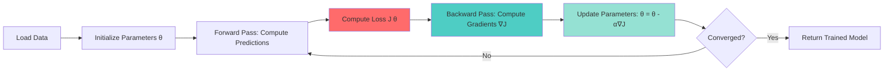

## What is Gradient Descent?

Gradient descent is the workhorse optimization algorithm behind most machine learning models. It's an iterative method for finding the minimum of a function by following the direction of steepest descent.

## The Mathematical Foundation

The core update rule for gradient descent is elegantly simple:

$$
\theta = \theta - \alpha \nabla J(\theta)
$$

Where:
- $\theta$ represents the model parameters
- $\alpha$ is the learning rate (step size)
- $\nabla J(\theta)$ is the gradient of the cost function with respect to $\theta$

For a simple linear regression, the cost function is:

$$
J(\theta) = \frac{1}{2m} \sum_{i=1}^{m} (h_\theta(x^{(i)}) - y^{(i)})^2
$$

## Python Implementation

Here's a minimal NumPy implementation of gradient descent for linear regression:

```python
import numpy as np

def gradient_descent(X, y, learning_rate=0.01, iterations=1000):
    """
    Perform gradient descent to learn theta parameters.
    
    Args:
        X: Feature matrix (m x n)
        y: Target vector (m x 1)
        learning_rate: Step size for parameter updates
        iterations: Number of optimization steps
    
    Returns:
        theta: Optimized parameters
        cost_history: Loss at each iteration
    """
    m, n = X.shape
    theta = np.zeros((n, 1))
    cost_history = []
    
    for i in range(iterations):
        # Compute predictions
        predictions = X.dot(theta)
        
        # Compute error
        error = predictions - y
        
        # Compute gradient
        gradient = (1/m) * X.T.dot(error)
        
        # Update parameters
        theta = theta - learning_rate * gradient
        
        # Track cost
        cost = (1/(2*m)) * np.sum(error**2)
        cost_history.append(cost)
    
    return theta, cost_history

# Example usage
X = np.random.randn(100, 3)  # 100 samples, 3 features
y = np.random.randn(100, 1)  # 100 target values

theta_optimal, costs = gradient_descent(X, y, learning_rate=0.1, iterations=500)
print(f"Optimal parameters: {theta_optimal.flatten()}")
```

## Training Loop Visualization

The following diagram illustrates the typical training loop in machine learning:



## Common Pitfalls

> **Warning: Learning Rate Selection**
> 
> Choosing the wrong learning rate is one of the most common mistakes in gradient descent:
> - **Too large**: The algorithm may overshoot the minimum and diverge (loss explodes)
> - **Too small**: Convergence becomes painfully slow, wasting computational resources
> 
> Start with $\alpha = 0.01$ and adjust based on your loss curve behavior.
{: .prompt-warning }

> **Tip: Monitoring Convergence**
> 
> Always plot your loss curve! A healthy training process shows:
> - Monotonically decreasing loss
> - Smooth convergence (not oscillating)
> - Plateau indicating convergence
{: .prompt-tip }

## Variants and Extensions

Modern deep learning rarely uses vanilla gradient descent. Common variants include:

1. **Stochastic Gradient Descent (SGD)**: Updates parameters using one sample at a time
2. **Mini-batch GD**: Balances computational efficiency and gradient accuracy
3. **Adam**: Adaptive learning rates with momentum (the current industry standard)

## Conclusion

Gradient descent is the foundation upon which modern machine learning is built. Understanding its mechanics, limitations, and variants is essential for any ML practitioner. In future posts, we'll explore advanced optimization techniques and their applications in deep learning.

---

**Next in this series**: [Momentum and Adaptive Learning Rates]()
