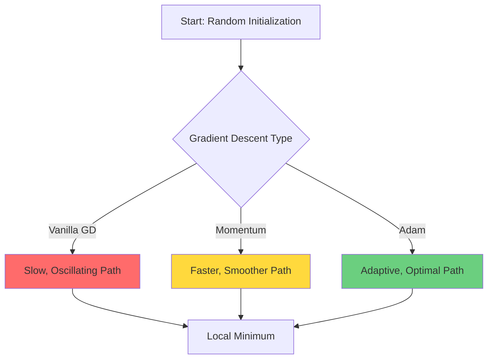
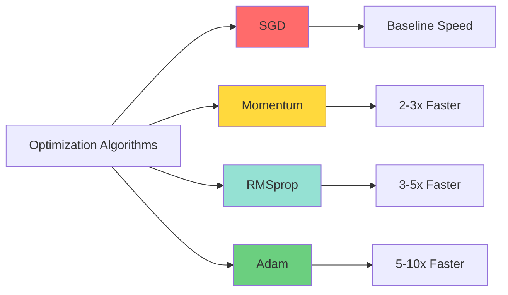

## Introduction

While vanilla gradient descent laid the foundation for modern machine learning, training deep neural networks requires more sophisticated optimization techniques. In this comprehensive guide, we'll explore **momentum-based methods** and **adaptive learning rate algorithms** that have become the backbone of deep learning optimization.

> **Key Insight**
> 
> The journey from SGD to Adam represents one of the most impactful advances in deep learning, reducing training time from weeks to hours for many architectures.
{: .prompt-info }

## The Problem with Vanilla Gradient Descent

Standard gradient descent suffers from several critical limitations:

1. **Slow convergence** in ravines (regions where the surface curves more steeply in one dimension)
2. **Oscillation** around local minima
3. **Uniform learning rates** across all parameters
4. **Sensitivity** to learning rate selection

Let's visualize the optimization landscape:



## Momentum: Physics-Inspired Optimization

### The Core Concept

Momentum borrows from physics: imagine a ball rolling down a hill. It accumulates velocity as it descends, allowing it to:
- **Accelerate** through flat regions
- **Dampen oscillations** in steep ravines
- **Escape** shallow local minima

### Mathematical Formulation

The momentum update rule introduces a velocity term $v$:

$$
\begin{aligned}
v_t &= \beta v_{t-1} + \nabla J(\theta_{t-1}) \\
\theta_t &= \theta_{t-1} - \alpha v_t
\end{aligned}
$$

Where:
- $v_t$ is the velocity at time $t$
- $\beta$ is the momentum coefficient (typically 0.9)
- $\alpha$ is the learning rate
- $\nabla J(\theta)$ is the gradient

### Nesterov Accelerated Gradient (NAG)

Nesterov momentum improves upon standard momentum by looking ahead:

$$
\begin{aligned}
v_t &= \beta v_{t-1} + \nabla J(\theta_{t-1} - \beta v_{t-1}) \\
\theta_t &= \theta_{t-1} - \alpha v_t
\end{aligned}
$$

This "look-ahead" gradient provides better convergence properties.

### Python Implementation

```python
import numpy as np
from typing import Tuple, List

class MomentumOptimizer:
    """
    Gradient descent with momentum optimization.
    
    Attributes:
        learning_rate: Step size for parameter updates
        momentum: Momentum coefficient (beta)
        velocity: Accumulated gradient history
    """
    
    def __init__(self, learning_rate: float = 0.01, momentum: float = 0.9):
        self.learning_rate = learning_rate
        self.momentum = momentum
        self.velocity = None
    
    def update(self, params: np.ndarray, gradients: np.ndarray) -> np.ndarray:
        """
        Update parameters using momentum.
        
        Args:
            params: Current parameter values
            gradients: Computed gradients
            
        Returns:
            Updated parameters
        """
        # Initialize velocity on first call
        if self.velocity is None:
            self.velocity = np.zeros_like(params)
        
        # Update velocity: v = beta * v + grad
        self.velocity = self.momentum * self.velocity + gradients
        
        # Update parameters: theta = theta - lr * v
        params = params - self.learning_rate * self.velocity
        
        return params


class NesterovOptimizer:
    """Nesterov Accelerated Gradient optimizer."""
    
    def __init__(self, learning_rate: float = 0.01, momentum: float = 0.9):
        self.learning_rate = learning_rate
        self.momentum = momentum
        self.velocity = None
    
    def update(self, params: np.ndarray, gradient_fn) -> np.ndarray:
        """
        Update parameters using Nesterov momentum.
        
        Args:
            params: Current parameter values
            gradient_fn: Function that computes gradients at given params
            
        Returns:
            Updated parameters
        """
        if self.velocity is None:
            self.velocity = np.zeros_like(params)
        
        # Look-ahead step
        params_ahead = params - self.momentum * self.velocity
        
        # Compute gradient at look-ahead position
        gradients = gradient_fn(params_ahead)
        
        # Update velocity and parameters
        self.velocity = self.momentum * self.velocity + gradients
        params = params - self.learning_rate * self.velocity
        
        return params


# Example usage
def rosenbrock_gradient(params):
    """Gradient of the Rosenbrock function."""
    x, y = params
    dx = -400 * x * (y - x**2) - 2 * (1 - x)
    dy = 200 * (y - x**2)
    return np.array([dx, dy])

# Initialize optimizers
momentum_opt = MomentumOptimizer(learning_rate=0.001, momentum=0.9)
nesterov_opt = NesterovOptimizer(learning_rate=0.001, momentum=0.9)

# Starting point
params = np.array([-1.0, 1.0])

# Run optimization
for i in range(100):
    gradients = rosenbrock_gradient(params)
    params = momentum_opt.update(params, gradients)
    
    if i % 20 == 0:
        print(f"Iteration {i}: params = {params}")
```

## Adaptive Learning Rate Methods

### The Motivation

Different parameters often require different learning rates:
- **Sparse features** need larger updates (they update infrequently)
- **Dense features** need smaller updates (they update constantly)
- **Deep layers** may need different rates than shallow layers

### AdaGrad: Adaptive Gradient Algorithm

AdaGrad adapts the learning rate for each parameter based on historical gradients:

$$
\theta_{t,i} = \theta_{t-1,i} - \frac{\alpha}{\sqrt{G_{t,i} + \epsilon}} \cdot g_{t,i}
$$

Where $G_{t,i}$ is the sum of squared gradients for parameter $i$ up to time $t$:

$$
G_{t,i} = \sum_{\tau=1}^{t} g_{\tau,i}^2
$$

> **Warning: AdaGrad Limitation**
> 
> The accumulated squared gradients grow monotonically, causing the learning rate to eventually become infinitesimally small. This makes AdaGrad unsuitable for training deep networks.
{: .prompt-warning }

### RMSprop: Root Mean Square Propagation

RMSprop fixes AdaGrad's diminishing learning rate problem using an exponentially weighted moving average:

$$
\begin{aligned}
E[g^2]_t &= \beta E[g^2]_{t-1} + (1-\beta) g_t^2 \\
\theta_t &= \theta_{t-1} - \frac{\alpha}{\sqrt{E[g^2]_t + \epsilon}} \cdot g_t
\end{aligned}
$$

### Adam: Adaptive Moment Estimation

**Adam** combines the best of momentum and RMSprop, maintaining both:
1. **First moment** (mean) of gradients (like momentum)
2. **Second moment** (uncentered variance) of gradients (like RMSprop)

The complete Adam update:

$$
\begin{aligned}
m_t &= \beta_1 m_{t-1} + (1-\beta_1) g_t \\
v_t &= \beta_2 v_{t-1} + (1-\beta_2) g_t^2 \\
\hat{m}_t &= \frac{m_t}{1-\beta_1^t} \\
\hat{v}_t &= \frac{v_t}{1-\beta_2^t} \\
\theta_t &= \theta_{t-1} - \frac{\alpha}{\sqrt{\hat{v}_t} + \epsilon} \cdot \hat{m}_t
\end{aligned}
$$

Default hyperparameters: $\beta_1 = 0.9$, $\beta_2 = 0.999$, $\epsilon = 10^{-8}$

### Complete Implementation

```python
class AdamOptimizer:
    """
    Adam (Adaptive Moment Estimation) optimizer.
    
    Combines momentum and RMSprop for robust optimization.
    """
    
    def __init__(
        self, 
        learning_rate: float = 0.001,
        beta1: float = 0.9,
        beta2: float = 0.999,
        epsilon: float = 1e-8
    ):
        self.learning_rate = learning_rate
        self.beta1 = beta1
        self.beta2 = beta2
        self.epsilon = epsilon
        
        # Initialize moment estimates
        self.m = None  # First moment (mean)
        self.v = None  # Second moment (uncentered variance)
        self.t = 0     # Time step
    
    def update(self, params: np.ndarray, gradients: np.ndarray) -> np.ndarray:
        """
        Update parameters using Adam algorithm.
        
        Args:
            params: Current parameter values
            gradients: Computed gradients
            
        Returns:
            Updated parameters
        """
        # Initialize moments on first call
        if self.m is None:
            self.m = np.zeros_like(params)
            self.v = np.zeros_like(params)
        
        self.t += 1
        
        # Update biased first moment estimate
        self.m = self.beta1 * self.m + (1 - self.beta1) * gradients
        
        # Update biased second raw moment estimate
        self.v = self.beta2 * self.v + (1 - self.beta2) * (gradients ** 2)
        
        # Compute bias-corrected first moment estimate
        m_hat = self.m / (1 - self.beta1 ** self.t)
        
        # Compute bias-corrected second raw moment estimate
        v_hat = self.v / (1 - self.beta2 ** self.t)
        
        # Update parameters
        params = params - self.learning_rate * m_hat / (np.sqrt(v_hat) + self.epsilon)
        
        return params


class RMSpropOptimizer:
    """RMSprop optimizer with exponentially decaying average of squared gradients."""
    
    def __init__(
        self,
        learning_rate: float = 0.001,
        decay_rate: float = 0.9,
        epsilon: float = 1e-8
    ):
        self.learning_rate = learning_rate
        self.decay_rate = decay_rate
        self.epsilon = epsilon
        self.cache = None
    
    def update(self, params: np.ndarray, gradients: np.ndarray) -> np.ndarray:
        """Update parameters using RMSprop."""
        if self.cache is None:
            self.cache = np.zeros_like(params)
        
        # Accumulate squared gradients
        self.cache = self.decay_rate * self.cache + (1 - self.decay_rate) * (gradients ** 2)
        
        # Update parameters
        params = params - self.learning_rate * gradients / (np.sqrt(self.cache) + self.epsilon)
        
        return params
```

## Comparative Analysis

### Convergence Speed Comparison



### When to Use Each Optimizer

| Optimizer | Best For | Pros | Cons |
|-----------|----------|------|------|
| **SGD** | Convex problems, simple models | Simple, well-understood | Slow, requires tuning |
| **Momentum** | Deep networks, ravines | Faster than SGD, smooth | Still needs LR tuning |
| **RMSprop** | RNNs, non-stationary problems | Adaptive LR | Can be unstable |
| **Adam** | Most deep learning tasks | Fast, robust, minimal tuning | Can overfit, memory intensive |

> **Tip: Optimizer Selection**
> 
> Start with Adam for rapid prototyping. If you have time for hyperparameter tuning, SGD with momentum often achieves better final performance on vision tasks.
{: .prompt-tip }

## Advanced Techniques

### Learning Rate Scheduling

Even with adaptive optimizers, learning rate schedules improve performance:

```python
class CosineAnnealingScheduler:
    """Cosine annealing learning rate schedule."""
    
    def __init__(self, initial_lr: float, T_max: int, eta_min: float = 0):
        self.initial_lr = initial_lr
        self.T_max = T_max
        self.eta_min = eta_min
    
    def get_lr(self, epoch: int) -> float:
        """Get learning rate for current epoch."""
        return self.eta_min + (self.initial_lr - self.eta_min) * \
               (1 + np.cos(np.pi * epoch / self.T_max)) / 2


class StepDecayScheduler:
    """Step decay learning rate schedule."""
    
    def __init__(self, initial_lr: float, drop_rate: float = 0.5, epochs_drop: int = 10):
        self.initial_lr = initial_lr
        self.drop_rate = drop_rate
        self.epochs_drop = epochs_drop
    
    def get_lr(self, epoch: int) -> float:
        """Get learning rate for current epoch."""
        return self.initial_lr * (self.drop_rate ** (epoch // self.epochs_drop))
```

### Gradient Clipping

Prevent exploding gradients in RNNs and transformers:

```python
def clip_gradients(gradients: np.ndarray, max_norm: float = 5.0) -> np.ndarray:
    """
    Clip gradients by global norm.
    
    Args:
        gradients: Gradient array
        max_norm: Maximum allowed norm
        
    Returns:
        Clipped gradients
    """
    total_norm = np.linalg.norm(gradients)
    
    if total_norm > max_norm:
        gradients = gradients * (max_norm / total_norm)
    
    return gradients
```

## Practical Training Loop

Here's a complete training loop incorporating these concepts:

```python
def train_model(
    model,
    X_train: np.ndarray,
    y_train: np.ndarray,
    epochs: int = 100,
    batch_size: int = 32,
    optimizer_type: str = 'adam'
):
    """
    Complete training loop with modern optimization.
    
    Args:
        model: Neural network model
        X_train: Training features
        y_train: Training labels
        epochs: Number of training epochs
        batch_size: Mini-batch size
        optimizer_type: 'sgd', 'momentum', 'rmsprop', or 'adam'
    """
    # Initialize optimizer
    optimizers = {
        'sgd': lambda: MomentumOptimizer(learning_rate=0.01, momentum=0.0),
        'momentum': lambda: MomentumOptimizer(learning_rate=0.01, momentum=0.9),
        'rmsprop': lambda: RMSpropOptimizer(learning_rate=0.001),
        'adam': lambda: AdamOptimizer(learning_rate=0.001)
    }
    optimizer = optimizers[optimizer_type]()
    
    # Learning rate scheduler
    scheduler = CosineAnnealingScheduler(initial_lr=0.001, T_max=epochs)
    
    n_samples = X_train.shape[0]
    history = {'loss': [], 'lr': []}
    
    for epoch in range(epochs):
        # Update learning rate
        current_lr = scheduler.get_lr(epoch)
        optimizer.learning_rate = current_lr
        
        # Shuffle data
        indices = np.random.permutation(n_samples)
        X_shuffled = X_train[indices]
        y_shuffled = y_train[indices]
        
        epoch_loss = 0
        n_batches = n_samples // batch_size
        
        for batch in range(n_batches):
            # Get mini-batch
            start_idx = batch * batch_size
            end_idx = start_idx + batch_size
            X_batch = X_shuffled[start_idx:end_idx]
            y_batch = y_shuffled[start_idx:end_idx]
            
            # Forward pass
            predictions = model.forward(X_batch)
            loss = model.compute_loss(predictions, y_batch)
            
            # Backward pass
            gradients = model.backward(X_batch, y_batch)
            
            # Gradient clipping
            gradients = clip_gradients(gradients, max_norm=5.0)
            
            # Update parameters
            model.params = optimizer.update(model.params, gradients)
            
            epoch_loss += loss
        
        # Log progress
        avg_loss = epoch_loss / n_batches
        history['loss'].append(avg_loss)
        history['lr'].append(current_lr)
        
        if epoch % 10 == 0:
            print(f"Epoch {epoch}/{epochs} - Loss: {avg_loss:.4f} - LR: {current_lr:.6f}")
    
    return history
```

## Conclusion

The evolution from vanilla gradient descent to adaptive optimizers represents a crucial advancement in deep learning:

1. **Momentum** accelerates convergence and dampens oscillations
2. **Adaptive learning rates** handle sparse features and varying parameter scales
3. **Adam** combines both approaches for robust, fast optimization

### Key Takeaways

- Use **Adam** as your default optimizer for most tasks
- Consider **SGD + Momentum** for final fine-tuning on vision models
- Always use **learning rate scheduling** for best results
- Apply **gradient clipping** when training RNNs or transformers

> **Next Steps**
> 
> In our next post, we'll explore **second-order optimization methods** like L-BFGS and natural gradient descent, and when they outperform first-order methods.
{: .prompt-info }

## References

1. Kingma & Ba (2014). "Adam: A Method for Stochastic Optimization"
2. Sutskever et al. (2013). "On the importance of initialization and momentum in deep learning"
3. Tieleman & Hinton (2012). "RMSprop: Divide the gradient by a running average"
4. Ruder (2016). "An overview of gradient descent optimization algorithms"

---

**Related Posts:**
- [Introduction to Gradient Descent]()
- Coming Soon: Second-Order Optimization Methods
