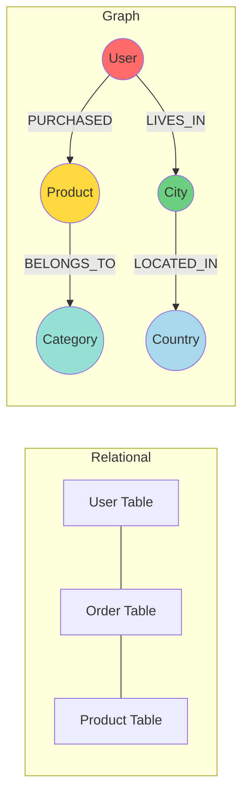
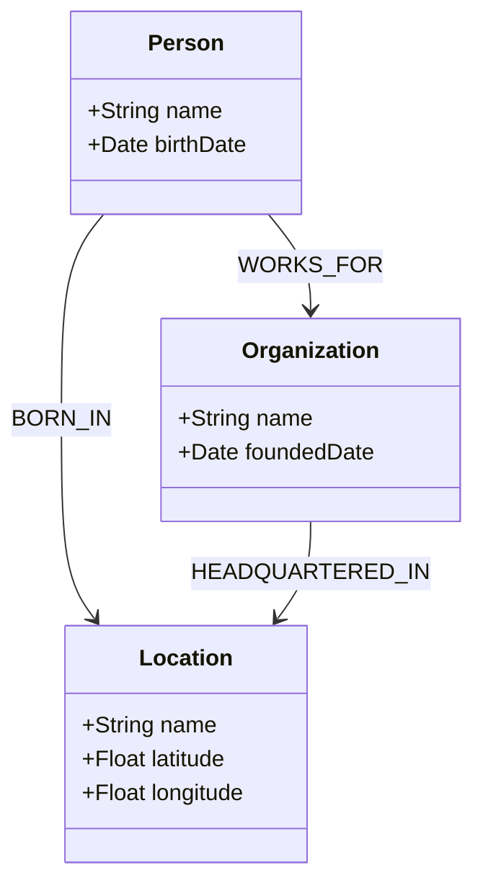

## Introduction

In the age of Big Data, we have more information than ever, but connecting that information to derive **meaning** remains a challenge. **Knowledge Graphs (KGs)** offer a powerful solution by structuring data as a network of entities and relationships, mirroring how humans understand the world.

> **Key Concept**
> 
> A **Knowledge Graph** represents knowledge as a collection of interlinked descriptions of entities – objects, events, situations, or abstract concepts – with free-form semantics.
{: .prompt-info }

## From Tables to Graphs

Traditional relational databases store data in rigid tables (rows and columns). While efficient for transactional data, they struggle with highly interconnected data.

**Relational Model:**
- Rigid schema
- Expensive JOIN operations
- Difficulty handling sparse data

**Graph Model:**
- Flexible schema
- Relationships are first-class citizens
- Natural representation of complex networks



## Core Building Blocks

### 1. The Triple (Subject - Predicate - Object)

The fundamental unit of a Knowledge Graph is the **triple**, often based on the **RDF (Resource Description Framework)** standard.

$$
\text{(Subject, Predicate, Object)}
$$

Examples:
- (Elon Musk, CEO_OF, Tesla)
- (Nairobi, CAPITAL_OF, Kenya)
- (Python, TYPE, Programming Language)

### 2. Ontologies

An **ontology** defines the schema or "world view" of the graph. It specifies:
- **Classes** (e.g., Person, Company, City)
- **Properties** (e.g., bornIn, worksFor)
- **Constraints** (e.g., a Person can only be born in a Location)



## Graph Databases

To store and query KGs efficiently, we use **Graph Databases** like Neo4j, Amazon Neptune, or TigerGraph.

### Cypher Query Language (Neo4j)

Cypher is to graph databases what SQL is to relational databases. It uses ASCII art to represent patterns.

**Example: Find all companies headquartered in Nairobi**

```cypher
MATCH (c:Company)-[:HEADQUARTERED_IN]->(l:Location {name: 'Nairobi'})
RETURN c.name, c.foundedDate
```

**Example: Find co-founders (people who founded the same company)**

```cypher
MATCH (p1:Person)-[:FOUNDED]->(c:Company)<-[:FOUNDED]-(p2:Person)
WHERE p1.name < p2.name
RETURN p1.name, p2.name, c.name
```

## Knowledge Graph Embeddings (KGE)

To use KGs in machine learning models (like neural networks), we need to convert the symbolic graph structure into continuous vector spaces. This is called **Knowledge Graph Embedding**.

### TransE (Translating Embeddings)

TransE models relationships as translations in the vector space. For a triple $(h, r, t)$ (head, relation, tail), it aims to satisfy:

$$
\mathbf{h} + \mathbf{r} \approx \mathbf{t}
$$

The loss function minimizes the distance:

$$
\mathcal{L} = \sum_{(h,r,t) \in S} \sum_{(h',r,t') \in S'} [\gamma + d(\mathbf{h}+\mathbf{r}, \mathbf{t}) - d(\mathbf{h}'+\mathbf{r}, \mathbf{t}')]_+
$$

Where $S$ are valid triples and $S'$ are corrupted (negative) triples.

### RotatE (Rotation Embeddings)

RotatE models relations as **rotations** in complex vector space. This allows it to capture patterns like symmetry, antisymmetry, inversion, and composition.

$$
\mathbf{t} = \mathbf{h} \circ \mathbf{r} \quad \text{where } |r_i| = 1
$$

### Python Implementation: TransE with PyTorch

```python
import torch
import torch.nn as nn
import torch.nn.functional as F

class TransE(nn.Module):
    """
    TransE (Translating Embeddings) model implementation.
    
    Models relationships as translations: head + relation = tail
    """
    
    def __init__(
        self, 
        num_entities: int, 
        num_relations: int, 
        embedding_dim: int, 
        margin: float = 1.0
    ):
        super(TransE, self).__init__()
        self.embedding_dim = embedding_dim
        self.margin = margin
        
        # Initialize embeddings
        self.entity_embeddings = nn.Embedding(num_entities, embedding_dim)
        self.relation_embeddings = nn.Embedding(num_relations, embedding_dim)
        
        # Xavier initialization
        nn.init.xavier_uniform_(self.entity_embeddings.weight)
        nn.init.xavier_uniform_(self.relation_embeddings.weight)
        
        # Normalize relation embeddings
        self.normalize_relations()
        
    def normalize_relations(self):
        """Normalize relation embeddings to unit length."""
        self.relation_embeddings.weight.data = F.normalize(
            self.relation_embeddings.weight.data, 
            p=2, 
            dim=1
        )
        
    def forward(self, head_indices, relation_indices, tail_indices):
        """
        Compute scores for triples.
        
        Args:
            head_indices: Tensor of head entity IDs
            relation_indices: Tensor of relation IDs
            tail_indices: Tensor of tail entity IDs
            
        Returns:
            Scores (distances) for the triples
        """
        head = self.entity_embeddings(head_indices)
        relation = self.relation_embeddings(relation_indices)
        tail = self.entity_embeddings(tail_indices)
        
        # Normalize entity embeddings (constraint in TransE paper)
        head = F.normalize(head, p=2, dim=1)
        tail = F.normalize(tail, p=2, dim=1)
        
        # Calculate distance: ||h + r - t||
        score = torch.norm(head + relation - tail, p=2, dim=1)
        
        return score
    
    def loss(self, positive_scores, negative_scores):
        """
        Compute max-margin loss.
        
        L = max(0, margin + pos_score - neg_score)
        """
        return torch.mean(F.relu(self.margin + positive_scores - negative_scores))

# Example Usage
num_entities = 100
num_relations = 10
embedding_dim = 50

model = TransE(num_entities, num_relations, embedding_dim)
optimizer = torch.optim.Adam(model.parameters(), lr=0.01)

# Dummy data
pos_h = torch.tensor([0, 1, 2])
pos_r = torch.tensor([0, 1, 0])
pos_t = torch.tensor([1, 2, 3])

neg_h = torch.tensor([0, 1, 2])
neg_r = torch.tensor([0, 1, 0])
neg_t = torch.tensor([5, 6, 7])  # Corrupted tails

# Training step
optimizer.zero_grad()
pos_scores = model(pos_h, pos_r, pos_t)
neg_scores = model(neg_h, neg_r, neg_t)
loss = model.loss(pos_scores, neg_scores)
loss.backward()
optimizer.step()

print(f"Loss: {loss.item():.4f}")
```

## Applications of Knowledge Graphs

### 1. Recommendation Systems
KGs can explain *why* a recommendation was made.
* "We recommended 'The Matrix' because you liked 'Inception', and both are **Sci-Fi** movies directed by **visionary directors**."

### 2. Question Answering (QA)
Google Search uses the Knowledge Graph to provide direct answers in the "Knowledge Panel" instead of just a list of links.

### 3. Drug Discovery
Connecting drugs, diseases, proteins, and genes to find new uses for existing drugs (drug repurposing).

### 4. Fraud Detection
Identifying rings of fraudsters by analyzing the network of shared attributes (phone numbers, addresses, devices).

## Building Your First Knowledge Graph

In the next post, we will build a **Knowledge Graph of African Tech Ecosystem** from scratch! We will:

1.  Scrape data about startups, founders, and investors.
2.  Define an ontology.
3.  Load the data into a Neo4j database.
4.  Run graph algorithms to find influential hubs.

> **Coming Next**
> 
> **Building a Knowledge Graph with Neo4j and Python**: A step-by-step tutorial on creating, populating, and querying a real-world knowledge graph.
{: .prompt-info }

## Conclusion

Knowledge Graphs bridge the gap between unstructured data and human understanding. By combining the flexibility of graphs with the power of machine learning (via embeddings), we can build smarter, more context-aware AI systems.

### Key Takeaways

- **Triples** are the atoms of knowledge.
- **Ontologies** provide the schema and semantics.
- **Graph Databases** (Neo4j) enable efficient storage and querying.
- **Embeddings** (TransE, RotatE) allow neural networks to learn from graphs.

## References

1.  Bordes et al. (2013). "Translating Embeddings for Modeling Multi-relational Data" (TransE)
2.  Sun et al. (2019). "RotatE: Knowledge Graph Embedding by Relational Rotation in Complex Space"
3.  Hogan et al. (2021). "Knowledge Graphs" (Comprehensive Survey)
4.  Neo4j Graph Database Documentation

---

**Related Posts:**
- [Second-Order Optimization Methods]()
- [Momentum and Adaptive Learning Rates]()
- **Next in this series:** [Building a Knowledge Graph with Neo4j and Python]()

---

*Ready to connect the dots? Stay tuned for our hands-on Neo4j tutorial!* 🚀
