## Introduction

While first-order methods like SGD and Adam dominate deep learning, **second-order optimization** methods offer powerful alternatives by exploiting **curvature information** from the loss landscape. In this comprehensive guide, we'll explore when and how to use these sophisticated techniques.

> **Key Insight**
> 
> Second-order methods use the **Hessian matrix** (second derivatives) to understand the curvature of the loss function, enabling faster convergence with fewer iterations - though at higher computational cost per iteration.
{: .prompt-info }

## The Limitation of First-Order Methods

Recall that gradient descent uses only the **first derivative** (gradient):

$$
\theta_{t+1} = \theta_t - \alpha \nabla J(\theta_t)
$$

This approach has fundamental limitations:

1. **No curvature awareness** - treats all directions equally
2. **Slow convergence** in ill-conditioned problems
3. **Requires careful learning rate tuning**
4. **Oscillates** in ravines and valleys


## Newton's Method: The Foundation

### Mathematical Formulation

Newton's method uses a **second-order Taylor approximation** of the loss function:

$$
J(\theta) \approx J(\theta_t) + \nabla J(\theta_t)^T (\theta - \theta_t) + \frac{1}{2}(\theta - \theta_t)^T H(\theta_t) (\theta - \theta_t)
$$

Where $H(\theta_t)$ is the **Hessian matrix**:

$$
H_{ij} = \frac{\partial^2 J}{\partial \theta_i \partial \theta_j}
$$

Minimizing this quadratic approximation yields the **Newton update**:

$$
\theta_{t+1} = \theta_t - H^{-1}(\theta_t) \nabla J(\theta_t)
$$

### Intuition: Adaptive Step Sizes

The Hessian inverse $H^{-1}$ acts as an **adaptive learning rate matrix**:

- **Large curvature** (steep valley) → small steps
- **Small curvature** (flat plateau) → large steps
- **Negative curvature** (saddle point) → direction reversal

This is fundamentally different from first-order methods which use a scalar learning rate!

### Python Implementation

```python
import numpy as np
from typing import Callable, Tuple
from scipy.linalg import cho_factor, cho_solve

class NewtonOptimizer:
    """
    Newton's method for unconstrained optimization.
    
    Uses second-order information (Hessian) for faster convergence.
    """
    
    def __init__(
        self,
        damping: float = 1e-4,
        max_iterations: int = 100,
        tolerance: float = 1e-6
    ):
        """
        Args:
            damping: Regularization for Hessian (Levenberg-Marquardt)
            max_iterations: Maximum optimization iterations
            tolerance: Convergence threshold for gradient norm
        """
        self.damping = damping
        self.max_iterations = max_iterations
        self.tolerance = tolerance
        self.history = {'loss': [], 'grad_norm': []}
    
    def optimize(
        self,
        f: Callable,
        grad_f: Callable,
        hess_f: Callable,
        x0: np.ndarray
    ) -> Tuple[np.ndarray, dict]:
        """
        Optimize function using Newton's method.
        
        Args:
            f: Objective function
            grad_f: Gradient function
            hess_f: Hessian function
            x0: Initial parameters
            
        Returns:
            Optimal parameters and optimization history
        """
        x = x0.copy()
        
        for iteration in range(self.max_iterations):
            # Compute gradient and Hessian
            grad = grad_f(x)
            hess = hess_f(x)
            
            # Check convergence
            grad_norm = np.linalg.norm(grad)
            if grad_norm < self.tolerance:
                print(f"Converged at iteration {iteration}")
                break
            
            # Regularize Hessian (Levenberg-Marquardt damping)
            hess_reg = hess + self.damping * np.eye(len(x))
            
            # Solve Newton system: H * delta = -grad
            try:
                # Use Cholesky decomposition for efficiency
                c, low = cho_factor(hess_reg)
                delta = -cho_solve((c, low), grad)
            except np.linalg.LinAlgError:
                # Fallback to regularized inverse
                delta = -np.linalg.solve(
                    hess_reg + 1e-3 * np.eye(len(x)),
                    grad
                )
            
            # Line search (backtracking)
            alpha = self._line_search(f, x, delta, grad)
            
            # Update parameters
            x = x + alpha * delta
            
            # Track progress
            self.history['loss'].append(f(x))
            self.history['grad_norm'].append(grad_norm)
            
            if iteration % 10 == 0:
                print(f"Iter {iteration}: loss={f(x):.6f}, ||grad||={grad_norm:.6f}")
        
        return x, self.history
    
    def _line_search(
        self,
        f: Callable,
        x: np.ndarray,
        direction: np.ndarray,
        grad: np.ndarray,
        alpha_init: float = 1.0,
        rho: float = 0.5,
        c: float = 1e-4
    ) -> float:
        """
        Backtracking line search (Armijo condition).
        
        Args:
            f: Objective function
            x: Current parameters
            direction: Search direction
            grad: Current gradient
            alpha_init: Initial step size
            rho: Backtracking factor
            c: Armijo constant
            
        Returns:
            Step size satisfying Armijo condition
        """
        alpha = alpha_init
        fx = f(x)
        descent = grad.dot(direction)
        
        while f(x + alpha * direction) > fx + c * alpha * descent:
            alpha *= rho
            if alpha < 1e-10:
                break
        
        return alpha


# Example: Rosenbrock function optimization
def rosenbrock(x):
    """Rosenbrock function: f(x,y) = (1-x)^2 + 100(y-x^2)^2"""
    return (1 - x[0])**2 + 100 * (x[1] - x[0]**2)**2

def rosenbrock_grad(x):
    """Gradient of Rosenbrock function."""
    dx = -2*(1 - x[0]) - 400*x[0]*(x[1] - x[0]**2)
    dy = 200*(x[1] - x[0]**2)
    return np.array([dx, dy])

def rosenbrock_hess(x):
    """Hessian of Rosenbrock function."""
    h11 = 2 - 400*(x[1] - x[0]**2) + 800*x[0]**2
    h12 = -400*x[0]
    h22 = 200
    return np.array([[h11, h12], [h12, h22]])

# Run optimization
optimizer = NewtonOptimizer(damping=1e-4)
x_opt, history = optimizer.optimize(
    rosenbrock,
    rosenbrock_grad,
    rosenbrock_hess,
    x0=np.array([-1.0, 1.0])
)

print(f"\nOptimal solution: {x_opt}")
print(f"Optimal value: {rosenbrock(x_opt):.10f}")
```

## The Computational Challenge

### Hessian Complexity

For a model with $n$ parameters:

- **Gradient**: $O(n)$ storage, $O(n)$ computation
- **Hessian**: $O(n^2)$ storage, $O(n^3)$ inversion

For deep learning models with millions of parameters, this is **prohibitively expensive**!

> **Warning: Scalability**
> 
> A model with 1 million parameters would require ~4 TB to store the Hessian matrix in memory. This makes exact Newton's method impractical for deep learning.
{: .prompt-warning }

## Quasi-Newton Methods: Practical Alternatives

### L-BFGS: Limited-Memory BFGS

**L-BFGS** (Limited-memory Broyden-Fletcher-Goldfarb-Shanno) approximates the Hessian inverse using only gradient information from recent iterations.

#### Key Ideas

1. **Don't compute Hessian** - approximate $H^{-1}$ implicitly
2. **Use gradient history** - store only last $m$ gradient pairs
3. **Two-loop recursion** - efficient computation of search direction

#### Mathematical Framework

Instead of storing $H^{-1}$, L-BFGS maintains:

$$
\begin{aligned}
s_k &= \theta_{k+1} - \theta_k \\
y_k &= \nabla J(\theta_{k+1}) - \nabla J(\theta_k)
\end{aligned}
$$

The Hessian inverse approximation is built recursively:

$$
H_k^{-1} = V_k^T H_{k-1}^{-1} V_k + \rho_k s_k s_k^T
$$

Where $\rho_k = \frac{1}{y_k^T s_k}$ and $V_k = I - \rho_k y_k s_k^T$

### Complete L-BFGS Implementation

```python
from collections import deque

class LBFGSOptimizer:
    """
    L-BFGS optimizer with two-loop recursion.
    
    Memory-efficient quasi-Newton method suitable for large-scale problems.
    """
    
    def __init__(
        self,
        memory_size: int = 10,
        max_iterations: int = 100,
        tolerance: float = 1e-5,
        line_search_max_iter: int = 20
    ):
        """
        Args:
            memory_size: Number of (s, y) pairs to store
            max_iterations: Maximum optimization iterations
            tolerance: Convergence threshold
            line_search_max_iter: Max line search iterations
        """
        self.m = memory_size
        self.max_iterations = max_iterations
        self.tolerance = tolerance
        self.line_search_max_iter = line_search_max_iter
        
        # Storage for gradient differences
        self.s_history = deque(maxlen=memory_size)  # Parameter differences
        self.y_history = deque(maxlen=memory_size)  # Gradient differences
        self.rho_history = deque(maxlen=memory_size)  # 1 / (y^T s)
        
        self.history = {'loss': [], 'grad_norm': []}
    
    def optimize(
        self,
        f: Callable,
        grad_f: Callable,
        x0: np.ndarray
    ) -> Tuple[np.ndarray, dict]:
        """
        Optimize using L-BFGS.
        
        Args:
            f: Objective function
            grad_f: Gradient function
            x0: Initial parameters
            
        Returns:
            Optimal parameters and history
        """
        x = x0.copy()
        grad = grad_f(x)
        
        for iteration in range(self.max_iterations):
            # Check convergence
            grad_norm = np.linalg.norm(grad)
            self.history['grad_norm'].append(grad_norm)
            self.history['loss'].append(f(x))
            
            if grad_norm < self.tolerance:
                print(f"Converged at iteration {iteration}")
                break
            
            # Compute search direction using two-loop recursion
            direction = self._two_loop_recursion(grad)
            
            # Line search
            alpha = self._strong_wolfe_line_search(f, grad_f, x, direction, grad)
            
            # Update parameters
            x_new = x + alpha * direction
            grad_new = grad_f(x_new)
            
            # Update history
            s = x_new - x
            y = grad_new - grad
            
            # Check curvature condition
            sy = s.dot(y)
            if sy > 1e-10:
                self.s_history.append(s)
                self.y_history.append(y)
                self.rho_history.append(1.0 / sy)
            
            x = x_new
            grad = grad_new
            
            if iteration % 10 == 0:
                print(f"Iter {iteration}: loss={f(x):.6f}, ||grad||={grad_norm:.6f}")
        
        return x, self.history
    
    def _two_loop_recursion(self, grad: np.ndarray) -> np.ndarray:
        """
        Compute search direction using L-BFGS two-loop recursion.
        
        This efficiently computes H^{-1} @ grad without forming H^{-1}.
        
        Args:
            grad: Current gradient
            
        Returns:
            Search direction
        """
        q = grad.copy()
        alphas = []
        
        # First loop (backward)
        for s, y, rho in zip(
            reversed(self.s_history),
            reversed(self.y_history),
            reversed(self.rho_history)
        ):
            alpha = rho * s.dot(q)
            q = q - alpha * y
            alphas.append(alpha)
        
        # Initial Hessian approximation (scaling)
        if len(self.s_history) > 0:
            s_last = self.s_history[-1]
            y_last = self.y_history[-1]
            gamma = s_last.dot(y_last) / y_last.dot(y_last)
            r = gamma * q
        else:
            r = q
        
        # Second loop (forward)
        alphas.reverse()
        for s, y, rho, alpha in zip(
            self.s_history,
            self.y_history,
            self.rho_history,
            alphas
        ):
            beta = rho * y.dot(r)
            r = r + s * (alpha - beta)
        
        return -r
    
    def _strong_wolfe_line_search(
        self,
        f: Callable,
        grad_f: Callable,
        x: np.ndarray,
        direction: np.ndarray,
        grad: np.ndarray,
        c1: float = 1e-4,
        c2: float = 0.9
    ) -> float:
        """
        Strong Wolfe line search.
        
        Finds step size satisfying both Armijo and curvature conditions.
        
        Args:
            f: Objective function
            grad_f: Gradient function
            x: Current parameters
            direction: Search direction
            grad: Current gradient
            c1: Armijo constant
            c2: Curvature constant
            
        Returns:
            Step size
        """
        alpha = 1.0
        fx = f(x)
        descent = grad.dot(direction)
        
        # Simple backtracking (simplified Wolfe)
        for _ in range(self.line_search_max_iter):
            x_new = x + alpha * direction
            fx_new = f(x_new)
            
            # Armijo condition
            if fx_new <= fx + c1 * alpha * descent:
                # Curvature condition (simplified)
                grad_new = grad_f(x_new)
                if abs(grad_new.dot(direction)) <= c2 * abs(descent):
                    return alpha
            
            alpha *= 0.5
        
        return alpha


# Example usage
lbfgs = LBFGSOptimizer(memory_size=10)
x_opt, history = lbfgs.optimize(
    rosenbrock,
    rosenbrock_grad,
    x0=np.array([-1.0, 1.0])
)

print(f"\nL-BFGS Optimal solution: {x_opt}")
print(f"L-BFGS Optimal value: {rosenbrock(x_opt):.10f}")
```

## Natural Gradient Descent

### The Information Geometry Perspective

**Natural Gradient** considers the geometry of the parameter space using the **Fisher Information Matrix**:

$$
F(\theta) = \mathbb{E}_{p(x|\theta)} \left[ \nabla \log p(x|\theta) \nabla \log p(x|\theta)^T \right]
$$

The natural gradient update is:

$$
\theta_{t+1} = \theta_t - \alpha F^{-1}(\theta_t) \nabla J(\theta_t)
$$

### Why Natural Gradient?

Standard gradient descent is **not invariant** to reparameterization. Natural gradient uses the **Riemannian metric** defined by the Fisher matrix, making it invariant to parameter transformations.

```python
class NaturalGradientOptimizer:
    """
    Natural Gradient Descent using Fisher Information Matrix.
    
    Particularly effective for probabilistic models and policy gradient methods.
    """
    
    def __init__(
        self,
        learning_rate: float = 0.01,
        damping: float = 1e-4,
        max_iterations: int = 100
    ):
        self.learning_rate = learning_rate
        self.damping = damping
        self.max_iterations = max_iterations
    
    def compute_fisher_matrix(
        self,
        log_prob_fn: Callable,
        params: np.ndarray,
        samples: np.ndarray
    ) -> np.ndarray:
        """
        Compute Fisher Information Matrix empirically.
        
        Args:
            log_prob_fn: Log probability function
            params: Current parameters
            samples: Data samples
            
        Returns:
            Fisher matrix approximation
        """
        n_params = len(params)
        fisher = np.zeros((n_params, n_params))
        
        for sample in samples:
            # Compute score (gradient of log-likelihood)
            score = self._compute_score(log_prob_fn, params, sample)
            
            # Outer product
            fisher += np.outer(score, score)
        
        fisher /= len(samples)
        return fisher
    
    def _compute_score(
        self,
        log_prob_fn: Callable,
        params: np.ndarray,
        sample: np.ndarray,
        eps: float = 1e-5
    ) -> np.ndarray:
        """Compute score function (gradient of log-prob) numerically."""
        score = np.zeros_like(params)
        
        for i in range(len(params)):
            params_plus = params.copy()
            params_minus = params.copy()
            params_plus[i] += eps
            params_minus[i] -= eps
            
            score[i] = (
                log_prob_fn(params_plus, sample) - 
                log_prob_fn(params_minus, sample)
            ) / (2 * eps)
        
        return score
    
    def update(
        self,
        params: np.ndarray,
        gradient: np.ndarray,
        fisher: np.ndarray
    ) -> np.ndarray:
        """
        Natural gradient update.
        
        Args:
            params: Current parameters
            gradient: Standard gradient
            fisher: Fisher information matrix
            
        Returns:
            Updated parameters
        """
        # Regularize Fisher matrix
        fisher_reg = fisher + self.damping * np.eye(len(params))
        
        # Compute natural gradient
        try:
            natural_grad = np.linalg.solve(fisher_reg, gradient)
        except np.linalg.LinAlgError:
            # Fallback to standard gradient
            natural_grad = gradient
        
        # Update parameters
        params_new = params - self.learning_rate * natural_grad
        
        return params_new
```

## Comparison: When to Use Each Method

```mermaid
graph TD
    A[Choose Optimization Method] --> B{Problem Size?}
    
    B -->|Small n < 1000| C[Newton's Method]
    B -->|Medium 1000 < n < 100k| D[L-BFGS]
    B -->|Large n > 100k| E{Problem Type?}
    
    E -->|Probabilistic Model| F[Natural Gradient]
    E -->|General Deep Learning| G[Adam/SGD]
    
    C --> H[Fast Convergence<br/>Few Iterations]
    D --> I[Good Convergence<br/>Memory Efficient]
    F --> J[Invariant Updates<br/>RL/Bayesian]
    G --> K[Scalable<br/>Stochastic]
    
    style C fill:#6bcf7f
    style D fill:#95e1d3
    style F fill:#ffd93d
    style G fill:#ff6b6b
```



### Decision Matrix

| Method | Best For | Pros | Cons | Memory |
|--------|----------|------|------|--------|
| **Newton** | Small-scale, convex | Quadratic convergence | $O(n^3)$ cost | $O(n^2)$ |
| **L-BFGS** | Medium-scale, batch | Fast, memory-efficient | Requires full batch | $O(mn)$ |
| **Natural Gradient** | Probabilistic models, RL | Parameter-invariant | Fisher computation | $O(n^2)$ |
| **Adam** | Large-scale, stochastic | Scalable, robust | Slower convergence | $O(n)$ |

> **Tip: Hybrid Approaches**
> 
> Consider using L-BFGS for final fine-tuning after pre-training with Adam. This combines the scalability of first-order methods with the fast convergence of second-order methods.
{: .prompt-tip }

## Practical Applications

### 1. Logistic Regression with L-BFGS

```python
from scipy.optimize import minimize

def logistic_loss_and_grad(params, X, y):
    """Compute logistic loss and gradient."""
    z = X.dot(params)
    predictions = 1 / (1 + np.exp(-z))
    
    # Loss
    loss = -np.mean(y * np.log(predictions + 1e-10) + 
                    (1 - y) * np.log(1 - predictions + 1e-10))
    
    # Gradient
    grad = X.T.dot(predictions - y) / len(y)
    
    return loss, grad

# Use scipy's L-BFGS implementation
result = minimize(
    fun=lambda w: logistic_loss_and_grad(w, X_train, y_train)[0],
    x0=np.zeros(X_train.shape[1]),
    method='L-BFGS-B',
    jac=lambda w: logistic_loss_and_grad(w, X_train, y_train)[1],
    options={'maxiter': 100, 'disp': True}
)

print(f"Optimal weights: {result.x}")
print(f"Final loss: {result.fun}")
```

### 2. Neural Network Fine-Tuning

```python
import torch
import torch.nn as nn

class LBFGSFineTuner:
    """Fine-tune neural network with L-BFGS."""
    
    def __init__(self, model: nn.Module, max_iter: int = 20):
        self.model = model
        self.max_iter = max_iter
    
    def fine_tune(self, train_loader, criterion):
        """Fine-tune model using L-BFGS."""
        optimizer = torch.optim.LBFGS(
            self.model.parameters(),
            lr=1.0,
            max_iter=self.max_iter,
            history_size=10,
            line_search_fn='strong_wolfe'
        )
        
        def closure():
            optimizer.zero_grad()
            total_loss = 0
            
            for inputs, targets in train_loader:
                outputs = self.model(inputs)
                loss = criterion(outputs, targets)
                loss.backward()
                total_loss += loss.item()
            
            return total_loss
        
        optimizer.step(closure)
        
        return self.model
```

## Looking Ahead: Knowledge Graphs

While second-order methods excel at optimization, the next frontier in AI involves **structured knowledge representation**. In our upcoming series on **Knowledge Graphs**, we'll explore:

- How to represent complex relationships between entities
- Graph neural networks for reasoning over structured data
- Combining symbolic knowledge with neural optimization
- Applications in recommendation systems, drug discovery, and NLP

> **Coming Soon**
> 
> Our next post will introduce **Knowledge Graphs fundamentals** - representing the world's knowledge as interconnected entities and relationships. We'll show how optimization techniques (including those covered here) apply to learning graph embeddings!
{: .prompt-info }

## Conclusion

Second-order optimization methods offer powerful tools for specific scenarios:

### Key Takeaways

1. **Newton's Method** - Quadratic convergence but $O(n^3)$ cost
2. **L-BFGS** - Practical quasi-Newton for medium-scale problems
3. **Natural Gradient** - Geometrically principled for probabilistic models
4. **Hybrid Strategies** - Combine first and second-order methods

### When to Use Second-Order Methods

- ✅ **Small to medium models** (< 100k parameters)
- ✅ **Batch optimization** (full dataset fits in memory)
- ✅ **Fine-tuning** pre-trained models
- ✅ **Convex or near-convex** problems
- ✅ **High-precision** requirements

### When to Stick with First-Order

- ❌ **Large-scale deep learning** (millions of parameters)
- ❌ **Stochastic/mini-batch** training
- ❌ **Limited memory** environments
- ❌ **Highly non-convex** landscapes

## References

1. Nocedal & Wright (2006). "Numerical Optimization" - The definitive reference
2. Martens (2010). "Deep learning via Hessian-free optimization"
3. Amari (1998). "Natural Gradient Works Efficiently in Learning"
4. Liu & Nocedal (1989). "On the Limited Memory BFGS Method"
5. Bottou et al. (2018). "Optimization Methods for Large-Scale Machine Learning"

---

**Related Posts:**
- [Introduction to Gradient Descent]()
- [Momentum and Adaptive Learning Rates]()
- [Knowledge Graphs Fundamentals]()

---
