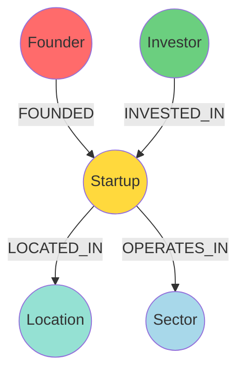
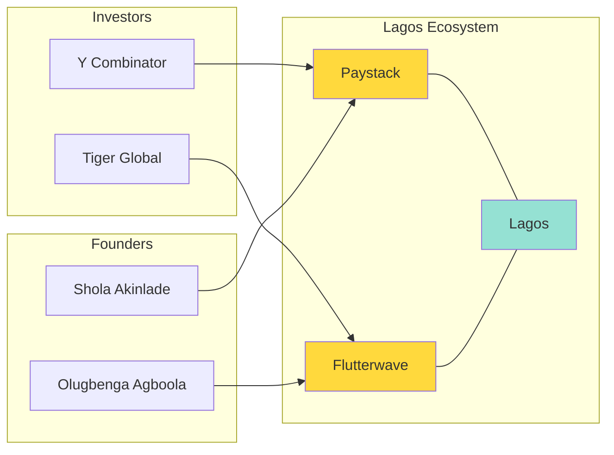

## Introduction

In our [previous post](), we explored the theory behind Knowledge Graphs (KGs). Now, it's time to get our hands dirty!

In this tutorial, we will build a **Knowledge Graph of the African Tech Ecosystem** from scratch. We'll model startups, founders, investors, and their relationships using **Neo4j**, the world's leading graph database, and control it all with **Python**.

> **Goal**
> 
> By the end of this tutorial, you will have a running Neo4j database populated with real-world-like data, and you'll be able to answer complex questions like *"Which investors are driving the fintech boom in Lagos?"*
{: .prompt-tip }

## Prerequisites

Before we begin, ensure you have:

1.  **Python 3.8+** installed.
2.  **Neo4j Database**: You can use [Neo4j Desktop](https://neo4j.com/download/) (local) or [Neo4j AuraDB](https://neo4j.com/cloud/aura/) (free cloud tier).
3.  **Python Libraries**:
    ```bash
    pip install neo4j pandas
    ```

## Step 1: Designing the Ontology

A Knowledge Graph starts with a schema (ontology). We want to capture the relationships in the tech ecosystem.

**Entities (Nodes):**
*   `Startup`
*   `Founder`
*   `Investor`
*   `Location` (City/Country)
*   `Sector` (e.g., Fintech, Healthtech)

**Relationships (Edges):**
*   `(:Founder)-[:FOUNDED]->(:Startup)`
*   `(:Investor)-[:INVESTED_IN]->(:Startup)`
*   `(:Startup)-[:LOCATED_IN]->(:Location)`
*   `(:Startup)-[:OPERATES_IN]->(:Sector)`



## Step 2: Connecting to Neo4j

Let's write a Python class to handle our database connection.

```python
from neo4j import GraphDatabase

class AfricanTechGraph:
    def __init__(self, uri, user, password):
        self.driver = GraphDatabase.driver(uri, auth=(user, password))

    def close(self):
        self.driver.close()

    def run_query(self, query, parameters=None):
        with self.driver.session() as session:
            result = session.run(query, parameters)
            return [record.data() for record in result]

# Usage (Update with your credentials)
# uri = "bolt://localhost:7687"
# kg = AfricanTechGraph(uri, "neo4j", "password")
```

## Step 3: Preparing the Data

We'll use a dictionary list to represent our "raw" data. In a real project, this would come from scraping or CSV files.

```python
startups_data = [
    {
        "name": "Paystack",
        "sector": "Fintech",
        "location": "Lagos",
        "founders": ["Shola Akinlade", "Ezra Olubi"],
        "investors": ["Stripe", "Y Combinator", "Tencent"]
    },
    {
        "name": "Flutterwave",
        "sector": "Fintech",
        "location": "Lagos",
        "founders": ["Olugbenga Agboola", "Iyinoluwa Aboyeji"],
        "investors": ["Tiger Global", "Avenir Growth"]
    },
    {
        "name": "Twiga Foods",
        "sector": "AgriTech",
        "location": "Nairobi",
        "founders": ["Peter Njonjo", "Grant Brooke"],
        "investors": ["Creadev", "TLcom Capital"]
    },
    {
        "name": "M-KOPA",
        "sector": "CleanTech",
        "location": "Nairobi",
        "founders": ["Jesse Moore"],
        "investors": ["Sumitomo Corporation", "Standard Bank"]
    }
]
```

## Step 4: Loading Data into Neo4j

We need to be careful not to create duplicates. We'll use the Cypher `MERGE` clause, which acts like "Create if not exists".

First, let's define uniqueness constraints (run this once in your Neo4j Browser or via Python):

```cypher
CREATE CONSTRAINT FOR (s:Startup) REQUIRE s.name IS UNIQUE;
CREATE CONSTRAINT FOR (f:Founder) REQUIRE f.name IS UNIQUE;
CREATE CONSTRAINT FOR (i:Investor) REQUIRE i.name IS UNIQUE;
CREATE CONSTRAINT FOR (l:Location) REQUIRE l.name IS UNIQUE;
CREATE CONSTRAINT FOR (sec:Sector) REQUIRE sec.name IS UNIQUE;
```

Now, the loading function:

```python
def load_data(kg, data):
    query = """
    UNWIND $startups AS row
    
    // Create Nodes
    MERGE (s:Startup {name: row.name})
    MERGE (sec:Sector {name: row.sector})
    MERGE (l:Location {name: row.location})
    
    // Create Relationships
    MERGE (s)-[:OPERATES_IN]->(sec)
    MERGE (s)-[:LOCATED_IN]->(l)
    
    // Handle Founders
    FOREACH (founder_name IN row.founders |
        MERGE (f:Founder {name: founder_name})
        MERGE (f)-[:FOUNDED]->(s)
    )
    
    // Handle Investors
    FOREACH (investor_name IN row.investors |
        MERGE (i:Investor {name: investor_name})
        MERGE (i)-[:INVESTED_IN]->(s)
    )
    """
    
    kg.run_query(query, parameters={"startups": data})
    print(f"Successfully loaded {len(data)} startups into the graph.")

# Execute loading
# load_data(kg, startups_data)
```

## Step 5: Analyzing the Graph

Now that our graph is populated, we can ask interesting questions using Cypher.

### Query 1: Find all Fintech startups in Lagos

```python
query_fintech_lagos = """
MATCH (s:Startup)-[:OPERATES_IN]->(:Sector {name: 'Fintech'})
MATCH (s)-[:LOCATED_IN]->(:Location {name: 'Lagos'})
RETURN s.name as Startup
"""
# print(kg.run_query(query_fintech_lagos))
# Output: [{'Startup': 'Paystack'}, {'Startup': 'Flutterwave'}]
```

### Query 2: Who are the "Super Investors"?

Find investors who have invested in more than one startup in our dataset.

```python
query_super_investors = """
MATCH (i:Investor)-[:INVESTED_IN]->(s:Startup)
WITH i, count(s) as portfolio_size
WHERE portfolio_size > 1
RETURN i.name, portfolio_size
ORDER BY portfolio_size DESC
"""
```

### Query 3: Shortest Path

How is **Stripe** connected to **Flutterwave**?

```python
query_path = """
MATCH path = shortestPath(
    (i:Investor {name: 'Stripe'})-[*]-(s:Startup {name: 'Flutterwave'})
)
RETURN [n in nodes(path) | n.name] as connection_path
"""
# Possible Output: ['Stripe', 'Paystack', 'Lagos', 'Flutterwave'] 
# (Showing they are connected via the Lagos ecosystem location!)
```

## Step 6: Visualizing the Graph

While Python is great for logic, graphs are visual.

1.  **Neo4j Browser**: Run `MATCH (n) RETURN n` to see your full graph interactively.
2.  **Neovis.js**: For embedding graphs in web apps.
3.  **yFiles for Jupyter**: For visualization directly in notebooks.

Here is a conceptual visualization of what we built:



## Conclusion

We've successfully built a functional Knowledge Graph of the African Tech Ecosystem! We moved from raw dictionaries to a structured, queryable graph database.

**What's Next?**
In the next post, we will explore **Graph Algorithms**. We'll use algorithms like **PageRank** to find the most influential nodes and **Louvain Modularity** to detect communities within our graph.

> **Challenge**
> 
> Try adding a new entity type `University` and a relationship `(:Founder)-[:STUDIED_AT]->(:University)`. Can you find which universities produce the most founders?
{: .prompt-challenge }

## References

1.  [Neo4j Python Driver Documentation](https://neo4j.com/docs/api/python-driver/current/)
2.  [Cypher Refcard](https://neo4j.com/docs/cypher-refcard/current/)
3.  [The African Tech Startups Funding Report](https://disrupt-africa.com/)

---

**Related Posts:**
- [Knowledge Graphs Fundamentals]()
- [Second-Order Optimization Methods]()

---

*Graph the future!*
