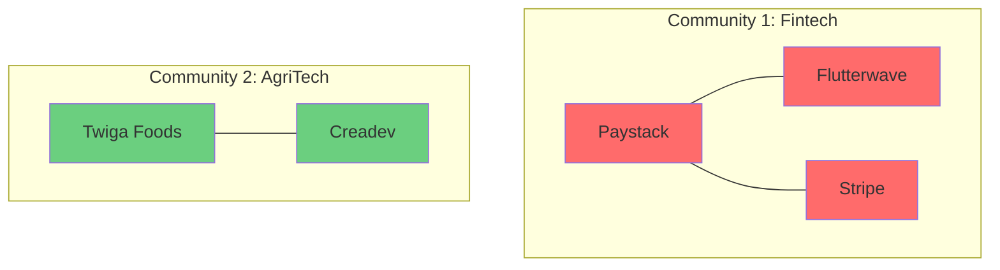

## Introduction

In our [previous tutorial](), we built a Knowledge Graph of the African Tech Ecosystem. But a graph is more than just a storage mechanism—it's a powerful structure for **analysis**.

In this post, we'll dive into **Graph Algorithms**. We'll use them to uncover hidden patterns, identify influential players, and detect communities within our ecosystem.

> **Key Concept**
> 
> **Graph Data Science (GDS)** is the application of graph algorithms to find patterns, clusters, and importance in connected data.
{: .prompt-info }

## Setting Up Neo4j Graph Data Science (GDS)

First, ensure you have the **Graph Data Science (GDS) Library** installed in your Neo4j instance. If you're using Neo4j Desktop, you can install it via the "Plugins" tab.

We'll interact with GDS using the official Python client:

```bash
pip install graphdatascience
```

```python
from graphdatascience import GraphDataScience

# Connect to Neo4j with GDS
gds = GraphDataScience("bolt://localhost:7687", auth=("neo4j", "password"))
```

## 1. Centrality Algorithms: Finding Influencers

Centrality algorithms identify the most important nodes in a graph.

### PageRank

Originally used by Google to rank web pages, **PageRank** measures the importance of a node based on the importance of its incoming links. In our context, a startup is "important" if it's connected to other important investors or founders.

**Projecting the Graph:**
Before running algorithms, we project our graph into memory.

```python
# Project a graph of Startups and Investors
gds.graph.project(
    "tech_ecosystem",
    ["Startup", "Investor"],
    "INVESTED_IN"
)
```

**Running PageRank:**

```python
results = gds.pageRank.stream("tech_ecosystem")

# Top 5 most influential entities
print(results.sort_values("score", ascending=False).head(5))
```

**Interpretation:**
High PageRank scores indicate startups that have attracted investment from highly connected investors, or investors who have backed many successful startups.

## 2. Community Detection: Finding Clusters

Community detection algorithms find groups of nodes that are more densely connected to each other than to the rest of the network.

### Louvain Modularity

The **Louvain method** is excellent for detecting hierarchical communities. It can reveal "ecosystem hubs" – e.g., the "Fintech Cluster" or the "Nairobi Hub".

```python
# Run Louvain algorithm
results = gds.louvain.stream("tech_ecosystem")

# Group by communityId
communities = results.groupby("communityId")["nodeId"].apply(list)
print(communities.head())
```

**Visualizing Communities:**



## 3. Pathfinding: Connecting the Dots

### Shortest Path (Dijkstra / A*)

We already saw `shortestPath` in Cypher. GDS offers weighted shortest paths, useful if we had properties like "Investment Amount" as weights.

```python
# Finding the weighted shortest path
path = gds.shortestPath.dijkstra.stream(
    "tech_ecosystem",
    sourceNode=source_id,
    targetNode=target_id,
    relationshipWeightProperty="amount"
)
```

## Real-World Application: Investment Recommendation

We can combine these algorithms to build a recommendation engine:

1.  **Identify Communities**: Use Louvain to find the "Fintech" cluster.
2.  **Rank Nodes**: Use PageRank to find the most influential investors in that cluster.
3.  **Recommend**: Suggest these top investors to a new Fintech startup entering the ecosystem.

## Conclusion

Graph algorithms allow us to move from **descriptive analytics** ("Who invested in whom?") to **predictive and prescriptive analytics** ("Who *should* invest in whom?").

By leveraging Neo4j GDS, we can unlock deep insights that are invisible in traditional tabular data.

> **Next Steps**
> 
> In our next post, we'll take this a step further and explore **[Graph Neural Networks (GNNs)]()**, where we'll use these graph features to train deep learning models!
{: .prompt-tip }

## References

1.  [Neo4j Graph Data Science Library](https://neo4j.com/docs/graph-data-science/current/)
2.  [PageRank Algorithm Explained](https://en.wikipedia.org/wiki/PageRank)
3.  [Louvain Method for Community Detection](https://en.wikipedia.org/wiki/Louvain_method)

---

**Related Posts:**
- [Building a Knowledge Graph with Neo4j and Python]()
- [Knowledge Graphs Fundamentals]()

---

*Uncovering the hidden structure of data.* 🚀
