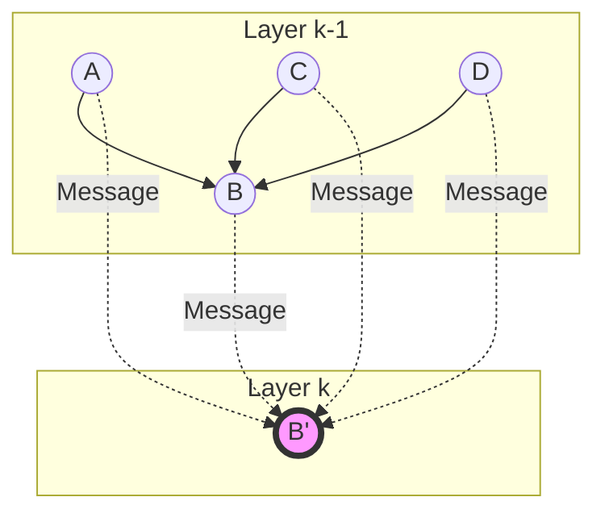

## Introduction

In our previous posts, we built a **Knowledge Graph** with Neo4j and analyzed it using **Graph Algorithms** like PageRank. These methods are powerful, but they are often limited to "shallow" learning.

Enter **Graph Neural Networks (GNNs)**.

GNNs are a class of deep learning models designed to perform inference on data described by graphs. They have revolutionized fields like drug discovery, recommender systems, and traffic prediction.

> **Why not just use a standard Neural Network?**
> 
> Standard NNs (like CNNs or RNNs) expect data in a fixed structure (grid or sequence). Graphs are **non-Euclidean**—they have no fixed order and varying neighbors. GNNs are designed to handle this irregularity.
{: .prompt-info }

## The Core Concept: Message Passing

The magic of GNNs lies in the **Message Passing Framework**. 

For every node in the graph, we:
1.  **Gather** information (messages) from its neighbors.
2.  **Aggregate** these messages (e.g., sum, mean, max).
3.  **Update** the node's own representation (embedding) based on the aggregated message and its previous state.

Mathematically, for a node $v$, its hidden state $h_v^{(k)}$ at layer $k$ is updated as:

$$ h_v^{(k)} = \sigma \left( W^{(k)} \cdot \text{AGG} \left( \{ h_u^{(k-1)} : u \in \mathcal{N}(v) \} \right) \right) $$

Where:
- $\mathcal{N}(v)$ is the set of neighbors of $v$.
- $\text{AGG}$ is a differentiable, permutation-invariant function (like sum or mean).
- $W^{(k)}$ is a learnable weight matrix.
- $\sigma$ is a non-linear activation function (like ReLU).

### Visualizing Message Passing



## Popular GNN Architectures

### 1. Graph Convolutional Networks (GCN)
GCNs are the "Hello World" of GNNs. They use a specific aggregation rule that approximates a spectral convolution.

$$ h_v^{(k)} = \sigma \left( \sum_{u \in \mathcal{N}(v) \cup \{v\}} \frac{1}{\sqrt{\text{deg}(v)\text{deg}(u)}} W^{(k)} h_u^{(k-1)} \right) $$

### 2. GraphSAGE (Graph Sample and Aggregate)
GraphSAGE is designed for **inductive learning** (handling unseen nodes). It learns to aggregate information from a fixed number of sampled neighbors.

### 3. Graph Attention Networks (GAT)
GAT adds an **attention mechanism**. Instead of treating all neighbors equally, it learns *importance weights* $\alpha_{vu}$ for each neighbor.

## Hands-On: Node Classification with PyTorch Geometric

Let's implement a simple GCN using **PyTorch Geometric (PyG)**, the leading library for GNNs.

We'll use the **Cora dataset**, a citation network where nodes are papers and edges are citations. The goal is to classify papers into subjects.

### Installation

```bash
pip install torch torch_geometric
```

### Implementation

```python
import torch
import torch.nn.functional as F
from torch_geometric.nn import GCNConv
from torch_geometric.datasets import Planetoid

# 1. Load the Cora dataset
dataset = Planetoid(root='/tmp/Cora', name='Cora')
data = dataset[0]

print(f'Nodes: {data.num_nodes}')
print(f'Edges: {data.num_edges}')
print(f'Features: {data.num_node_features}')
print(f'Classes: {dataset.num_classes}')

# 2. Define the GCN Model
class GCN(torch.nn.Module):
    def __init__(self):
        super().__init__()
        # Two Graph Convolutional Layers
        self.conv1 = GCNConv(dataset.num_node_features, 16)
        self.conv2 = GCNConv(16, dataset.num_classes)

    def forward(self, data):
        x, edge_index = data.x, data.edge_index

        # Layer 1
        x = self.conv1(x, edge_index)
        x = F.relu(x)
        x = F.dropout(x, training=self.training)

        # Layer 2
        x = self.conv2(x, edge_index)
        
        return F.log_softmax(x, dim=1)

# 3. Train the Model
device = torch.device('cuda' if torch.cuda.is_available() else 'cpu')
model = GCN().to(device)
data = data.to(device)
optimizer = torch.optim.Adam(model.parameters(), lr=0.01, weight_decay=5e-4)

model.train()
for epoch in range(200):
    optimizer.zero_grad()
    out = model(data)
    loss = F.nll_loss(out[data.train_mask], data.y[data.train_mask])
    loss.backward()
    optimizer.step()

# 4. Evaluate
model.eval()
pred = model(data).argmax(dim=1)
correct = (pred[data.test_mask] == data.y[data.test_mask]).sum()
acc = int(correct) / int(data.test_mask.sum())
print(f'Accuracy: {acc:.4f}')
```

## Conclusion

We've just scratched the surface of Graph Neural Networks. By leveraging the structure of data, GNNs unlock performance that traditional models can't match on relational datasets.

> **Next Steps**
> 
> Try applying this GCN model to our **African Tech Ecosystem** graph! You could predict the "Category" of a startup based on its investors and connections.
{: .prompt-tip }

## References

1.  [PyTorch Geometric Documentation](https://pytorch-geometric.readthedocs.io/en/latest/)
2.  [A Gentle Introduction to Graph Neural Networks (Distill)](https://distill.pub/2021/gnn-intro/)
3.  [Semi-Supervised Classification with Graph Convolutional Networks (Kipf & Welling)](https://arxiv.org/abs/1609.02907)

---

**Related Posts:**
- [Graph Algorithms in Neo4j]()
- [Building a Knowledge Graph with Neo4j and Python]()

---

*Learning from connections.* 🧠
