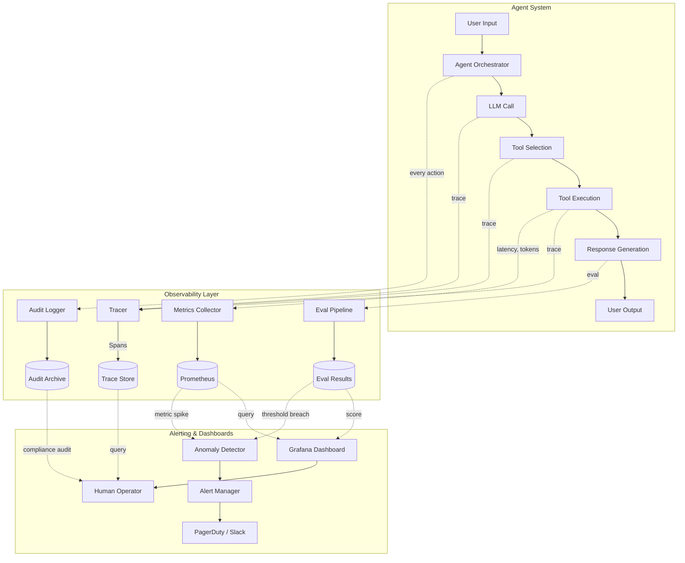
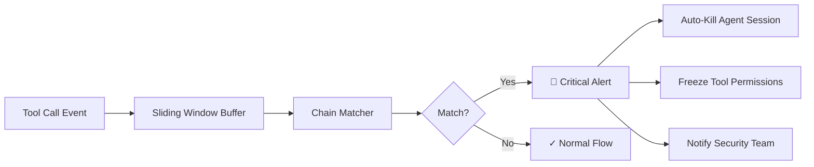

## Introduction

> **The scariest thing about autonomous AI agents isn't that they fail — it's that you don't know they're failing until it's too late.**
{: .prompt-danger }

An AI agent is a system where an LLM makes decisions, calls tools, browses the web, reads files, and executes actions — all with varying degrees of autonomy. When everything works, it's magic. But when something goes wrong — an agent exfiltrates data, deletes a database, hallucinates a transaction, or follows an injection payload — how do you even *know*?

You need **observability**: the ability to trace every decision, measure every output, and detect anomalies before they become incidents.

In our previous posts, we covered the attack side — [Insecure Agent Design]() (the problem of excessive agency), [Prompt Injection]() (the root cause of most exploits), and [MLSecOps Pipeline Security]() (securing the infra). This post is the defense: **observability for AI agents**.

> **Why observability matters more for AI agents than traditional software**
>
> Traditional software is deterministic — given the same input, it produces the same output. An LLM agent is stochastic, tool-calling, and stateful. A production bug in a web server returns a 500 error. A production bug in an AI agent deletes your database and credits the attacker's crypto wallet.
{: .prompt-info }

## The Observability Stack for AI Agents

Traditional observability (logs, metrics, traces) catches infrastructure failures. AI agent observability must catch *behavioral* failures — the agent doing the wrong thing even though every individual step succeeded.

Here's the layered stack you need:

| Layer | What It Tracks | Tooling |
|-------|----------------|---------|
| **Tracing** | Every LLM call, tool invocation, and decision step | LangFuse, LangSmith, Arize Phoenix |
| **Monitoring** | Latency, token usage, error rates, refusal rates | Datadog, Grafana, Prometheus |
| **Evaluation** | Output quality, safety, alignment | DeepEval, RAGAS, custom evals |
| **Auditing** | Full history of agent actions for compliance | Custom logging, vector DB, S3/Blob |
| **Alerting** | Anomalous behavior detection | Rule-based + ML anomaly detection |

> **Not "if" but "when"**
>
> You will deploy an agent that does something unexpected. The question is whether you'll find out from your observability dashboard — or from a user on Reddit.
{: .prompt-warning }

## Architecture Overview

The following diagram shows how observability fits into a production agent system:



Every LLM call, every tool execution, every decision rationale is captured. Metrics flow to Prometheus for real-time dashboards. Eval pipelines score outputs offline. Anomaly detection triggers alerts. Everything also goes to an immutable audit log for compliance.

## Implementation: Tracing Agent Decisions

### A Custom Tracer Decorator

The foundation of agent observability is **tracing** — capturing every step as a structured span with inputs, outputs, timestamps, and rationale. Here's a Python tracer you can wrap around any agent function:

```python
import json
import time
import uuid
from datetime import datetime, timezone
from functools import wraps
from typing import Any, Callable, Optional


class TraceSpan:
    """A single span in a trace — represents one step of agent execution."""

    def __init__(self, name: str, trace_id: str, parent_id: Optional[str] = None):
        self.span_id = uuid.uuid4().hex[:16]
        self.trace_id = trace_id
        self.parent_id = parent_id
        self.name = name
        self.start_time = datetime.now(timezone.utc)
        self.end_time: Optional[datetime] = None
        self.input: Any = None
        self.output: Any = None
        self.metadata: dict = {}
        self.error: Optional[str] = None

    def close(self):
        self.end_time = datetime.now(timezone.utc)

    @property
    def duration_ms(self) -> float:
        if self.end_time is None:
            return 0.0
        return (self.end_time - self.start_time).total_seconds() * 1000

    def to_dict(self) -> dict:
        return {
            "span_id": self.span_id,
            "trace_id": self.trace_id,
            "parent_id": self.parent_id,
            "name": self.name,
            "start_time": self.start_time.isoformat(),
            "end_time": self.end_time.isoformat() if self.end_time else None,
            "duration_ms": self.duration_ms,
            "input": self.input,
            "output": self.output,
            "metadata": self.metadata,
            "error": self.error,
        }


class AgentTracer:
    """Collects and exports traces for an agent session."""

    def __init__(self):
        self.spans: list[TraceSpan] = []
        self._current_span: Optional[TraceSpan] = None

    def trace(self, name: str):
        """Decorator: wrap any agent step (LLM call, tool exec, decision)."""
        def decorator(func: Callable):
            @wraps(func)
            def wrapper(*args, **kwargs):
                parent_id = self._current_span.span_id if self._current_span else None
                span = TraceSpan(name, trace_id=uuid.uuid4().hex[:16], parent_id=parent_id)
                span.input = {"args": repr(args), "kwargs": {k: repr(v) for k, v in kwargs.items()}}

                self.spans.append(span)
                previous = self._current_span
                self._current_span = span

                try:
                    result = func(*args, **kwargs)
                    span.output = result
                    return result
                except Exception as e:
                    span.error = str(e)
                    raise
                finally:
                    span.close()
                    self._current_span = previous

            return wrapper
        return decorator

    def export(self) -> list[dict]:
        """Export all spans for ingestion (LangFuse, S3, etc.)."""
        return [s.to_dict() for s in self.spans]


# ── Usage example ──────────────────────────────────────────────────

tracer = AgentTracer()


class MyAgent:
    @tracer.trace("llm_call")
    def query_llm(self, prompt: str) -> str:
        # Simulated LLM call
        time.sleep(0.1)
        return f"Response to: {prompt[:50]}..."

    @tracer.trace("tool_exec")
    def read_file(self, path: str) -> str:
        with open(path, "r") as f:
            return f.read()

    @tracer.trace("decision")
    def choose_tool(self, task: str, tools: list[str]) -> str:
        # Simulated tool selection
        return tools[0] if tools else "none"


# Run the agent
agent = MyAgent()
response = agent.query_llm("What files should I read?")
tool = agent.choose_tool("read logs", ["read_file", "search_web"])
content = agent.read_file("/tmp/app.log")

# Export traces
for span in tracer.export():
    print(json.dumps(span, indent=2, default=str))
```

### Anomalous Tool Call Sequence Detection

One of the most powerful observability patterns is detecting **suspicious tool call chains** — sequences that wouldn't make sense for the agent's legitimate task:

```python
from collections import defaultdict
from typing import list

SUSPICIOUS_CHAINS = [
    # Data exfiltration patterns
    ["read_file", "compose_email", "send_email"],
    ["list_directory", "read_file", "http_request"],
    ["read_database", "write_file", "upload_file"],
    # Privilege escalation patterns
    ["read_config", "execute_shell", "create_user"],
    ["list_instances", "create_instance", "modify_firewall"],
    # Credential harvesting
    ["read_env", "http_request"],
    ["read_file", "base64_encode", "http_post"],
]


class ChainDetector:
    def __init__(self, window: int = 5):
        self.window = window
        self.history: list[str] = []

    def observe(self, tool_name: str) -> Optional[str]:
        """Record a tool call and check for suspicious chains."""
        self.history.append(tool_name)
        if len(self.history) > self.window:
            self.history.pop(0)

        for chain in SUSPICIOUS_CHAINS:
            if len(chain) > len(self.history):
                continue
            # Check if the tail of history matches this chain
            tail = self.history[-len(chain):]
            if tail == chain:
                return f"SUSPICIOUS CHAIN DETECTED: {' → '.join(chain)}"

        return None


# ── Example ────────────────────────────────────────────────────────

detector = ChainDetector()

# Normal agent activity
for tool in ["read_file", "search_web", "read_file", "query_llm"]:
    alert = detector.observe(tool)
    if alert:
        print(f"⚠️  {alert}")

# Anomalous activity
for tool in ["list_directory", "read_file", "http_request"]:
    alert = detector.observe(tool)
    if alert:
        print(f"🚨 {alert}")
```

> **Detection is table stakes**
>
> Every agent deployment should have chain detection. The difference between a normal "helpful agent" trace and a data exfiltration trace is often just the order of 3-4 tool calls.
{: .prompt-tip }

## What to Monitor

Beyond traces, you need real-time metrics. Here are the seven signals that matter most for AI agent security:

### 1. Refusal Rate

The rate at which your agent refuses to execute a user request. A sudden drop means alignment is being bypassed.

```python
# Prometheus-style metric pseudocode
REFUSAL_RATE = gauge(
    name="agent_refusal_rate",
    help="Percentage of requests the agent refused",
)

# Alert rule: refusal rate drops below 1% (baseline is ~5%)
ALERT_RULE = """
  - alert: RefusalRateDrop
    expr: agent_refusal_rate < 0.01
    for: 5m
    labels:
      severity: critical
    annotations:
      summary: "Agent refusal rate dropped below 1% — possible jailbreak"
"""
```

### 2. Tool Call Frequency

Spikes in dangerous tools are red flags:

| Metric | Normal | Suspicious |
|--------|--------|------------|
| `read_file` calls/min | 2-10 | 50+ |
| `http_request` calls/min | 1-5 | 30+ |
| `execute_shell` calls/min | 0-1 | 10+ |
| `delete_*` calls | 0 | Any |

### 3. Context Window Usage

Prompt injection attacks often stuff huge payloads into the context window. Monitor both token count and compression ratio:

```python
CONTEXT_USAGE = gauge(
    name="agent_context_tokens",
    help="Tokens consumed per LLM call",
    labels=["agent_id", "model"],
)

# Alert: context usage > 80% of model limit
ALERT_RULE = """
  - alert: ContextWindowSpike
    expr: agent_context_tokens / agent_context_limit > 0.8
    for: 2m
    labels:
      severity: warning
    annotations:
      summary: "Context window above 80% — possible injection payload"
"""
```

### 4. Response Entropy

Jailbroken models produce more variable, less predictable responses. Statistical entropy of token probabilities is a strong signal:

```python
import math
from collections import Counter

def response_entropy(tokens: list[str]) -> float:
    """Compute Shannon entropy of token distribution."""
    total = len(tokens)
    freq = Counter(tokens)
    entropy = -sum(
        (count / total) * math.log2(count / total)
        for count in freq.values()
    )
    return entropy / math.log2(total) if total > 1 else 0.0  # Normalized

# Baseline runs (benign queries):  entropy ~0.3-0.5
# Jailbroken agent:               entropy ~0.7-0.9
# Anomaly alert threshold:        entropy > 0.65
```

### 5. Latency Distribution

Model extraction attacks have distinct latency signatures — attackers probe the model with structured inputs that produce unusually consistent response times:

```python
LATENCY_P95 = gauge(
    name="agent_llm_latency_p95",
    help="P95 latency of LLM calls in milliseconds",
)

# Alert: latency drops consistently below 200ms
# (indicates attacker is probing with cached/simple queries)
ALERT_RULE = """
  - alert: LowLatencyProbe
    expr: agent_llm_latency_p95 < 200
    for: 10m
    labels:
      severity: warning
    annotations:
      summary: "Consistently low latency — possible extraction attack"
"""
```

### 6. Token Throughput

Data exfiltration shows up as massive token throughput spikes — the agent is reading and emitting far more data than its task requires:

```python
# Total tokens in + out per session
TOKEN_THROUGHPUT = counter(
    name="agent_token_throughput",
    help="Total tokens processed per session",
    labels=["session_id"],
)

# Session-level threshold: 500K tokens in 1 minute
ALERT_RULE = """
  - alert: TokenExfiltration
    expr: rate(agent_token_throughput[1m]) > 500000
    labels:
      severity: critical
    annotations:
      summary: "Session processing >500K tokens/min — possible exfiltration"
"""
```

### 7. Tool Call Chains (Detailed)

We already covered chain detection above — but in production, you want this running as a streaming pipeline:



## Real Incidents Where Observability Would Have Helped

### 1. Auto-GPT Buying Domains (2023)

Auto-GPT autonomously purchased domains with real money because there was **no budget guardrail** and **no tool call audit trail**. With observability:

- A budget counter metric would have fired at the first dollar spent
- A tool call trace would have shown: `search_domain → add_to_cart → checkout`
- A chain detector would have flagged `add_to_cart → checkout` as suspicious without human confirmation

### 2. GitHub Issue Agent Cross-Repo Theft (2025)

An agent reading GitHub Issues was tricked into exfiltrating an entire private codebase. With observability:

- **File access monitoring** would have shown the agent reading 1000+ files in 30 seconds — far beyond any legitimate triage task
- **Token throughput** would have spiked as it encoded and exfiltrated those files
- **Tool chain detection** would have flagged `read_file → base64_encode → http_request`

### 3. Email Assistant CVE-2024-5184

This vulnerability in an AI email assistant allowed prompt injection via email content to trigger unintended tool calls. With observability:

- **Refusal rate** would have dropped as the injected prompts overrode safety instructions
- **Context window** would have spiked with the injected payload
- **Tool calls** would have deviated from the agent's normal pattern

> **Every incident in the AI security landscape shares a common thread: the absence of observability. Trace, monitor, evaluate, and alert — or accept that you'll discover failures from your users, not your dashboards.**
{: .prompt-warning }

## Integration with Existing Tools

You don't need to build everything from scratch. The ecosystem has matured significantly:

### W&B (Weights & Biases) for Experiment Tracking

W&B isn't just for training runs — it's excellent for tracking agent behavior across sessions:

```python
import wandb

# Initialize a W&B run for your agent session
run = wandb.init(
    project="ai-agent-observability",
    config={
        "agent_type": "code-assistant",
        "llm_model": "gpt-4o",
        "max_tool_calls": 100,
        "guardrails": ["nemo", "custom-content-safety"],
    },
)

# Log every agent step
for step in agent_steps:
    wandb.log({
        "step": step.number,
        "tool_called": step.tool_name,
        "latency_ms": step.latency_ms,
        "tokens_in": step.tokens_in,
        "tokens_out": step.tokens_out,
        "refusal": int(step.was_refused),
        "eval_safety_score": step.safety_score,
        "eval_helpfulness": step.helpfulness_score,
    })

run.finish()
```

### LangFuse for LLM Tracing

LangFuse provides purpose-built tracing for LLM applications, including agent-specific features:

```python
from langfuse import Langfuse
from langfuse.decorators import observe, langfuse_context

langfuse = Langfuse(
    secret_key="sk-lf-...",
    public_key="pk-lf-...",
    host="https://cloud.langfuse.com",
)

@observe()
def agent_step(task: str, tool: str, input_data: str) -> str:
    """Each agent step is automatically traced with LangFuse."""

    # The @observe decorator captures timing, input, output
    # Add custom metadata for tool-specific details
    langfuse_context.update_current_observation(
        input=input_data,
        metadata={
            "tool_name": tool,
            "task_description": task,
            "agent_version": "v2.1.0",
        }
    )

    result = execute_tool(tool, input_data)

    # Score the output automatically
    langfuse.score(
        name="safety",
        value=compute_safety_score(result),
        comment="Automated safety evaluation",
    )

    return result
```

### Prometheus + Grafana for Metrics

Standardize on OpenMetrics format for all agent metrics:

```python
from prometheus_client import Counter, Histogram, Gauge, start_http_server

# Define agent metrics
AGENT_LLM_CALLS = Counter(
    "agent_llm_calls_total",
    "Total LLM calls",
    ["agent_id", "model", "status"],
)

AGENT_TOOL_CALLS = Counter(
    "agent_tool_calls_total",
    "Total tool calls",
    ["agent_id", "tool_name", "status"],
)

AGENT_LATENCY = Histogram(
    "agent_step_duration_ms",
    "Duration of agent steps",
    ["agent_id", "step_type"],
    buckets=[50, 100, 200, 500, 1000, 2000, 5000],
)

AGENT_CONTEXT_TOKENS = Gauge(
    "agent_context_tokens",
    "Context tokens used per call",
    ["agent_id"],
)

# Start metrics server
start_http_server(8000)

# Use in your agent loop
def run_agent_step(agent_id: str, model: str, prompt: str):
    AGENT_LLM_CALLS.labels(agent_id=agent_id, model=model, status="started").inc()
    with AGENT_LATENCY.labels(agent_id=agent_id, step_type="llm").time():
        response = llm_call(prompt)
    AGENT_LLM_CALLS.labels(agent_id=agent_id, model=model, status="success").inc()
    AGENT_CONTEXT_TOKENS.labels(agent_id=agent_id).set(count_tokens(prompt + response))
```

### Custom Guardrails

Guardrails act as the last line of defense — they inspect agent outputs before execution:

```python
from typing import Any

class AgentGuardrail:
    """Check an agent action before it executes."""

    def check_tool_call(
        self,
        tool_name: str,
        tool_args: dict[str, Any],
        context: dict[str, Any],
    ) -> tuple[bool, str]:
        """Return (allowed, reason)."""
        raise NotImplementedError

    def check_output(
        self,
        output: str,
        context: dict[str, Any],
    ) -> tuple[bool, str]:
        """Return (passed, reason)."""
        raise NotImplementedError


class BudgetGuardrail(AgentGuardrail):
    """Prevent agents from spending more than budget."""

    def __init__(self, max_cost_per_session: float = 0.01):
        self.max_cost = max_cost_per_session
        self.total_spent = 0.0

    def check_tool_call(
        self,
        tool_name: str,
        tool_args: dict[str, Any],
        context: dict[str, Any],
    ) -> tuple[bool, str]:
        if tool_name == "checkout":
            cost = tool_args.get("amount", 0)
            if self.total_spent + cost > self.max_cost:
                return False, f"Budget exceeded: ${self.total_spent + cost:.2f} > ${self.max_cost:.2f}"
        return True, ""


class DataExfilGuardrail(AgentGuardrail):
    """Block large-scale data movement."""

    def __init__(self, max_bytes: int = 1_000_000):
        self.max_bytes = max_bytes

    def check_tool_call(
        self,
        tool_name: str,
        tool_args: dict[str, Any],
        context: dict[str, Any],
    ) -> tuple[bool, str]:
        if tool_name == "http_request":
            data_size = len(str(tool_args.get("data", "")))
            if data_size > self.max_bytes:
                return False, f"Data size {data_size} exceeds limit {self.max_bytes}"
        return True, ""
```

## Building Your Observability Maturity Model

Organizations don't go from zero to fully observable overnight. Here's a maturity model to guide your journey:

| Level | Name | What You Have | What You're Missing |
|-------|------|--------------|-------------------|
| **1** | Blind | Basic request logging | Traces, evals, real-time alerts |
| **2** | Aware | LLM call tracing (LangFuse) | Tool call monitoring, anomaly detection |
| **3** | Monitored | Full tracing + metrics (Prometheus) | Evals, guardrails, automated alerting |
| **4** | Autonomous | All layers + auto-remediation | Nothing — you've arrived |

> **Start at Level 1, target Level 3**
>
> Level 1 is dangerous but fast. Level 3 is safe but takes investment. Skip Level 4 until your organization has mature MLOps and security operations — autonomous remediation of agent failures is an advanced capability.
{: .prompt-info }

## References

1. **LangFuse Documentation** — Open-source LLM observability and tracing. https://langfuse.com/docs
2. **Arize AI — LLM Observability** — Tracing, evaluation, and monitoring for LLM applications. https://arize.com/llm-observability/
3. **Guardrails AI** — Guardrails for LLM outputs. https://www.guardrailsai.com/
4. **NVIDIA NeMo Guardrails** — Open-source toolkit for adding guardrails to LLM systems. https://github.com/NVIDIA/NeMo-Guardrails
5. **OWASP LLM06 — Excessive Agency** — The OWASP Top 10 for LLM Applications vulnerability classification. https://genai.owasp.org/llm-top-10/
6. **DeepEval** — LLM evaluation framework. https://github.com/confident-ai/deepeval
7. **Prometheus & Grafana** — Metrics and dashboarding. https://prometheus.io / https://grafana.com
8. **Weights & Biases** — Experiment tracking for ML and LLM agents. https://wandb.ai
9. **The Auto-GPT Incident (2023)** — First major autonomous agent failure in the wild. https://news.ycombinator.com/item?id=35220568
10. **CVE-2024-5184** — Email assistant prompt injection vulnerability. https://nvd.nist.gov/vuln/detail/CVE-2024-5184

---

*This is Blog Post 5 of the AI Hacking & Defense Series. Read the companion posts: [Insecure Agent Design]() (the vulnerability that observability mitigates), [Prompt Injection]() (the attack vector), and [MLSecOps Pipeline Security]() (securing the infrastructure).*
