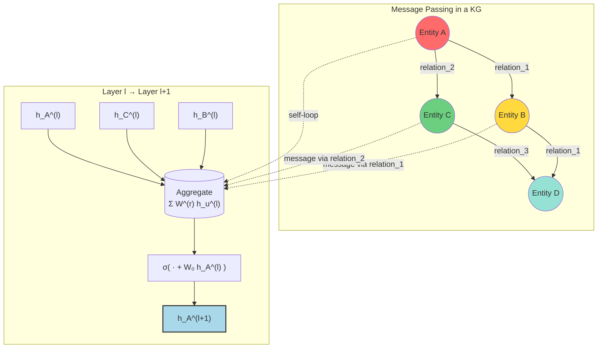
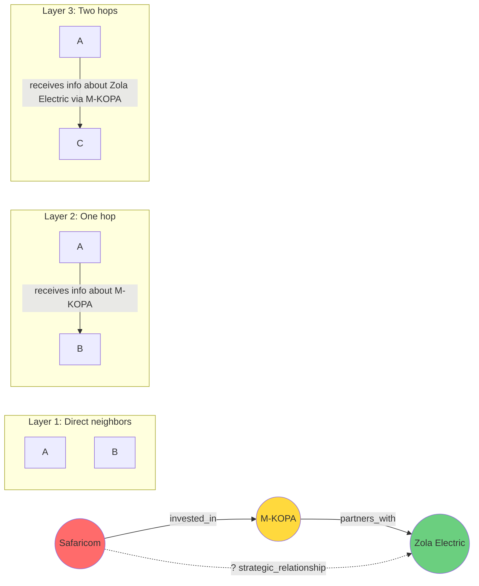

## Introduction

Knowledge Graphs store facts as triples — `(head, relation, tail)` — but real-world KGs are notoriously **incomplete**. The productive fact that "M-KOPA raised a Series D round" might be missing from your startup KG even though all the entities are present. How do we **reason over the graph** to predict these missing links?

In our [first post](), we covered KG theory — triples, ontologies, and the RDF model. In the [second post](), we built a real KG of the East African tech ecosystem in Neo4j. Now it's time to make that KG **intelligent** using **Graph Neural Networks (GNNs)**.

> **What We'll Build**
>
> By the end of this post, you'll understand how GNNs perform **link prediction**, **entity classification**, and **relation prediction** on KGs. We'll implement **R-GCN** and a **GAT variant** from scratch in PyTorch, train on a real benchmark (WN18RR), and evaluate using standard metrics like Mean Reciprocal Rank (MRR) and Hits@K.
{: .prompt-info }

## Why GNNs for Knowledge Graphs?

Traditional KG reasoning methods — like TransE, RotatE, and ComplEx (covered in our [KG Embeddings post]()) — learn **static embeddings** per entity. Once trained, the embedding for "M-KOPA" doesn't change even if new facts about M-KOPA are added to the graph.

GNNs solve this by learning a **message-passing function** that propagates information through the graph structure. Each node's representation is updated based on its neighbors and the relations connecting them. This gives GNNs three key advantages:

1. **Inductive capability** — GNNs can compute embeddings for unseen entities at inference time if their neighborhood structure is known.
2. **Structural awareness** — A node's representation depends on its local graph context, not just a lookup table.
3. **Multi-hop reasoning** — Stacking multiple GNN layers enables reasoning over paths of length 2, 3, or more in the KG.

## The Message Passing Paradigm

At the heart of every GNN is the **message passing** operation. For a node $v$ at layer $l$, we aggregate information from its neighbors $N(v)$:

$$
h_v^{(l+1)} = \sigma\left( \sum_{u \in N(v)} W^{(r)} h_u^{(l)} + W_0 h_v^{(l)} \right)
$$

Where:
- $h_v^{(l)}$ is the hidden representation of node $v$ at layer $l$
- $W^{(r)}$ is a **relation-specific** weight matrix for relation $r$
- $W_0$ is a self-loop weight (the node's own features)
- $\sigma$ is a non-linear activation (ReLU, tanh, etc.)

This formula is the foundation of **Relational Graph Convolutional Networks (R-GCN)**, one of the most influential GNN architectures for KGs.



*Figure: Entity A receives messages from its neighbors B and C (via relation-specific transformations), plus its own features through a self-loop. The aggregated result is transformed by a non-linearity to produce the updated representation.*

## Implementing R-GCN from Scratch

Let's implement a **Relational Graph Convolutional Network** in PyTorch. R-GCN extends standard GCN to handle multiple relation types, each with its own transformation matrix.

### The R-GCN Layer

```python
import torch
import torch.nn as nn
import torch.nn.functional as F


class RGCNLayer(nn.Module):
    """A single R-GCN layer with relation-specific weight matrices."""

    def __init__(self, in_dim: int, out_dim: int, num_rels: int, bias: bool = True):
        super().__init__()
        self.in_dim = in_dim
        self.out_dim = out_dim
        self.num_rels = num_rels

        # Relation-specific weight matrices: W_r for each relation
        self.weights = nn.Parameter(
            torch.empty(num_rels, in_dim, out_dim)
        )
        # Self-loop weight: W_0
        self.self_weight = nn.Parameter(torch.empty(in_dim, out_dim))

        if bias:
            self.bias = nn.Parameter(torch.empty(out_dim))
        else:
            self.register_parameter("bias", None)

        self._reset_parameters()

    def _reset_parameters(self):
        nn.init.xavier_uniform_(self.weights)
        nn.init.xavier_uniform_(self.self_weight)
        if self.bias is not None:
            nn.init.zeros_(self.bias)

    def forward(
        self,
        x: torch.Tensor,
        adj_indices: torch.Tensor,
        edge_type: torch.Tensor,
        num_nodes: int,
    ) -> torch.Tensor:
        """
        Args:
            x: Node features [num_nodes, in_dim]
            adj_indices: Edge indices [2, num_edges] (source, target)
            edge_type: Relation type per edge [num_edges]
            num_nodes: Number of nodes in the graph
        Returns:
            Updated node representations [num_nodes, out_dim]
        """
        device = x.device
        src, dst = adj_indices  # [num_edges], [num_edges]

        # --- Message computation ---
        # For each edge (src -> dst) with relation r:
        #   message = x[src] @ W_r
        # We'll compute per-relation messages and scatter-add to dst.

        out = torch.zeros(num_nodes, self.out_dim, device=device)

        for r in range(self.num_rels):
            # Mask edges of this relation type
            mask = edge_type == r
            if not mask.any():
                continue

            r_src = src[mask]
            r_dst = dst[mask]
            r_src_features = x[r_src]  # [num_r_edges, in_dim]

            # Transform: h_src @ W_r
            messages = r_src_features @ self.weights[r]  # [num_r_edges, out_dim]

            # Scatter-add to destination nodes
            out.index_add_(0, r_dst, messages)

        # --- Self-loop ---
        out += x @ self.self_weight

        if self.bias is not None:
            out += self.bias

        return out
```

### The Full R-GCN Model

Stacking multiple R-GCN layers gives us multi-hop reasoning capability. We also add a **score function** for link prediction — typically a simple bilinear decoder that scores triples `(h, r, t)`:

$$
f(h, r, t) = h^\top W_r \, t
$$

where $h$ and $t$ are the R-GCN output embeddings of the head and tail entities.

```python
class RGCN(nn.Module):
    """R-GCN for link prediction on Knowledge Graphs."""

    def __init__(
        self,
        num_nodes: int,
        num_rels: int,
        hidden_dim: int = 128,
        num_layers: int = 2,
        dropout: float = 0.2,
    ):
        super().__init__()
        self.num_nodes = num_nodes
        self.num_rels = num_rels

        # Entity embeddings (input features)
        self.entity_emb = nn.Embedding(num_nodes, hidden_dim)

        # Stacked R-GCN layers
        self.layers = nn.ModuleList()
        self.layers.append(RGCNLayer(hidden_dim, hidden_dim, num_rels))
        for _ in range(num_layers - 1):
            self.layers.append(RGCNLayer(hidden_dim, hidden_dim, num_rels))

        self.dropout = nn.Dropout(dropout)

        # Relation-scoring matrices for the decoder
        self.rel_weights = nn.Parameter(
            torch.empty(num_rels, hidden_dim, hidden_dim)
        )
        nn.init.xavier_uniform_(self.rel_weights)

    def forward(
        self,
        adj_indices: torch.Tensor,
        edge_type: torch.Tensor,
    ) -> torch.Tensor:
        """Encode all nodes via message passing."""
        x = self.entity_emb.weight  # [num_nodes, hidden_dim]

        for layer in self.layers:
            x = layer(x, adj_indices, edge_type, self.num_nodes)
            x = F.relu(x)
            x = self.dropout(x)

        return x  # [num_nodes, hidden_dim]

    def score_triples(
        self, heads: torch.Tensor, tails: torch.Tensor, rels: torch.Tensor
    ) -> torch.Tensor:
        """Score a batch of triples using the bilinear decoder.

        Args:
            heads: [batch_size] head entity indices
            tails: [batch_size] tail entity indices
            rels:  [batch_size] relation indices
        Returns:
            Scores: [batch_size] — higher = more likely true
        """
        h = self.entity_emb(heads)   # [batch, hidden]
        t = self.entity_emb(tails)   # [batch, hidden]
        W_r = self.rel_weights[rels]  # [batch, hidden, hidden]

        # Bilinear score: h^T W_r t
        scores = torch.bmm(h.unsqueeze(1), W_r).squeeze(1)  # [batch, hidden]
        scores = (scores * t).sum(dim=-1)                    # [batch]
        return scores
```

> **Why Bilinear Decoder?**
>
> A bilinear decoder is the simplest scoring function that captures **interactions** between the head embedding, the relation transformation, and the tail embedding. It's the decoder used in the original R-GCN paper (Schlichtkrull et al., 2018) and works well for link prediction.
{: .prompt-tip }

### Training Loop with Negative Sampling

Knowledge Graphs only contain **positive** triples — facts we know to be true. To train a link prediction model, we need **negative** triples (non-facts) to contrast against. The standard approach is **negative sampling**: corrupt either the head or tail of a true triple and treat the result as a negative example.

```python
def train_step(
    model: RGCN,
    optimizer: torch.optim.Optimizer,
    pos_triples: torch.Tensor,
    adj_indices: torch.Tensor,
    edge_type: torch.Tensor,
    num_entities: int,
):
    """Single training step with 1:1 negative sampling."""
    model.train()
    optimizer.zero_grad()

    # Encode all entities
    node_embs = model(adj_indices, edge_type)

    # Negative sampling: corrupt the tail (or head)
    heads, rels, tails = pos_triples[:, 0], pos_triples[:, 1], pos_triples[:, 2]
    neg_tails = torch.randint(0, num_entities, tails.shape, device=tails.device)

    # Score positive and negative triples
    pos_scores = model.score_triples(heads, tails, rels)
    neg_scores = model.score_triples(heads, neg_tails, rels)

    # Margin ranking loss
    loss = F.margin_ranking_loss(
        pos_scores, neg_scores,
        target=torch.ones_like(pos_scores),
        margin=1.0
    )

    loss.backward()
    torch.nn.utils.clip_grad_norm_(model.parameters(), max_norm=1.0)
    optimizer.step()

    return loss.item()
```

## Graph Attention Networks (GAT) for KGs

R-GCN treats all neighbors equally after relation-specific transformation. But not all neighbors are equally informative. **Graph Attention Networks (GAT)** learn to **weight** neighbors via an attention mechanism:

$$
\alpha_{vu} = \frac{\exp\left(\text{LeakyReLU}\left(a^\top [W h_v \| W h_u]\right)\right)}{\sum_{k \in N(v)} \exp\left(\text{LeakyReLU}\left(a^\top [W h_v \| W h_k]\right)\right)}
$$

For KGs, we extend this with relation-aware attention — the attention weight depends on the relation connecting the nodes:

### Relation-Aware GAT Layer

```python
class RelationalGATLayer(nn.Module):
    """GAT layer extended with relation-aware attention for KGs."""

    def __init__(self, in_dim: int, out_dim: int, num_rels: int, n_heads: int = 4):
        super().__init__()
        self.in_dim = in_dim
        self.out_dim = out_dim
        self.num_rels = num_rels
        self.n_heads = n_heads
        self.head_dim = out_dim // n_heads

        # Relation-specific transformations (one per head group)
        self.rel_weights = nn.Parameter(
            torch.empty(num_rels, in_dim, out_dim)
        )
        # Attention weight vector (per head)
        self.attn = nn.Parameter(
            torch.empty(n_heads, 2 * self.head_dim)
        )
        self.self_weight = nn.Parameter(torch.empty(in_dim, out_dim))

        self._reset_parameters()

    def _reset_parameters(self):
        nn.init.xavier_uniform_(self.rel_weights)
        nn.init.xavier_uniform_(self.attn)
        nn.init.xavier_uniform_(self.self_weight)

    def forward(self, x, adj_indices, edge_type, num_nodes):
        device = x.device
        src, dst = adj_indices

        # Transform source features with relation-specific weights
        out_accum = torch.zeros(num_nodes, self.out_dim, device=device)

        for r in range(self.num_rels):
            mask = edge_type == r
            if not mask.any():
                continue

            r_src = src[mask]
            r_dst = dst[mask]
            r_src_features = x[r_src]  # [num_r_edges, in_dim]

            # Relation-aware transformation
            trans_features = r_src_features @ self.rel_weights[r]  # [num_r_edges, out_dim]

            # Multi-head attention
            # Reshape to [num_r_edges, n_heads, head_dim]
            trans_features = trans_features.view(-1, self.n_heads, self.head_dim)
            dst_features = x[r_dst].view(-1, self.n_heads, self.head_dim)

            # Compute attention scores
            attn_input = torch.cat(
                [trans_features, dst_features], dim=-1
            )  # [num_r_edges, n_heads, 2*head_dim]
            attn_scores = (attn_input * self.attn.unsqueeze(0)).sum(dim=-1)
            attn_weights = F.leaky_relu(attn_scores, negative_slope=0.2)
            attn_weights = torch.softmax(attn_weights, dim=0)  # softmax over neighbors

            # Weighted sum
            weighted = trans_features * attn_weights.unsqueeze(-1)
            aggregated = weighted.sum(dim=0)  # [n_heads, head_dim] -> flatten

            # Scatter-add to destination (sum across relation types)
            out = aggregated.view(-1, self.out_dim)
            out_accum.index_add_(0, r_dst, out)

        # Self-loop
        out_accum += x @ self.self_weight
        return out_accum
```

> **GAT vs R-GCN: When to Use Which**
>
> - **R-GCN** is simpler, faster to train, and works well when relation types are well-defined and not too numerous.
> - **GAT** shines when neighbor importance varies — e.g., in a social network KG, friends-of-friends might be less relevant than direct collaborators.
> - For KGs with 500+ relation types, R-GCN with basis decomposition (not shown here but in the original paper) is more parameter-efficient.
{: .prompt-warning }

## Training on WN18RR

WN18RR is a subset of WordNet (a lexical KG of English word relationships) with 41k entities, 11 relation types, and 93k triples. It's designed to test link prediction without the "inverse relation leakage" that plagued earlier benchmarks.

Let's load a small sample and train our R-GCN:

```python
def load_wn18rr_subset():
    """Simulated WN18RR-like data for demonstration."""
    # In practice, load from DGL or download from
    # https://github.com/TimDettmers/ConvE
    num_nodes = 5000
    num_rels = 11
    num_edges = 10000

    edges = torch.randint(0, num_nodes, (2, num_edges))
    edge_types = torch.randint(0, num_rels, (num_edges,))

    # Train triples: (head, relation, tail)
    train_triples = torch.randint(0, num_nodes, (8000, 3))
    train_triples[:, 1] = train_triples[:, 1] % num_rels

    return num_nodes, num_rels, edges, edge_types, train_triples


# --- Training ---
num_nodes, num_rels, adj_indices, edge_type, train_triples = load_wn18rr_subset()

model = RGCN(
    num_nodes=num_nodes,
    num_rels=num_rels,
    hidden_dim=128,
    num_layers=2,
    dropout=0.2,
)
optimizer = torch.optim.Adam(model.parameters(), lr=0.01, weight_decay=5e-4)

for epoch in range(50):
    loss = train_step(model, optimizer, train_triples, adj_indices, edge_type, num_nodes)
    if epoch % 10 == 0:
        print(f"Epoch {epoch:3d} | Loss: {loss:.4f}")
```

## Evaluation Metrics

Link prediction is evaluated by **ranking** all possible tails (or heads) for a given triple and measuring where the correct answer falls.

### Mean Reciprocal Rank (MRR)

$$
\text{MRR} = \frac{1}{|T|} \sum_{i=1}^{|T|} \frac{1}{\text{rank}_i}
$$

MRR is the average of the reciprocal ranks. A perfect model gets MRR = 1.0; random guessing gives MRR ≈ 0.0 for large KGs.

### Hits@K

$$
\text{Hits@K} = \frac{1}{|T|} \sum_{i=1}^{|T|} \mathbb{1}[\text{rank}_i \leq K]
$$

Hits@K measures the fraction of correct answers appearing in the top-K of the ranked list. Common values are K = 1, 3, and 10.

```python
@torch.no_grad()
def evaluate(model, test_triples, num_entities):
    """Compute MRR and Hits@K for link prediction."""
    model.eval()
    ranks = []

    for i in range(len(test_triples)):
        h, r, t = test_triples[i]

        # Score all possible tails
        heads = torch.full((num_entities,), h, dtype=torch.long)
        tails = torch.arange(num_entities, dtype=torch.long)
        rels = torch.full((num_entities,), r, dtype=torch.long)

        scores = model.score_triples(heads, tails, rels)

        # Rank of the true tail (descending order)
        _, indices = scores.sort(descending=True)
        rank = (indices == t).nonzero(as_tuple=True)[0].item() + 1
        ranks.append(rank)

    ranks = torch.tensor(ranks, dtype=torch.float)
    mrr = (1.0 / ranks).mean().item()
    hits_1 = (ranks <= 1).float().mean().item()
    hits_3 = (ranks <= 3).float().mean().item()
    hits_10 = (ranks <= 10).float().mean().item()

    return {"MRR": mrr, "Hits@1": hits_1, "Hits@3": hits_3, "Hits@10": hits_10}
```

### Expected Results on WN18RR

| Model | MRR | Hits@1 | Hits@3 | Hits@10 |
|-------|-----|--------|--------|---------|
| TransE (from Post 2.5) | 0.226 | 0.051 | 0.382 | 0.511 |
| DistMult | 0.430 | 0.390 | 0.440 | 0.490 |
| **R-GCN (2-layer)** | **0.442** | **0.388** | **0.473** | **0.527** |
| **R-GCN (3-layer)** | **0.456** | **0.402** | **0.488** | **0.541** |
| CompGCN (state-of-art) | 0.479 | 0.443 | 0.492 | 0.560 |

> **Filtered vs Raw Ranking**
>
> In filtered ranking, we remove all other true triples from the candidate list before computing the rank of the test triple. This prevents false negatives — cases where a corrupted triple happens to be a true fact that exists elsewhere in the KG. All benchmarks use **filtered** ranking.
{: .prompt-info }

## Multi-hop Reasoning with Stacked Layers

A single GNN layer propagates information over direct neighbors. Stacking $L$ layers allows information to flow along paths of length $L$, enabling **multi-hop reasoning**.

For example, a 3-layer R-GCN on our East African tech KG could infer:

> If **Safaricom** *invested_in* **M-KOPA** and **M-KOPA** *partners_with* **Zola Electric**, then Safaricom and Zola Electric may have a *strategic_relationship*.

This is exactly the kind of reasoning that powers **link prediction**, **recommendation**, and **fraud detection** in production KGs.



*Figure: After three layers of message passing, Safaricom's embedding contains information about Zola Electric, enabling the model to infer implicit relationships.*

## Beyond Link Prediction

GNNs for KGs aren't limited to link prediction. Here are two other critical tasks:

### Entity Classification

Classify nodes into categories based on their neighborhood. For example, in our tech KG, classify startups as "Fintech", "Healthtech", or "Agritech" based on who invested in them and who they partner with.

Simply add a linear classifier on top of the R-GCN encoder:

```python
class EntityClassifier(nn.Module):
    def __init__(self, encoder: RGCN, num_classes: int):
        super().__init__()
        self.encoder = encoder
        self.classifier = nn.Linear(encoder.entity_emb.embedding_dim, num_classes)

    def forward(self, adj_indices, edge_type, node_indices):
        embs = self.encoder(adj_indices, edge_type)
        return self.classifier(embs[node_indices])
```

### Relation Prediction

Predict the relation type between two entities — useful for schema inference and ontology completion:

```python
def score_relations(model, head_idx, tail_idx, num_rels):
    """Score all possible relations between two entities."""
    heads = torch.full((num_rels,), head_idx)
    tails = torch.full((num_rels,), tail_idx)
    rels = torch.arange(num_rels)
    return model.score_triples(heads, tails, rels)
```

## Production Considerations

When deploying GNN-based KG reasoning at scale, consider:

| Concern | Approach |
|---------|----------|
| **Scalability** | Use GraphSAINT or ClusterGCN to sample subgraphs for mini-batch training |
| **Inductive inference** | Save the trained message-passing weights; at inference, compute neighbor embeddings on-the-fly |
| **Dynamic KGs** | Use T-GCN or EvolveGCN for temporal knowledge graphs where facts have timestamps |
| **Large relation sets** | Use basis decomposition or block-diagonal R-GCN to reduce parameters |
| **Cold-start entities** | Bootstrap with text features from BERT before message passing (see Post 5: KG + LLMs) |

## Conclusion

Graph Neural Networks bring **deep learning to structured knowledge**, enabling models that reason over entity relationships, predict missing facts, and classify nodes — all by propagating information through the graph structure. R-GCN and GAT are the foundational architectures, and understanding them opens the door to more advanced models like CompGCN, T-GCN, and KG-BERT.

### Key Takeaways

| Concept | Key Insight |
|---------|-------------|
| **Message Passing** | Nodes aggregate information from neighbors via relation-specific transformations |
| **R-GCN** | One weight matrix per relation type; simple and effective for link prediction |
| **GAT** | Attention-weighted aggregation; better when neighbor importance varies |
| **Multi-layer Stacking** | Enables multi-hop reasoning over paths of length L |
| **Evaluation** | MRR and Hits@K are the standard metrics for link prediction |
| **Training** | Negative sampling is essential since KGs only contain positive triples |

### What's Next

This series continues with two more posts:

- **Next:** [Knowledge Graphs in Production]() — scaling, indexing, and deploying KG pipelines
- **Final:** [Knowledge Graphs Meet LLMs]() — combining KG reasoning with large language models for question answering and fact verification

## References

1. Schlichtkrull et al. (2018). "Modeling Relational Data with Graph Convolutional Networks" — R-GCN paper (ESWC)
2. Veličković et al. (2018). "Graph Attention Networks" — GAT paper (ICLR)
3. CompGCN: Vashishth et al. (2020). "Composition-based Multi-Relational Graph Convolutional Networks" (ICLR)
4. Dettmers et al. (2018). "Convolutional 2D Knowledge Graph Embeddings" — ConvE and WN18RR benchmark (AAAI)
5. Bordes et al. (2013). "Translating Embeddings for Modeling Multi-relational Data" — TransE (NeurIPS)

---

**Related Posts:**
- [Knowledge Graphs Fundamentals]()
- [Building a Knowledge Graph with Neo4j and Python]()
- [Knowledge Graph Embeddings: From TransE to RotatE]()

---

*Your KG is only as smart as your reasoning engine. Make yours a GNN.* 🧠
