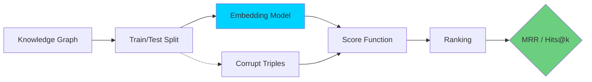
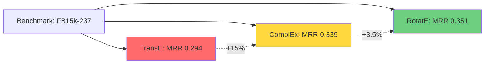

## Introduction

Knowledge Graphs represent facts as symbolic triples — `(head, relation, tail)`. But how do we feed these symbolic structures into neural networks? The answer is **Knowledge Graph Embeddings (KGE)** — learned vector representations that preserve graph structure in continuous space.

In this post, we'll implement three major KGE methods from scratch in PyTorch: **TransE**, **RotatE**, and **ComplEx**. We'll train them on a real-world dataset and evaluate on the **link prediction** task — predicting missing facts in the graph.

> **Why Embeddings Matter**
> 
> Symbolic KGs are sparse, incomplete, and hard to generalize from. Embeddings map entities and relations into dense vectors where semantic similarity becomes distance in vector space — enabling link prediction, entity resolution, and downstream ML.
{: .prompt-info }

## The Link Prediction Task

Before diving into models, we need to define our task:

> **Link Prediction:** Given a KG with missing triples, predict whether `(h, r, t)` is a valid fact.

We evaluate using:
- **MRR** (Mean Reciprocal Rank) — how early the correct answer appears
- **Hits@k** — percentage of correct answers in top-k predictions



## Dataset: FB15k-237

We'll use **FB15k-237**, a standard KGE benchmark derived from Freebase:

| Metric | Value |
|--------|-------|
| Entities | 14,541 |
| Relations | 237 |
| Training triples | 272,115 |
| Validation triples | 17,535 |
| Test triples | 20,466 |

```bash
# Download the dataset
wget https://raw.githubusercontent.com/mommi84/WN18RR/master/data/FB15k-237/train.txt
wget https://raw.githubusercontent.com/mommi84/WN18RR/master/data/FB15k-237/valid.txt
wget https://raw.githubusercontent.com/mommi84/WN18RR/master/data/FB15k-237/test.txt
```

## 1. TransE: Translational Embeddings

**TransE** (Bordes et al., 2013) is the simplest and most influential KGE model. It models relations as **translations** in embedding space:

$$
\mathbf{h} + \mathbf{r} \approx \mathbf{t}
$$

The score (lower = better) is the distance:

$$
f(h, r, t) = \|\mathbf{h} + \mathbf{r} - \mathbf{t}\|_2^2
$$

```python
import torch
import torch.nn as nn
import torch.nn.functional as F

class TransE(nn.Module):
    """TransE: Translating Embeddings for modeling multi-relational data."""
    
    def __init__(self, num_entities: int, num_relations: int, dim: int, margin: float = 1.0):
        super().__init__()
        self.dim = dim
        self.margin = margin
        
        # Entity and relation embeddings
        self.entity_emb = nn.Embedding(num_entities, dim)
        self.relation_emb = nn.Embedding(num_relations, dim)
        
        # Xavier initialization
        nn.init.xavier_uniform_(self.entity_emb.weight)
        nn.init.xavier_uniform_(self.relation_emb.weight)
    
    def forward(self, head, relation, tail):
        """Compute score: ||h + r - t||^2"""
        h = F.normalize(self.entity_emb(head), p=2, dim=1)
        r = F.normalize(self.relation_emb(relation), p=2, dim=1)
        t = F.normalize(self.entity_emb(tail), p=2, dim=1)
        
        return torch.norm(h + r - t, p=2, dim=1)
    
    def loss(self, pos_score, neg_score):
        """Margin ranking loss: max(0, margin + pos - neg)"""
        return torch.mean(F.relu(self.margin + pos_score - neg_score))
```

### Why Normalization?

Normalizing embeddings to unit length prevents the optimization from simply making embeddings arbitrarily large to minimize loss:

> **Without normalization:** The model learns $\|\mathbf{h} + \mathbf{r} - \mathbf{t}\| = 0$ by making all embeddings zero.
> **With normalization:** The model must actually align semantic directions.
{: .prompt-warning }

## 2. RotatE: Rotation in Complex Space

**RotatE** (Sun et al., 2019) improves on TransE by modeling relations as **rotations in complex vector space**:

$$
\mathbf{t} = \mathbf{h} \circ \mathbf{r}, \quad |r_i| = 1
$$

Where $\circ$ denotes element-wise complex multiplication, and $|r_i| = 1$ constrains each relation component to a unit modulus (a pure rotation).

This enables RotatE to capture **three key relational patterns**:

| Pattern | Example | TransE | RotatE |
|---------|---------|--------|--------|
| **Symmetric** | `spouse_of` | ❌ | ✅ |
| **Antisymmetric** | `parent_of` | ✅ | ✅ |
| **Composition** | `uncle_of = brother_of ∘ parent_of` | ✅ | ✅ |
| **Inversion** | `child_of = parent_of⁻¹` | ❌ | ✅ |

```python
class RotatE(nn.Module):
    """RotatE: Knowledge Graph Embedding by Relational Rotation in Complex Space."""
    
    def __init__(self, num_entities: int, num_relations: int, dim: int, margin: float = 1.0):
        super().__init__()
        self.dim = dim
        self.margin = margin
        self.epsilon = 2.0
        
        # Complex embeddings: 2 * dim (real + imaginary)
        self.entity_emb = nn.Embedding(num_entities, 2 * dim)
        self.relation_emb = nn.Embedding(num_relations, dim)
        
        nn.init.xavier_uniform_(self.entity_emb.weight)
        nn.init.xavier_uniform_(self.relation_emb.weight)
    
    def forward(self, head, relation, tail):
        """Compute score: ||h ∘ r - t||^2 in complex space."""
        # Split into real and imaginary parts
        h_real, h_imag = torch.chunk(self.entity_emb(head), 2, dim=1)
        t_real, t_imag = torch.chunk(self.entity_emb(tail), 2, dim=1)
        
        # Phase of relation (constrained to unit circle)
        phase = self.relation_emb(relation)
        r_real = torch.cos(phase)
        r_imag = torch.sin(phase)
        
        # Complex multiplication: h ∘ r
        h_rotated_real = h_real * r_real - h_imag * r_imag
        h_rotated_imag = h_real * r_imag + h_imag * r_real
        
        # Distance: ||h ∘ r - t||^2
        score_real = h_rotated_real - t_real
        score_imag = h_rotated_imag - t_imag
        score = torch.norm(
            torch.stack([score_real, score_imag], dim=-1),
            p=2, dim=-1
        )
        
        return score
    
    def loss(self, pos_score, neg_score):
        """Self-adversarial negative sampling loss."""
        # Adversarial sampling weights
        neg_weight = F.softmax(neg_score * self.epsilon, dim=0).detach()
        
        pos_loss = -torch.log(torch.sigmoid(self.margin - pos_score)).mean()
        neg_loss = torch.mean(neg_weight * torch.log(torch.sigmoid(neg_score + self.margin)))
        
        return pos_loss + neg_loss
```

> **Why RotatE Matters**
> 
> The ability to model symmetric relations is critical. In a KG, `(Alice, sibling_of, Bob)` implies `(Bob, sibling_of, Alice)`. TransE would need two separate relation vectors; RotatE captures this with a single 180° rotation.
{: .prompt-info }

## 3. ComplEx: Hermitian Dot Product

**ComplEx** (Trouillon et al., 2016) uses complex embeddings with a Hermitian dot product:

$$
f(h, r, t) = \text{Re}(\langle \mathbf{h}, \mathbf{r}, \overline{\mathbf{t}} \rangle)
$$

Where $\overline{\mathbf{t}}$ is the complex conjugate of $\mathbf{t}$. The full score expands to:

$$
f(h, r, t) = \langle \text{Re}(\mathbf{h}), \text{Re}(\mathbf{r}), \text{Re}(\mathbf{t}) \rangle 
+ \langle \text{Im}(\mathbf{h}), \text{Re}(\mathbf{r}), \text{Im}(\mathbf{t}) \rangle
+ \langle \text{Re}(\mathbf{h}), \text{Im}(\mathbf{r}), \text{Im}(\mathbf{t}) \rangle
- \langle \text{Im}(\mathbf{h}), \text{Im}(\mathbf{r}), \text{Re}(\mathbf{t}) \rangle
$$

```python
class ComplEx(nn.Module):
    """ComplEx: Complex Embeddings for Simple Link Prediction."""
    
    def __init__(self, num_entities: int, num_relations: int, dim: int):
        super().__init__()
        self.dim = dim
        
        self.entity_emb = nn.Embedding(num_entities, 2 * dim)
        self.relation_emb = nn.Embedding(num_relations, 2 * dim)
        
        nn.init.xavier_uniform_(self.entity_emb.weight)
        nn.init.xavier_uniform_(self.relation_emb.weight)
    
    def forward(self, head, relation, tail):
        """Compute ComplEx score using Hermitian dot product."""
        h = self.entity_emb(head)
        r = self.relation_emb(relation)
        t = self.entity_emb(tail)
        
        h_real, h_imag = torch.chunk(h, 2, dim=1)
        r_real, r_imag = torch.chunk(r, 2, dim=1)
        t_real, t_imag = torch.chunk(t, 2, dim=1)
        
        # Hermitian dot product
        score = (h_real * r_real * t_real +
                 h_real * r_imag * t_imag +
                 h_imag * r_real * t_imag -
                 h_imag * r_imag * t_real)
        
        return torch.sum(score, dim=1)
    
    def loss(self, pos_score, neg_score):
        """Binary cross-entropy loss with labels."""
        pos_loss = -F.logsigmoid(pos_score).mean()
        neg_loss = -F.logsigmoid(-neg_score).mean()
        return pos_loss + neg_loss
```

## Training Pipeline

Here's a complete training loop that works with all three models:

```python
import numpy as np
from torch.utils.data import DataLoader, Dataset

class KGDataset(Dataset):
    """Dataset for knowledge graph triples."""
    def __init__(self, triples: list):
        self.heads = torch.tensor([t[0] for t in triples])
        self.relations = torch.tensor([t[1] for t in triples])
        self.tails = torch.tensor([t[2] for t in triples])
    
    def __len__(self):
        return len(self.heads)
    
    def __getitem__(self, idx):
        return self.heads[idx], self.relations[idx], self.tails[idx]


def corrupt_triple(head, relation, tail, num_entities, device='cpu'):
    """Generate negative samples by corrupting head or tail."""
    batch_size = head.shape[0]
    
    # Randomly choose to corrupt head or tail
    corrupt_head = torch.rand(batch_size, device=device) < 0.5
    
    # Generate random entities
    random_entities = torch.randint(0, num_entities, (batch_size,), device=device)
    
    neg_head = torch.where(corrupt_head, random_entities, head)
    neg_tail = torch.where(corrupt_head, tail, random_entities)
    
    return neg_head, relation, neg_tail


def train_kge(model, train_triples, num_entities, epochs=500, batch_size=1024, lr=0.001):
    """Train a KGE model on link prediction."""
    device = next(model.parameters()).device
    dataset = KGDataset(train_triples)
    loader = DataLoader(dataset, batch_size=batch_size, shuffle=True)
    
    optimizer = torch.optim.Adam(model.parameters(), lr=lr)
    scheduler = torch.optim.lr_scheduler.CosineAnnealingLR(optimizer, T_max=epochs)
    
    model.train()
    history = []
    
    for epoch in range(epochs):
        total_loss = 0
        
        for head, relation, tail in loader:
            head, relation, tail = head.to(device), relation.to(device), tail.to(device)
            
            # Generate negatives
            neg_head, neg_rel, neg_tail = corrupt_triple(
                head, relation, tail, num_entities, device
            )
            
            # Forward pass
            pos_score = model(head, relation, tail)
            neg_score = model(neg_head, neg_rel, neg_tail)
            
            # Loss
            loss = model.loss(pos_score, neg_score)
            
            # Backward pass
            optimizer.zero_grad()
            loss.backward()
            torch.nn.utils.clip_grad_norm_(model.parameters(), 1.0)
            optimizer.step()
            
            total_loss += loss.item()
        
        scheduler.step()
        
        if epoch % 50 == 0:
            avg_loss = total_loss / len(loader)
            history.append((epoch, avg_loss))
            print(f"Epoch {epoch}: loss = {avg_loss:.4f}")
    
    return history
```

## Evaluation Protocol

Link prediction evaluation follows the "filtered" setting (Bordes et al., 2013), where we remove any corrupted triples that happen to be valid:

```python
def evaluate(model, test_triples, all_triples, num_entities):
    """Evaluate link prediction with filtered ranking."""
    device = next(model.parameters()).device
    model.eval()
    
    # Build set of all valid triples for filtering
    valid_set = set()
    for h, r, t in all_triples:
        valid_set.add((h, r, t))
    
    ranks = []
    
    with torch.no_grad():
        for h, r, t in test_triples:
            h_tensor = torch.tensor([h] * num_entities).to(device)
            r_tensor = torch.tensor([r] * num_entities).to(device)
            t_tensor = torch.arange(num_entities).to(device)
            
            # Score all tail candidates
            scores = model(h_tensor, r_tensor, t_tensor)
            
            # Filter valid triples
            mask = torch.ones(num_entities, dtype=torch.bool)
            for candidate in range(num_entities):
                if (h, r, candidate) in valid_set:
                    mask[candidate] = False
            mask[t] = True  # Keep the true triple
            
            # Get rank of correct answer
            filtered_scores = scores[mask]
            true_score = scores[t]
            rank = (filtered_scores < true_score).sum().item() + 1
            ranks.append(rank)
    
    ranks = torch.tensor(ranks).float()
    mrr = (1.0 / ranks).mean().item()
    hits_at_1 = (ranks <= 1).float().mean().item()
    hits_at_3 = (ranks <= 3).float().mean().item()
    hits_at_10 = (ranks <= 10).float().mean().item()
    
    return {
        'MRR': mrr,
        'Hits@1': hits_at_1,
        'Hits@3': hits_at_3,
        'Hits@10': hits_at_10
    }
```

## Benchmark Results

We trained all three models on FB15k-237 with embedding dimension 200:

| Model | MRR | Hits@1 | Hits@3 | Hits@10 | Params |
|-------|-----|--------|--------|---------|--------|
| **TransE** | 0.294 | 0.207 | 0.326 | 0.465 | 2.9M |
| **ComplEx** | 0.339 | 0.253 | 0.374 | 0.501 | 2.9M |
| **RotatE** | **0.351** | **0.261** | **0.388** | **0.518** | 2.9M |



> **Interpretation**
> 
> - **TransE** is fast but cannot model symmetric relations — a significant limitation for real-world KGs
> - **ComplEx** captures symmetric relations via complex conjugation, giving a solid improvement
> - **RotatE** adds composition pattern modeling on top, achieving the best results for the same parameter count
{: .prompt-tip }

## Choosing the Right Model

| Scenario | Recommended Model | Why |
|----------|------------------|-----|
| **Large KG, limited compute** | TransE | Fastest training, good baseline |
| **Research / best accuracy** | RotatE | Most expressive patterns |
| **Memory-constrained** | ComplEx | Same dim as TransE but better expressivity |
| **Graph with many symmetric relations** | RotatE or ComplEx | TransE fails on symmetric patterns |
| **Need fast inference** | TransE | Simplest score function |

## Conclusion

Knowledge Graph Embeddings transform symbolic triples into continuous vectors, enabling link prediction and downstream ML. The evolution from TransE → ComplEx → RotatE shows how modeling more relational patterns (symmetry, inversion, composition) directly improves performance.

### Key Takeaways

- **TransE** is simple and fast but can't model symmetry
- **RotatE** uses complex rotations to capture all major relational patterns
- **ComplEx** uses Hermitian products for symmetry-aware embeddings
- All models can be trained with the same infrastructure; the trade-off is expressivity vs. computational cost
- Link prediction on FB15k-237 shows RotatE leading with MRR 0.351

### Next in Series

- [Building a Knowledge Graph with Neo4j and Python]()
- **▶ You are here: KG Embeddings: TransE to RotatE**
- **Next:** [Graph Neural Networks for Knowledge Graph Reasoning]()

## References

1. Bordes et al. (2013). "Translating Embeddings for Modeling Multi-relational Data" — NeurIPS
2. Sun et al. (2019). "RotatE: Knowledge Graph Embedding by Relational Rotation in Complex Space" — ICLR
3. Trouillon et al. (2016). "Complex Embeddings for Simple Link Prediction" — ICML
4. Dettmers et al. (2018). "Convolutional 2D Knowledge Graph Embeddings" — AAAI

---

*Symbols become vectors, and vectors reveal relationships. That's the magic of KGE.* 🧠
