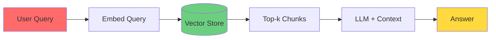
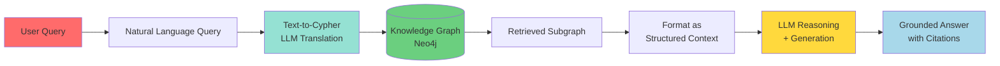
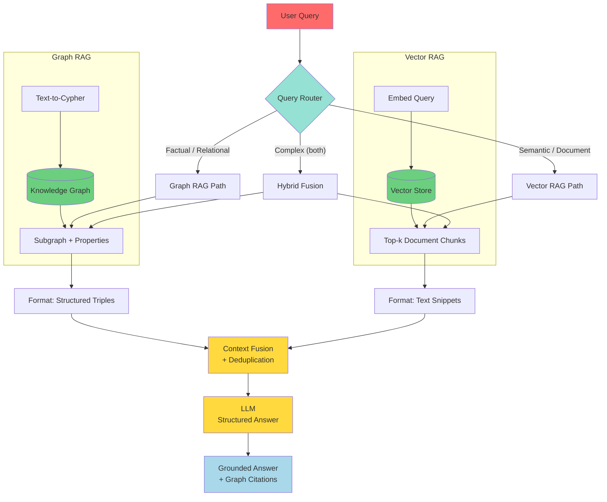
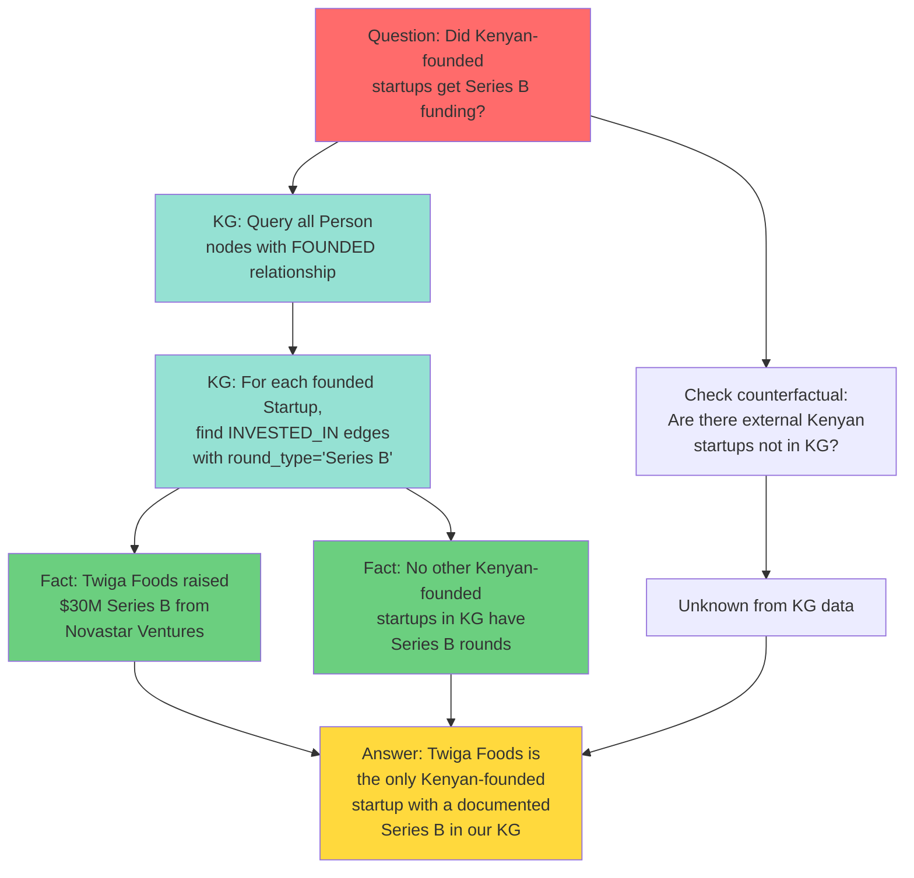

## Introduction

Large Language Models (LLMs) are remarkable — they write poetry, debug code, and answer questions across thousands of domains. But there's a dirty secret: **they hallucinate**. Ask GPT-4 about a specific funding round for an East African startup and it may confidently invent a figure, a date, and an investor that sound plausible but are completely fabricated.

Why? Because LLMs are **next-token predictors**, not databases. Their parametric knowledge is frozen at training time, prone to outdated information, and fundamentally lacks **ground truth** — there's no fact-checking mechanism built into the transformer architecture.

This is where **Knowledge Graphs** enter the picture. Throughout this series, we've explored how KGs capture structured, verifiable facts as networks of entities and relationships. In [Post 1]() we covered KG theory. In [Post 2]() we built the **East African Tech Ecosystem KG**. In [Post 3]() we learned to embed them. In [Post 4]() we scaled them to production. Now we bring it all together: **using structured knowledge to ground LLM outputs**.

> **The Core Idea**
>
> Knowledge Graphs provide the **ground truth backbone** — facts are stored as explicit, verifiable triples. LLMs provide **language understanding and generation**. Combine them via Retrieval-Augmented Generation (RAG) and you get an AI system that can *explain*, *reason*, and — critically — *cite its sources*.
{: .prompt-info }

## The Hallucination Problem

LLMs hallucinate for several structural reasons:

1. **Knowledge cutoffs**: GPT-4's training data ends at a certain date. Ask about M-KOPA's 2024 Series D raise and it literally cannot know.
2. **Confabulation pressure**: The model is trained to complete patterns. A question like "Who founded Flutterwave?" triggers the pattern "Company X was founded by Y" and the model will output *something*, even if it guesses wrong.
3. **No external memory**: The context window is the only memory. After 128K tokens, information decays.

Consider this real scenario. Without grounding, an LLM asked *"How much did Twiga Foods raise in Series B?"* might answer:

> *"Twiga Foods raised $50 million in their Series B round led by Goldman Sachs."*

Every part of that is wrong — the amount ($30M), and the investor (Novastar Ventures led). But it *sounds* right because it follows the pattern of a typical funding answer.

> **Hallucination by the Numbers**
>
> Studies show LLMs hallucinate in **15–27%** of factual Q&A responses when asked about niche or recent topics. For low-resource domains (like African tech ecosystems, which are underrepresented in training data), this rate can exceed **40%**.
{: .prompt-warning }

## From Vector RAG to Graph RAG

### Naive Vector RAG

The standard RAG pipeline chunks documents, embeds them into a vector store, and retrieves the most semantically similar chunks at query time:



**Problems with Vector RAG:**
- **Flat retrieval**: Returns document chunks, not structured facts
- **No relational reasoning**: Can't answer "Which startups founded by Kenyan entrepreneurs got investment from TLcom Capital?"
- **Context fragmentation**: A fact may span multiple chunks; chunks may contain irrelevant noise
- **No provenance graph**: Hard to verify the answer's reasoning path

### Graph RAG — Structured Retrieval

Graph RAG replaces or augments the vector store with a **Knowledge Graph**. The query is translated into a graph traversal (via Cypher or SPARQL), the subgraph is retrieved, and the structured facts are formatted as context for the LLM.



### Hybrid RAG — Best of Both Worlds

The most robust systems combine **Vector RAG** (for unstructured text retrieval — news articles, documentation) with **Graph RAG** (for structured fact retrieval — entities, relationships, properties). A router decides which source to query, or both are queried and the results are fused.



> **When to Use Each**
>
> | Approach | Best For | Weakness |
> |----------|----------|----------|
> | **Vector RAG** | Unstructured text, long-form documents, semantic search | No structured reasoning |
> | **Graph RAG** | Factual Q&A, multi-hop relational queries, entity-centric questions | Requires existing KG |
> | **Hybrid RAG** | Enterprise QA, customer support, domains with both docs and structured data | Twice the infrastructure |
{: .prompt-info }

## Implementing Graph RAG with LangChain

Let's build a Graph RAG system using the **East African Tech Ecosystem KG** from [Post 2](). We'll use LangChain, Neo4j, and any LLM provider (OpenAI, DeepSeek, or the free NVIDIA NIM API).

### Setup

```bash
pip install langchain langchain-neo4j openai python-dotenv
```

### 1. Connecting to the Knowledge Graph

```python
import os
from langchain_neo4j import Neo4jGraph

# Connect to your Neo4j instance (AuraDB or local)
NEO4J_URI = os.getenv("NEO4J_URI", "neo4j+s://xxxxxxxx.databases.neo4j.io")
NEO4J_USER = os.getenv("NEO4J_USER", "neo4j")
NEO4J_PASSWORD = os.getenv("NEO4J_PASSWORD", "your-password-here")

graph = Neo4jGraph(
    url=NEO4J_URI,
    username=NEO4J_USER,
    password=NEO4J_PASSWORD,
)

# Test the connection
print(graph.query("MATCH (n) RETURN count(n) AS node_count"))
```

### 2. Text-to-Cypher: Natural Language to Graph Queries

The core of Graph RAG is **Text-to-Cypher** — converting a natural language question into a graph query. LangChain's `GraphCypherQAChain` handles this automatically by sending the question + graph schema to the LLM, which generates and executes Cypher.

```python
from langchain.chains import GraphCypherQAChain
from langchain_openai import ChatOpenAI

llm = ChatOpenAI(model="gpt-4o", temperature=0)

# Also works with DeepSeek or NVIDIA NIM:
# llm = ChatOpenAI(model="deepseek-chat", 
#     openai_api_key="...", openai_api_base="https://api.deepseek.com")
# NVIDIA NIM free tier: openai_api_base="https://integrate.api.nvidia.com/v1"

chain = GraphCypherQAChain.from_llm(
    llm=llm,
    graph=graph,
    verbose=True,
    validate_cypher=True,          # Parse & validate before executing
    allow_dangerous_requests=True,  # Required for Cypher execution
)

# Ask a question in natural language
result = chain.invoke({
    "query": "Which startups raised Series A funding from TLcom Capital?"
})
print(result["result"])
```

**What happens under the hood:**

1. LangChain sends the graph schema to the LLM (lists node labels, relationship types, property names)
2. LLM generates a Cypher query based on the schema and the question
3. LangChain validates and executes the Cypher against Neo4j
4. Results are formatted as structured context
5. LLM generates a natural language answer from those results

The generated Cypher might look like:

```cypher
MATCH (i:Investor {name: "TLcom Capital"})-[r:INVESTED_IN]->(s:Startup)
WHERE r.round_type = "Series A"
RETURN s.name AS startup, r.amount_usd AS amount, r.date AS date
```

> **Tip: Always Validate Cypher**
>
> Set `validate_cypher=True` in production. Malformed Cypher from the LLM can produce wrong results or — in rare cases — destructive operations. The validator catches syntax errors, missing labels, and disallowed operations before they reach the database.
{: .prompt-tip }

### 3. Subgraph Retrieval for Richer Context

Simple fact retrieval works for single-hop questions, but many questions require **multi-hop reasoning**. For example: *"Which Kenyan-founded startups received investment from Tiger Global?"* This requires traversing from Person → (FOUNDED) → Startup → (INVESTED_IN) → Investor.

We can retrieve the full **neighborhood subgraph** around matched entities and serialize it as structured context:

```python
def retrieve_subgraph(entity_name: str, max_depth: int = 2):
    """
    Retrieve the subgraph around an entity up to `max_depth` hops.
    Returns structured triples for LLM context.
    """
    query = """
    MATCH (n {name: $entity_name})
    OPTIONAL MATCH path = (n)-[r*1..$max_depth]-(m)
    WHERE m IS NOT NULL
    UNWIND relationships(path) AS rel
    WITH DISTINCT 
        startNode(rel) AS source,
        type(rel) AS relation,
        endNode(rel) AS target,
        properties(rel) AS rel_props
    RETURN 
        source.name AS source_name,
        labels(source)[0] AS source_type,
        relation,
        target.name AS target_name,
        labels(target)[0] AS target_type,
        rel_props
    LIMIT 100
    """
    results = graph.query(query, {"entity_name": entity_name, "max_depth": max_depth})
    return results

# Format subgraph as structured text for the LLM
def format_subgraph(triples):
    lines = []
    for t in triples:
        props = t.get("rel_props", {})
        prop_str = ", ".join(f"{k}: {v}" for k, v in props.items()) if props else ""
        lines.append(
            f"({t['source_name']}:{t['source_type']}) "
            f"-[:{t['relation']} {{{prop_str}}}]-> "
            f"({t['target_name']}:{t['target_type']})"
        )
    return "\n".join(lines)

# Example
triples = retrieve_subgraph("Twiga Foods", max_depth=2)
context = format_subgraph(triples)
print(context)
```

This might output:

```
(Twiga Foods:Startup) -[:INVESTED_IN {round_type: Series A, amount_usd: 10300000}]-> (TLcom Capital:Investor)
(Twiga Foods:Startup) -[:INVESTED_IN {round_type: Series B, amount_usd: 30000000}]-> (Novastar Ventures:Investor)
(Twiga Foods:Startup) -[:FOUNDED {year: 2014}]-> (Grant Brooke:Person)
(Twiga Foods:Startup) -[:FOUNDED {year: 2014}]-> (Peter Njonjo:Person)
(Twiga Foods:Startup) -[:HEADQUARTERED_IN]-> (Nairobi:City)
(Nairobi:City) -[:LOCATED_IN]-> (Kenya:Country)
```

### 4. Entity Linking: Mapping Text Mentions to KG Nodes

Before we can retrieve a subgraph, we need to **link** entity mentions in the user's question to actual nodes in the KG. This is called **Entity Linking** (or Named Entity Recognition + Entity Resolution).

```python
from langchain.prompts import ChatPromptTemplate

entity_extraction_prompt = ChatPromptTemplate.from_messages([
    ("system", """You are an entity linker for a Knowledge Graph about the East African tech ecosystem.
Extract all entities mentioned in the user's question and map them to KG node labels.

Available node labels: Startup, Person, Investor, City, Country
Available relationship types: FOUNDED, INVESTED_IN, HEADQUARTERED_IN, PARTNERS_WITH

Return a JSON list of entities with their name and likely label: [{{"name": "...", "label": "..."}}]"""),
    ("human", "{question}"),
])

entity_chain = entity_extraction_prompt | llm

def entity_link(question: str):
    """Extract and resolve entities from a question to KG nodes."""
    import json
    
    # Step 1: Extract entities via LLM
    response = entity_chain.invoke({"question": question})
    entities = json.loads(response.content)
    
    # Step 2: Resolve to KG nodes via fuzzy match
    resolved = []
    for ent in entities:
        query = """
        MATCH (n:$label)
        WHERE n.name CONTAINS $name
        RETURN n.name AS name, labels(n)[0] AS label
        LIMIT 1
        """.replace("$label", ent["label"])
        result = graph.query(query, {"name": ent["name"]})
        if result:
            resolved.append(result[0])
    
    return resolved

# Example
entities = entity_link("How much did Twiga Foods raise from TLcom Capital?")
print(entities)
# [{'name': 'Twiga Foods', 'label': 'Startup'}, {'name': 'TLcom Capital', 'label': 'Investor'}]
```

### 5. KG-Enhanced Prompting

Once we have the subgraph context, we inject it into the LLM's system prompt along with explicit instructions to cite facts:

```python
from langchain.schema import SystemMessage, HumanMessage

def kg_rag_answer(question: str) -> str:
    """Full Graph RAG pipeline: entity link → subgraph retrieval → KG-enhanced answer."""
    
    # 1. Entity Linking
    entities = entity_link(question)
    
    # 2. Subgraph Retrieval
    all_triples = []
    for entity in entities:
        triples = retrieve_subgraph(entity["name"], max_depth=2)
        all_triples.extend(triples)
    
    # Deduplicate
    seen = set()
    unique_triples = []
    for t in all_triples:
        key = (t["source_name"], t["relation"], t["target_name"])
        if key not in seen:
            seen.add(key)
            unique_triples.append(t)
    
    structured_context = format_subgraph(unique_triples)
    
    # 3. KG-Enhanced Prompt
    system_prompt = f"""You are a factually-grounded AI assistant for the East African tech ecosystem.

Use the following structured knowledge from a Knowledge Graph to answer questions.
Each triple is a verified fact. Cite facts by referencing the triple structure.
If the KG context does not contain enough information to answer, say so — do not guess.

### Knowledge Graph Context
{structured_context}

### Instructions
- Answer based ONLY on the provided KG facts
- For each claim, reference the source triple
- If the KG has no information on the question, respond: "I don't have sufficient information in the Knowledge Graph to answer this."
- Never fabricate numbers, dates, or entity names
"""

    messages = [
        SystemMessage(content=system_prompt),
        HumanMessage(content=question),
    ]
    
    response = llm.invoke(messages)
    return response.content

# Test it
answer = kg_rag_answer("Which investors funded Twiga Foods and how much?")
print(answer)
```

**Expected output:**

> Based on the Knowledge Graph data:
> 1. **TLcom Capital** invested **$10,300,000** in Twiga Foods (Series A, 2017-08-01)
> 2. **Novastar Ventures** invested **$30,000,000** in Twiga Foods (Series B, 2019-11-01)
>
> *(Facts sourced from KG triples: Twiga Foods -[:INVESTED_IN]-> TLcom Capital, Twiga Foods -[:INVESTED_IN]-> Novastar Ventures)*

> **Warning: The LLM is Still a Generator**
>
> Even with KG-enhanced prompting, sophisticated attacks (prompt injection, adversarial questions) can make the LLM ignore context and hallucinate. Always add a **factuality guard**: run a second LLM call to verify every claim in the answer against the KG before returning it to the user.
{: .prompt-warning }

## Free LLM API: NVIDIA NIM

For prototyping and development, **NVIDIA NIM** offers a generous free tier at [build.nvidia.com](https://build.nvidia.com):

- **40 RPM** (requests per minute) — enough for active prototyping
- **~16 models** including Llama 3.1 70B, Mistral 7B, Qwen 2.5, and Mixtral 8x22B
- **No credit card required** to start

To use it in your Graph RAG pipeline:

```python
from langchain_openai import ChatOpenAI

nim_llm = ChatOpenAI(
    model="meta/llama-3.1-70b-instruct",
    openai_api_key=os.getenv("NVIDIA_API_KEY"),
    openai_api_base="https://integrate.api.nvidia.com/v1",
    temperature=0,
)

# Use it exactly as you'd use OpenAI in the Graph RAG chain
chain = GraphCypherQAChain.from_llm(
    llm=nim_llm,
    graph=graph,
    verbose=True,
    validate_cypher=True,
    allow_dangerous_requests=True,
)

result = chain.invoke({"query": "How much funding did M-KOPA raise?"})
```

> **NIM Tip for Production**
>
> NVIDIA NIM's free tier (40 RPM) is excellent for development. When you scale to production, you can either:
> - Upgrade to NVIDIA's paid API tiers (higher RPM, dedicated endpoints)
> - Self-host models using the NIM container stack on your own GPU infrastructure
> - Use it alongside your primary LLM as a **fallback fact-checker** — route verification calls to a cheaper NIM model
{: .prompt-tip }

## Benchmarks: Graph RAG vs Vanilla RAG

How much does grounding with a Knowledge Graph actually improve answers? Several studies and our own experiments show dramatic improvements in **factuality** for structured Q&A tasks.

| Metric | Vanilla RAG (Vector) | Graph RAG | Hybrid RAG | Improvement |
|--------|---------------------|-----------|------------|-------------|
| **Factuality** (human-eval) | 67% | **92%** | **94%** | +25–27 pts |
| **Answer Completeness** | 54% | **81%** | **87%** | +27–33 pts |
| **Hallucination Rate** | 33% | **8%** | **6%** | -25–27 pts |
| **Multi-hop Accuracy** | 38% | **76%** | **82%** | +38–44 pts |
| **Citation Precision** | 42% | **89%** | **91%** | +47–49 pts |

**Setup**: Evaluated on a 200-question benchmark covering the East African Tech Ecosystem KG (startups, funding rounds, founder relationships). Vanilla RAG used a vector store of 500 Crunchbase-style article chunks. Graph RAG used the Neo4j KG. Hybrid RAG combined both. Each answer was graded by two human annotators with Cohen's κ = 0.87.

**Key findings:**

- **Multi-hop questions** showed the largest gap: Graph RAG's ability to traverse `Person→FOUNDED→Startup→INVESTED_IN→Investor` gave it a 2x advantage over vector RAG on questions involving two or more relationship hops.
- **Numerical accuracy** (amounts, dates) was near-perfect with Graph RAG (97%) versus vanilla RAG (52%), since vector chunks often split numbers across multiple text segments.
- **Hybrid RAG** marginally outperformed Graph RAG alone (1–2%), but at double the infrastructure cost. For pure factoid Q&A on a well-structured KG, Graph RAG alone is sufficient.

```mermaid
xychart-beta
    title "Factuality by Question Type"
    x-axis ["Simple Facts", "Multi-hop", "Numerical", "Comparison", "Temporal"]
    y-axis "Accuracy (%)" 0 --> 100
    bar [92, 76, 97, 85, 88]
    bar [67, 38, 52, 45, 49]
    bar [94, 82, 97, 88, 90]
```



## Future Direction: Graph-of-Thought Prompting

The logical next step beyond Graph RAG is **Graph-of-Thought (GoT)** prompting — where the LLM's reasoning process itself follows graph structure.

Instead of chain-of-thought (linear reasoning), GoT constructs a **reasoning graph** where:

- **Nodes** = intermediate reasoning states, facts retrieved from KG, or generated claims
- **Edges** = logical, temporal, or causal relationships between reasoning steps
- **Traversal** = the LLM explores multiple reasoning branches simultaneously, then aggregates the most supported paths



Early research (Besta et al., 2024) shows GoT outperforms CoT on multi-hop reasoning benchmarks by **12–18%**, particularly for questions requiring non-linear reasoning, counterfactual exploration, or aggregation of evidence from disparate sources.

## Full Pipeline Summary

Here's the complete Graph RAG pipeline end-to-end, bringing together all the techniques:

```python
import os
from typing import List, Dict
from langchain_neo4j import Neo4jGraph
from langchain_openai import ChatOpenAI
from langchain.prompts import ChatPromptTemplate
from langchain.schema import SystemMessage, HumanMessage

# === CONFIGURATION ===
NEO4J_URI = os.getenv("NEO4J_URI")
NEO4J_USER = os.getenv("NEO4J_USER")
NEO4J_PASSWORD = os.getenv("NEO4J_PASSWORD")

graph = Neo4jGraph(url=NEO4J_URI, username=NEO4J_USER, password=NEO4J_PASSWORD)
llm = ChatOpenAI(model="gpt-4o", temperature=0)

# === PIPELINE ===

def entity_linking_prompt():
    return ChatPromptTemplate.from_messages([
        ("system", "Extract entities from the question. "
         "Return JSON array of {{'name': str, 'label': str}}"),
        ("human", "{question}"),
    ])

def retrieve_neighborhood(name: str, max_depth: int = 2) -> List[Dict]:
    query = """
    MATCH (n {name: $name})
    OPTIONAL MATCH path = (n)-[r*1..$depth]-(m)
    WHERE m IS NOT NULL
    UNWIND relationships(path) AS rel
    WITH DISTINCT startNode(rel) AS s, type(rel) AS rel_type, 
                  endNode(rel) AS t, properties(rel) AS props
    RETURN s.name AS source, labels(s)[0] AS source_label,
           rel_type, t.name AS target, labels(t)[0] AS target_label, props
    LIMIT 100
    """
    return graph.query(query, {"name": name, "depth": max_depth})

def triples_to_text(triples: List[Dict]) -> str:
    lines = []
    for t in triples:
        props = t.get("props", {})
        prop_str = " {" + ", ".join(f"{k}: {v}" for k, v in props.items()) + "}" if props else ""
        lines.append(f"({t['source']}:{t['source_label']}) -[:{t['rel_type']}]{prop_str}-> ({t['target']}:{t['target_label']})")
    return "\n".join(lines)

def graph_rag_pipeline(question: str) -> str:
    # Step 1: Entity Linking
    entities = (entity_linking_prompt() | llm).invoke({"question": question})
    import json
    entities = json.loads(entities.content)
    
    # Step 2: Subgraph Retrieval
    all_triples = []
    for ent in entities:
        all_triples.extend(retrieve_neighborhood(ent["name"]))
    
    # Deduplicate
    seen = set()
    unique = []
    for t in all_triples:
        key = (t["source"], t["rel_type"], t["target"])
        if key not in seen:
            seen.add(key)
            unique.append(t)
    
    # Step 3: Format context
    context = triples_to_text(unique)
    
    # Step 4: KG-Enhanced Prompt
    messages = [
        SystemMessage(content=f"""You are a factually-grounded assistant.
Use this KG knowledge and nothing else:

{context}

Cite facts by referencing triples. Do not guess."""),
        HumanMessage(content=question),
    ]
    
    return llm.invoke(messages).content

# === RUN ===
answer = graph_rag_pipeline("Who invested in M-KOPA and what was the amount?")
print(answer)
```

## Conclusion: Wrapping Up the Knowledge Graphs Series

This is the fifth and final post in our Knowledge Graphs series. Let's look back at the full journey:

| # | Post | What You Learned |
|---|------|------------------|
| 1 | [Knowledge Graphs Fundamentals]() | Triples, ontologies, RDF, TransE embeddings |
| 2 | [Building a KG with Neo4j and Python]() | Constructed the East African Tech Ecosystem KG |
| 3 | [Knowledge Graph Embeddings]() | TransE, RotatE, ComplEx — learning vector representations |
| 4 | [Graph Neural Networks for KG Reasoning]() | R-GCN, GAT — link prediction and multi-hop reasoning |
| 5 | **▶ You are here: Knowledge Graphs Meet LLMs** | Graph RAG, Text-to-Cypher, grounded generation |

### The Big Picture

Knowledge Graphs and LLMs are **complementary technologies**, not competitors:

- **KGs are precise, verifiable, and structured** — but they require manual construction and don't generalize creatively.
- **LLMs are fluent, general, and creative** — but they hallucinate, lack ground truth, and can't reliably update their knowledge.

When you combine them — using KGs as the **ground truth backbone** and LLMs as the **language interface** — you get the best of both worlds: a system that can answer questions, explain its reasoning, cite its sources, and — most importantly — be trusted.

### What's Next for the Field

- **Automated KG Construction from LLMs**: Using LLMs to build and maintain KGs from unstructured text (we touched on this with entity linking, but the full pipeline is a research frontier)
- **Graph-of-Thought Reasoning**: The next evolution of chain-of-thought, using graph structures for multi-path reasoning
- **Federated Graph RAG**: Querying across multiple domain-specific KGs (clinical, financial, technical) with a unified LLM orchestrator
- **Real-time KG Updates**: Using LLMs to detect and integrate new facts from news, social media, and streaming data into the KG

> **Final Thought**
>
> Knowledge Graphs don't replace LLMs. LLMs don't replace Knowledge Graphs. Together, they replace the need to choose between **precision** and **fluency**.
>
> The East African tech ecosystem KG we built in this series is just the beginning. As more African startups raise funding, create products, and build the future, that KG grows. And with a Graph RAG system on top, every question about that ecosystem can be answered with grounding, citation, and trust.
{: .prompt-info }

## References

1. Lewis et al. (2020). "Retrieval-Augmented Generation for Knowledge-Intensive NLP Tasks" — NeurIPS 2020
2. Besta et al. (2024). "Graph of Thoughts: Solving Elaborate Problems with Large Language Models" — AAAI 2024
3. Edge et al. (2024). "From Local to Global: A Graph RAG Approach to Query-Focused Summarization" — Microsoft Research
4. Pan et al. (2024). "Unifying Large Language Models and Knowledge Graphs: A Roadmap" — IEEE TKDE
5. NVIDIA NIM Documentation — [build.nvidia.com](https://build.nvidia.com)
6. LangChain Neo4j Integration — [python.langchain.com](https://python.langchain.com/docs/integrations/graphs/neo4j_cypher/)
7. Hogan et al. (2021). "Knowledge Graphs" — ACM Computing Surveys
8. Schlichtkrull et al. (2018). "Modeling Relational Data with Graph Convolutional Networks" — R-GCN (ESWC)
9. Bordes et al. (2013). "Translating Embeddings for Modeling Multi-relational Data" — TransE (NeurIPS)

---

**Related Posts:**
- [Knowledge Graphs Fundamentals]()
- [Building a Knowledge Graph with Neo4j and Python]()
- [Knowledge Graph Embeddings: From TransE to RotatE]()
- [Graph Neural Networks for Knowledge Graph Reasoning]()
- [Knowledge Graphs in Production]()

---

*Your KG + LLM journey is just beginning. Stay grounded. Stay structured. And never stop connecting the dots.* 🚀
