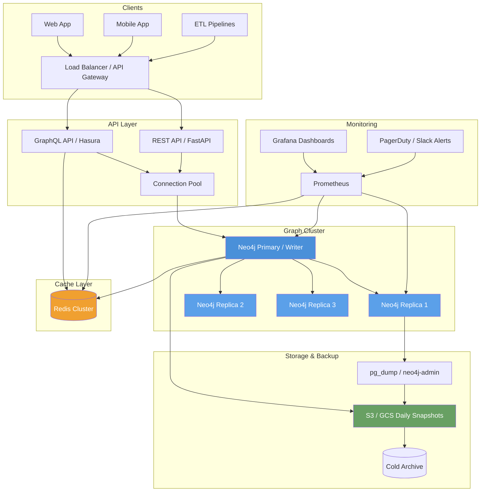

## Introduction

You built a Knowledge Graph. It works beautifully on your laptop — 10,000 nodes, 50,000 edges, crisp Cypher queries, and a Streamlit dashboard that makes you look like a data wizard at demo day.

Then your organization decides to put it in production. Suddenly your 10K nodes become 100 million. Your laptop's 16 GB of RAM is a joke. The query that took 50ms now takes 50 seconds. Users start complaining. Your Neo4j process OOMs during the nightly ETL pipeline.

Welcome to the gap between **prototype KG** and **production KG**.

This post is the fourth in our Knowledge Graphs series. We covered [KG fundamentals](), [built a Neo4j KG from scratch](), and [applied GNNs for reasoning](). Now we graduate to production — where the rubber meets the graph.

> **What This Post Covers**  
> We'll walk through database selection, sharding strategies, indexing, caching, versioning, API design, monitoring, and cost analysis — everything you need to take a KG from prototype to production. Code examples use the `neo4j` Python driver and are adaptable to Neptune and JanusGraph.
{: .prompt-info }

## Production Architecture Overview

Before diving into specifics, let's look at the target architecture for a production KG deployment.



This architecture separates concerns cleanly: a stateless API layer, a replicated graph cluster for read scaling, Redis for hot-path caching, and a robust backup pipeline. We'll unpack each component below.

## Choosing Your Production Graph Database

### Neo4j (Self-Hosted vs AuraDB)

Neo4j dominates the graph DB space for good reason: mature Cypher support, indexing, clustering, and excellent tooling.

**Self-hosted Neo4j** gives you full control. You run Neo4j Community or Enterprise Edition on your own infrastructure. Community is free but lacks clustering (no replicas, no read scaling). Enterprise adds Causal Clustering — a primary node for writes and up to dozens of read replicas.

```bash
# Neo4j Enterprise Docker setup with clustering
docker run \
  --name neo4j-primary \
  -p 7474:7474 -p 7687:7687 \
  -e NEO4J_AUTH=neo4j/strong-password-here \
  -e NEO4J_dbms_mode=CORE \
  -e NEO4J_causal__clustering_initial__discovery__members=neo4j-primary:5000,neo4j-replica1:5000 \
  -e NEO4J_dbms_memory_pagecache_size=4G \
  -e NEO4J_dbms_memory_heap_max__size=8G \
  neo4j:enterprise
```

**Neo4j AuraDB** is fully managed — automatic backups, scaling, patching. The Professional tier (≈$0.75/hr) gives you a single node, while Enterprise tiers ($3+/hr) add read replicas. The tradeoff is cost and vendor lock-in, but you save a DevOps team.

### Amazon Neptune

Neptune is a fully-managed graph database supporting both **property graph** (Gremlin) and **RDF** (SPARQL) models. It auto-scales storage up to 128 TiB across three AZs — no manual sharding.

```python
# Neptune connection with IAM authentication
from gremlin_python.driver import client, serializer

def get_neptune_client(endpoint: str, port: int = 8182) -> client.Client:
    return client.Client(
        f'wss://{endpoint}:{port}/gremlin',
        'g',
        message_serializer=serializer.GraphSONSerializersV3d0()
    )
```

Neptune shines for **RDF workloads** where SPARQL is the query language of choice. It's pricier than self-hosted Neo4j (~$0.25/hr for db.r6g.large, plus storage at $0.10/GB-month) but offers near-zero ops overhead.

### JanusGraph

JanusGraph is an open-source, **distributed graph database** designed for graphs with **billions of edges**. It decouples storage, indexing, and caching — using Cassandra/ScyllaDB for storage, Elasticsearch for indexing, and a configurable cache layer.

```yaml
# janusgraph-server.yaml — storage backend config
storage.backend: cassandra
storage.hostname: 10.0.1.10,10.0.1.11,10.0.1.12
storage.cassandra.keyspace: mlkenya_kg

index.search.backend: elasticsearch
index.search.hostname: 10.0.2.10,10.0.2.11
index.search.elasticsearch.client-only: true

cache.db-cache: true
cache.db-cache-clean-wait: 20
cache.db-cache-time: 180000
```

JanusGraph is the right choice when your KG exceeds **10 billion edges** and you need massive horizontal scalability. The cost is operational complexity — you're running Cassandra + Elasticsearch + JanusGraph servers.

### ArangoDB

ArangoDB is a **multi-model** database (graph, document, key-value). Its native graph engine supports traversals with `GRAPH_NEIGHBORS` and `SHORTEST_PATH` via AQL.

ArangoDB excels when your application needs **graph + document + search** in one system — e.g., a product catalog where products are documents and recommendations are graph edges. It avoids schema mismatch between services.

> **Which One Should You Pick?**  
> - **Small KG (< 10M nodes)**: Neo4j Community edition, single node.  
> - **Medium KG (10M–500M)**: Neo4j Enterprise (self-hosted or AuraDB).  
> - **RDF-heavy production**: Amazon Neptune.  
> - **Massive KG (1B+ edges)**: JanusGraph on Cassandra.  
> - **Multi-model needs**: ArangoDB.  
{: .prompt-tip }

## Sharding Strategies for Large KGs

Graphs are notoriously hard to shard. A single traversal hop can cross any partition boundary, turning distributed queries into network nightmares.

### Strategy 1: Vertex-Cut Partitioning

Each vertex is stored on exactly one partition; edges are replicated across partitions when their endpoints differ. This is what **JanusGraph + Cassandra** does under the hood. The benefit: fast vertex lookups. The cost: edge replication overhead.

### Strategy 2: Edge-Cut Partitioning

Edges are assigned to partitions; vertices are replicated across the partitions that own their incident edges. Used by **Neo4j Fabric** (Neo4j 4.0+). Queries that cross partitions pay a serialization cost, but edge traversal within a partition is fast.

### Strategy 3: Domain-Aware Sharding

This is the strategy you want. Partition your graph by **business domain**:

- **Geographic**: East African startups → partition 1, West African → partition 2
- **Temporal**: 2015–2020 data → partition 1, 2020–2025 → partition 2
- **Entity type**: Companies → partition 1, People → partition 2, Funding Events → partition 3

```python
# Domain-aware shard routing in Neo4j Fabric
sharding_rules = {
    "east_africa": {
        "database": "kg_east_africa",
        "predicate": "n.country IN ['Kenya', 'Tanzania', 'Uganda']"
    },
    "west_africa": {
        "database": "kg_west_africa",
        "predicate": "n.country IN ['Nigeria', 'Ghana']"
    },
    "southern_africa": {
        "database": "kg_southern_africa",
        "predicate": "n.country IN ['South Africa', 'Botswana']"
    }
}
```

This matches real-world query patterns: 90% of queries touch a single region. Cross-region queries become rare, well-defined operations.

> **Warning: Avoid Random Sharding**  
> Random hash-based sharding destroys graph locality. Every query becomes a distributed query. The worst-case scenario: a 6-hop traversal across 7 partitions, each hop paying network latency. Use domain-aware or labeled partitions instead.
{: .prompt-warning }

## Indexing Strategies

Without proper indexes, even a 50M-node KG becomes unusable in seconds.

### Property Indexes (Neo4j)

Always index the properties you filter on. In Cypher:

```cypher
CREATE INDEX startup_name_index FOR (n:Startup) ON (n.name);
CREATE INDEX founded_year_index FOR (n:Startup) ON (n.founded_year);
CREATE INDEX investor_name_index FOR (n:Investor) ON (n.name);
```

### Composite Indexes (Neo4j 5+)

For queries filtering on multiple properties:

```cypher
CREATE COMPOSITE INDEX startup_industry_country FOR (n:Startup)
ON (n.industry, n.country);
```

This powers queries like `MATCH (s:Startup {industry: 'FinTech', country: 'Kenya'})` in a single index seek instead of two separate scans.

### Full-Text Search

Neo4j's `db.index.fulltext.createNodeIndex` enables keyword search across node properties:

```cypher
CREATE FULLTEXT INDEX startup_search FOR (n:Startup) ON EACH [n.name, n.description, n.bio];
```

Then query with:

```cypher
CALL db.index.fulltext.queryNodes('startup_search', 'mobile money ~') YIELD node, score
RETURN node.name, score
ORDER BY score DESC
LIMIT 10;
```

The `~` enables fuzzy matching — critical when users mistype "M-PESA" as "MPESA".

### Elasticsearch + JanusGraph Indexing

For JanusGraph, the indexing backend is separate from the storage backend:

```groovy
// JanusGraph management system index creation
mgmt = graph.openManagement()
name = mgmt.makePropertyKey('name').dataType(String.class).make()
mgmt.buildIndex('startupByName', Vertex.class)
    .addKey(name)
    .buildMixedIndex('search')
mgmt.commit()
```

## Caching Layer: Redis + Neo4j

Production KGs see **hot paths** — frequent queries for popular entities. M-KOPA, Flutterwave, or Safaricom might be queried 1,000x more often than an obscure 2016 seed-stage startup. Cache the hot paths.

```python
import redis
import json
from neo4j import GraphDatabase

class CachedKnowledgeGraph:
    """Graph client with Redis caching for hot-path queries."""

    def __init__(self, neo4j_uri: str, neo4j_auth: tuple, redis_url: str):
        self.driver = GraphDatabase.driver(neo4j_uri, auth=neo4j_auth)
        self.cache = redis.from_url(redis_url)
        self.cache_ttl = 300  # 5 minutes

    def _cache_key(self, query: str, params: dict) -> str:
        return f"kg:query:{hash(query + json.dumps(params, sort_keys=True))}"

    def get_startup_and_investors(self, startup_name: str):
        """Hot-path query: get a startup and its investors, cached."""
        params = {"name": startup_name}
        cache_key = self._cache_key(
            "MATCH (s:Startup {name: $name})-[r:INVESTED_IN]->(s) RETURN s, r, i",
            params
        )

        # Check cache first
        cached = self.cache.get(cache_key)
        if cached:
            return json.loads(cached)

        # Execute query
        with self.driver.session() as session:
            result = session.run(
                """
                MATCH (s:Startup {name: $name})
                OPTIONAL MATCH (i:Investor)-[:INVESTED_IN]->(s)
                RETURN s.name AS startup,
                       s.industry AS industry,
                       collect(DISTINCT i.name) AS investors,
                       count(i) AS investor_count
                """,
                params
            )
            records = [dict(r) for r in result]

        # Cache for next time
        self.cache.setex(cache_key, self.cache_ttl, json.dumps(records))
        return records

    def close(self):
        self.driver.close()
        self.cache.close()
```

Redis Cluster with at least 3 nodes is recommended for production. Use Redis `EXPIRE` to set TTLs — stale data is worse than slow data.

## Versioning and Temporal KGs

Knowledge evolves. A startup that was "active" in 2022 might be "acquired" in 2024. You can't just UPDATE in place — you need temporal queries.

### BITemporal Pattern

Store **valid time** (when the fact was true in the real world) and **transaction time** (when it was stored in the database):

```cypher
CREATE (reliance:Startup {
    name: "Reliance Industries",
    industry: "Conglomerate",
    founded_year: 1966,
    valid_from: datetime("2020-01-01T00:00:00Z"),
    valid_to: datetime("2023-07-15T00:00:00Z"),
    created_at: datetime(),
    superseded_at: null
});

CREATE (jio:Startup {
    name: "Jio Platforms",
    industry: "Telecom",
    founded_year: 2015,
    valid_from: datetime("2023-07-16T00:00:00Z"),
    valid_to: datetime("9999-12-31T00:00:00Z"),
    created_at: datetime(),
    superseded_at: null
});
```

Then query with temporal snapshots:

```cypher
MATCH (s:Startup)
WHERE s.valid_from <= datetime($query_date)
  AND (s.valid_to >= datetime($query_date) OR s.valid_to IS NULL)
  AND s.superseded_at IS NULL
RETURN s.name, s.industry, s.valid_from, s.valid_to
```

### Timeline Edge Versioning

Version each relationship too:

```cypher
MATCH (flutterwave:Startup {name: "Flutterwave"})
MATCH (tiger:Investor {name: "Tiger Global"})
CREATE (tiger)-[:INVESTED_IN {
    round: "Series C",
    amount_usd: 170000000,
    year: 2021,
    valid_from: datetime("2021-03-10T00:00:00Z"),
    valid_to: datetime("9999-12-31T00:00:00Z")
}]->(flutterwave);
```

You can now query the state of your KG at any point in time — invaluable for audit trails, retroactive analysis, and ML training sets.

## Bulk Loading Millions of Triples

Loading 100 million triples via individual `CREATE` statements takes weeks. Use Neo4j's `neo4j-admin import` tool or `LOAD CSV` with periodic commit for bulk loads.

### Method 1: `neo4j-admin import` (Cold Start)

```bash
# Export your triples as CSV headers + data files
# nodes.csv:
# startupId:ID,name,industry,:LABEL
neo4j-admin database import full \
  --nodes=/data/startups.csv \
  --nodes=/data/investors.csv \
  --relationships=/data/investments.csv \
  --delimiter="," \
  --skip-duplicate-nodes=true \
  neo4j
```

This is the fastest method — can load 50M nodes in under 10 minutes.

### Method 2: `LOAD CSV` with Periodic Commit (Hot Load)

```cypher
:auto USING PERIODIC COMMIT 5000
LOAD CSV WITH HEADERS FROM 'file:///investments.csv' AS row
MATCH (s:Startup {id: row.startup_id})
MATCH (i:Investor {id: row.investor_id})
CREATE (i)-[:INVESTED_IN {
    amount: toInteger(row.amount),
    year: toInteger(row.year),
    round: row.round
}]->(s);
```

### Method 3: Python Bulk Writer (For Streaming)

```python
from neo4j import GraphDatabase
from typing import Iterator, Dict

class BulkKGLoader:
    """Batch-write triples using UNWIND with parameterized queries."""

    BATCH_SIZE = 5000

    def __init__(self, uri: str, auth: tuple):
        self.driver = GraphDatabase.driver(uri, auth=auth)

    def load_triples(self, triple_stream: Iterator[Dict]):
        """Load triples in batches of 5000 using UNWIND."""
        batch = []
        for i, triple in enumerate(triple_stream, 1):
            batch.append(triple)
            if len(batch) >= self.BATCH_SIZE:
                self._write_batch(batch)
                batch = []

        if batch:
            self._write_batch(batch)

    def _write_batch(self, batch: list):
        """Write a single batch via UNWIND for maximum throughput."""
        with self.driver.session() as session:
            session.run(
                """
                UNWIND $batch AS row
                MATCH (h:Entity {id: row.head_id})
                MATCH (t:Entity {id: row.tail_id})
                CALL apoc.merge.relationship(
                    h,
                    row.relation,
                    {source: row.source, confidence: row.confidence},
                    {},
                    t,
                    {source: row.source}
                ) YIELD rel
                RETURN count(*) AS created
                """,
                batch=batch
            )

    def close(self):
        self.driver.close()

# Usage
loader = BulkKGLoader("bolt://localhost:7687", ("neo4j", "password"))
loader.load_triples(stream_of_triples())  # ~500K triples/min on standard hardware
```

> **Performance Tip**  
> Use `UNWIND` instead of individual `CREATE` statements. A single `UNWIND $batch AS row ...` with 5000 rows is 50-100x faster than 5000 individual queries. Always use `apoc.merge.relationship` (APOC plugin) to avoid creating duplicate edges.
{: .prompt-tip }

## Connection Pooling

Never create a new driver connection per request. Neo4j's Python driver has built-in connection pooling — but you must use it correctly.

```python
from neo4j import GraphDatabase
from contextlib import contextmanager

class GraphConnectionPool:
    """Singleton connection pool for Neo4j."""

    _instance = None

    def __new__(cls, uri: str, auth: tuple, max_connections: int = 50):
        if cls._instance is None:
            cls._instance = super().__new__(cls)
            cls._instance.driver = GraphDatabase.driver(
                uri,
                auth=auth,
                max_connection_pool_size=max_connections,
                connection_acquisition_timeout=60,
                max_transaction_retry_time=30
            )
        return cls._instance

    @contextmanager
    def session(self):
        """Context manager for safe session handling."""
        session = self.driver.session()
        try:
            yield session
        finally:
            session.close()

    def close(self):
        self.driver.close()

# Usage in FastAPI
pool = GraphConnectionPool("bolt://cluster:7687", ("neo4j", "secret"))

@contextmanager
def get_graph():
    with pool.session() as session:
        yield session
```

Key pooling parameters:
- `max_connection_pool_size`: 50 for most workloads; monitor connection churn.
- `connection_acquisition_timeout`: Kill clients that wait too long for a connection.
- `max_transaction_retry_time`: Neo4j auto-retries on transient failures (leader re-election, etc.).

## Query Optimization with EXPLAIN / PROFILE

Before you optimize, measure. Neo4j's `EXPLAIN` and `PROFILE` commands reveal the query plan.

```cypher
// EXPLAIN shows the plan without executing
EXPLAIN
MATCH (s:Startup {name: "Flutterwave"})
MATCH (s)<-[:INVESTED_IN]-(i:Investor)
MATCH (i)-[:INVESTED_IN]->(other:Startup)
RETURN other.name, count(i) AS common_investors
ORDER BY common_investors DESC
LIMIT 10;

// PROFILE executes and shows real metrics
PROFILE
MATCH (s:Startup {name: "Flutterwave"})
MATCH (s)<-[:INVESTED_IN]-(i:Investor)
MATCH (i)-[:INVESTED_IN]->(other:Startup)
RETURN other.name, count(i) AS common_investors
ORDER BY common_investors DESC
LIMIT 10;
```

**Reading the profile output** (key metrics in the `db hits` column):
- **NodeByLabelScan**: Scanning all nodes — needs an index
- **Expand(All)**: Traversal step — check if it's filtering early
- **Filter**: Post-filtering — move predicates into MATCH clauses
- **db hits / rows**: Ratio > 100 means you're doing a cartesian product somewhere

### Common Optimization Patterns

**1. Avoid cartesian products:** Use `MATCH` sequentially instead of comma-separated:

```cypher
// BAD — creates cartesian product before filtering
MATCH (s:Startup), (i:Investor)
WHERE s.country = i.country

// GOOD — builds relationships first
MATCH (s:Startup)-[:INVESTED_IN]-(i:Investor)
WHERE s.country = i.country
```

**2. Use `LIMIT` early:** Even in subqueries:

```cypher
MATCH (s:Startup {name: "Flutterwave"})
CALL {
    WITH s
    MATCH (s)<-[:INVESTED_IN]-(i:Investor)
    RETURN i
    ORDER BY i.portfolio_size DESC
    LIMIT 5
}
RETURN i.name, i.firm
```

**3. Parameterize everything:** Neo4j caches query plans for parameterized queries:

```cypher
// BAD — new plan cached for each startup name
MATCH (s:Startup {name: "Flutterwave"})

// GOOD — cached plan reused
MATCH (s:Startup {name: $startup_name})
```

## Monitoring Production KGs

### Neo4j Metrics to Watch

| Metric | What It Tells You | Alert Threshold |
|--------|-------------------|-----------------|
| Page cache hits | Are you using the page cache effectively? | < 95% hit rate |
| Heap usage | Memory pressure | > 80% of max heap |
| Transaction log size | Write pressure / replication lag | > 10 GB |
| Query execution time (p99) | User-facing latency | > 500ms |
| Open connections | Connection pool saturation | > 80% of max |
| Checkpoint time | Full GC / I/O pressure | > 5 seconds |

### Prometheus + Grafana Setup

```yaml
# prometheus.yml — scrape Neo4j metrics endpoint
scrape_configs:
  - job_name: 'neo4j'
    metrics_path: '/metrics'
    scheme: 'http'
    static_configs:
      - targets:
        - 'neo4j-primary:2004'
        - 'neo4j-replica1:2004'
        - 'neo4j-replica2:2004'
```

Enable the Neo4j metrics exporter:

```bash
# neo4j.conf
server.metrics.enabled=true
server.metrics.prometheus.enabled=true
server.metrics.prometheus.endpoint=0.0.0.0:2004
server.metrics.filter=*bolt*,*dbms*,*neo4j*
```

### Query Profiling Dashboard

Build a dashboard tracking:
1. **Top 10 slowest queries** (by p99 latency)
2. **Cache hit ratio over time** (page cache + Redis)
3. **Replication lag** (transaction log size per replica)
4. **Failed transactions** (client retries, deadlocks)
5. **Storage growth rate** (predict when you need to add shards)

## Backup and Restore Strategies

| Strategy | Tool | RPO | RTO | Cost | Best For |
|----------|------|-----|-----|------|----------|
| `neo4j-admin dump` | CLI | Point-in-time | 30min–2hr | Free | Scheduled nightlies |
| `neo4j-admin backup` (Enterprise) | Built-in | 5min | 10min | License | High-availability |
| AWS EBS snapshots | AWS | 10min | 15min | $0.05/GB-month | Neptune / EC2 Neo4j |
| Cassandra snapshots + commit logs | nodetool | Seconds | 5min | Storage cost | JanusGraph |

### Automated Backup Script

```bash
#!/bin/bash
# nightly-neo4j-backup.sh — run via cron at 02:00

set -euo pipefail

BACKUP_DIR="/backups/neo4j"
DB_NAME="neo4j"
DATE=$(date +%Y-%m-%d-%H%M)
S3_BUCKET="s3://mlkenya-kg-backups"

echo "[$(date)] Starting backup of $DB_NAME"

# Online backup (Neo4j Enterprise)
neo4j-admin database backup \
  --from=bolt://localhost:7687 \
  --type=full \
  "$DB_NAME"

# Compress and upload
tar czf "$BACKUP_DIR/$DB_NAME-$DATE.tar.gz" /data/backups/$DB_NAME/
aws s3 cp "$BACKUP_DIR/$DB_NAME-$DATE.tar.gz" "$S3_BUCKET/daily/"

# Delete local backups older than 7 days
find "$BACKUP_DIR" -name "*.tar.gz" -mtime +7 -delete

# Keep only last 30 days in S3 (enforced via lifecycle policy)
echo "[$(date)] Backup complete: $DB_NAME-$DATE.tar.gz"
```

### Restore Drill

Test your restore monthly. Nothing is worse than discovering your backup is corrupted during an actual outage:

```bash
# Mount backup and start a temporary instance
neo4j-admin database load --from-path=/backups/neo4j/full-2026-05-01 neo4j

# Verify record count
cypher-shell "MATCH (n) RETURN count(n) AS node_count;"
cypher-shell "MATCH ()-[r]->() RETURN count(r) AS edge_count;"
```

## API Design: GraphQL vs REST

### REST API

Simple, cacheable, well-understood:

```python
from fastapi import FastAPI, HTTPException, Query
from neo4j import GraphDatabase

app = FastAPI()
driver = GraphDatabase.driver("bolt://cluster:7687", auth=("neo4j", "secret"))

@app.get("/api/v1/startups/{name}")
async def get_startup(name: str):
    """Get a startup and its investors."""
    with driver.session() as session:
        result = session.run(
            """
            MATCH (s:Startup {name: $name})
            OPTIONAL MATCH (s)<-[r:INVESTED_IN]-(i:Investor)
            RETURN s {.name, .industry, .founded_year} AS startup,
                   collect(DISTINCT i {.name, .firm}) AS investors
            """,
            name=name
        )
        record = result.single()
        if not record:
            raise HTTPException(status_code=404, detail="Startup not found")
        return {"data": record.data()}

@app.get("/api/v1/startups/{name}/competitors")
async def get_competitors(
    name: str,
    max_distance: int = Query(2, ge=1, le=4)
):
    """Find indirect competitors via shared investors."""
    with driver.session() as session:
        result = session.run(
            """
            MATCH (s:Startup {name: $name})
            MATCH (s)<-[:INVESTED_IN*..$max_distance]-(other:Startup)
            WHERE other.name <> $name
            RETURN other.name AS competitor,
                   count(*) AS connection_strength
            ORDER BY connection_strength DESC
            LIMIT 20
            """,
            name=name, max_distance=max_distance
        )
        return {"data": [dict(r) for r in result]}
```

### GraphQL API

Better for complex, nested graph queries:

```graphql
type Startup {
  name: String!
  industry: String
  foundedYear: Int
  investors: [Investor!]!
  competitors(maxDistance: Int = 2): [Startup!]!
}

type Investor {
  name: String!
  firm: String
  portfolio: [Startup!]!
}

type Query {
  startup(name: String!): Startup
  searchStartups(query: String!, limit: Int = 10): [Startup!]!
}
```

**When to use which:**
- **REST**: Simple CRUD, mobile apps, cache-heavy workloads (CDN caching on GET endpoints)
- **GraphQL**: Complex graph traversals, multiple entity types in one request, federated graphs

**The hybrid approach**: Use REST for bulk/simple endpoints and GraphQL (via Hasura or Apollo) for the graph exploration interface. This gives you CDN-cacheable hot paths with a flexible query layer for power users.

## Cost Analysis

| Setup | Monthly Cost | Throughput | Storage | Best For |
|-------|-------------|------------|---------|----------|
| Neo4j Community (1x m6g.xlarge) | $120–150 | 5K QPS | 500 GB | Dev/Staging, < 10M nodes |
| Neo4j Enterprise (3x r6g.2xlarge) | $800–1,200 | 50K QPS | 4 TB | Production, 10M–500M nodes |
| Neo4j AuraDB Professional | $540–1,080 | 10K QPS | 32 GB | Small prod, no DevOps |
| Neo4j AuraDB Enterprise | $2,160–5,400 | 100K QPS | 4 TB | Enterprise prod |
| Amazon Neptune (3x r6g.large) | $600–900 | 30K QPS | 128 TB (auto) | RDF workloads |
| JanusGraph + 3x Cassandra + 3x ES | $1,500–2,500 | 200K+ QPS | 50 TB+ | 1B+ edges |
| ArangoDB (3x c5.2xlarge) | $700–1,000 | 40K QPS | 10 TB | Multi-model |

Costs estimated for AWS US-East-1 (on-demand). Reserved instances / savings plans reduce costs by 30–60%. Self-hosted Neo4j adds ~$15K/year per Enterprise license.

> **Optimization Tip**  
> If your read:write ratio is > 20:1 (typical for production KGs), consider using **read replicas aggressively**. One primary writer + 3 read replicas can handle 4x the read traffic at only 50% cost increase vs. a single oversized writer.
{: .prompt-tip }

## Production Readiness Checklist

Before you click "Deploy to Production":

- [ ] **Database selection**: Neo4j, Neptune, JanusGraph, or ArangoDB based on graph size, model, and ops capacity
- [ ] **Connection pooling**: Singleton driver with max 50 connections, retry timeouts configured
- [ ] **Indexes created**: Property indexes on all filtered attributes, full-text search, composite indexes
- [ ] **Sharding strategy**: Domain-aware partitions; validate query patterns hit one shard at a time
- [ ] **Caching**: Redis cluster for hot paths; set TTLs; cache invalidation on writes via pub/sub
- [ ] **Bulk loading path**: UNWIND batches of 5,000; APOC installed for merge operations
- [ ] **Temporal versioning**: BITemporal model with `valid_from`/`valid_to` on nodes and edges
- [ ] **Query profiling**: EXPLAIN/PROFILE all production queries; no full scans, no cartesian products
- [ ] **Backup schedule**: Daily full backup + S3 lifecycle; monthly restore drill; verify checksums
- [ ] **Monitoring**: Prometheus + Grafana with dashboards for latency, cache hit rate, replication lag
- [ ] **API layer**: REST for hot paths (CDN-cacheable), GraphQL for exploration; rate limiting at 100 req/sec
- [ ] **Cost budget**: Track per-query cost; unexpected query growth == unplanned spend

## What's Next

Production deployment isn't the end of the journey — it's where the real work begins. In our next and final post in this series, we'll explore the intersection of **Knowledge Graphs and Large Language Models (LLMs)** — using LLMs to build KGs from unstructured text, query KGs with natural language, and combine graph reasoning with transformer-based retrieval.

Stay tuned for [Knowledge Graphs Meet LLMs]() — the final post in this series.
