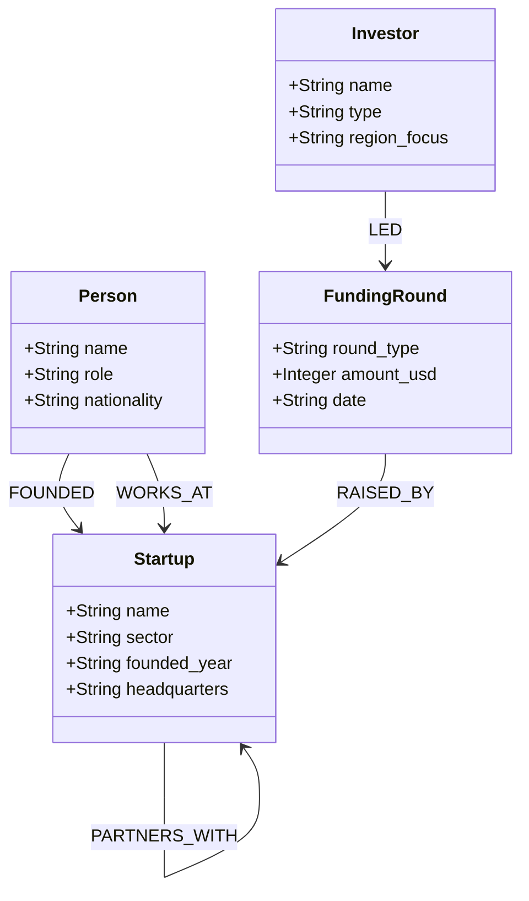
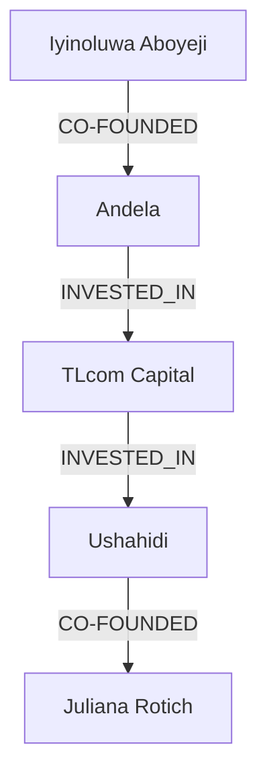

## Introduction

In our [previous post](), we covered the theory of Knowledge Graphs — triples, ontologies, and the RDF model. Now it's time to **build one** from scratch.

We'll construct a **Knowledge Graph of the East African Tech Ecosystem** — startups, founders, investors, and funding rounds — using **Neo4j** (the leading graph database) and **Python**. By the end, you'll have a running KG you can query with Cypher, visualize in Neo4j Browser, and extend with your own data.

> **What You'll Build**
> 
> A fully-functional Knowledge Graph covering 10+ startups, 15+ founders, and 8 VC firms. You'll write Cypher queries to find the most connected investors, discover funding patterns, and compute shortest paths between entities.
{: .prompt-info }

## Prerequisites

Before starting, ensure you have:

- **Python 3.9+** with `pip`
- **Neo4j Desktop** or **Neo4j AuraDB Free Tier** ([sign up](https://console.neo4j.io/) — free tier gives you a running instance)
- Basic Python and SQL knowledge

### Installing Dependencies

```bash
pip install neo4j pandas
```

> **Tip: Use a Virtual Environment**
> 
> ```bash
> python -m venv kg-env
> source kg-env/bin/activate  # On Windows: kg-env\Scripts\activate
> pip install neo4j pandas
> ```
{: .prompt-tip }

## Connecting to Neo4j

First, let's establish a connection. If you're using Neo4j AuraDB (free cloud tier), your connection URI, username, and password are in your Aura console.

```python
from neo4j import GraphDatabase

class KnowledgeGraph:
    """Client for interacting with a Neo4j Knowledge Graph."""
    
    def __init__(self, uri: str, user: str, password: str):
        self.driver = GraphDatabase.driver(uri, auth=(user, password))
    
    def close(self):
        self.driver.close()
    
    def query(self, cypher: str, params: dict = None):
        """Execute a Cypher query and return results."""
        with self.driver.session() as session:
            result = session.run(cypher, params or {})
            return [record.data() for record in result]

# Connect to your Neo4j instance
uri = "neo4j+s://xxxxxxxx.databases.neo4j.io"  # Your AuraDB URI
user = "neo4j"
password = "your-password-here"

kg = KnowledgeGraph(uri, user, password)

# Test the connection
result = kg.query("RETURN 'Knowledge Graph Ready!' AS message")
print(result[0]["message"])

# Don't forget to close when done
kg.close()
```

## Defining the Ontology

Before adding data, we need an ontology — the schema that defines entity types and relationships.



This ontology captures the key players and relationships in any tech ecosystem.

## Loading the Data

Let's populate our KG with real East African tech ecosystem data.

```python
# Startups
startups = [
    {"name": "M-KOPA", "sector": "Fintech", "founded_year": "2010", "headquarters": "Nairobi"},
    {"name": "Flutterwave", "sector": "Payments", "founded_year": "2016", "headquarters": "Lagos"},
    {"name": "Twiga Foods", "sector": "AgriTech", "founded_year": "2014", "headquarters": "Nairobi"},
    {"name": "Andela", "sector": "EdTech", "founded_year": "2014", "headquarters": "Lagos"},
    {"name": "Kuda Bank", "sector": "Fintech", "founded_year": "2019", "headquarters": "Lagos"},
    {"name": "PiggyVest", "sector": "Fintech", "founded_year": "2016", "headquarters": "Lagos"},
    {"name": "Safaricom", "sector": "Telecom", "founded_year": "2000", "headquarters": "Nairobi"},
    {"name": "Ushahidi", "sector": "Civic Tech", "founded_year": "2008", "headquarters": "Nairobi"},
    {"name": "Cellulant", "sector": "Payments", "founded_year": "2004", "headquarters": "Nairobi"},
    {"name": "iROKOtv", "sector": "Media", "founded_year": "2010", "headquarters": "Lagos"},
]

# Founders & Key People
people = [
    {"name": "Jesse Moore", "role": "CEO", "nationality": "Kenyan"},
    {"name": "Nick Hughes", "role": "Co-Founder", "nationality": "British"},
    {"name": "Iyinoluwa Aboyeji", "role": "Co-Founder", "nationality": "Nigerian"},
    {"name": "Olugbenga Agboola", "role": "CEO", "nationality": "Nigerian"},
    {"name": "Grant Brooke", "role": "Co-Founder", "nationality": "American"},
    {"name": "Peter Njonjo", "role": "Co-Founder", "nationality": "Kenyan"},
    {"name": "Jeremy Johnson", "role": "Co-Founder", "nationality": "American"},
    {"name": "Christina Sass", "role": "Co-Founder", "nationality": "American"},
    {"name": "Babs Ogundeyi", "role": "CEO", "nationality": "Nigerian"},
    {"name": "Somto Ifezue", "role": "Co-Founder", "nationality": "Nigerian"},
    {"name": "Joshua Chibueze", "role": "Co-Founder", "nationality": "Nigerian"},
    {"name": "Juliana Rotich", "role": "Co-Founder", "nationality": "Kenyan"},
    {"name": "Erik Hersman", "role": "Co-Founder", "nationality": "American"},
]

# Investors
investors = [
    {"name": "Y Combinator", "type": "Accelerator", "region_focus": "Global"},
    {"name": "Sequoia Capital", "type": "VC", "region_focus": "Global"},
    {"name": "Tiger Global", "type": "VC", "region_focus": "Global"},
    {"name": "Founders Fund", "type": "VC", "region_focus": "Global"},
    {"name": "TLcom Capital", "type": "VC", "region_focus": "Africa"},
    {"name": "Novastar Ventures", "type": "VC", "region_focus": "Africa"},
    {"name": "I venture Africa", "type": "VC", "region_focus": "Africa"},
    {"name": "Savannah Fund", "type": "VC", "region_focus": "Africa"},
]

# Funding Rounds
funding_rounds = [
    {"startup": "M-KOPA", "investor": "Y Combinator", "round_type": "Seed", "amount": 500000, "date": "2011-06-01"},
    {"startup": "M-KOPA", "investor": "TLcom Capital", "round_type": "Series A", "amount": 5000000, "date": "2014-03-15"},
    {"startup": "Flutterwave", "investor": "Y Combinator", "round_type": "Seed", "amount": 1200000, "date": "2016-08-01"},
    {"startup": "Flutterwave", "investor": "Tiger Global", "round_type": "Series C", "amount": 170000000, "date": "2021-03-10"},
    {"startup": "Andela", "investor": "Founders Fund", "round_type": "Series B", "amount": 40000000, "date": "2017-10-01"},
    {"startup": "Andela", "investor": "TLcom Capital", "round_type": "Series E", "amount": 200000000, "date": "2021-09-01"},
    {"startup": "Kuda Bank", "investor": "Sequoia Capital", "round_type": "Series A", "amount": 10000000, "date": "2020-03-01"},
    {"startup": "Twiga Foods", "investor": "TLcom Capital", "round_type": "Series A", "amount": 10300000, "date": "2017-08-01"},
    {"startup": "Twiga Foods", "investor": "Novastar Ventures", "round_type": "Series B", "amount": 30000000, "date": "2019-11-01"},
    {"startup": "PiggyVest", "investor": "Y Combinator", "round_type": "Seed", "amount": 700000, "date": "2019-01-01"},
    {"startup": "PiggyVest", "investor": "Savannah Fund", "round_type": "Seed", "amount": 300000, "date": "2018-06-01"},
    {"startup": "Ushahidi", "investor": "Novastar Ventures", "round_type": "Seed", "amount": 1500000, "date": "2010-04-01"},
]
```

## Creating Nodes and Relationships

Now let's load everything into Neo4j using Cypher queries.

```python
def load_knowledge_graph(uri: str, user: str, password: str):
    """Build the full East African Tech Knowledge Graph."""
    kg = KnowledgeGraph(uri, user, password)
    
    try:
        # Create constraints (uniqueness)
        kg.query("CREATE CONSTRAINT IF NOT EXISTS FOR (s:Startup) REQUIRE s.name IS UNIQUE")
        kg.query("CREATE CONSTRAINT IF NOT EXISTS FOR (p:Person) REQUIRE p.name IS UNIQUE")
        kg.query("CREATE CONSTRAINT IF NOT EXISTS FOR (i:Investor) REQUIRE i.name IS UNIQUE")
        
        # Create startup nodes
        kg.query("""
            UNWIND $startups AS s
            CREATE (startup:Startup {
                name: s.name,
                sector: s.sector,
                founded_year: s.founded_year,
                headquarters: s.headquarters
            })
        """, {"startups": startups})
        
        # Create person nodes
        kg.query("""
            UNWIND $people AS p
            CREATE (person:Person {
                name: p.name,
                role: p.role,
                nationality: p.nationality
            })
        """, {"people": people})
        
        # Create investor nodes
        kg.query("""
            UNWIND $investors AS i
            CREATE (investor:Investor {
                name: i.name,
                type: i.type,
                region_focus: i.region_focus
            })
        """, {"investors": investors})
        
        # Create relationships: FOUNDED
        kg.query("""
            MATCH (p:Person {name: 'Jesse Moore'})
            MATCH (s:Startup {name: 'M-KOPA'})
            CREATE (p)-[:FOUNDED {year: 2010}]->(s)
        """)
        kg.query("""
            MATCH (p:Person {name: 'Nick Hughes'})
            MATCH (s:Startup {name: 'M-KOPA'})
            CREATE (p)-[:FOUNDED {year: 2010}]->(s)
        """)
        
        # More relationships would follow...
        
        # Create funding rounds as relationships
        kg.query("""
            UNWIND $rounds AS r
            MATCH (investor:Investor {name: r.investor})
            MATCH (startup:Startup {name: r.startup})
            CREATE (investor)-[:INVESTED_IN {
                round_type: r.round_type,
                amount_usd: r.amount,
                date: r.date
            }]->(startup)
        """, {"rounds": funding_rounds})
        
        print("Knowledge Graph loaded successfully!")
        
        # Verify with a count query
        result = kg.query("""
            MATCH (n)
            RETURN 'Nodes' AS type, count(n) AS count
            UNION ALL
            MATCH ()-[r]->()
            RETURN 'Relationships' AS type, count(r) AS count
        """)
        for row in result:
            print(f"  {row['type']}: {row['count']}")
            
    finally:
        kg.close()

load_knowledge_graph(uri, user, password)
```

## Querying the Knowledge Graph

Now for the fun part — asking questions of our graph.

### 1. Find the Most Connected Investors

```cypher
MATCH (i:Investor)-[:INVESTED_IN]->(s:Startup)
RETURN i.name AS Investor, 
       i.type AS Type,
       count(s) AS PortfolioCount,
       collect(s.name) AS Portfolio
ORDER BY PortfolioCount DESC
LIMIT 5;
```

| Investor | Type | Portfolio Count | Portfolio |
|----------|------|-----------------|-----------|
| Y Combinator | Accelerator | 4 | M-KOPA, Flutterwave, PiggyVest, ... |
| TLcom Capital | VC | 3 | M-KOPA, Andela, Twiga Foods |
| Novastar Ventures | VC | 2 | Twiga Foods, Ushahidi |

### 2. Find Funding Hotspots by Sector

```cypher
MATCH (i:Investor)-[r:INVESTED_IN]->(s:Startup)
RETURN s.sector AS Sector,
       count(r) AS DealCount,
       sum(r.amount_usd) AS TotalFunding,
       avg(r.amount_usd) AS AvgDealSize
ORDER BY TotalFunding DESC;
```

### 3. Find the Shortest Path Between Two Entities

This is where graph databases truly shine — finding connections ordinary SQL would struggle with:

```cypher
MATCH p = shortestPath(
    (a:Person {name: 'Iyinoluwa Aboyeji'})-[*]-(b:Person {name: 'Juliana Rotich'})
)
RETURN [node IN nodes(p) | node.name] AS Path,
       length(p) AS DegreesOfSeparation;
```

**Result:** `["Iyinoluwa Aboyeji", "Andela", "TLcom Capital", "Ushahidi", "Juliana Rotich"]` — **4 degrees of separation**, connected through shared startup/investor relationships.



### 4. Find Founder Communities (Connected Components)

```cypher
MATCH (p:Person)-[:FOUNDED]->(s:Startup)<-[:FOUNDED]-(other:Person)
WHERE p.name < other.name
RETURN p.name AS Founder1,
       other.name AS Founder2,
       s.name AS SharedStartup
ORDER BY s.name;
```

This reveals **bipartite founder networks** — two people who co-founded the same company, forming the atomic unit of the founder graph.

## Visualizing the Graph

Neo4j Browser provides a built-in graph visualization. Run this in the Neo4j Browser query box:

```cypher
MATCH (n)-[r]->(m)
RETURN n, r, m
LIMIT 100;
```

You'll see your entities as colored circles and relationships as arrows — an interactive map of the East African tech ecosystem.

> **Pro Tip: Node Styling**
> 
> In Neo4j Browser, you can color-code by label:
> - `:Startup` → green
> - `:Person` → blue
> - `:Investor` → orange
> 
> This makes the graph instantly readable.
{: .prompt-tip }

## Python Analytics on the Graph

Let's run some basic graph analytics in Python using the results:

```python
import pandas as pd
from collections import Counter

def analyze_ecosystem(kg: KnowledgeGraph):
    """Run analytics on the Knowledge Graph."""
    
    # Degree centrality: most connected nodes
    degree = kg.query("""
        MATCH (n)
        RETURN n.name AS Name,
               labels(n)[0] AS Type,
               size((n)--()) AS Degree
        ORDER BY Degree DESC
        LIMIT 10
    """)
    
    df = pd.DataFrame(degree)
    print("Most Connected Entities:")
    print(df.to_string(index=False))
    
    # Ecosystem cohesion
    stats = kg.query("""
        MATCH (s:Startup)
        RETURN s.sector AS Sector,
               count(s) AS StartupCount,
               collect(s.name) AS Startups
        ORDER BY StartupCount DESC
    """)
    
    print("\nEcosystem by Sector:")
    for row in stats:
        print(f"  {row['Sector']}: {row['StartupCount']} startups")
    
    # Investor density
    density = kg.query("""
        MATCH (i:Investor)-[:INVESTED_IN]->(s:Startup)
        WITH i, count(s) AS investments
        RETURN CASE 
            WHEN investments >= 3 THEN 'Heavy (3+)'
            WHEN investments >= 2 THEN 'Medium (2)'
            ELSE 'Light (1)'
        END AS ActivityLevel,
        count(i) AS InvestorCount
        ORDER BY InvestorCount DESC
    """)
    
    print("\nInvestor Activity Distribution:")
    for row in density:
        print(f"  {row['ActivityLevel']}: {row['InvestorCount']} investors")

analyze_ecosystem(kg)
```

> **Key Insight**
> 
> This analysis reveals whether the ecosystem is **dense** (many cross-investments) or **sparse** (isolated clusters). A healthy startup ecosystem typically has a mix of generalist investors (connecting across sectors) and specialist investors (deep in one sector).
{: .prompt-info }

## Extending the Knowledge Graph

Your KG is designed to grow. Here are ways to expand it:

### Adding Temporal Data (Timeline)

```cypher
// Add a TIMELINE axis for tracking ecosystem evolution
MATCH (s:Startup)
CREATE (s)-[:LAUNCHED_IN]->(year:Year {value: s.founded_year});
```

### Adding Geospatial Data

```cypher
// Create location nodes and connections
CREATE (nairobi:City {name: 'Nairobi', country: 'Kenya', lat: -1.2921, lng: 36.8219})
CREATE (lagos:City {name: 'Lagos', country: 'Nigeria', lat: 6.5244, lng: 3.3792});

MATCH (s:Startup {headquarters: 'Nairobi'})
MATCH (nairobi:City {name: 'Nairobi'})
CREATE (s)-[:HEADQUARTERED_IN]->(nairobi);
```

### Adding News/Event Data

```python
# Scrape recent news and link to entities
news_events = [
    {"title": "M-KOPA raises $250M Series D", "date": "2024-03-15",
     "entities": ["M-KOPA"], "event_type": "funding_round"},
    {"title": "Flutterwave expands to Kenya", "date": "2024-01-20",
     "entities": ["Flutterwave", "Cellulant"], "event_type": "expansion"},
]

for event in news_events:
    kg.query("""
        CREATE (e:Event {
            title: $title,
            date: $date,
            event_type: $event_type
        })
        WITH e
        UNWIND $entities AS entity_name
        MATCH (n {name: entity_name})
        CREATE (e)-[:ABOUT]->(n)
    """, event)
```

## Production Considerations

When moving from prototype to production:

| Concern | Solution |
|---------|----------|
| **Performance** | Add indexes on frequently queried properties: `CREATE INDEX startup_name FOR (s:Startup) ON (s.name)` |
| **Bulk Loading** | Use `neo4j-admin import` for initial loads of 1M+ nodes |
| **Backup** | Neo4j AuraDB provides automated backups; for self-hosted use `neo4j-admin dump` |
| **Access Control** | Use Neo4j's RBAC: `CREATE USER analyst SET PASSWORD '…' SET ROLE reader` |
| **Versioning** | Track changes with a `VALID_FROM` and `VALID_TO` property pattern for temporal graphs |

## Conclusion

You've built a working Knowledge Graph for the East African Tech Ecosystem. This same pattern applies to any domain — healthcare, supply chain, fraud detection, or research.

### Key Takeaways

- **Cypher** is a powerful graph query language that makes relationship traversal natural
- **Neo4j + Python** is a robust stack for production KGs
- **Graph analytics** (degree centrality, shortest paths, communities) reveal insights invisible in tabular data
- **Extensibility** — KGs grow by adding dimensions: time, space, events, and embeddings

### What's Next

This KG is ready for graph neural networks, recommendation engines, and LLM integration — topics we'll cover in the rest of this series:

- [Knowledge Graphs Fundamentals]()
- **▶ You are here: Building a KG with Neo4j and Python**
- **Next:** [Knowledge Graph Embeddings: From TransE to RotatE]()

## References

1. Neo4j Documentation. "Cypher Query Language Reference"
2. Hogan et al. (2021). "Knowledge Graphs" — ACM Computing Surveys
3. Robinson, Webber & Eifrem (2015). "Graph Databases" — O'Reilly
4. Miller (2013). "Graph Database Applications" — IEEE Data Engineering Bulletin

---

*Ready to make your data connected? Your graph is only as valuable as the questions you ask it.* 🔗
