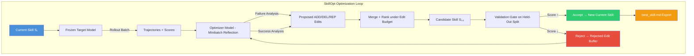
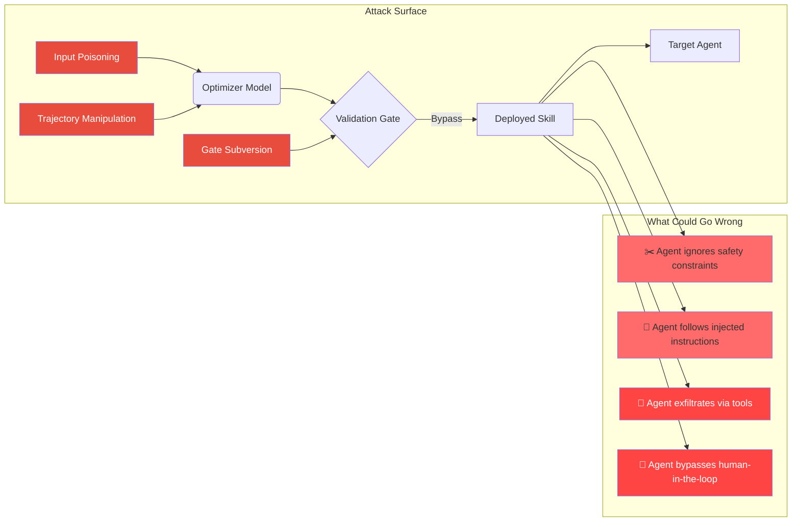

## Introduction

On May 22, 2026, a team of researchers from **Microsoft Research, Shanghai Jiao Tong University, Tongji University, and Fudan University** published a paper that quietly rewrote the rules for how AI agents learn. Titled *"SkillOpt: Executive Strategy for Self-Evolving Agent Skills"* (arXiv:2605.23904), it introduces something the field has been missing: **a deep-learning-style optimizer for agent skills that works entirely in natural language**.

Here's the core idea: instead of hand-crafting system prompts or hoping an agent figures things out on its own, SkillOpt treats a skill document — a plain Markdown file — as *trainable external state*. A separate frontier LLM acts as the optimizer, proposing bounded edits to the skill based on trajectory rollouts, validation gates, and an edit budget that acts like a textual learning rate.

> **The result?** Across 52 (model, benchmark, harness) evaluation cells — spanning 6 benchmarks, 7 target models, and 3 execution environments — SkillOpt is best or tied-best on **all 52**. On GPT-5.5 direct chat, it lifts average accuracy from 58.8% (no skill) to 82.3% — a **+23.5 point gain** from pure text edits.
{: .prompt-info }

In this post, we'll dissect how SkillOpt works, why it matters for AI security, and what happens when an AI system can rewrite its own operational playbook.

## The Problem: Today's Skills Are Hand-Crafted

Agent skills today fall into three categories, none of which is satisfactory:

| Approach | How It Works | Failure Mode |
|----------|-------------|--------------|
| **Hand-written** | Domain expert crafts a system prompt | Brittle, expensive, doesn't improve |
| **One-shot LLM** | Prompt "write a skill for X" | Generic, misses domain nuance |
| **Self-revision** | Agent reflects on its own failures | Unstable, can regress, no validation |

None of these behaves like a proper optimizer. A one-shot skill cannot improve from experience. Self-revision without validation can *degrade* performance — the agent confidently adds bad rules. As the SkillOpt authors put it:

> "Agent skills today are hand-crafted, generated one-shot, or evolved through loosely controlled self-revision — none of which behaves like a deep-learning optimizer for the skill, and none of which reliably improves over its starting point under feedback."
> — SkillOpt paper, Section 1

## The SkillOpt Architecture

SkillOpt reframes skill editing as a **controlled domain-adaptation process**. Here's the high-level loop:



The deep-learning analogy runs deep:

| Deep Learning Concept | SkillOpt Analogue | What It Does |
|----------------------|-------------------|--------------|
| Parameter | Skill document | External text state being optimized |
| Gradient direction | Trajectory-derived edit direction | What to add/delete/replace |
| Learning rate | Edit budget $L_t$ | Max edits per step |
| Batch size | Rollout batch | Evidence noise control |
| Minibatch | Reflection minibatch | Groups similar failures |
| Validation | Held-out selection gate | Accept only improving edits |
| Momentum | Epoch-wise slow/meta update | Carry durable patterns across epochs |
| Negative gradient | Rejected-edit buffer | What *not* to repeat |

### The Core Optimizer

The optimizer is a *separate frontier LLM* (not the target model being adapted). It receives scored execution trajectories and produces structured edits using a detailed prompt pipeline (reproduced from the paper's Appendix C):

```python
"""
Simplified SkillOpt Optimizer Prompt (from Appendix C.2.1)
================================================================
You are a skill editor analyzing agent trajectories.
You receive: (1) the current skill document,
(2) a batch of FAILURE trajectories with scores,
(3) a batch of SUCCESS trajectories with scores.

For FAILURE trajectories, identify recurring procedural errors.
Propose edits as a JSON list with operations: ADD, DELETE, REPLACE.

For SUCCESS trajectories, identify effective patterns to preserve.
Propose edits conservatively — only patterns missing from current skill.

Constraints:
- Maximum {budget} edits per step
- Do NOT modify the <!-- SLOW_UPDATE_START --> protected section
- Failure edits take priority over success edits
- Respond ONLY with valid JSON
"""
```

### Bounded Text Updates — The "Textual Learning Rate"

The most critical innovation is the **edit budget** $L_t$ — the maximum number of atomic edits (ADD, DELETE, REPLACE) allowed per optimization step. This is the textual analogue of a learning rate:

$$L_t = L_0 \cdot \text{schedule}(t)$$

SkillOpt supports constant, linear, cosine, and autonomous schedules. The default **cosine schedule** starts with larger edits (exploration) and decays toward smaller consolidation steps (convergence):

$$L_t = \left\lfloor L_0 \cdot \frac{1}{2}\left(1 + \cos\left(\frac{t\pi}{T}\right)\right) \right\rfloor$$

where $L_0$ is the initial budget, $t$ is the current step, and $T$ is the total steps.

> **Why this matters for security:** Unbounded self-revision is a chaotic process that can introduce arbitrary behaviors. A bounded edit budget ensures each revision stays close to the previous one. This is the difference between fine-tuning and randomly rewriting your operating system's kernel.
{: .prompt-warning }

### The Validation Gate

Every candidate skill is evaluated on a **held-out selection split** $D_{sel}$ before acceptance:

$$s^\star_{sel} = \arg\max_{s \in C(D_{tr})} \frac{1}{|D_{sel}|} \sum_{x \in D_{sel}} r(s)$$

Where $r(s) \in [0,1]$ is the target model's score with skill $s$. The gate:

- **Accepts** only if score improves over current best
- **Rejects** otherwise, storing the failure pattern in a rejected-edit buffer
- Exports only the best validated skill as `best_skill.md`

This turns reflection into **propose-and-test optimization** rather than unconditional self-editing.

```python
class SkillOptValidationGate:
    """Held-out selection gate for skill updates."""

    def __init__(self, target_model, harness, selection_split):
        self.model = target_model      # Frozen target LLM
        self.harness = harness          # Execution environment
        self.selection = selection_split  # Held-out data
        self.best_score = 0.0
        self.best_skill = None
        self.rejected_buffer = []

    def evaluate(self, skill_document: str) -> float:
        """Run target model on selection split with this skill."""
        total = 0.0
        for task in self.selection:
            _, score = self.harness.execute(
                self.model, task, skill_document
            )
            total += score
        return total / len(self.selection)

    def gate(self, candidate_skill: str) -> bool:
        """Accept or reject a candidate skill update."""
        score = self.evaluate(candidate_skill)
        if score > self.best_score:
            self.best_score = score
            self.best_skill = candidate_skill
            return True  # ACCEPT
        else:
            # Store rejected edit as negative feedback
            self.rejected_buffer.append({
                "skill": candidate_skill,
                "score": score,
                "best_score": self.best_score,
            })
            return False  # REJECT
```

## The Deep Benchmarks

The SkillOpt paper runs one of the largest empirical studies ever conducted for agent skill optimization:

| Benchmark | Domain | No Skill | SkillOpt | Gain |
|-----------|--------|----------|----------|------|
| **SearchQA** | Factual QA | 77.7 | **87.3** | +9.6 |
| **SpreadsheetBench** | Spreadsheet execution | 41.8 | **80.7** | +38.9 |
| **OfficeQA** | Office productivity | 33.1 | **72.1** | +39.0 |
| **DocVQA** | Document QA | 78.8 | **91.2** | +12.4 |
| **LiveMathematicianBench** | Live math | 37.6 | **66.9** | +29.3 |
| **ALFWorld** | Embodied decision-making | 83.6 | **95.5** | +11.9 |

Results from SkillOpt paper Table 1 (GPT-5.5, direct chat mode). All differences are statistically significant.

The benchmark covers **6 benchmarks, 7 target models** (from GPT-5.5 down to Qwen-2.5-7B), and **3 execution harnesses**: direct chat, Codex-style tool loops, and Claude Code-style tool loops. **Best or tied-best on 52/52 cells.**

## Security Implications: The Double-Edged Sword

> This is where we connect the dots back to our series on AI security. In [Insecure Agent Design](), we warned about *excessive agency* — giving AI tools it shouldn't have. SkillOpt introduces a new axis of risk: **self-modifying procedural knowledge**.
{: .prompt-danger }

### The Attack Surface

A self-evolving skill system has four distinct components that attackers could target:

1. **The optimizer model** — If compromised, could inject malicious rules into the skill
2. **The trajectory data** — Poisoned rollouts could teach the optimizer wrong patterns
3. **The validation gate** — If bypassed, harmful edits could be accepted
4. **The deployed skill** — The final `best_skill.md` could contain injected instructions



### What SkillOpt Gets Right (on Security)

The paper explicitly acknowledges auditability. Key quotes from the paper:

- **"A skill can be optimized once, audited as text, and reused across related models"** (line 186)
- **"A controlled and auditable procedure for producing a portable best_skill.md"** (line 414)
- **"Held-out gating prevents harmful proposals from accumulating"** (line 188)
- The output is **"compact (300–2,000 tokens), inspectable, and procedural rather than instance-specific"** (line 191-192)

This is actually a *strength* compared to weight-space optimization. A model fine-tune is a black box — you can't read what it learned. A SkillOpt skill is **plain Markdown** that a human can read and audit in minutes.

### What Still Worries Me

The paper is honest about limitations. Here's what keeps me up at night:

1. **The optimizer model is also a frontier LLM** — it could hallucinate edits or insert plausible-sounding but incorrect rules
2. **Validation gate fidelity** — the held-out split must perfectly represent the deployment distribution. If it doesn't, a skill that passes validation could fail catastrophically in production
3. **No adversarial testing** — the paper doesn't evaluate how SkillOpt behaves under prompt injection or data poisoning
4. **Transfer amplifies risk** — a compromised skill that passes validation can be *transferred across models and harnesses*, spreading the harm

> **The Observability Imperative**
> We covered this in [AI Agent Observability](): if you can't trace what your agent is doing, you can't secure it. SkillOpt skills are auditable *at rest*, but you still need runtime observability to catch behavioral drift in production. The two defenses are complementary: audit the skill before deployment, trace the agent during execution.
{: .prompt-tip }

## The MLSecOps Connection

Self-evolving skills are a new **supply chain** artifact. Just as we argued in [MLSecOps Pipeline Security]() that model weights need signing and verification, skill documents need:

| Security Control | Why It Matters for Skills |
|-----------------|--------------------------|
| **Signing** | Verify a skill hasn't been tampered with between optimization and deployment |
| **Version pinning** | Know exactly which skill version produced which agent behavior |
| **CI/CD validation** | Run gated tests on new skill proposals before deployment |
| **Change audit trail** | Every edit to the skill should be logged with optimizer rationale |
| **Rollback** | If a skill causes degradation, revert to the previous validated version |

```python
# Example: Skill document CI/CD pipeline
import hashlib
import json
from datetime import datetime


class SkillCIValidator:
    """Validates a skill document before deployment."""

    REQUIRED_SECTIONS = [
        "domain_purpose",
        "procedural_rules",
        "tool_policies",
        "output_constraints",
        "failure_modes",
    ]

    def validate_structure(self, skill_text: str) -> dict:
        """Check that skill has all required sections."""
        results = {"valid": True, "checks": []}
        for section in self.REQUIRED_SECTIONS:
            found = f"## {section}" in skill_text.lower()
            results["checks"].append({section: "✅" if found else "❌"})
            if not found:
                results["valid"] = False
        return results

    def validate_token_budget(self, skill_text: str, max_tokens: int = 2000) -> bool:
        """Skill must stay within deployable token budget."""
        tokens = len(skill_text.split())
        return tokens <= max_tokens

    def compute_checksum(self, skill_text: str) -> str:
        """For immutable audit trail."""
        return hashlib.sha256(skill_text.encode()).hexdigest()

    def generate_manifest(self, skill_text: str, skill_id: str) -> dict:
        """Generate deployment manifest with audit metadata."""
        return {
            "skill_id": skill_id,
            "sha256": self.compute_checksum(skill_text),
            "token_count": len(skill_text.split()),
            "validated_at": datetime.utcnow().isoformat(),
            "validator_version": "1.0.0",
        }
```

## What the Learned Skills Actually Look Like

One of the most striking findings in the paper is that **1–4 accepted edits** are often sufficient to achieve large gains. OfficeQA jumps from 33.1 to 72.1 (+39.0 points) with just a handful of edits. The learned skills remain compact — 300–2,000 tokens — and are purely procedural.

Example structure (from the paper's documentation):

```markdown
## domain_purpose
This skill guides the agent in answering office productivity questions.

## procedural_rules
1. When opening a spreadsheet, first read the column headers to understand layout.
2. For date-related questions, check for hidden time components in cells.
3. If a formula cell is referenced, recursively evaluate its dependencies.

## tool_policies
- Use read_range() for contiguous data; use read_cell() for individual lookups.
- Never write to cells unless explicitly instructed.

## output_constraints
- Answers must cite the specific cell or row reference used.
- For numerical answers, round to 2 decimal places and note precision.

## failure_modes
- If agent encounters a circular reference, report it rather than guessing.
- If cell value is empty, check for merged cells or hidden rows.
```

This is **readable by any developer with domain knowledge**. You can code-review a skill just like you'd review a pull request. That's the audit superpower.

## Key Takeaways

> SkillOpt represents a genuine breakthrough — the first systematic, controllable text-space optimizer for agent skills. But with every new capability comes a new class of security considerations. The good news: skill artifacts are the most auditable form of agent knowledge we've ever had. The bad news: we're only beginning to understand how attackers might subvert them.
{: .prompt-warning }

| Finding | Detail |
|---------|--------|
| **What it is** | First systematic text-space optimizer for agent skills (arXiv:2605.23904, Microsoft Research + SJTU + Tongji + Fudan, May 2026) |
| **How it works** | Frozen target model + separate optimizer LLM; bounded ADD/DEL/REP edits gated by validation |
| **Key innovation** | Edit budget as textual learning rate; rejected-edit buffer as negative feedback |
| **Empirical result** | Best/tied-best on **52/52** evaluation cells; +23.5 avg points on GPT-5.5 direct chat |
| **Audit upside** | Skills are plain Markdown (300–2,000 tokens), human-readable, code-reviewable |
| **Security risk** | Optimizer hallucination, validation gate bypass, poisoned trajectories, no adversarial testing in paper |
| **Defense pattern** | Signing + version pinning + CI/CD validation + runtime observability (see [AI Agent Observability]()) |
| **MLSecOps link** | Skills are a new supply chain artifact — needs same rigor as model weights (see [MLSecOps Pipeline Security]()) |

## References

1. Yifan Yang, Ziyang Gong, Weiquan Huang, Qihao Yang, Ziwei Zhou, Zisu Huang, Yan Li, Xuemei Gao, Qi Dai, Bei Liu, Kai Qiu, Yuqing Yang, Dongdong Chen, Xue Yang, Chong Luo. *"SkillOpt: Executive Strategy for Self-Evolving Agent Skills."* arXiv:2605.23904, May 2026. Microsoft Research, Shanghai Jiao Tong University, Tongji University, Fudan University. Code: https://aka.ms/SkillOpt
2. H. Zhang et al. *"EvoSkills: Self-Evolving Agent Skills via Co-Evolutionary Verification."* arXiv:2604.01687, 2026.
3. OWASP Top 10 for LLM Applications (2025) — LLM06: Excessive Agency
4. CVE-2023-36085 — LangChain SSRF vulnerability via `LLMMathChain`

---

*This post is part of the AI Security series. Previous entries: [Insecure Agent Design](), [AI Agent Observability](), [MLSecOps Pipeline Security]().*
