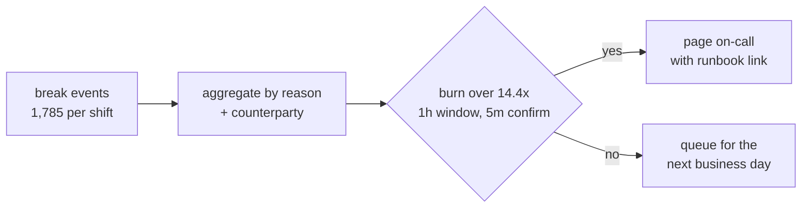

## The break has a clock, and it is not yours

On **20 September 2019** the Reserve Bank of India redefined what a reconciliation break *is*. Under its harmonised TAT framework (in force **15 October 2019**), if a customer is debited but the beneficiary is not credited, the beneficiary bank must auto-reverse by **T+1** — T+5 for merchant payments — or pay **₹100 per day per transaction**, credited **"suo moto, without waiting for a complaint or claim from the customer"** ([RBI](https://www.rbi.org.in/commonman/English/scripts/Notification.aspx?Id=3074)).

A customer-visible failure, a statutory deadline, a per-transaction penalty — and the customer removed from the detection loop: no ticket, no complaint, no error code tells you money is stuck. Only your reconciliation queue can find it, and only if that queue is *paged inside the clock*.

[Reconciliation analytics](/posts/reconciliation-analytics-fintech/), [anomaly detection](/posts/anomaly-detection-reconciliation/) and [outage post-mortems](/posts/fintech-outage-post-mortem/) already cover the detectors and the measurement. This post is the piece between them: money SLIs, burn-rate alerting, dedup, the page budget, the runbook, and the forced sweep after a restart.

## Integrity alerts are a different species

SRE's oldest rule is to alert on **symptoms**, not causes. In payments the symptom is *money whose state is unknown* — not "detector 7 fired".

**A detector firing is a cause.** `rules_engine_consumer_lag_high` leaves the on-call engineer to work out whether money is affected; "KES 1.4M unmatched, oldest 3h 10m" tells them who to call.

**Integrity budgets are timing budgets.** Unmatched value is money whose status is unknown; most clears when the partner feed catches up and only a fraction monetises. Say so in the alert doc, or "24× burn" reads as a loss.

**Silence is the dangerous failure.** NCBA Bank Rwanda's injected logic returned success for every withdrawal, suppressing the error signals monitoring watched ([analysed here](/posts/reconciliation-analytics-fintech/)). Mobile money repeats the shape for a duller reason: Daraja callbacks are HTTPS POSTs and Daraja refuses HTTP callback URLs, so a misconfigured endpoint stops delivering without erroring ([KenZobe](https://www.kenzobe.com/blog/mpesa-daraja-api-errors)).

## Define money SLIs before you write a single alert

You cannot page on what you have not named. Six SLIs cover most payments stacks:

| SLI | Definition | Example objective | Route |
|-----|------------|-------------------|-------|
| `unmatched_value` | KES of items posted but not matched, now | ≤ 0.1% of settled value / 30 d | burn-rate page |
| `match_latency_p95` | posting → matched, 95th percentile | ≤ 15 min intraday | page at 3× objective |
| `break_age_max` | age of the oldest break with no owner | ≤ 4 h | page the owner |
| `auto_match_rate` | lines matched without a human | ≥ 99.5% | ticket |
| `clock_margin` | hours before the statutory reversal deadline | ≥ 6 h | page |
| `silent_channel` | minutes since an always-breaking channel produced none | ≤ 90 min | investigate |

Two rules make the table real. Set every objective **strictly inside the statutory clock** — a rule firing at T+0.9 of a T+1 deadline leaves a two-hour window at 02:00. And treat `clock_margin` as the countdown to automatic compensation: the SLI that makes a queue financial rather than technical.

## Burn rate, in shillings

The SRE Workbook's construction — alert on how fast the budget burns, across several windows ([SRE Workbook](https://sre.google/workbook/alerting-on-slos/)) — survives the change of unit: 2% of budget in 1 hour (burn rate 14.4) and 5% in 6 hours (6) page, 10% in 3 days (1) opens a ticket. Set the SLI at *unmatched value ≤ 0.1% of settled value over 30 days* and a KES 1bn/day base makes **burn rate 1.0 equal KES 694 per minute**. The Workbook also warns that with three windows configured one bad minute satisfies all three, and suggests a short confirmation window 1/12 the long one:

```yaml
- alert: reconciliation_budget_burn
  expr: sli_unmatched_value_rate_1h > 14.4 * 0.0001
        and sli_unmatched_value_rate_5m > 14.4 * 0.0001
  labels: {severity: page, runbook: runbooks/unmatched-value.md}
- alert: reconciliation_budget_burn_slow
  expr: sli_unmatched_value_rate_3d > 1 * 0.0001
  labels: {severity: ticket}
```



## The page budget: why per-break paging always fails

The SRE Book caps on-call load: one incident — root cause, remediation, postmortem, follow-ups — averages about **6 hours**, limiting a healthy rotation to **2 incidents per 12-hour shift**, median 0 ([SRE Book](https://sre.google/sre-book/being-on-call/)). Alerting that ignores that ceiling trains people to ignore alerts.

The demo below runs 720 one-minute bins of a break queue: a slow drift from minute 120 (a partner feed falling behind, climbing to KES 20,000/min) and a failover burst at minute 480. Four policies, same data:

| Policy | Pages per shift | First page | What it misses |
|--------|-----------------|-----------|----------------|
| A — page every break line | **1,785** (one every 24.2 s) | everywhere | everything |
| B — static alarm at 25,000/min | 20 | minute 480 | the 360-min drift |
| C — burn rate 14.4× (1h + 5m) | 80 | **minute 238** | nothing — it never stops firing |
| D — burn rate + group + 60-min silence | **5** | minute 238 | nothing it should |

Policy B is what most finance shops run: plausible, and structurally blind to the drift that partner reconciliation problems actually produce. Policy C catches that drift two hours in — **KES 830,666 already unmatched** — but 80 pages is four times the shift's budget; Policy D, the same trigger with grouping, lands at 5.

What the table does not contain is a false-positive rate: alert fatigue in finance is an ownership problem before a maths problem.

## The runbook is the deliverable

An alert without a runbook is a notification. Write the first actions and the clock against each route:

| Signal | Owner | First actions | Clock |
|--------|-------|---------------|-------|
| burn > 14.4× | payments on-call | freeze auto-close; compare ledger to switch control totals; call the counterparty | minutes |
| burn > 6× for 6 h | reconciliation engineer | isolate reason codes; quantify KES and count; decide customer-visible vs internal | hours |
| burn > 1× for 3 d | queue owner | split the backlog by counterparty; stop the process creating it | next business day |
| `break_age_max` > 4 h, no owner | queue owner | assign, or escalate that the queue has no owner | hours |
| `silent_channel` | integration on-call | check callback reachability and TLS; reconcile by polling status, not waiting | 90 min |
| `clock_margin` < 6 h | payments lead | prioritise the affected set; start auto-reversal; confirm the compensation path | statutory |

Three rules outrank the table: **never auto-close a break to clear a dashboard** (that is how a queue becomes a lie); **a suppression is not a resolution**; and **every page must reach someone who can act**.

## The forced sweep after a restart

Restarts manufacture reconciliation debt. When an issuer goes offline the network can authorise **on its behalf**: Visa's stand-in processing does this, and the AI version shipped in **August 2020** approves or declines using cardholder-level deep learning, claiming up to 50% fewer declines ([Visa](https://usa.visa.com/about-visa/newsroom/press-releases.releaseId.17301.html)). Each is an authorisation your ledger never made, arriving only with clearing. Instant rails are worse: the EPC's SCT Inst rulebook records the EU Instant Payments Regulation **shortening the hard timeline to 10 seconds**, which is why transaction timestamps must now carry milliseconds ([EPC](https://www.europeanpaymentscouncil.eu/what-we-do/epc-payment-schemes/sepa-instant-credit-transfer/sepa-instant-credit-transfer-rulebook)). At ten seconds a timeout is not an edge case; it is a queue item you inherit.

So the sweep has a shape, and it is not "reconcile harder":

1. **Cut off at a point of financial reference** — the last confirmed settlement position, not a deploy timestamp.
2. **Replay with an idempotency key** on every message, so duplicates are suppressible rather than debatable.
3. **Bucket into three**: matched, unmatched, duplicate-suppressed. The third is where retry surges hide.
4. **Sweep before the clock, not after** — "restored" is a status, not a reconciliation ([TechCabal](https://techcabal.com/2025/11/03/ncba-works-to-restore-m-shwari-outage/) on M-Shwari).

## The demo

Stdlib Python, no network, seeded: 720 one-minute bins over a KES 1bn/day settled base with a 0.1%/30-day SLI, so burn rate 1.0 is KES 694/minute.

```python
"""Alerting pipeline for a payments reconciliation queue - stdlib only, deterministic.

12-hour on-call shift, 1-minute bins. Break events carry a value in KES.
Budget: daily settled value KES 1,000,000,000; SLI = unmatched value <= 0.1% of
settled value over 30 days  ->  error budget KES 30,000,000 / 30 days
= KES 1,000,000/day = KES 694.44/min == burn rate 1.0.
"""
import random

random.seed(13)
MINUTES = 720
SETTLED_PER_DAY = 1_000_000_000
SLO_ERROR_RATIO = 0.001                        # 99.9%
BUDGET_PER_MIN = SETTLED_PER_DAY * SLO_ERROR_RATIO / 1440    # 694.4 KES/min
STATIC_LIMIT = 25_000                          # ops team's "suspicious minute" limit

def minute_slice(minute):
    """(n_lines, total_value) of unmatched items posted in this minute."""
    ramp = 0.0
    extra_lines = 0
    if 120 <= minute < 300:                    # slow drift: partner feed lag builds
        ramp = 20_000 * (minute - 120) / 180
        extra_lines = 1
    if 480 <= minute < 500:                    # switch failover: hard burst
        ramp += 60_000
        extra_lines += 8
    n = random.randint(0, 4) + extra_lines
    base = sum(max(0.0, random.gauss(150, 60)) for _ in range(n))
    return n, base + ramp

def reason_for(minute):
    if 480 <= minute < 500:
        return "FAILOVER_UNMATCHED"
    if 120 <= minute < 300:
        return "PARTNER_FEED_LAG"
    return "TIMEOUT_STALE_STATUS"

bins = [(m,) + minute_slice(m) for m in range(MINUTES)]

def burn(window, end, level=0.0):
    """Burn rate: unmatched value in the trailing window / budget for that window."""
    lo = max(0, end - window)
    spent = sum(v for _, _, v in bins[lo:end]) + level
    return spent / (BUDGET_PER_MIN * window)

# Policy A - page on every break line
pages_a = sum(n for _, n, _ in bins)

# Policy B - static threshold on the value posted in a minute
pages_b, first_b = 0, None
for m, _, v in bins:
    if v > STATIC_LIMIT:
        pages_b += 1
        first_b = m if first_b is None else first_b

# Policy C - multiwindow, multi-burn-rate (Workbook Table 5-6: 14.4x/1h, 6x/6h)
pages_c, first_c = 0, None
for m in range(1, MINUTES):
    if burn(60, m) > 14.4 and burn(5, m) > 14.4:
        pages_c += 1
        first_c = m if first_c is None else first_c

# Policy D - same trigger, plus the grouping/silence the Workbook says you need
pages_d, first_d, silenced_until = 0, None, {}
for m in range(1, MINUTES):
    if burn(60, m) > 14.4 and burn(5, m) > 14.4:
        group = reason_for(m)
        if m >= silenced_until.get(group, 0):
            pages_d += 1
            first_d = m if first_d is None else first_d
            silenced_until[group] = m + 60          # page once per group per hour

queue = sum(v for _, _, v in bins)
open_lines = sum(n for _, n, _ in bins)
drift_value_at = lambda m: sum(v for _, _, v in bins[120:m + 1])

print("shift 720 min | budget %.1f KES/min == burn 1.0" % BUDGET_PER_MIN)
print("unmatched value left in the queue: KES", format(queue, ",.0f"))
print("open break lines: %d" % open_lines)
print("drift burn at minute 300 (1h window): %.1fx" % burn(60, 300))
print("burst burn at minute 500 (1h window): %.0fx" % burn(60, 500))
print("A page-per-break      : %d pages/shift (one every %.1f s)" % (pages_a, 43200.0/pages_a))
print("B static 25k/minute   : %d pages/shift, first page %s" %
      (pages_b, ("minute %d" % first_b) if first_b else "NEVER"))
print("C burn-rate, raw      : %d pages/shift, first page minute %d" % (pages_c, first_c))
print("D burn-rate + grouping: %d pages/shift, first page minute %d" % (pages_d, first_d))
print("drift started minute 120; value unmatched before first page: KES",
      format(drift_value_at(first_d), ",.0f") if first_c else "-")
print("statutory exposure if the queue is left past T+1: INR %s/day (%d x 100)" %
      (format(open_lines * 100, ","), open_lines))
```

Output, verbatim:

```text
shift 720 min | budget 694.4 KES/min == burn 1.0
unmatched value left in the queue: KES 3,262,711
open break lines: 1785
drift burn at minute 300 (1h window): 24.6x
burst burn at minute 500 (1h window): 30x
A page-per-break      : 1785 pages/shift (one every 24.2 s)
B static 25k/minute   : 20 pages/shift, first page minute 480
C burn-rate, raw      : 80 pages/shift, first page minute 238
D burn-rate + grouping: 5 pages/shift, first page minute 238
drift started minute 120; value unmatched before first page: KES 830,666
statutory exposure if the queue is left past T+1: INR 178,500/day (1785 x 100)
```

The last line deserves a risk committee: leaving the shift's queue unreversed past T+1 is **₹178,500 per day** of statutory compensation. Seeds 7 and 42 move the numbers by a rounding error; the lesson does not move.

## How we can do better

1. **Name the SLIs and their owners** before touching a detector.
2. **Set objectives inside the statutory clock**, with `clock_margin` as the countdown.
3. **Page on aggregate value and age**, never per line — 1,785 pages is one every 24 seconds.
4. **One page per break group**, runbook link in the payload; the group key is your dedup contract.
5. **Measure pages per shift against the 2-incident budget**, and treat a sustained breach as an incident of its own.
6. **Alert on silence**, and never auto-close a break to clear a dashboard.
7. **Sweep before the clock** — compensation is automatic; your detection does not get to be.

## Key takeaways

| Takeaway | Why it matters |
|----------|----------------|
| A break is a liability with a deadline | T+1 pays ₹100/day per unreversed transaction suo moto — detection is mandatory, not best effort |
| Threshold alarms are blind to drift | The 25,000/min rule missed 360 minutes of accumulating unmatched value; it fired only on the burst |
| Burn rate is the right trigger, grouping the right volume | 14.4× caught the drift at minute 238; grouping cut 80 raw pages to 5 |
| On-call has a budget | ~6 hours per incident caps a shift at 2; stand-in authorisations and instant-rail timeouts land in your ledger later, so sweep at a point of financial reference with idempotency keys |

## References

- RBI, *Harmonisation of TAT and customer compensation for failed transactions*, 20 Sep 2019 — [rbi.org.in](https://www.rbi.org.in/commonman/English/scripts/Notification.aspx?Id=3074)
- Google SRE Workbook, *Alerting on SLOs* (burn rates 14.4 / 6 / 1) — [sre.google](https://sre.google/workbook/alerting-on-slos/)
- Google SRE Book, *Being On-Call* (6 h per incident; 2 per shift) — [sre.google](https://sre.google/sre-book/being-on-call/)
- Visa, *Smarter Stand-in Processing*, 26 Aug 2020 — [usa.visa.com](https://usa.visa.com/about-visa/newsroom/press-releases.releaseId.17301.html)
- European Payments Council, *SCT Inst rulebook* (10-second timeline; millisecond timestamps) — [europeanpaymentscouncil.eu](https://www.europeanpaymentscouncil.eu/what-we-do/epc-payment-schemes/sepa-instant-credit-transfer/sepa-instant-credit-transfer-rulebook)
- KenZobe, *M-PESA Daraja API errors* (callback URL requirements) — [kenzobe.com](https://www.kenzobe.com/blog/mpesa-daraja-api-errors)
- TechCabal, *NCBA works to restore M-Shwari outage*, 3 Nov 2025 — [techcabal.com](https://techcabal.com/2025/11/03/ncba-works-to-restore-m-shwari-outage/)

## Related posts

- [Reconciliation Analytics: How Data Catches What Dashboards Miss](/posts/reconciliation-analytics-fintech/)
- [Anomaly Detection for Reconciliation at Scale](/posts/anomaly-detection-reconciliation/)
- [The Money Stopped Moving: What Fintech Outage Post-Mortems Actually Measure](/posts/fintech-outage-post-mortem/)
- [Fraud Model Drift Monitoring](/posts/fraud-model-drift-monitoring/)
- [M-PESA Daraja API Pitfalls](/posts/mpesa-daraja-api-pitfalls/)
