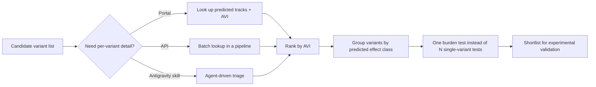

## Introduction

> **The release, in one line**
> On 8 September 2026 Google DeepMind published **AlphaGenome Atlas**: a 1-petabyte resource holding model predictions for the effects of **9 billion single-nucleotide variants** — every single-letter change possible in the human genome — free to use for academic research through a portal, an API, and an agent skill.
{: .prompt-info }

Most AI-for-science announcements describe a model. This one is more interesting because it describes a *lookup table*: the model was already published and already in use, and the Atlas is what you get when you spend the compute to pre-run it at genome scale and publish the results instead of the weights.

That distinction — model versus precomputed atlas — is the reason this release is usable by people who will never train a genomics model, and it is the reason the workflow behind its headline result transfers straight back to ordinary ML engineering.

## Model, atlas, and the one number that ranks them

Three artefacts shipped on 8 September, and conflating them causes most of the confusion in the coverage that followed.

| Artefact | What it is | Why you care |
|---|---|---|
| **AlphaGenome** (the model) | A deep learning model that inputs a 1-megabase DNA sequence and predicts functional genomic tracks at single-base resolution across modalities; score a variant by contrasting mutated and unmutated sequences | You can already use it per-variant; it needs compute and some genomics tooling |
| **AlphaGenome Atlas** | Predictions for 9 billion single-nucleotide variants, precomputed and published as a 1-petabyte dataset — "more than 30 times larger than the AlphaFold Database" | You can look up a variant's predicted molecular effects instead of running the model |
| **AlphaGenome Variant Impact (AVI) score** | A single number combining AlphaGenome with AlphaMissense (DeepMind's protein-altering variant model), covering both the ~2% of the genome that codes for proteins and the 98% that does not | You can sort a variant list by predicted impact before spending lab time on it |

DeepMind's own framing of the precompute is explicit: "By precomputing AlphaGenome's predictions at scale, we have created an easily accessible resource that vastly expands the model's reach." The Atlas is reachable through the [website portal](https://deepmind.google/blog/alphagenome-atlas-a-predictive-map-of-every-possible-dna-letter-change-in-the-human-genome/), the AlphaGenome API, and as a skill inside Google Antigravity; it is free for researchers, with commercial access through Google Cloud described as coming soon.

The AlphaFold comparison is the one DeepMind leans on, and it is a fair one: the 2022 AlphaFold Database expansion took 3D structure coverage from roughly 190,000 experimental structures to more than 200 million predictions, and the accompanying portal let researchers with no coding experience work at scale. An atlas, in this framing, is what turns a model into infrastructure.

## What the model behind the lookups actually does

The [AlphaGenome paper](https://www.nature.com/articles/s41586-025-10014-0) in *Nature* describes the machinery the Atlas precomputes, and the architecture explains why a 1-petabyte precompute was the sensible move:

- **Input.** AlphaGenome processes **1 megabase of DNA sequence** plus species identity (human or mouse).
- **Output.** It predicts **5,930 human or 1,128 mouse genome tracks** across diverse cell types and **11 output types**, at resolutions that vary by assay: RNA-seq, ATAC-seq and DNase-seq predictions at 1-base-pair resolution; H3K27ac and CTCF ChIP-seq at 128 bp; contact maps at 2,048 bp.
- **Shape.** A U-Net-style encoder, transformers with inter-device communication, and a decoder feeding task-specific output heads — with the 1 Mb split into **131-kb chunks** processed across devices for sequence parallelism.
- **Training.** Pretraining sampled 1-Mb intervals from cross-validation folds and augmented them by shifting and reverse-complementing; a **distillation** step then produced a single model that reproduces frozen teacher predictions on "augmented and mutationally perturbed input sequences". That distilled student is what makes variant effect prediction practical at all.

Read the last point twice, because it is the whole reason the Atlas exists. Scoring a variant means contrasting the model's predictions for a mutated sequence against the unmutated one. That is embarrassingly parallel across roughly nine billion variants, one megabase window each — a throughput problem, not a scientific unknown. Precompute the answers, publish the table, and the number of people who can use the model goes from "those with genomics pipelines and GPU budget" to "anyone with a browser".

> **The caveat that comes with the window**
> A 1-Mb input means effects are modelled within a local window, and the Atlas is a snapshot of one model family at one point in time. It is an excellent triage instrument, not a substitute for a mechanistic model of a whole genome.
{: .prompt-warning }

## The significance wall

Here is the problem the Atlas is meant to shrink. If you test nine billion variants one at a time for association with a trait, your multiple-testing budget collapses:


```python
import numpy as np
from math import erfc, sqrt
rng = np.random.default_rng(20260926)

VARIANTS, N, GENOME = 2_000, 20_000, 9_000_000_000
def p_two_sided(z):
    return erfc(abs(float(z)) / sqrt(2))
def z_for_p(target):
    lo, hi = 0.0, 40.0
    for _ in range(200):
        mid = (lo + hi) / 2
        lo, hi = (mid, hi) if p_two_sided(mid) > target else (lo, mid)
    return (lo + hi) / 2

alpha = 0.05 / GENOME
print(f"Bonferroni across {GENOME:,} variants: {alpha:.2e}  ->  |z| >= {z_for_p(alpha):.2f}")
print(f"expected false positives at the conventional 5e-8 threshold: {GENOME*5e-8:,.0f}")
print(f"|z| needed at 5e-8: {z_for_p(5e-8):.2f}")

af = rng.uniform(0.0005, 0.01, VARIANTS)
causal = np.zeros(VARIANTS, bool); causal[rng.choice(VARIANTS, 120, replace=False)] = True
effect = np.where(causal, -0.15, 0.0)

G = (rng.random((N, VARIANTS)) < af).astype(np.float32)
Gc = G - G.mean(0); Gc /= Gc.std(0) + 1e-9
y = G @ effect + rng.normal(0, 1, N); y -= y.mean(); y /= y.std()

r = (Gc.T @ y) / N
z = r * sqrt(N - 2) / np.sqrt(1 - r**2)
print(f"\nper-variant test: max |z| = {np.abs(z).max():.2f} (p = {p_two_sided(np.abs(z).max()):.1e}), "
      f"variants passing Bonferroni: {(np.abs(z) >= z_for_p(alpha)).sum()}")

avi = np.where(causal, rng.beta(3, 2, VARIANTS), rng.beta(1.5, 8, VARIANTS))
top = avi > np.quantile(avi, 0.90)
for label, sel in [("all 2,000 variants", np.ones(VARIANTS, bool)),
                   ("random 10%", rng.random(VARIANTS) < 0.10),
                   ("top-decile predicted impact", top)]:
    b = G[:, sel].sum(1).astype(float); b -= b.mean(); b /= b.std()
    rb = float(np.corrcoef(b, y)[0, 1]); zb = rb * sqrt(N - 2) / np.sqrt(1 - rb**2)
    print(f"burden over {label:28s} n={sel.sum():4d}  z={zb:5.2f}  p={p_two_sided(zb):.1e}")
```


```text
Bonferroni across 9,000,000,000 variants: 5.56e-12  ->  |z| >= 6.89
expected false positives at the conventional 5e-8 threshold: 450
|z| needed at 5e-8: 5.45

per-variant test: max |z| = 3.41 (p = 6.5e-04), variants passing Bonferroni: 0
burden over all 2,000 variants           n=2000  z=-6.06  p=1.4e-09
burden over random 10%                   n= 208  z=-3.43  p=6.0e-04
burden over top-decile predicted impact  n= 200  z=-10.81  p=3.1e-27
```

> **This is a simulation, and it is labelled as one**
> The block above is synthetic: 20,000 simulated individuals, 2,000 simulated rare variants, a seeded RNG, and a stand-in score in place of the real AVI. It demonstrates a *mechanism*, not DeepMind's result. The published figures stay the anchor — see the next section.
{: .prompt-warning }

Three numbers in that output are the story. The 5e-8 threshold conventionally used for genome-wide association studies would be expected to produce **450 false positives** across nine billion tests, which is why the strict bar is 5.56 × 10⁻¹² (roughly |z| ≥ 6.89). And the per-variant test finds nothing at all: the strongest signal in the simulated cohort sits at |z| = 3.41, comfortably inside the noise.

Then look at the last three rows. Grouping the same variants into a single burden score changes the outcome — but only when the grouping is informed. Selecting the *top decile by predicted impact* gives z = −10.81 (p = 3.1 × 10⁻²⁷), a random 10% subset gives z = −3.43 (p = 6.0 × 10⁻⁴), and lumping all 2,000 variants together gives z = −6.06 (p = 1.4 × 10⁻⁹). Uninformed pooling dilutes the signal below the conventional bar; informed pooling clears it by a wide margin. That is the entire reason a per-variant impact score is worth a 1-petabyte precompute.

## What the collaborators actually found

Two published uses of the Atlas, both involving external researchers, show the mechanism working on real data.

**Common traits, more associations.** Gareth Hawkes, a Medical Research Council fellow at the University of Exeter, applied the Atlas to whole-genome data from **more than 54,000 UK Biobank participants**. As [HPCwire's write-up](https://www.hpcwire.com/2026/09/18/google-deepminds-alphagenome-takes-aim-at-one-of-genetics-biggest-problems/) puts it: "By grouping rare variants based on their predicted molecular effects, Hawkes uncovered 22% more non-coding genetic associations, which would otherwise have not been detectable in the statistical noise."

Note what that claim is and is not. It is *22% more associations detected* in one analysis on one biobank cohort — a power gain from better grouping. It is not a claim that the Atlas diagnoses anything, and 22% is a result from a specific cohort rather than a constant anyone should expect to reproduce.

**An unsolved rare-disease case.** Working with the GREGoR Consortium, researchers from the Broad Institute used the AVI score to look for variants that earlier analyses had missed. They identified a variant affecting **DNM1**, a gene strongly associated with epileptic encephalopathy. AlphaGenome predicted that the variant created an incorrect RNA splice site, and laboratory experiments then validated that prediction. DeepMind reports the same class of outcome more generally: external collaborators have "used AlphaGenome Atlas to identify and experimentally verify key variants in unsolved rare disease research".

That is the correct order of operations for anyone adopting this: the model proposes, the bench confirms. Pushmeet Kohli, who leads DeepMind's AI-for-science work, framed the release against the Human Genome Project with a line worth remembering — the book was bought in 2003, and is still not fully readable.

## Where the grouping idea comes from

The Atlas did not invent aggregation; it supplies a much better prior for it. The standard statistical family for rare variants is well established:

| Approach | What it does | When it wins |
|---|---|---|
| Burden test | Collapses variants in a region into one score and tests that score | Effects point the same way and the region carries real signal |
| Variance-component test (SKAT) | Tests whether the region's variants explain variance at all, without fixing a direction | Effects are mixed or only some variants matter |
| Combined test (SKAT-O) | Adapts between the two | You have no prior on the genetic architecture |

The Atlas changes the *input* to that decision. AVI gives every variant a predicted impact, so the grouping can be built from variants that the model believes are functional rather than from whatever happened to pass a frequency filter. The published result — 22% more non-coding associations in the Exeter analysis — is the payoff on one cohort, and the mechanism is exactly the one the simulation above isolates: informed grouping versus uniform pooling is the difference between p = 3.1 × 10⁻²⁷ and p = 1.4 × 10⁻⁹.

Two design warnings that follow from the same literature, and that no score can decide for you:

1. **A plain burden test assumes a direction.** If damaging variants in a region push a trait both ways, collapsing them into one score can cancel the signal. That is the case the variance-component and combined tests exist for.
2. **The threshold is a hypothesis.** "Top decile by AVI" is a choice, not a given. Report it, and where the data allows, test more than one grouping rather than tuning until something clears the bar.

> **Our own warning, restated**
> Nothing in this section reproduces DeepMind's numbers on DeepMind's data. It explains why their number is plausible and gives you the code to check your own grouping choices.
{: .prompt-tip }

## How to actually use it



- **Portal** — no-code lookup for a variant or a short list, including the molecular processes (splicing, gene expression) the model expects to be affected.
- **API** — the route for pipelines, and the one that matters if you are generating candidate lists programme-wide rather than reading them one at a time.
- **Antigravity skill** — the Atlas is packaged as a skill inside Google's agentic development platform, which is a signal about where DeepMind thinks this work will increasingly happen: an agent assembling variant evidence rather than a human clicking a portal.
- **Licence boundary** — free for academic research today; commercial access via Google Cloud is described as forthcoming. Check the terms before you build a product on it.

Three honest caveats, all of them from the primary sources:

1. **Predictions are not causes.** The Atlas says which variants are worth spending lab time on; it does not say which variants cause disease.
2. **It is a snapshot.** DeepMind states the Atlas "will change as AlphaGenome and its other AI models get better", so any pipeline you build against it needs a versioning plan.
3. **Grouping is a hypothesis, not a free lunch.** Collapsing variants into one burden score buys statistical power by throwing away per-variant resolution — the right move when individual effects are far below the noise floor, the wrong move when a single variant is doing the work.

## The transferable pattern

Strip away the genomics and the workflow is one you can use on your own expensive scorer:

1. **Precompute what is expensive, publish the scores.** If a model costs real compute per input but the input space is finite and enumerable, a lookup layer often beats a service layer. This is the same trade-off as caching embeddings for a fixed corpus instead of re-encoding at query time — [we measured where that trade turns bad](/posts/embedding-compression-audit/).
2. **Distil the precompute into one ranking number.** The AVI score exists because nine billion records are unusable without a sort key.
3. **Test in groups, informed by the score.** Whether your units are variants, text spans or transactions, grouping by a cheap predicted score beats both brute-force per-unit testing and blind aggregation.
4. **Ship the model's confidence with the result.** Google's agricultural mapping lead made the same point about crop identification: the value is not just the label but the stated confidence attached to it, published transparently.

> **Where this connects to the rest of the blog**
> The Atlas is an example of the pattern we covered when [AI designed physics experiments](/posts/ai-designed-physics-experiments/): model-generated candidates are useful only when a downstream system can rank, filter and verify them.
{: .prompt-tip }

## Key takeaways

| Takeaway | Detail |
|---|---|
| The release is a precomputed lookup layer, not a new model | 9 billion single-nucleotide variants, 1-petabyte dataset, more than 30× the AlphaFold Database |
| The AVI score is the sort key | AlphaGenome + AlphaMissense compressed into one number spanning coding and non-coding regions |
| Its headline wins are power gains from better grouping | 22% more non-coding associations across 54,000+ UK Biobank participants; a DNM1 splice-site variant in the Broad/GREGoR rare-disease work, later validated in the lab |
| Access is portal, API, agent skill | Free for academic research; commercial access via Google Cloud described as coming soon |
| The workflow transfers | Precompute, distil to a ranking number, test in informed groups, publish confidence alongside predictions |
| Know the limits | Predictions are not causal claims, the resource will be re-versioned, and grouping trades resolution for power |

## References

- [AlphaGenome Atlas: A predictive map of every possible DNA letter change in the human genome](https://deepmind.google/blog/alphagenome-atlas-a-predictive-map-of-every-possible-dna-letter-change-in-the-human-genome/) — Google DeepMind, 8 September 2026
- [Google DeepMind's AlphaGenome Takes Aim at One of Genetics' Biggest Problems](https://www.hpcwire.com/2026/09/18/google-deepminds-alphagenome-takes-aim-at-one-of-genetics-biggest-problems/) — HPCwire/AIwire, on the UK Biobank grouping result, the DNM1 case and licence scope
- [DeepMind's new genome 'atlas' charts effects of all nine billion human gene mutations](https://www.nature.com/articles/d41586-026-02835-4) — Nature news
- [Google DeepMind Releases AlphaGenome Atlas With Precomputed Molecular Effect Predictions and AVI Scores](https://www.marktechpost.com/2026/09/08/google-deepmind-releases-alphagenome-atlas-with-precomputed-molecular-effect-predictions-and-avi-scores-for-9-billion-human-dna-variants/) — MarkTechPost, on the published pipeline shape
- [Advancing regulatory variant effect prediction with AlphaGenome](https://www.nature.com/articles/s41586-025-10014-0) — the underlying AlphaGenome model paper
- [DeepMind releases AlphaGenome Atlas of 9bn DNA variants](https://www.resultsense.com/news/2026-09-09-deepmind-alphagenome-atlas/) — on the Human Genome Project framing
- [Optimal tests for rare variant effects in sequencing association studies](https://pmc.ncbi.nlm.nih.gov/articles/PMC3440237/) — Lee et al., the SKAT variance-component test
- [Rare-Variant Association Analysis: Study Designs and Statistical Tests](https://www.sciencedirect.com/science/article/pii/S0002929714002717) — burden, variance-component and combined tests compared
- [Rare-variant association studies: When are aggregation tests more powerful than single-variant tests?](https://www.sciencedirect.com/science/article/pii/S0002929725002721) — the direct question behind the Atlas's grouping result

## Related posts

- [AI-Designed Physics Experiments](/posts/ai-designed-physics-experiments/) — model-generated candidates and the verification step that follows
- [Thirty Times Smaller: Auditing Embedding Compression](/posts/embedding-compression-audit/) — the precompute-versus-query-time trade-off, measured
- [Class IIb, Not Class III: The First CE-Marked Clinical AI](/posts/ai-primary-care-class-iib-ce/) — what regulatory evidence looks like when a model proposes and a clinician confirms
