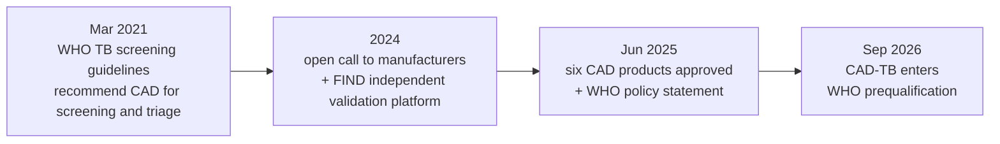

## Introduction

> **The release, in one line**
> On 25 September 2026 the World Health Organization [announced](https://www.who.int/news/item/25-09-2026-who-announces-expansion-of-prequalification-programme-for-medical-devices) that it is expanding its prequalification programme for medical devices to cover **computer-aided detection (CAD) software for tuberculosis screening** — the first digital health technology to enter a list that United Nations agencies, procurement organisations, donors and national authorities buy from.
{: .prompt-info }

That is a quiet announcement about paperwork, and it is the most useful thing to happen to medical AI in Africa this quarter. Everything else in this space is a pilot, a press release or a benchmark. Prequalification is different: it is the mechanism that decides which products a health ministry can buy with donor money without re-running the vendor's evaluation itself.

Two recent posts on this blog touched the edges of this without covering it. [Certified in Europe, Judged at the Health Post](/posts/ai-primary-care-class-iib-ce/) read a single company's EU Class IIb certificate and asked what a market-access mark transfers to a health post. [AI in African Healthcare](/posts/ai-african-healthcare/) surveyed where imaging and triage tools are already running on the continent. This post is about a third thing: the procurement gate itself, how a software product gets onto it, and what a programme has to do **after** go-live to keep the listing honest.

The stake is not abstract. In 2024 an estimated [10.7 million people fell ill with TB](https://www.who.int/news-room/fact-sheets/detail/tuberculosis) worldwide and 8.3 million were reported as newly diagnosed — which leaves roughly 2.4 million people who were never counted, most of them in exactly the places where a radiologist reads a thousand films a month alone. The WHO African Region carried [25% of new cases in 2024](https://www.who.int/news-room/fact-sheets/detail/tuberculosis), with Nigeria alone at 4.8% of the global total and the Democratic Republic of the Congo at 3.9%.

## What WHO actually announced

The 25 September expansion is wider than the TB line that will travel furthest in the trade press. Products that meet the standards are added to the WHO list of prequalified medical devices, which the announcement describes as "trusted guidance for United Nations agencies, procurement organizations, donors and national authorities." Four things change:

| Product class | What changed on 25 September 2026 |
|---|---|
| **CAD-TB software** | Newly added — "bringing a digital health technology into the WHO prequalification programme" |
| Male and female condoms, IUDs | Prequalification transferred from UNFPA to WHO |
| Male circumcision devices | Moved into the broader WHO medical device prequalification framework, out of a separate process |
| In vitro diagnostics (existing scope) | Unchanged |

Two sentences in the announcement are worth keeping:

> "Everyone, everywhere, should be able to rely on medical devices that are safe, effective and meet high standards of quality. By expanding WHO prequalification, we are strengthening confidence in these essential health products and helping countries expand equitable access to the technologies people need to protect and improve their health."
> — Dr Sylvie Briand, WHO Chief Scientist and Assistant Director-General a.i. for Health Systems, Access and Data

And the reason the programme matters more in Nairobi or Abuja than in Geneva: **"an estimated 70% of countries report inadequate or weak regulatory systems for medicines and vaccines, with even greater challenges for other health products."** A ministry that cannot independently evaluate a neural network can still require that the product it buys is on a list somebody else evaluated. That is the whole point of prequalification, and it is why adding a *software* class to it is harder than adding a condom.

The same announcement states the terms for a listed CAD product plainly: it "uses digital chest X-rays and artificial intelligence to identify people who may have TB and need further testing," and it is aimed at "countries with a high TB rate, where reliable screening can help detect TB earlier and connect people to diagnosis and treatment quickly."

## Five years of groundwork behind one paragraph

Software had to be squeezed into a framework built for catheters. The WHO [prequalification of priority medical devices](https://extranet.who.int/prequal/prequalification-priority-medical-devices-mdv) page describes the CAD-TB track as a "pathfinder" and lays out the sequence that led here:



Three details from the 2021 step are easy to lose. It was the [first recommendation of CAD for TB screening and triage](https://extranet.who.int/prequal/prequalification-priority-medical-devices-mdv), it was "the first time that software employing artificial intelligence is recommended in a WHO TB guideline," and the evidence reviewed was "an independent assessment of the performance of three commercially available software products on a library of digital radiographs." The guidance deliberately does not name a product. What it does instead is define what a product must prove, in a Technical Specifications Series (TSS) document setting "the minimum performance requirements for WHO prequalification."

The June 2025 policy statement then did the first real filtering pass, and WHO's own [write-up of it](https://www.who.int/news/item/11-06-2025-who-approves-six-software-products-for-computer-aided-detection-of-tb-on-chest-x-ray) is unusually specific about method and limits:

- Manufacturers were invited in a **2024 open call** to submit software for evaluation by the **Technical Advisory Group (TAG)** on Tuberculosis Diagnostics and Laboratory Strengthening;
- submissions were first run through "an independent validation platform conducted by the Foundation for Innovative New Diagnostics (FIND) in Geneva";
- **six products** met WHO's performance standards — behind the products on the market, this was a filtering, not a rubber stamp;
- the recommendation is for **people aged 15 and older**: "WHO does not yet recommend the use of CAD to screen children and adolescents younger than 15";
- and the operational rule that no software licence overrides: "people who screen positive should undergo confirmatory testing before starting TB treatment."

## What the evidence says the software can and cannot do

Prequalification formalises a claim, so it is worth reading what independent evaluations have actually measured. The most rigorous recent one is a prospective multi-site study published in **NEJM AI**, run across three clinical sites in a high TB/HIV-burden population, [reported in full on PMC](https://pmc.ncbi.nlm.nih.gov/articles/PMC11737584/). It recruited 1,978 adults who had TB symptoms, were close contacts of confirmed patients, or were newly diagnosed with HIV, and analysed 1,910 of them:

| Measure | Result |
|---|---|
| Participants analysed | 1,910 (96% had conclusive TB status; 36% HIV-positive) |
| TB prevalence in the study population | 192 of 1,827 analysed (11%) |
| TB-detecting AI, high-sensitivity threshold | **87% sensitivity / 70% specificity** |
| TB-detecting AI, balanced threshold | 78% sensitivity / 82% specificity |
| Average radiologist (10 readers, blinded) | 76% sensitivity / 82% specificity |
| WHO target for a TB triage test | 90% sensitivity / 70% specificity |

The conclusion is the part worth quoting to a procurement committee: the AI was noninferior to radiologists for triage — but **"neither the TB AI nor the radiologists met WHO recommendations for sensitivity in the study population."** A model that meets a policy threshold on a validation library can land at 87% on a real population with high HIV prevalence. That is a reason to prequalify and monitor, not a reason to distrust the class.

The operating reality on the other side of the model is better documented than most people assume. A [community screening programme in Ebonyi and Nasarawa States, Nigeria](https://pmc.ncbi.nlm.nih.gov/articles/PMC13445830/) published in *BMC Global and Public Health* ran portable digital chest X-ray with AI software across 93 outreach activities between January 2023 and December 2024:

| Cascade step | Count | Conversion |
|---|---|---|
| People screened (aged 6+) | 9,585 | — |
| Chest radiographs flagged abnormal by AI | 3,166 | 33.0% of screened |
| Classified presumptive TB | 1,336 | 42.2% of flagged |
| Produced a sputum sample for Xpert MTB/RIF | 1,123 | 84.1% of presumptive |
| Bacteriologically confirmed TB | 204 | 18.2% of those tested |
| Initiated on treatment | 194 | 95.1% of confirmed |

Two more findings from the same programme deserve to sit next to the headline yield. First, of the abnormal radiographs, 2,367 (75%) showed features suggesting cardiovascular or chronic respiratory disease — and only **12% of those referrals were ever completed**, because services for them were not decentralised. Second, 199 further people were clinically diagnosed after radiologist or clinician review, which is the human layer the software cannot replace. AI-enabled screening was feasible and linked TB cases to treatment at high rates; it did not, on its own, produce a working referral system for anything else it happened to find.

And a caution from the last month that cuts across all of it: a [meta-reanalysis of TB prevalence survey data](https://pubmed.ncbi.nlm.nih.gov/42665896/) published in the *IJTLD* in September 2026 reworked 21 of the 23 studies in an earlier systematic review and found that the published sensitivity of chest X-ray screening is inflated by incorporation bias — the pooled estimate among symptom screen–positive participants was **86% (83–90%)** against **94% (92–96%)** in the original meta-analysis, a pooled difference of **6% (4–8%)**. The authors' instruction to programmes is blunt: treat the symptom-positive figure as the realistic maximum, because combined sensitivity for symptomatic and asymptomatic TB is likely lower still.

## Version drift: the problem prequalification was built to face

A catheter is the same object in 2031 as it was the day it was approved. A CAD product is not. This is the single hardest part of putting software into a prequalification framework, and the evidence for it is unusually clean.

A [PLOS Digital Health comparison of successive CAD versions](https://journals.plos.org/digitalhealth/article?id=10.1371%2Fjournal.pdig.0000067) used a case-control sample of 12,890 chest X-rays to test whether the new builds actually improved on the ones WHO had evaluated:

| Product | Older version (AUC) | Newer version (AUC) | WHO Target Product Profile |
|---|---|---|---|
| CAD4TB | v6 — 0.823 (0.816–0.830) | v7 — 0.903 (0.897–0.908) | older version missed it, newer met it |
| qXR | v2 — 0.872 (0.866–0.878) | v3 — 0.906 (0.901–0.911) | older version missed it, newer met it |

The upgrades improved the products. They also mean that **the evaluated artefact and the shipped artefact are different objects**. The authors' warning is the sentence a monitoring plan should be built around: "unlike laboratory diagnostic tools, CAD software updates could significantly impact the selection of appropriate threshold scores, the number of people with TB detected and cost-effectiveness," and "prior to implementation CAD should be evaluated using local data because underlying neural networks can differ significantly."

Read that against the June 2025 approval of six products. A prequalified listing is a statement about a specific build evaluated through FIND's platform and TAG's review. It is not a statement about v-next, and it is not a statement about your district's population, which will differ from any validation library in HIV prevalence, age mix, prior TB history and image quality. Prequalification narrows the field; the programme still has to do the last mile.

## How to apply this: read your cascade, size your audit

If you run or fund a CAD-TB screening programme, three things are now true. The shortlist is public, so vendor selection gets easier and shorter. The listing is build-specific, so version control becomes a clinical control, not an IT preference. And the only performance number that counts is the one your own cascade produces — which you already have, in your screening registers.

The first block below reads a cascade the way a programme manager should: not as a headline detection number, but as five conversion rates, because that is where a working deployment and a failing one diverge. The counts are the published Nigerian programme figures.


```python
# Site-level read-out of a community CAD-TB screening cascade (Nigeria, 2023-2024).
screened, flagged = 9585, 3166      # chest X-rays taken / flagged abnormal by AI
presumptive, sputum = 1336, 1123    # referred for testing / actually produced a sample
confirmed, started = 204, 194       # Xpert MTB/RIF positive / initiated on treatment
clinical = 199                      # clinically diagnosed after radiologist review

def pct(a, b):
    return f"{a} ({a/b:.1%})"

print("screened:                ", screened)
print("AI flagged abnormal:     ", pct(flagged, screened))
print("presumptive TB referred: ", pct(presumptive, flagged), "of flagged")
print("sputum sample produced:  ", pct(sputum, presumptive), "of presumptive")
print("Xpert-confirmed TB:      ", pct(confirmed, sputum), "of tested")
print("started on treatment:    ", pct(started, confirmed), "of confirmed")
print("clinical diagnoses:      ", clinical, "(no Xpert confirmation reported)")
print(f"bacteriologically confirmed per 1,000 screened: {confirmed/screened*1000:.1f}")
print(f"number needed to screen per confirmed case:     {screened/confirmed:.0f}")
print(f"referral completion for non-TB findings:        {0.12:.0%} (2,367 flagged, 12% completed)")
```


```text
screened:                 9585
AI flagged abnormal:      3166 (33.0%)
presumptive TB referred:  1336 (42.2%) of flagged
sputum sample produced:   1123 (84.1%) of presumptive
Xpert-confirmed TB:       204 (18.2%) of tested
started on treatment:     194 (95.1%) of confirmed
clinical diagnoses:       199 (no Xpert confirmation reported)
bacteriologically confirmed per 1,000 screened: 21.3
number needed to screen per confirmed case:     47
referral completion for non-TB findings:        12% (2,367 flagged, 12% completed)
```

The second block answers the question every monitoring plan gets wrong: how many confirmed cases does a local audit need before it can distinguish "still performing" from "has drifted"? Treat the registered sensitivity as a null hypothesis, not a boast.


```python
# How many confirmed cases must a local audit contain before it can tell
# "the model still meets the 90% target" from "the model has drifted"?
import math

def wilson(k, n, z=1.96):
    """95% Wilson score interval for a proportion."""
    p = k / n
    d = 1 + z*z/n
    centre = (p + z*z/(2*n)) / d
    half = z * math.sqrt(p*(1-p)/n + z*z/(4*n*n)) / d
    return centre - half, centre + half

def cases_for_power(p0, p1, alpha=0.05, power=0.80):
    """One-sample test of H0: sensitivity = p0 against a true value of p1."""
    z_a = 1.645 if alpha == 0.05 else 1.96
    z_b = 0.8416 if power == 0.80 else 1.282
    num = z_a*math.sqrt(p0*(1-p0)) + z_b*math.sqrt(p1*(1-p1))
    return math.ceil((num / (p1 - p0))**2)

print("Site audit of a deployed CAD product (registered at 90% sensitivity, 87% observed)")
print(f"{'cases':>6} | {'hits @ 87%':>10} | {'95% CI (Wilson)':>15} | lower bound above 80%?")
for n in (20, 30, 50, 100, 200):
    hits = round(0.87*n)
    lo, hi = wilson(hits, n)
    print(f"{n:>6} | {hits:>10} | {lo:.2f} - {hi:.2f}   | {'yes' if lo > 0.80 else 'no'}")

print(f"\ncases needed to detect a real drop 90% -> 80% (alpha 0.05, power 0.80): {cases_for_power(0.80, 0.90)}")
lo, hi = wilson(26, 30)
print(f"26 of 30 confirmed cases (86.7%) gives a 95% CI of {lo:.2f}-{hi:.2f},")
print(f"so a 30-case audit cannot separate {lo:.0%} from {hi:.0%}.")
```


```text
Site audit of a deployed CAD product (registered at 90% sensitivity, 87% observed)
 cases | hits @ 87% | 95% CI (Wilson) | lower bound above 80%?
    20 |         17 | 0.64 - 0.95   | no
    30 |         26 | 0.70 - 0.95   | no
    50 |         44 | 0.76 - 0.94   | no
   100 |         87 | 0.79 - 0.92   | no
   200 |        174 | 0.82 - 0.91   | yes

cases needed to detect a real drop 90% -> 80% (alpha 0.05, power 0.80): 83
26 of 30 confirmed cases (86.7%) gives a 95% CI of 0.70-0.95,
so a 30-case audit cannot separate 70% from 95%.
```

The two numbers in that output pull in different directions, and the resolution is the useful part. **83 confirmed cases** is the minimum for a test with 80% power to catch a real ten-point drop on average. But a *point estimate* whose entire confidence interval sits above the floor needs roughly **200** cases. If your site has 200 culture-confirmed results a year, an annual audit is informative; if it has 30, your audit is a rumour generator, and the honest report says so. Most districts will need to pool sites or accept a lower-powered screen that only fires on gross drift.

That translates into five monitoring questions, distinct from the pre-signature procurement checklist — these are the ones that matter after go-live:

| # | Question | Where the answer lives |
|---|---|---|
| 1 | Which **build** is running at each site, and who signs off an upgrade? | Deployment manifest + change log; pin version strings |
| 2 | Is the **threshold** still the one validated for this population? | Threshold recorded per site, re-checked after every update |
| 3 | What is our **screen-positive → sputum → treatment** conversion this quarter? | Screening register; compare against the cascade above |
| 4 | How many **confirmed cases** did the last audit rest on? | Lab register; below ~83, label the result underpowered |
| 5 | What happens to the **non-TB findings** the model surfaces? | Referral log; the Nigerian programme completed only 12% |

## Key takeaways

| Point | Detail |
|---|---|
| What happened | WHO expanded prequalification to CAD-TB software on 25 September 2026 — first digital health technology in the programme |
| Why it matters for Africa | The African Region carried 25% of new TB cases in 2024; 70% of countries report weak regulatory systems, so a global list substitutes for capacity countries do not yet have |
| The bar was real | Six products cleared a 2024 open call, FIND's independent validation platform and TAG review before the June 2025 policy statement |
| The listing is build-specific | CAD4TB 0.823 → 0.903 and qXR 0.872 → 0.906 across one version step; the evaluated artefact and the shipped artefact differ |
| The target is triage, not diagnosis | Prospective validation measured 87%/70% against a 90%/70% WHO target; screen-positives still need confirmatory testing, and CAD is not yet recommended under 15 |
| Local evidence still required | Sensitivity published from survey data is inflated by ~6 points; audit with at least ~83 confirmed cases, and say so when you have fewer |

## References

1. World Health Organization, [WHO announces expansion of prequalification programme for medical devices](https://www.who.int/news/item/25-09-2026-who-announces-expansion-of-prequalification-programme-for-medical-devices), 25 September 2026.
2. World Health Organization, [Prequalification of priority medical devices (MDV)](https://extranet.who.int/prequal/prequalification-priority-medical-devices-mdv) — CAD for TB as the pathfinder, TSS performance criteria.
3. World Health Organization, [WHO approves six software products for computer-aided detection of TB on chest X-ray](https://www.who.int/news/item/11-06-2025-who-approves-six-software-products-for-computer-aided-detection-of-tb-on-chest-x-ray), 11 June 2025.
4. World Health Organization, [Use of computer-aided detection software for tuberculosis screening: WHO policy statement](https://www.who.int/publications/i/item/9789240110373).
5. World Health Organization, [Tuberculosis fact sheet](https://www.who.int/news-room/fact-sheets/detail/tuberculosis) — 2024 regional distribution, 10.7 million cases, 1.23 million deaths.
6. World Health Organization, [Global tuberculosis report 2025 factsheet](https://cdn.who.int/media/docs/default-source/global-tuberculosis-report-2025/global-tb-report-2025_factsheet.pdf) — 8.3 million diagnosed, ~2.4 million missed.
7. Liu et al., [Prospective multi-site validation of AI to detect tuberculosis and chest X-ray abnormalities](https://pmc.ncbi.nlm.nih.gov/articles/PMC11737584/), *NEJM AI* — 87%/70% at the high-sensitivity threshold, radiologist comparison.
8. Okoye et al., [Implementing AI-enabled chest X-ray for community-based integrated screening in Nigeria](https://pmc.ncbi.nlm.nih.gov/articles/PMC13445830/), *BMC Global and Public Health*, 2026.
9. Qin et al., [Comparing different versions of computer-aided detection products when reading chest X-rays for tuberculosis](https://journals.plos.org/digitalhealth/article?id=10.1371%2Fjournal.pdig.0000067), *PLOS Digital Health*, 2022.
10. [Sensitivity of chest X-ray from community screening: a meta-reanalysis of TB prevalence survey data](https://pubmed.ncbi.nlm.nih.gov/42665896/), *IJTLD* 30(9), 2026.
11. MDDI Online, [WHO expands medical device prequalification program](https://www.mddionline.com/medical-device-markets/who-expands-medical-device-prequalification) — secondary coverage of the September 2026 expansion.
12. Mirage News, [WHO expands medical device prequalification programme](https://www.miragenews.com/who-expands-medical-device-prequalification-1750372/) — secondary coverage of the same announcement.

## Related posts

- [Certified in Europe, Judged at the Health Post: What a Class IIb CE Mark Really Buys Primary Care](/posts/ai-primary-care-class-iib-ce/)
- [AI in African Healthcare: Diagnostics, Drug Discovery and Care Delivery](/posts/ai-african-healthcare/)
- [Fraud Models Rot Quietly: PSI, Feature Drift and Data-Quality Gates in Production](/posts/fraud-model-drift-monitoring/)
- [MLOps for RegTech: Model Governance Under CBK, ODPC and EU AI Act Rules](/posts/mlops-regtech-model-governance/)
